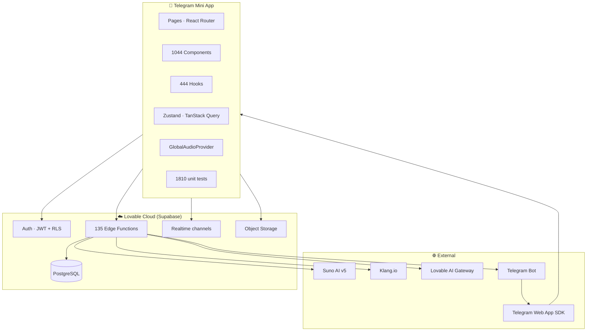
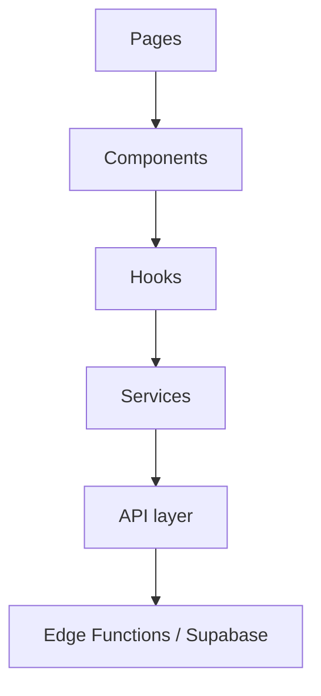
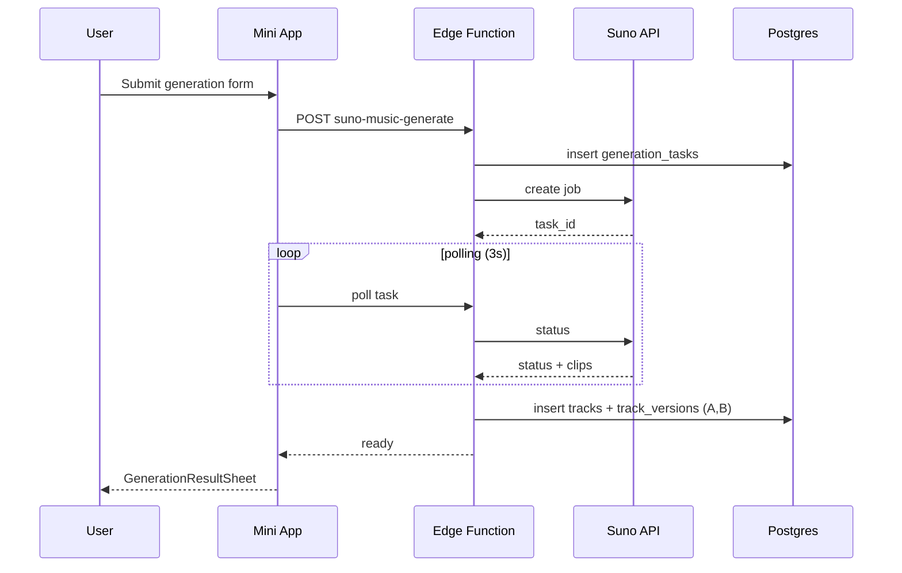
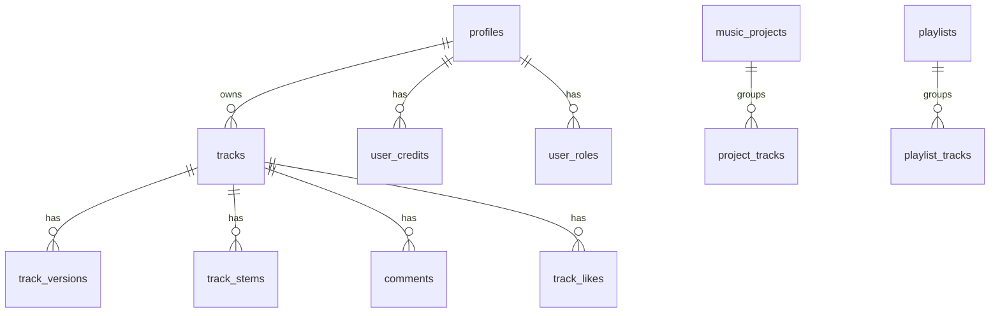

# 🏛 Architecture Hub

**Canonical entry point for everything architecture-related in MusicVerse AI.**

  
  
  

  <a href="README.md">🏠 Home</a> ·
  <a href="DOCUMENTATION_INDEX.md">📚 Docs</a> ·
  <a href="REPOSITORY_STRUCTURE.md">🗂 Structure</a> ·
  <a href="ROADMAP.md">🗺 Roadmap</a>

---

> [!TIP]
> Start here, then drill into the specialised docs linked at the bottom of each section.

## 1. High-level system

> **Verified:** 2026-07-24 (counts from `find`/`wc` against `src/` and `supabase/functions/`)

## 2. Layered architecture

| Layer      | Path                  | Responsibility           |
| ---------- | --------------------- | ------------------------ |
| Pages      | `src/pages/`          | Route-level, lazy-loaded |
| Components | `src/components/`     | Presentation             |
| Hooks      | `src/hooks/`          | React Query + state      |
| Services   | `src/services/`       | Business logic           |
| API        | `src/api/`            | Typed Supabase queries   |
| Edge       | `supabase/functions/` | Server-side jobs         |

## 3. State strategy

| Use case                                    | Tool                  |
| ------------------------------------------- | --------------------- |
| Global player, studio, lyrics, mixer        | Zustand               |
| Server state (queries, caching, optimistic) | TanStack Query        |
| Forms                                       | React Hook Form + Zod |
| Local UI                                    | React hooks           |

## 4. Audio architecture

> [!IMPORTANT]
> The entire app uses **one** `<audio>` element managed by `GlobalAudioProvider`. Never instantiate additional audio elements outside the pool.

See [`docs/PLAYER_ARCHITECTURE.md`](docs/PLAYER_ARCHITECTURE.md) · [`docs/AUDIO_ARCHITECTURE_DIAGRAM.md`](docs/AUDIO_ARCHITECTURE_DIAGRAM.md).

## 5. Generation pipeline

Detail: [`docs/GENERATION_SYSTEM.md`](docs/GENERATION_SYSTEM.md) · [`docs/SUNO_API.md`](docs/SUNO_API.md).

## 6. Database

Full schema: [`docs/DATABASE.md`](docs/DATABASE.md).

## 7. Telegram integration

- Native SDK via `@twa-dev/sdk` 8.0.
- MainButton/BackButton proxies, haptic system, Stories share.
- Deep link format: `t.me/AIMusicVerseBot/app?startapp=PARAM`.

See [`docs/TELEGRAM_BOT_ARCHITECTURE.md`](docs/TELEGRAM_BOT_ARCHITECTURE.md) · [`docs/TELEGRAM_MINI_APP_FEATURES.md`](docs/TELEGRAM_MINI_APP_FEATURES.md).

## 8. ADRs

Architecture Decision Records under [`ADR/`](ADR/). Notable:

| ADR | Title                       |
| --- | --------------------------- |
| 001 | Technology stack choice     |
| 002 | Frontend architecture       |
| 003 | Performance optimisation    |
| 004 | Audio playback optimisation |
| 005 | State machine architecture  |
| 006 | Type-safe audio context     |
| 012 | Generation form compact UI  |

---

### 🔗 Related Documentation

|            📚 Index             |             🗂 Structure              |       🗺 Roadmap       |         🧩 KB          |       📝 Changelog        |
| :-----------------------------: | :----------------------------------: | :-------------------: | :--------------------: | :-----------------------: |
| [Index](DOCUMENTATION_INDEX.md) | [Structure](REPOSITORY_STRUCTURE.md) | [Roadmap](ROADMAP.md) | [CLAUDE.md](CLAUDE.md) | [Changelog](CHANGELOG.md) |

---

[← REPOSITORY_STRUCTURE.md](./REPOSITORY_STRUCTURE.md) · [↑ К индексу](./DOCUMENTATION_INDEX.md) · [ROADMAP.md →](./ROADMAP.md)

Обновлено: 24.07.2026

