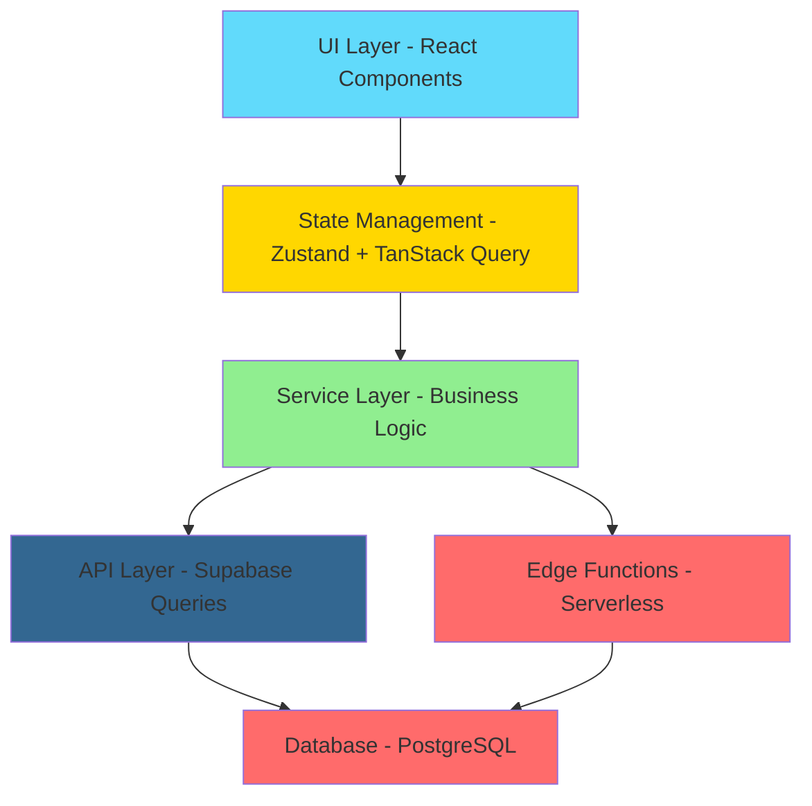

# 🏗️ Architecture Hub - MusicVerse AI

**Last Updated:** 2026-06-26  
**Version:** 1.0.0  
**Status:** ✅ Active

---

## 🎯 Purpose

This document serves as the **central navigation hub** for all architecture-related documentation in the MusicVerse AI project. It provides organized access to architectural decisions, system design, technical specifications, and implementation patterns.

---

## 📚 Architecture Documentation Categories

### 🏛️ Core Architecture Documents

| Document | Description | Status | Priority |
|----------|-------------|--------|----------|
| **[docs/ARCHITECTURE.md](docs/ARCHITECTURE.md)** | Main system architecture overview | ✅ Complete | 🔴 High |
| **[docs/ARCHITECTURE_DIAGRAMS.md](docs/ARCHITECTURE_DIAGRAMS.md)** | Visual architecture diagrams | ✅ Complete | 🔴 High |
| **[docs/COMPREHENSIVE_ARCHITECTURE.md](docs/COMPREHENSIVE_ARCHITECTURE.md)** | Detailed architectural documentation | ✅ Complete | 🟡 Medium |
| **[docs/DATABASE.md](docs/DATABASE.md)** | Database schema and design | ✅ Complete | 🔴 High |
| **[REPOSITORY_STRUCTURE.md](REPOSITORY_STRUCTURE.md)** | Repository organization and file structure | ✅ Complete | 🟡 Medium |

### 🎵 Audio & Player Architecture

| Document | Description | Status | Priority |
|----------|-------------|--------|----------|
| **[docs/PLAYER_ARCHITECTURE.md](docs/PLAYER_ARCHITECTURE.md)** | Audio player system architecture | ✅ Complete | 🔴 High |
| **[docs/AUDIO_ARCHITECTURE_DIAGRAM.md](docs/AUDIO_ARCHITECTURE_DIAGRAM.md)** | Audio system visual diagram | ✅ Complete | 🔴 High |
| **[docs/STEM_STUDIO.md](docs/STEM_STUDIO.md)** | Stem separation and mixing architecture | ✅ Complete | 🔴 High |

### 🤖 Telegram Integration Architecture

| Document | Description | Status | Priority |
|----------|-------------|--------|----------|
| **[docs/TELEGRAM_BOT_ARCHITECTURE.md](docs/TELEGRAM_BOT_ARCHITECTURE.md)** | Telegram bot architecture | ✅ Complete | 🔴 High |
| **[docs/TELEGRAM_MINI_APP_FEATURES.md](docs/TELEGRAM_MINI_APP_FEATURES.md)** | Mini App integration patterns | ✅ Complete | 🔴 High |
| **[docs/TELEGRAM_MINI_APP_ADVANCED_FEATURES.md](docs/TELEGRAM_MINI_APP_ADVANCED_FEATURES.md)** | Advanced Mini App features | ✅ Complete | 🟡 Medium |

### 🎨 UI/UX Architecture

| Document | Description | Status | Priority |
|----------|-------------|--------|----------|
| **[docs/DESIGN_SYSTEM_COMPREHENSIVE.md](docs/DESIGN_SYSTEM_COMPREHENSIVE.md)** | Design system architecture | ✅ Complete | 🟡 Medium |
| **[docs/LAYOUT_SYSTEM.md](docs/LAYOUT_SYSTEM.md)** | Layout system architecture | ✅ Complete | 🟡 Medium |
| **[docs/SAFE_AREA_GUIDELINES.md](docs/SAFE_AREA_GUIDELINES.md)** | Mobile safe area architecture | ✅ Complete | 🔴 High |
| **[docs/MOBILE_COMPONENTS.md](docs/MOBILE_COMPONENTS.md)** | Mobile component architecture | ✅ Complete | 🟡 Medium |

### ⚡ Performance & Optimization Architecture

| Document | Description | Status | Priority |
|----------|-------------|--------|----------|
| **[docs/PERFORMANCE_OPTIMIZATION.md](docs/PERFORMANCE_OPTIMIZATION.md)** | Performance optimization strategies | ✅ Complete | 🔴 High |
| **[docs/PERFORMANCE_OPTIMIZATION_GUIDE.md](docs/PERFORMANCE_OPTIMIZATION_GUIDE.md)** | Performance optimization guide | ✅ Complete | 🟡 Medium |
| **[docs/BUNDLE_OPTIMIZATION.md](docs/BUNDLE_OPTIMIZATION.md)** | Bundle size optimization | ✅ Complete | 🟡 Medium |
| **[docs/PERFORMANCE_MONITORING_SETUP.md](docs/PERFORMANCE_MONITORING_SETUP.md)** | Monitoring architecture | ✅ Complete | 🟡 Medium |

### 🔒 Security & Error Handling Architecture

| Document | Description | Status | Priority |
|----------|-------------|--------|----------|
| **[docs/SECURITY_SUMMARY.md](docs/SECURITY_SUMMARY.md)** | Security architecture overview | ✅ Complete | 🔴 High |
| **[docs/ERROR_HANDLING_INFRASTRUCTURE.md](docs/ERROR_HANDLING_INFRASTRUCTURE.md)** | Error handling architecture | ✅ Complete | 🔴 High |
| **[docs/AUDIT_SYSTEM.md](docs/AUDIT_SYSTEM.md)** | Audit system architecture | ✅ Complete | 🟡 Medium |

### 🔌 Integration Architecture

| Document | Description | Status | Priority |
|----------|-------------|--------|----------|
| **[docs/API.md](docs/API.md)** | API architecture and documentation | ✅ Complete | 🔴 High |
| **[docs/SUNO_API.md](docs/SUNO_API.md)** | Suno AI integration architecture | ✅ Complete | 🔴 High |
| **[docs/GENERATION_SYSTEM.md](docs/GENERATION_SYSTEM.md)** | Music generation architecture | ✅ Complete | 🔴 High |
| **[docs/KLANG_IO.md](docs/KLANG_IO.md)** | Klang.io integration | ✅ Complete | 🟢 Low |

### 🧪 Testing & Quality Architecture

| Document | Description | Status | Priority |
|----------|-------------|--------|----------|
| **[docs/TESTING_INFRASTRUCTURE.md](docs/TESTING_INFRASTRUCTURE.md)** | Testing infrastructure | ✅ Complete | 🔴 High |
| **[docs/QUALITY_GATES.md](docs/QUALITY_GATES.md)** | Quality gates and standards | ✅ Complete | 🔴 High |

---

## 📋 Architecture Decision Records (ADR)

### Core Technology Decisions

| ADR | Title | Status | Date |
|-----|-------|--------|------|
| **[ADR-001](ADR/ADR-001-TECHNOLOGY-STACK-CHOICE.md)** | Technology Stack Choice | ✅ Accepted | 2024-01-15 |
| **[ADR-002](ADR/ADR-002-Frontend-Architecture-And-Stack.md)** | Frontend Architecture and Stack | ✅ Accepted | 2024-01-20 |
| **[ADR-003](ADR/ADR-003-Performance-Optimization-Architecture.md)** | Performance Optimization Architecture | ✅ Accepted | 2024-02-10 |

### Audio & Media Decisions

| ADR | Title | Status | Date |
|-----|-------|--------|------|
| **[ADR-004](ADR/ADR-004-Audio-Playback-Optimization.md)** | Audio Playback Optimization | ✅ Accepted | 2024-02-15 |
| **[ADR-006](ADR/ADR-006-Type-Safe-Audio-Context.md)** | Type-Safe Audio Context | ✅ Accepted | 2024-03-01 |

### System Architecture Decisions

| ADR | Title | Status | Date |
|-----|-------|--------|------|
| **[ADR-004](ADR/ADR-004-Error-Handling-Architecture.md)** | Error Handling Architecture | ✅ Accepted | 2024-02-20 |
| **[ADR-005](ADR/ADR-005-State-Machine-Architecture.md)** | State Machine Architecture | ✅ Accepted | 2024-02-25 |

### Feature Architecture Decisions

| ADR | Title | Status | Date |
|-----|-------|--------|------|
| **[ADR-011](ADR/ADR-011-UNIFIED-STUDIO-ARCHITECTURE.md)** | Unified Studio Architecture | ✅ Accepted | 2024-04-10 |
| **[ADR-012](ADR/ADR-012-GENERATION-FORM-COMPACT-UI.md)** | Generation Form Compact UI | ✅ Accepted | 2024-04-15 |

---

## 🎯 Architecture Patterns Used

### Frontend Architecture

- **Framework:** React 19.2 with TypeScript 5.9
- **State Management:** Zustand 5.0 (global) + TanStack Query 5.90 (server state)
- **Routing:** React Router v7 with code splitting
- **Build Tool:** Vite 5.0 with vendor chunking strategy
- **Styling:** Tailwind CSS 3.4 + shadcn/ui + Radix UI

### Backend Architecture

- **Backend-as-a-Service:** Supabase (PostgreSQL + Edge Functions + Storage)
- **Database:** PostgreSQL with Row Level Security (RLS)
- **API Layer:** RESTful API with type-safe queries
- **Serverless:** Deno-based Edge Functions
- **Storage:** Supabase Storage with CDN optimization

### Audio Architecture

- **Audio Engine:** Tone.js 14.9 + Wavesurfer.js 7.8
- **Pattern:** Single global audio element (GlobalAudioProvider)
- **Optimization:** Audio element pooling for iOS Safari
- **Caching:** Pre-computed waveforms with CDN caching

### Mobile Architecture

- **Platform:** Telegram Mini App (WebView)
- **Integration:** @twa-dev/sdk 8.0.2
- **Touch:** @use-gesture/react for gestures
- **Safe Areas:** Custom safe area utilities
- **Keyboard:** VisualViewport API tracking

---

## 🔄 Architecture Layers

---

## 🗂️ Key Architectural Components

### Frontend Components (`src/components/`)

- **1,124+ React components** organized by feature
- **ui/**: shadcn/ui base components
- **mobile/**: Mobile-specific components (19)
- **player/**: Audio player components
- **generate/**: Music generation interface
- **studio/**: Unified Studio components
- **library/**: Track library with virtualization

### Custom Hooks (`src/hooks/`)

- **200+ custom hooks** for reusable logic
- **useTelegram.ts**: Telegram integration
- **useAudioPlayer.ts**: Audio player controls
- **useGeneration.ts**: Music generation logic

### Services (`src/services/`)

- **13 services** for business logic
- **audioService.ts**: Audio operations
- **generationService.ts**: Music generation
- **telegramService.ts**: Telegram API

### API Layer (`src/api/`)

- **Direct Supabase queries** with type safety
- **tracks.api.ts**: Track operations
- **users.api.ts**: User operations
- **generation.api.ts**: Generation operations

### Global State (`src/stores/`)

- **8 Zustand stores** for complex state
- **playerStore**: Audio playback state
- **useUnifiedStudioStore**: Studio state (38KB)
- **useLyricsHistoryStore**: Lyrics editing history

---

## 📊 Architecture Statistics

| Metric | Value |
|--------|-------|
| **React Components** | 1,124+ |
| **Custom Hooks** | 200+ |
| **Services** | 13 |
| **API Files** | 13 |
| **Zustand Stores** | 8 |
| **Edge Functions** | 99+ |
| **Database Tables** | 30+ |
| **ADR Records** | 8 |
| **Architecture Docs** | 20+ |

---

## 🔗 Quick Navigation

### By Role

- **New Developer:** Start with [docs/ARCHITECTURE.md](docs/ARCHITECTURE.md)
- **Frontend Developer:** [docs/DESIGN_SYSTEM_COMPREHENSIVE.md](docs/DESIGN_SYSTEM_COMPREHENSIVE.md)
- **Backend Developer:** [docs/DATABASE.md](docs/DATABASE.md)
- **Mobile Developer:** [docs/SAFE_AREA_GUIDELINES.md](docs/SAFE_AREA_GUIDELINES.md)
- **QA Engineer:** [docs/TESTING_INFRASTRUCTURE.md](docs/TESTING_INFRASTRUCTURE.md)

### By Task

- **Understanding Audio System:** [docs/PLAYER_ARCHITECTURE.md](docs/PLAYER_ARCHITECTURE.md)
- **Telegram Integration:** [docs/TELEGRAM_BOT_ARCHITECTURE.md](docs/TELEGRAM_BOT_ARCHITECTURE.md)
- **Performance Issues:** [docs/PERFORMANCE_OPTIMIZATION.md](docs/PERFORMANCE_OPTIMIZATION.md)
- **Security Review:** [docs/SECURITY_SUMMARY.md](docs/SECURITY_SUMMARY.md)
- **API Integration:** [docs/API.md](docs/API.md)

---

## 🎓 Learning Paths

### Path 1: Complete Architecture Understanding (4-6 hours)

1. [docs/ARCHITECTURE.md](docs/ARCHITECTURE.md) - Main overview
2. [docs/ARCHITECTURE_DIAGRAMS.md](docs/ARCHITECTURE_DIAGRAMS.md) - Visual diagrams
3. [docs/DATABASE.md](docs/DATABASE.md) - Data layer
4. [docs/PLAYER_ARCHITECTURE.md](docs/PLAYER_ARCHITECTURE.md) - Audio system
5. [docs/TELEGRAM_BOT_ARCHITECTURE.md](docs/TELEGRAM_BOT_ARCHITECTURE.md) - Telegram integration
6. [ADR/](ADR/) - Architecture decisions

### Path 2: Frontend Architecture Deep Dive (3-4 hours)

1. [docs/DESIGN_SYSTEM_COMPREHENSIVE.md](docs/DESIGN_SYSTEM_COMPREHENSIVE.md)
2. [docs/LAYOUT_SYSTEM.md](docs/LAYOUT_SYSTEM.md)
3. [docs/PERFORMANCE_OPTIMIZATION.md](docs/PERFORMANCE_OPTIMIZATION.md)
4. [docs/BUNDLE_OPTIMIZATION.md](docs/BUNDLE_OPTIMIZATION.md)
5. [ADR/ADR-002-Frontend-Architecture-And-Stack.md](ADR/ADR-002-Frontend-Architecture-And-Stack.md)

### Path 3: Mobile & Telegram Focus (2-3 hours)

1. [docs/SAFE_AREA_GUIDELINES.md](docs/SAFE_AREA_GUIDELINES.md)
2. [docs/TELEGRAM_MINI_APP_FEATURES.md](docs/TELEGRAM_MINI_APP_FEATURES.md)
3. [docs/TELEGRAM_MINI_APP_ADVANCED_FEATURES.md](docs/TELEGRAM_MINI_APP_ADVANCED_FEATURES.md)
4. [docs/MOBILE_COMPONENTS.md](docs/MOBILE_COMPONENTS.md)

---

## 🚀 Architecture Principles

### 1. **Separation of Concerns**
- Clear boundaries between UI, business logic, and data layers
- API layer → Service layer → Hook layer → Component layer

### 2. **Type Safety**
- Strict TypeScript configuration
- Type-safe database queries
- Zod validation for runtime type checking

### 3. **Performance First**
- Code splitting at route level
- Vendor chunking strategy
- Audio element pooling
- List virtualization for large datasets

### 4. **Mobile-First**
- Designed for Telegram Mini App
- Touch-optimized interfaces
- Safe area handling
- iOS Safari compatibility

### 5. **Developer Experience**
- Comprehensive documentation
- Clear architecture decisions
- Consistent patterns
- Easy onboarding

---

## 📝 Contributing to Architecture Documentation

When making architectural changes:

1. **Create ADR:** Use [ADR/ADR_TEMPLATE.md](ADR/ADR_TEMPLATE.md)
2. **Update diagrams:** Keep [docs/ARCHITECTURE_DIAGRAMS.md](docs/ARCHITECTURE_DIAGRAMS.md) current
3. **Document decisions:** Update relevant architecture docs
4. **Review principles:** Ensure alignment with architecture principles

---

## 🔍 Search & Discovery

### Finding Architecture Information

**Looking for component architecture?**
- Check `src/components/` → Component-specific docs
- Review [docs/DESIGN_SYSTEM_COMPREHENSIVE.md](docs/DESIGN_SYSTEM_COMPREHENSIVE.md)

**Looking for data flow?**
- Review [docs/ARCHITECTURE_DIAGRAMS.md](docs/ARCHITECTURE_DIAGRAMS.md)
- Check [docs/DATABASE.md](docs/DATABASE.md)

**Looking for integration patterns?**
- Review [docs/API.md](docs/API.md)
- Check integration docs in [docs/integrations/](docs/integrations/)

**Looking for why something was built this way?**
- Search [ADR/](ADR/) for architecture decisions

---

**Architecture Hub maintained by the MusicVerse AI Team**

_Last Updated: 2026-06-26_

[🏠 Home](README.md) • [📚 Documentation Index](DOCUMENTATION_INDEX.md) • [🔧 Repository Structure](REPOSITORY_STRUCTURE.md)

