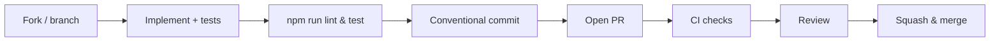

<div align="center">

# 🤝 Contributing to MusicVerse AI

**Thanks for considering a contribution!** This guide explains how to propose changes, ship pull requests, and stay aligned with our conventions.

<p>
  
  
  
  
</p>

<p>
  <a href="README.md">🏠 Home</a> ·
  <a href="DOCUMENTATION_INDEX.md">📚 Docs</a> ·
  <a href="CODE_OF_CONDUCT.md">📜 Code of Conduct</a> ·
  <a href="SECURITY.md">🔒 Security</a>
</p>

</div>

---

> [!IMPORTANT]
> All contributions are subject to the [Code of Conduct](CODE_OF_CONDUCT.md). Be kind, be clear, be constructive.

## 🚦 Workflow at a glance



## 1. Pick or open an issue

- Search [issues](https://github.com/HOW2AI-AGENCY/aimusicverse/issues) first.
- Use the templates: bug · feature · docs · performance.
- For larger work, open a [discussion](https://github.com/HOW2AI-AGENCY/aimusicverse/issues) first.

## 2. Branching

- Branch off `main`.
- Naming: `feat/<scope>`, `fix/<scope>`, `docs/<scope>`, `refactor/<scope>`.

## 3. Coding standards

- **TypeScript strict** — no `any`.
- Use `@/` absolute imports.
- Styling: Tailwind + design tokens (`src/lib/design-tokens.ts`). **No** hardcoded colors.
- Logging via `@/lib/logger` — never `console.log`.
- Audio: single `GlobalAudioProvider`. **Never** create extra `<audio>`.
- Icons: import only from `src/lib/icons.ts`.
- Mobile: respect 44×44 px touch targets; use `MobileBottomSheet` not `Dialog`.

## 4. Commits — Conventional Commits 1.0

```
<type>(<scope>): <subject>

[body]
[footer]
```

Types: `feat` · `fix` · `docs` · `style` · `refactor` · `perf` · `test` · `build` · `ci` · `chore` · `revert`.

Examples:

```
feat(studio): add stem solo button
fix(player): avoid double-play on iOS Safari
docs(readme): refresh badge palette
```

Husky + commitlint enforce this on commit.

## 5. Tests

| Layer      | Command                   | Required for              |
| ---------- | ------------------------- | ------------------------- |
| Unit       | `npm test`                | All logic changes         |
| Coverage   | `npm run test:coverage`   | Non-trivial features      |
| E2E        | `npm run test:e2e`        | UI flows                  |
| E2E mobile | `npm run test:e2e:mobile` | Mobile-facing changes     |
| Bundle     | `npm run size`            | Anything affecting bundle |
| Lint       | `npm run lint`            | Always                    |

> [!WARNING]
> PRs that decrease coverage or break the 950 KB bundle budget are blocked by CI.

## 6. Pull Request

- Use the PR template.
- Link the issue (`Closes #123`).
- Add screenshots/GIFs for UI changes.
- Mark as Draft until CI is green.
- Squash-merge with a Conventional Commit message.

## 7. Documentation

- Update relevant `docs/` and the [`DOCUMENTATION_INDEX`](DOCUMENTATION_INDEX.md).
- Add ADRs under [`ADR/`](ADR/) for architectural decisions.
- Run `node scripts/check-links.js` if you touch links.

## 8. Releasing

Maintainers handle releases:

1. Update [`CHANGELOG.md`](CHANGELOG.md) (Keep a Changelog).
2. `npm version <major|minor|patch>` → tag.
3. GitHub Actions deploys via Lovable.

---

<div align="center">

### 🔗 Related Documentation

|            📚 Index             |       🏛 Architecture       |          📜 CoC           |       🔒 Security       |       📝 Changelog        |
| :-----------------------------: | :------------------------: | :-----------------------: | :---------------------: | :-----------------------: |
| [Index](DOCUMENTATION_INDEX.md) | [Hub](ARCHITECTURE_HUB.md) | [CoC](CODE_OF_CONDUCT.md) | [Security](SECURITY.md) | [Changelog](CHANGELOG.md) |

<sub>Last updated: 2026-06-27</sub>

</div>
