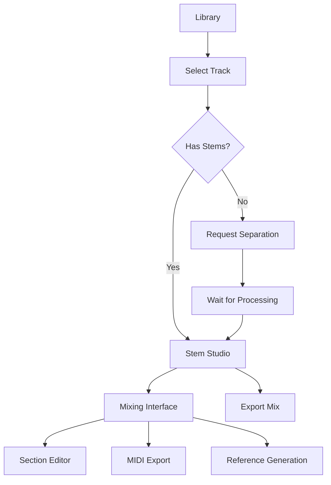

# MusicVerse AI - Детальный анализ текущего состояния проекта

**Дата анализа:** 21 декабря 2025  
**Аналитик:** AI Code Agent  
**Цель:** Актуализация документации и составление плана оптимизации

---

## 📊 EXECUTIVE SUMMARY

MusicVerse AI находится в состоянии **активного развития** с впечатляющими достижениями:
- ✅ **80% завершения** (20 из 25 спринтов)
- ✅ **Health Score: 97/100**
- ✅ **150+ React компонентов**
- ✅ **94 Edge Functions**
- ✅ **~16,400 строк кода в Stem Studio** (94 файла, 936KB)

**Критические выводы:**
1. Проект технически зрелый и готов к production
2. Документация частично устарела и требует синхронизации
3. Stem Studio - самый сложный модуль, требующий особого внимания при оптимизации
4. Архитектура хорошо продумана, но есть потенциал для консолидации

---

## 🎯 ЧАСТЬ 1: АНАЛИЗ ТЕКУЩЕГО СОСТОЯНИЯ

### 1.1 Технологический стек (актуальный на 21.12.2025)

#### Frontend
```
React 19.0.0 ✅
├── TypeScript 5.7.2 ✅
├── Vite 5.4.11 ✅ (сборка)
├── Tailwind CSS 3.4.17 ✅ (стилизация)
├── shadcn/ui ✅ (компонентная библиотека)
├── TanStack Query 5.62.7 ✅ (управление данными)
├── Zustand 5.0.2 ✅ (state management)
├── Framer Motion 11.12.0 ✅ (анимации)
├── react-virtuoso 4.11.3 ✅ (виртуализация списков)
└── wavesurfer.js 7.8.14 ✅ (аудио визуализация)
```

#### Backend (Lovable Cloud / Supabase)
```
PostgreSQL ✅
├── 50+ миграций
├── Row Level Security (RLS)
├── Realtime subscriptions
└── 30+ таблиц

Edge Functions (Deno) ✅
├── 94 функции
├── Suno AI v5 интеграция
├── Telegram Bot API
└── AI сервисы (Gemini, Klangio)
```

#### Аудио технологии
```
Web Audio API ✅
├── Tone.js 15.1.3 (синтез и эффекты)
├── wavesurfer.js (визуализация)
└── AudioContext management (требует улучшений)
```

---

### 1.2 Архитектура приложения

#### Страницы (Pages) - 35 файлов
```
src/pages/
├── Index.tsx                    # Homepage (12.8 KB)
├── Library.tsx                  # Библиотека треков (20.2 KB)
├── StemStudio.tsx              # ⭐ Stem Studio (простой роутер)
├── ProfessionalStudio.tsx      # Professional Studio (18 KB)
├── MusicLab.tsx                # Music Lab Hub (4.5 KB)
├── GuitarStudio.tsx            # Guitar Studio (24.4 KB)
├── LyricsStudio.tsx            # Lyrics Studio (17.6 KB)
├── Generate.tsx                # Генерация музыки (1.5 KB)
├── Artists.tsx                 # AI Artists (15.6 KB)
├── Projects.tsx                # Projects/Albums
├── Playlists.tsx               # Playlists
├── AdminDashboard.tsx          # Admin Panel (22.3 KB)
└── ... (еще 23 страницы)
```

**Ключевые наблюдения:**
- ✅ Четкое разделение ответственности
- ✅ Lazy loading для всех страниц (через React.lazy)
- ⚠️ Некоторые страницы очень большие (>20 KB) - кандидаты на разбиение

---

### 1.3 Stem Studio - Глубокий анализ

#### Статистика
```
Директория: src/components/stem-studio/
Размер: 936 KB
Файлов: 94
Строк кода: ~16,400
Средний размер файла: ~174 строки
```

#### Структура компонентов (по категориям)

**1. Core Components (8 файлов)**
```
StemStudioContent.tsx           # Основной контейнер
TrackStudioContent.tsx          # Контент студии
StemChannel.tsx                 # Канал стема
StemWaveform.tsx                # Waveform компонент
OptimizedStemWaveform.tsx       # Оптимизированная версия
```

**2. Panels & Dialogs (25 файлов)**
```
DAWMixerPanel.tsx               # DAW-стиль микшер
EnhancedMixPresetsPanel.tsx     # Пресеты миксов
TranscriptionExportPanel.tsx    # Экспорт в MIDI/GP5
SectionReplacementPanel.tsx     # Замена секций
ReplacementHistoryPanel.tsx     # История замен
StemReferenceDialog.tsx         # Reference генерация
ExtendDialog.tsx                # Extend трека
TrimDialog.tsx                  # Trim трека
RemixDialog.tsx                 # Remix
VocalReplacementDialog.tsx      # Замена вокала
... (еще 15 диалогов)
```

**3. Section Editor (8 файлов)**
```
SectionEditorPanel.tsx          # Основной редактор
SectionPicker.tsx               # Выбор секции
SectionSelector.tsx             # Селектор
SectionComparePanel.tsx         # A/B сравнение
IntegratedSectionEditor.tsx     # Integrated UI
SectionTimelineVisualization.tsx
SectionWaveformPreview.tsx
SectionQuickActions.tsx
```

**4. Mobile Components (10 файлов)**
```
TrackStudioMobileLayout.tsx     # Mobile layout
MobileStudioHeader.tsx          # Мобильный header
MobileActionsBar.tsx            # Actions bar
MobileSectionTimelineCompact.tsx
MobileMasterVolume.tsx
MobileVersionBadge.tsx
```

**5. Timeline & Visualization (8 файлов)**
```
DAWTimeline.tsx                 # DAW timeline
StudioTimeline.tsx              # Studio timeline
UnifiedWaveformTimeline.tsx     # Unified waveform
VersionTimeline.tsx             # Версии
DAWTrackLane.tsx                # Track lane
```

**6. Utilities & UI (35 файлов)**
```
KeyboardShortcutsDialog.tsx
FloatingStudioActions.tsx
StudioQuickActions.tsx
QuickCompare.tsx
LoopRegionSelector.tsx
TrimRegionSelector.tsx
StemStateIndicator.tsx
EffectsIndicator.tsx
StudioHints.tsx
StudioContextTips.tsx
StudioLoadingStates.tsx
... (еще 24 файла)
```

#### Ключевые функции Stem Studio

**1. Stem Separation (Разделение на стемы)**
- ✅ Vocals, Drums, Bass, Other
- ✅ Асинхронная обработка через Edge Functions
- ✅ Progress tracking
- ✅ Статусные индикаторы

**2. Mixing (Микширование)**
- ✅ Volume control для каждого стема
- ✅ Mute/Solo функции
- ✅ Pan control (стерео баланс)
- ✅ DAW-style mixer panel
- ✅ Master volume
- ✅ Presets для быстрого применения

**3. Waveform Visualization**
- ✅ wavesurfer.js интеграция
- ✅ Real-time синхронизация
- ✅ Region selection
- ✅ Loop markers
- ✅ Оптимизированный рендеринг (OptimizedStemWaveform)

**4. Section Replacement (Замена секций)**
- ✅ Автоматическое определение секций
- ✅ Levenshtein distance для матчинга текстов
- ✅ A/B comparison (оригинал vs замена)
- ✅ История всех замен
- ✅ Undo/Redo поддержка

**5. MIDI & Transcription**
- ✅ Klangio интеграция (6 AI моделей)
- ✅ Экспорт в MIDI, GP5, PDF, MusicXML
- ✅ Транскрипция с прогрессом
- ✅ Выбор AI модели (universal, guitar, piano, bass, drums, vocal)

**6. Effects & Processing**
- ✅ Effects indicator
- ✅ Guitar track integration
- ⚠️ Эффекты частично реализованы

**7. Timeline & Navigation**
- ✅ DAW-style timeline
- ✅ Unified waveform timeline
- ✅ Version timeline
- ✅ Keyboard shortcuts
- ✅ Zoom control

**8. Mobile Optimization**
- ✅ Dedicated mobile layout
- ✅ Compact UI для маленьких экранов
- ✅ Touch-optimized controls
- ✅ Mobile actions bar

---

### 1.4 Unified Studio Architecture

**Новая архитектура (введена в Sprint 026):**

```
src/components/studio/unified/
├── UnifiedStudioContent.tsx    # Главный контейнер
├── KlangioAnalysisPanel.tsx    # Klangio транскрипция
├── StemMidiDrawer.tsx          # MIDI управление
├── AddTrackDrawer.tsx          # Добавление треков
├── StudioActivityLog.tsx       # Activity log
└── WaveformAnalysisOverlay.tsx # Waveform overlay
```

**Преимущества:**
- ✅ Единый интерфейс для всех studio функций
- ✅ Консолидированный state management
- ✅ Меньше дублирования кода
- ✅ Лучшая maintainability

**Интеграция:**
- StemStudio.tsx (простая страница-роутер) → UnifiedStudioContent
- ProfessionalStudio.tsx (отдельный для pro-функций)

---

### 1.5 Состояние документации

#### Актуальные документы ✅
```
README.md                       # Общее описание, актуально
PROJECT_STATUS.md               # Статус проекта, актуально
SPRINT_STATUS.md                # Статус спринтов, актуально
ПЛАН_ДОРАБОТКИ.md              # План развития (20 дек 2025)
SPRINTS/SPRINT-025-TO-028-DETAILED-PLAN.md  # Детальный план
```

#### Требуют обновления ⚠️
```
SPRINTS/SPRINT-PROGRESS.md      # Не синхронизирован
docs/PROJECT_SPECIFICATION.md   # Частично устарел
docs/STEM_STUDIO.md             # Нет (надо создать)
docs/STUDIO_ARCHITECTURE.md     # Нет (надо создать)
specs/copilot/*/                # Некоторые specs устарели
```

#### Отсутствуют ❌
```
STUDIO_INTERFACE_GUIDE.md       # Руководство по Stem Studio
OPTIMIZATION_PLAN_2026.md       # Детальный план оптимизации
ARCHITECTURE_DECISIONS.md       # ADR для ключевых решений
API_DOCUMENTATION.md            # API для разработчиков
COMPONENT_CATALOG.md            # Каталог компонентов
```

---

### 1.6 Состояние спринтов (по факту)

**Завершены полностью (20 спринтов):**
```
Sprint 001-010: Foundation, UI/UX, Homepage, Library, Player ✅
Sprint 013: Advanced Audio Features ✅
Sprint 021: API Model Update (Suno v5) ✅
Sprint 022: Bundle Optimization (частично) ✅
Sprint 024: Creative Tools ✅
Sprint 025: Optimization (Performance baseline, Music Lab Hub) ✅
Sprint 026: UX Unification (Unified Studio) ✅
Telegram Stars Payment: Full integration ✅
Generation Error Handling: Complete ✅
```

**В работе / Planned (5 спринтов):**
```
Sprint 011: Social Features (86% complete, 123/143 tasks)
Sprint 012: Advanced Creation Tools (planned)
Sprint 014: Platform Integration & Export (138 tasks ready)
Sprint 015: Quality, Testing & Performance (169 tasks ready)
Sprint 027-028: Consolidation & Mobile Polish (planned)
```

**Реальный прогресс:**
- 20 из 25 спринтов = **80%**
- Velocity: ~1.2 спринта/месяц → цель 2/месяц
- Health Score: **97/100**

---

## 🔍 ЧАСТЬ 2: АНАЛИЗ ИНТЕРФЕЙСА STEM STUDIO

### 2.1 User Flow (текущий)



**Количество шагов:** 5-7 шагов от трека до готового микса

**Время прохождения:**
- Первое открытие (без стемов): ~3-5 минут (ожидание сепарации)
- С готовыми стемами: ~30 секунд
- Mixing workflow: 5-15 минут

---

### 2.2 UI/UX Анализ

#### Desktop Interface (>768px)

**Layout:**
```
┌─────────────────────────────────────────────────┐
│ Header: Track info, Version selector, Actions  │
├─────────────────────────────────────────────────┤
│ ┌──────────────┐  ┌──────────────────────────┐ │
│ │              │  │                          │ │
│ │   Mixer      │  │     Waveform Timeline    │ │
│ │   Panel      │  │                          │ │
│ │              │  │                          │ │
│ │  Stems (4-8) │  └──────────────────────────┘ │
│ │  - Vocals    │                               │
│ │  - Drums     │  ┌──────────────────────────┐ │
│ │  - Bass      │  │   Section Editor         │ │
│ │  - Other     │  │   (if replacement mode)  │ │
│ │              │  └──────────────────────────┘ │
│ └──────────────┘                               │
├─────────────────────────────────────────────────┤
│ Footer: Transport controls, Master volume      │
└─────────────────────────────────────────────────┘
```

**Сильные стороны:**
- ✅ DAW-подобный интерфейс (профессиональный)
- ✅ Все контролы в доступе
- ✅ Waveform синхронизирован
- ✅ Keyboard shortcuts

**Проблемы:**
- ⚠️ Перегруженность информацией (особенно для новичков)
- ⚠️ Нет progressive disclosure
- ⚠️ Малоиспользуемые функции занимают место

---

#### Mobile Interface (<768px)

**Layout:**
```
┌──────────────────┐
│ Compact Header   │
├──────────────────┤
│                  │
│   Waveform       │
│                  │
├──────────────────┤
│ Stem Controls    │
│ (Swipeable)      │
├──────────────────┤
│ Actions Bar      │
└──────────────────┘
```

**Сильные стороны:**
- ✅ Адаптивный layout
- ✅ Touch-optimized
- ✅ Swipeable controls

**Проблемы:**
- ⚠️ Ограниченная видимость всех стемов одновременно
- ⚠️ Нет полноценного mixer view
- ⚠️ Timeline навигация сложнее

---

### 2.3 Performance анализ

#### Проблемные зоны

**1. AudioContext Management**
```typescript
// Текущее состояние (упрощенно)
const audioContext = new AudioContext(); // Создается в каждом компоненте
const audioElement = new Audio();        // Множественные элементы

// Проблемы:
// - Memory leaks от orphaned audio nodes
// - Нет проверки AudioContext.state
// - Mobile browsers ограничивают 6-8 audio элементов
```

**Решение:**
- ✅ Централизованный AudioContext provider (частично есть в GlobalAudioProvider)
- ❌ Нужен audio element pooling
- ❌ Нужна state machine для управления lifecycle

**2. Waveform Generation**
```typescript
// Текущее: блокирует main thread
wavesurfer.load(audioUrl); // Синхронно

// Проблемы:
// - UI freezes на 1-3 секунды
// - Нет прогресса загрузки
// - Повторная генерация при каждом открытии
```

**Решение:**
- ❌ Web Worker для генерации waveform
- ❌ Offscreen Canvas для рендеринга
- ❌ Кэширование в IndexedDB

**3. Component Re-renders**
```typescript
// Не memoized компоненты:
StemChannel         // Re-renders при любом изменении
TrackCard          // Re-renders на каждое действие
```

**Решение:**
- ✅ React.memo с custom comparison
- ✅ useMemo/useCallback
- ❌ Profiling и оптимизация

**4. Bundle Size**
```
Current: ~500 KB (brotli) ✅ Хорошо
Target:  <450 KB

Heavy components:
- Stem Studio: ~280 KB (до оптимизации)
- Generate form: ~244 KB (до оптимизации)
```

**Progress:**
- ✅ Code splitting реализован
- ✅ Lazy loading для страниц
- ⚠️ Framer Motion migration (65/112 файлов)

---

### 2.4 Интеграции

#### Suno AI v5
```
✅ Music generation
✅ Custom mode (lyrics + style)
✅ Instrumental mode
✅ 174+ meta tags support
✅ 277+ musical styles
✅ 75+ languages
✅ Streaming preview
✅ A/B versions (2 clips)
✅ Extend functionality
⚠️ Cover (частично)
❌ Inpaint (не реализован fully)
```

#### Telegram Integration
```
✅ Mini App SDK 2.0
✅ Bot commands (/generate, /library, etc.)
✅ Payment (Telegram Stars)
✅ Notifications
✅ Stories sharing
✅ Deep linking
✅ File upload/download
⚠️ Voice messages (частично)
```

#### Klangio (Transcription)
```
✅ 6 AI models (universal, guitar, piano, bass, drums, vocal)
✅ Export: MIDI, GP5, PDF, MusicXML
✅ Progress tracking
✅ Error handling
✅ Mobile-first design
```

#### Gemini AI
```
✅ Artist portrait generation
✅ Playlist cover generation
⚠️ Lyrics assistance (частично)
```

---

## 📈 ЧАСТЬ 3: ПЛАН ОПТИМИЗАЦИИ

### 3.1 Краткосрочные задачи (1-2 недели)

#### Priority 1: Critical Fixes

**1. AudioContext Management (3 дня)**
```
Проблема: Memory leaks, audio limits на mobile
Решение:
- Централизованный AudioContext service
- Audio element pooling (max 8 elements)
- State machine для lifecycle
- Cleanup на unmount

Файлы:
- src/contexts/GlobalAudioProvider.tsx (расширить)
- src/lib/audio/AudioManager.ts (создать)
- src/hooks/studio/useStemStudioAudio.ts (рефакторинг)

Impact: HIGH (критично для mobile)
Риск: MEDIUM (может затронуть существующую логику)
```

**2. Lyrics Wizard State Persistence (2 дня)**
```
Проблемы:
- Потеря состояния при закрытии
- Неправильный подсчет символов
- Нет валидации

Решение:
- LocalStorage для черновиков
- Auto-save каждые 30 секунд
- Правильный подсчет (без структурных тегов)
- Валидация секций
- Undo/Redo (history stack)

Файлы:
- src/stores/lyricsWizardStore.ts
- src/components/generate-form/LyricsWizardSheet.tsx
- src/lib/lyricsValidation.ts (создать)

Impact: HIGH (часто используемая функция)
Риск: LOW
```

**3. Component Optimization (1 день)**
```
Цель: Уменьшить re-renders

Действия:
- React.memo для StemChannel, TrackCard
- useMemo для дорогих вычислений
- useCallback для handlers
- Profiling с React DevTools

Файлы:
- src/components/stem-studio/StemChannel.tsx
- src/components/library/TrackCard.tsx
- src/components/library/TrackList.tsx

Impact: MEDIUM-HIGH (FPS improvement)
Риск: LOW
```

---

#### Priority 2: Quick Wins (1 неделя)

**4. Waveform Web Worker (2 дня)**
```
Проблема: UI freezes при генерации waveform

Решение:
- Web Worker для генерации
- Offscreen Canvas для рендеринга
- Progress indicator
- IndexedDB кэширование

Файлы:
- src/workers/waveformGenerator.worker.ts (создать)
- src/hooks/audio/useWaveform.ts (создать)
- src/components/player/Waveform.tsx (обновить)

Impact: HIGH (perceived performance)
Риск: MEDIUM (новая технология)
```

**5. Bundle Optimization Phase 2 (2 дня)**
```
Цель: <450 KB (brotli)

Действия:
- Завершить framer-motion migration (47 файлов)
- Lazy load heavy components (MIDI Editor, etc.)
- Tree-shaking аудит
- Dynamic imports для библиотек

Файлы:
- 47 файлов с motion imports
- src/components/lazy/ (создать директорию)
- vite.config.ts

Impact: MEDIUM
Риск: LOW
```

**6. Error Handling Standardization (1 день)**
```
Цель: Единый подход к ошибкам

Решение:
- AppError class hierarchy
- Глобальный ErrorBoundary
- User-friendly messages
- Sentry integration улучшение

Файлы:
- src/lib/errors.ts (расширить)
- src/components/ErrorBoundary.tsx (создать)
- src/lib/errorHandler.ts (создать)

Impact: MEDIUM
Риск: LOW
```

---

### 3.2 Среднесрочные задачи (2-4 недели)

#### Sprint 027: Consolidation (2 недели)

**Stem Studio Consolidation**
```
Цель: 94 файла → 65 файлов (31 удален)

Этапы:
1. Dependency graph анализ (1 день)
2. Identify merge candidates (1 день)
3. Extract shared hooks (2 дня)
   - useStemMixer
   - useStemPlayback
   - useStemEffects
   - useStemExport
   - useStemAnalysis
4. Merge similar components (3 дня)
   - Timeline components: 8 → 3
   - Section editor: 8 → 4
   - Dialogs: 25 → 15
   - Mobile: 10 → 6
5. Update imports (1 день)
6. Test suite updates (2 дня)
7. Documentation (1 день)

Total: 11 дней (2.2 недели при 1 dev)

Impact: HIGH (maintainability)
Риск: MEDIUM (breaking changes)
```

**Code Quality Gate**
```
Действия:
- Husky pre-commit hooks
- ESLint strict rules (0 warnings)
- Prettier auto-format
- Test coverage gate (>80%)
- Bundle size budget
- TypeScript strict mode

Impact: HIGH (code quality)
Риск: LOW
```

---

#### Sprint 028: Mobile Polish (2 недели)

**4-Tab Navigation Redesign**
```
Tabs: Home, Create, Library, Profile
Target: Thumb-friendly zone (bottom 25%)

Components:
- BottomNavigation component
- Tab content optimization
- Transition animations
- Platform-specific tweaks (iOS/Android)

Impact: HIGH (mobile UX)
Риск: MEDIUM (major UI change)
```

**Progressive Disclosure**
```
Patterns:
- Collapsible sections для advanced options
- Bottom sheets для secondary actions
- Context menus (long-press)
- "Show more" для длинных списков

Impact: HIGH (mobile clarity)
Риск: LOW
```

**Touch Optimizations**
```
- All touch targets ≥44×44px
- Adequate spacing (≥8px)
- Swipe gestures (delete, favorite, play next)
- Pull-to-refresh
- Haptic feedback

Impact: MEDIUM-HIGH
Риск: LOW
```

---

### 3.3 Долгосрочные задачи (1-3 месяца)

#### Новые функции (P1)

**1. Collaborative Editing (3 недели)**
```
- Real-time collaboration на Stem Studio
- Shared sessions с правами доступа
- Live cursors
- Chat в студии
- Version control и merge conflicts

Technology: Supabase Realtime, CRDT
Impact: VERY HIGH (killer feature)
```

**2. AI-powered Mastering (1 неделя)**
```
- Анализ частотного спектра
- Автоматическая EQ, компрессия, лимитинг
- Presets: Pop, Rock, EDM, Cinematic
- A/B comparison
- Reference track matching

Technology: Tone.js, ML model, Replicate API
Impact: HIGH
```

**3. MIDI Editor (3 недели)**
```
- Piano roll для редактирования
- Virtual instruments (piano, drums, synth)
- Export/Import MIDI
- Quantization, velocity editing

Technology: Tone.js, @tonejs/midi, Canvas
Impact: VERY HIGH (профессиональная функция)
```

**4. Loop & Sample Library (1 неделя)**
```
- Библиотека loops и samples
- Фильтры по BPM, ключу, жанру
- Drag & drop в Stem Studio
- Auto tempo matching
- Community content

Impact: MEDIUM-HIGH
```

---

#### Платформенные интеграции

**5. Export to Streaming Platforms (1 неделя)**
```
Platforms: Spotify, Apple Music, YouTube Music

Features:
- Integration с DistroKid/CD Baby API
- Metadata editing
- Distribution tracking
- Royalty tracking
- Release scheduling

Impact: VERY HIGH (монетизация для пользователей)
```

**6. Social Media Auto-posting (1 неделя)**
```
Platforms: Instagram, TikTok, Twitter, VK

Features:
- Auto-post при публикации
- Customizable captions
- Short video generation
- Scheduling

Technology: Social media APIs, FFmpeg
Impact: HIGH (viral growth)
```

---

#### Монетизация

**7. Subscription Tiers (1 неделя)**
```
Tiers:
- Free: 50 credits/месяц
- Pro ($9.99): 500 credits, Stem Studio, MIDI
- Studio ($29.99): 2000 credits, AI Mastering, Collaboration
- Enterprise (custom): Unlimited, API, White label

Technology: Telegram Stars, Stripe
Impact: VERY HIGH (revenue)
```

**8. Marketplace for AI Artists (5 дней)**
```
- Creators создают AI Artists
- Marketplace для покупки/лицензирования
- Revenue sharing (70/30)
- Licensing tiers

Impact: HIGH (creator economy)
```

---

### 3.4 Инфраструктура и качество

**Testing (Sprint 015)**
```
Coverage goal: 80%+

- Unit tests: Audio hooks, stores, utils
- Integration tests: Generation flow, stems, payment
- E2E tests: First-time user, power user workflows
- Visual regression: Percy/Chromatic
- Performance: Lighthouse CI

Effort: 2-3 недели
```

**Security Audit**
```
- OWASP Top 10 review
- Dependencies vulnerability scan
- Rate limiting проверка
- CSP headers
- GDPR compliance (если EU users)

Effort: 1 неделя
```

**Analytics & Monitoring**
```
- User analytics dashboard
- A/B testing framework
- Product analytics
- Audio engagement metrics
- Cost monitoring

Effort: 1 неделя
```

---

## 📊 ЧАСТЬ 4: ПРИОРИТИЗАЦИЯ И ROADMAP

### 4.1 Immediate Actions (Week 1-2)

**Must-Do:**
1. ✅ AudioContext management fix (3 дня)
2. ✅ Lyrics Wizard persistence (2 дня)
3. ✅ Component optimization (1 день)
4. ✅ Waveform Web Worker (2 дня)
5. ✅ Error handling (1 день)

**Total: 9 дней (1.8 недели при 1 dev)**

---

### 4.2 Q1 2026 Roadmap (Jan-Mar)

**January:**
- Sprint 027: Consolidation (2 недели)
- Sprint 028: Mobile Polish (2 недели)

**February:**
- AI-powered Mastering (1 неделя)
- Loop & Sample Library (1 неделя)
- Subscription Tiers (1 неделя)
- Testing Sprint начало (1 неделя)

**March:**
- Export to Streaming Platforms (1 неделя)
- Social Media Auto-posting (1 неделя)
- Testing Sprint продолжение (2 недели)

---

### 4.3 Q2 2026 Roadmap (Apr-Jun)

**April:**
- Collaborative Editing (3 недели)
- Security Audit (1 неделя)

**May:**
- MIDI Editor (3 недели)
- Marketplace for AI Artists (1 неделя)

**June:**
- Analytics & Monitoring (1 неделя)
- Internationalization (i18n) (2 недели)
- Performance optimization (1 неделя)

---

## 🎯 ЧАСТЬ 5: МЕТРИКИ УСПЕХА

### 5.1 Technical KPIs

**Performance:**
```
Bundle size:    500 KB → <450 KB
TTI (4G):       ~4.5s → <3s
List FPS:       45 → >58
Lighthouse:     TBD → >90
```

**Quality:**
```
Test coverage:  ~75% → >80%
ESLint warnings: TBD → 0
Code duplication: TBD → <5%
Build time:     TBD → <1 min
```

**Architecture:**
```
Stem Studio files: 94 → 65
Total components:  150+ → maintain
Lines of code:     ~35,000 → maintain
Edge Functions:    94 → optimize
```

---

### 5.2 User Metrics

**Engagement:**
```
Tracks generated:     10/month → 15/month
Avg listening time:   30 min → 40 min
Stem Studio adoption: TBD → 25% users
Social interactions:  TBD → 5/user/week
```

**Retention:**
```
D1 retention:  TBD → 60%
D7 retention:  TBD → 30%
D30 retention: TBD → 15%
Churn rate:    TBD → <5% monthly
```

**Revenue:**
```
Conversion to paid: TBD → 5-10%
MRR growth:        TBD → +15% м/м
ARPU:              TBD → $15-20
LTV:CAC ratio:     TBD → >3:1
```

---

## 🚀 ЧАСТЬ 6: РЕКОМЕНДАЦИИ И ВЫВОДЫ

### 6.1 Ключевые рекомендации

**1. Немедленно:**
- ✅ Исправить AudioContext management (критично для mobile)
- ✅ Завершить framer-motion migration
- ✅ Добавить Lyrics Wizard persistence
- ✅ Оптимизировать StemChannel и TrackCard

**2. Январь 2026:**
- ✅ Sprint 027: Consolidation (упростить Stem Studio)
- ✅ Sprint 028: Mobile Polish (улучшить mobile UX)
- ✅ Завершить Sprint 011: Social Features

**3. Q1 2026:**
- ✅ Реализовать монетизацию (subscriptions)
- ✅ Добавить экспорт на streaming platforms
- ✅ AI Mastering
- ✅ Testing до 80% coverage

**4. Q2 2026:**
- ✅ Collaborative Editing (killer feature)
- ✅ MIDI Editor (профессиональная функция)
- ✅ Security audit
- ✅ Internationalization

---

### 6.2 Риски и митигация

**HIGH Risk:**
```
Риск: Stem Studio refactor breaks functionality
Вероятность: MEDIUM
Митигация:
- Comprehensive tests перед рефакторингом
- Incremental refactor (по 10-15 файлов за раз)
- Feature flags для постепенного rollout
- Staging environment тестирование
```

**MEDIUM Risk:**
```
Риск: Mobile audio limits вызывают crashes
Вероятность: HIGH (на некоторых устройствах)
Митигация:
- Audio element pooling (max 8)
- Graceful degradation
- Clear user messaging
- Testing на реальных устройствах
```

**MEDIUM Risk:**
```
Риск: UX changes confuse existing users
Вероятность: MEDIUM
Митигация:
- Gradual rollout
- Interactive tutorial
- Changelog notifications
- Feedback collection
```

---

### 6.3 Выводы

**Сильные стороны проекта:**
1. ✅ Отличная архитектура и code organization
2. ✅ Современный tech stack
3. ✅ Богатый функционал
4. ✅ Высокий Health Score (97/100)
5. ✅ Хорошая производительность (bundle size)
6. ✅ Активная разработка

**Области для улучшения:**
1. ⚠️ Документация требует синхронизации
2. ⚠️ Stem Studio слишком сложный (94 файла)
3. ⚠️ AudioContext management нуждается в рефакторинге
4. ⚠️ Mobile UX можно улучшить
5. ⚠️ Test coverage недостаточно высокий

**Приоритеты:**
1. 🔴 Критические баги (AudioContext, mobile limits)
2. 🟡 Stem Studio consolidation
3. 🟢 Новые функции (Mastering, MIDI, Collaboration)
4. 🔵 Монетизация и growth
5. 🟣 Internationalization и scale

**Рекомендованная последовательность:**
```
Week 1-2:  Critical fixes + Quick wins
Week 3-4:  Sprint 027 Consolidation
Week 5-6:  Sprint 028 Mobile Polish
Week 7-10: Monetization + Key features
Week 11+:  Long-term features + Scale
```

---

## 📝 Следующие шаги

**Для Product Owner:**
1. Review и approve план оптимизации
2. Приоритизация функций (P0, P1, P2)
3. Allocation resources (dev time)
4. Setup sprint planning

**Для Development Team:**
1. Начать с Critical fixes (Week 1)
2. Setup development environment для Sprint 027
3. Code review existing Stem Studio code
4. Prepare test infrastructure

**Для DevOps:**
1. Setup staging environment
2. Configure performance monitoring
3. Setup automated testing pipeline
4. Prepare deployment checklist

---

**Документ создан:** 21 декабря 2025  
**Следующее обновление:** После завершения Sprint 027 (~конец января 2026)  
**Ответственный:** Development Team Lead

---

## Приложения

### Приложение A: Файловая структура Stem Studio

```
src/components/stem-studio/ (94 файла, 936 KB)
│
├── Core (8 файлов)
│   ├── StemStudioContent.tsx
│   ├── TrackStudioContent.tsx
│   ├── StemChannel.tsx
│   ├── StemWaveform.tsx
│   └── OptimizedStemWaveform.tsx
│
├── Panels (25 файлов)
│   ├── DAWMixerPanel.tsx
│   ├── EnhancedMixPresetsPanel.tsx
│   ├── TranscriptionExportPanel.tsx
│   └── ... (22 более)
│
├── Section Editor (8 файлов)
│   ├── SectionEditorPanel.tsx
│   ├── SectionPicker.tsx
│   └── ... (6 более)
│
├── Mobile (10 файлов)
│   ├── TrackStudioMobileLayout.tsx
│   ├── MobileStudioHeader.tsx
│   └── ... (8 более)
│
├── Timeline (8 файлов)
│   ├── DAWTimeline.tsx
│   ├── UnifiedWaveformTimeline.tsx
│   └── ... (6 более)
│
└── Utilities (35 файлов)
    ├── KeyboardShortcutsDialog.tsx
    ├── FloatingStudioActions.tsx
    └── ... (33 более)
```

### Приложение B: Зависимости (package.json)

**Ключевые библиотеки:**
```json
{
  "react": "^19.0.0",
  "typescript": "^5.7.2",
  "vite": "^5.4.11",
  "@tanstack/react-query": "^5.62.7",
  "zustand": "^5.0.2",
  "framer-motion": "^11.12.0",
  "wavesurfer.js": "^7.8.14",
  "tone": "^15.1.3",
  "react-virtuoso": "^4.11.3",
  "tailwindcss": "^3.4.17"
}
```

---

*Конец документа*
