# 📚 Полный указатель документации

**Последнее обновление:** 2024-06-24  
**Статус:** ✅ Комплексный | **Всего файлов:** 100+ | **Языки:** 🇬🇧 English + 🇷🇺 Русский

---

<div align="center">

## 🔗 Быстрая навигация

```mermaid
graph TD
    Root((MusicVerse AI))
    Root --> Core[📂 Основное и статус]
    Root --> Docs[📂 Руководства и мануалы]
    Root --> Arch[📂 Архитектура и ADR]
    Root --> Policy[📂 Политики и стандарты]
    Root --> Mobile[📂 Мобильная и Telegram]
    Root --> Test[📂 Тестирование и качество]
    
    Core --> README[README.md]
    Core --> STATUS[PROJECT_STATUS.md]
    Core --> ROADMAP[ROADMAP.md]
    Core --> PROGRESS[docs/PROGRESS.md]
    
    Docs --> NAV[docs/NAVIGATION.md]
    Docs --> DEV_GUIDE[docs/DEVELOPMENT_WORKFLOW.md]
    Docs --> ONBOARDING[docs/ONBOARDING.md]
    Docs --> CONTRIB[CONTRIBUTING.md]
    
    Arch --> COMP_ARCH[docs/ARCHITECTURE_DIAGRAMS.md]
    Arch --> ADR_DIR[ADR/]
    Arch --> DB_SCHEMA[docs/DATABASE.md]
    Arch --> PLAYER[docs/PLAYER_ARCHITECTURE.md]
    
    Mobile --> SAFE[docs/SAFE_AREA_GUIDELINES.md]
    Mobile --> TELEGRAM[docs/TELEGRAM_BOT_ARCHITECTURE.md]
    Mobile --> MOBILE_OPT[docs/mobile/OPTIMIZATION_ROADMAP_2026.md]
    
    Test --> TESTING[docs/TESTING_INFRASTRUCTURE.md]
    Test --> QUALITY[docs/QUALITY_GATES.md]
    Test --> E2E[tests/e2e/*.spec.ts]
    
    style Root fill:#26A5E4
    style Test fill:#90EE90
    style Mobile fill:#FFD700
    style Arch fill:#336791
```

</div>

<div align="center">



</div>

---

## 🎯 Документация по категориям

### 🏠 Основная документация

| Документ | Описание | Статус | Последнее обновление |
|----------|-------------|--------|----------------------|
| **[README.md](README.md)** | 🎯 **Главная точка входа проекта** | ✅ Актуален | 2024-06-24 |
| **[CLAUDE.md](CLAUDE.md)** | Инструкции для Claude Code | ✅ Актуален | 2024-06-24 |
| **[LICENSE](LICENSE)** | Лицензия MIT | ✅ Стабилен | - |
| **[CHANGELOG.md](CHANGELOG.md)** | История версий | ✅ Активен | 2024-06-24 |
| **[CONTRIBUTING.md](CONTRIBUTING.md)** | Руководство по контрибуции | ✅ Активен | 2024-06-24 |

---

### 📊 Статус и планирование

| Документ | Описание | Статус | Последнее обновление |
|----------|-------------|--------|----------------------|
| **[PROJECT_STATUS.md](PROJECT_STATUS.md)** | 🎯 **Комплексный статус проекта** | ✅ Обновлён | 2024-06-24 |
| **[docs/PROGRESS.md](docs/PROGRESS.md)** | 📊 **Трекер прогресса** | ✅ **НОВЫЙ** | 2024-06-24 |
| **[ROADMAP.md](ROADMAP.md)** | Дорожная карта развития | ✅ Активен | 2024-06-24 |
| **[SPRINTS/SPRINT-PROGRESS.md](SPRINTS/SPRINT-PROGRESS.md)** | Прогресс спринтов (35 завершено) | ✅ Завершён | 2024-06-24 |
| **[SPRINTS/BACKLOG.md](SPRINTS/BACKLOG.md)** | Бэклог продукта | ✅ Активен | 2024-06-24 |
| **[KNOWLEDGE_BASE.md](KNOWLEDGE_BASE.md)** | База знаний проекта | ✅ Актуален | 2024-06-24 |

---

### 🔗 Навигация и открытие

| Документ | Описание | Статус | Последнее обновление |
|----------|-------------|--------|----------------------|
| **[docs/NAVIGATION.md](docs/NAVIGATION.md)** | 📚 **Центр навигации** | ✅ **НОВЫЙ** | 2024-06-24 |

---

### 🏗️ Архитектура системы

| Документ | Описание | Статус | Фокус |
|----------|-------------|--------|-------|
| **[docs/ARCHITECTURE_DIAGRAMS.md](docs/ARCHITECTURE_DIAGRAMS.md)** | Визуальные диаграммы системы | ✅ Комплексный | Все слои |
| **[docs/DATABASE.md](docs/DATABASE.md)** | Схема базы данных и ERD | ✅ Детальный | Backend |
| **[docs/PLAYER_ARCHITECTURE.md](docs/PLAYER_ARCHITECTURE.md)** | Архитектура аудио плеера | ✅ Полный | Аудио |
| **[docs/TELEGRAM_BOT_ARCHITECTURE.md](docs/TELEGRAM_BOT_ARCHITECTURE.md)** | Архитектура бота | ✅ Актуален | Telegram |
| **[docs/PROJECT_SPECIFICATION.md](docs/PROJECT_SPECIFICATION.md)** | Спецификация проекта | ✅ Детальный | Планирование |

---

### 🧪 Тестирование и качество

| Документ | Описание | Статус | Покрытие |
|----------|-------------|--------|----------|
| **[docs/TESTING_INFRASTRUCTURE.md](docs/TESTING_INFRASTRUCTURE.md)** | 🧪 **Полная настройка тестирования** | ✅ **НОВЫЙ** | 62+ E2E, 27+ unit |
| **[docs/QUALITY_GATES.md](docs/QUALITY_GATES.md)** | ✅ **Стандарты качества** | ✅ **НОВЫЙ** | Все gates |
| **[docs/PERFORMANCE.md](docs/PERFORMANCE.md)** | Отслеживание производительности | ✅ Активен | Бюджеты |

---

### 📱 Мобильная и Telegram

| Документ | Описание | Статус | Фокус |
|----------|-------------|--------|-------|
| **[docs/SAFE_AREA_GUIDELINES.md](docs/SAFE_AREA_GUIDELINES.md)** | Руководство по безопасным зонам | ✅ Mobile-optimized | Mobile UX |
| **[docs/TELEGRAM_MINI_APP_FEATURES.md](docs/TELEGRAM_MINI_APP_FEATURES.md)** | Функции Mini App | ✅ Актуален | Telegram |
| **[docs/mobile/OPTIMIZATION_ROADMAP_2026.md](docs/mobile/OPTIMIZATION_ROADMAP_2026.md)** | План оптимизации мобильных | ✅ Активен | 4 фазы |

---

### 🎵 Документация функций

| Документ | Описание | Статус | Функция |
|----------|-------------|--------|---------|
| **[docs/SUNO_API.md](docs/SUNO_API.md)** | Интеграция Suno AI | ✅ Актуален | Генерация |
| **[docs/STEM_STUDIO.md](docs/STEM_STUDIO.md)** | Функции Stem Studio | ✅ Обновлён | Студия |
| **[docs/DEMO_MODE.md](docs/DEMO_MODE.md)** | Гостевой режим | ✅ Актуален | Демо |
| **[docs/KNOWN_ISSUES.md](docs/KNOWN_ISSUES.md)** | Известные проблемы | ✅ Архив | Поддержка |

---

### 🛠️ Рабочий процесс

| Документ | Описание | Статус | Аудитория |
|----------|-------------|--------|----------|
| **[docs/DEVELOPMENT_WORKFLOW.md](docs/DEVELOPMENT_WORKFLOW.md)** | Рабочий процесс | ✅ Комплексный | Разработчики |
| **[docs/ONBOARDING.md](docs/ONBOARDING.md)** | Гайд для новых разработчиков | ✅ Актуален | Новички |
| **[docs/DEVELOPER_GUIDE.md](docs/DEVELOPER_GUIDE.md)** | Гайд разработчика (RU) | ✅ Актуален | Разработчики |

---

### 🗺️ Records архитектурных решений

| Record | Тема | Статус | Дата |
|--------|-------|--------|------|
| **[ADR-001: Technology Stack](ADR/ADR-001-technology-stack.md)** | Выбор технологий | ✅ Принят | 2025-11 |
| **[ADR-002: Frontend Architecture](ADR/ADR-002-frontend-architecture.md)** | Frontend архитектура | ✅ Принят | 2025-11 |
| **[ADR-003: Performance Optimization](ADR/ADR-003-performance-optimization.md)** | Оптимизация производительности | ✅ Принят | 2025-11 |
| **[ADR-004: Error Handling](ADR/ADR-004-error-handling.md)** | Архитектура обработки ошибок | ✅ Принят | 2025-11 |
| **[ADR-005: State Machine](ADR/ADR-005-state-machine.md)** | Архитектура состояний | ✅ Принят | 2025-11 |
| **[ADR-006: Audio Context](ADR/ADR-006-audio-context.md)** | Type-safe аудио контекст | ✅ Принят | 2025-11 |
| **[ADR-011: Unified Studio](ADR/ADR-011-unified-studio.md)** | Архитектура unified студии | ✅ Принят | 2026-01 |

---

### 📋 Технические спецификации

| Спецификация | Описание | Статус | Требования |
|---------------|-------------|--------|-----------|
| **[specs/001-mobile-ui-redesign/](specs/001-mobile-ui-redesign/)** | Mobile UI редизайн | ✅ Завершён | 6 user stories |
| **[specs/031-mobile-studio-v2/](specs/031-mobile-studio-v2/)** | Mobile студия V2 | ✅ Активен | 42 требования |
| **[specs/032-professional-ui/](specs/032-professional-ui/)** | Professional UI | ✅ Активен | 22 требования |

---

### 📊 Документация спринтов

| Документ | Описание | Статус | Спринты |
|----------|-------------|--------|---------|
| **[SPRINTS/SPRINT-PROGRESS.md](SPRINTS/SPRINT-PROGRESS.md)** | Отслеживание спринтов | ✅ Завершён | 35 спринтов |
| **[SPRINTS/BACKLOG.md](SPRINTS/BACKLOG.md)** | Бэклог продукта | ✅ Активен | Все спринты |
| **[SPRINTS/FUTURE_WORK_PLAN_2026.md](SPRINTS/FUTURE_WORK_PLAN_2026.md)** | Планы на Q2 2026 | ✅ Активен | Фаза 6-7 |
| **[SPRINTS/IMPROVEMENT_PLAN_2026.md](SPRINTS/IMPROVEMENT_PLAN_2026.md)** | Приоритеты улучшений | ✅ Активен | Все фазы |
| **[SPRINTS/completed/](SPRINTS/completed/)** | Завершённые спринты | ✅ Архив | 35 спринтов |

---

## 🎯 Быстрые справочники

### 🚀 Для новых разработчиков

**Начните здесь:** [README.md](README.md) → [CONTRIBUTING.md](CONTRIBUTING.md) → [docs/ONBOARDING.md](docs/ONBOARDING.md)

**Путь обучения:**
1. [README.md](README.md) - Обзор проекта
2. [docs/ONBOARDING.md](docs/ONBOARDING.md) - Настройка окружения
3. [docs/DEVELOPMENT_WORKFLOW.md](docs/DEVELOPMENT_WORKFLOW.md) - Как мы работаем
4. [docs/ARCHITECTURE_DIAGRAMS.md](docs/ARCHITECTURE_DIAGRAMS.md) - Системная архитектура
5. [docs/TESTING_INFRASTRUCTURE.md](docs/TESTING_INFRASTRUCTURE.md) - Руководство по тестированию

### 📱 Для мобильных разработчиков

**Mobile путь:** [docs/SAFE_AREA_GUIDELINES.md](docs/SAFE_AREA_GUIDELINES.md) → [docs/mobile/OPTIMIZATION_ROADMAP_2026.md](docs/mobile/OPTIMIZATION_ROADMAP_2026.md) → [specs/031-mobile-studio-v2/](specs/031-mobile-studio-v2/)

**Ключевые ресурсы:**
- [docs/TELEGRAM_MINI_APP_FEATURES.md](docs/TELEGRAM_MINI_APP_FEATURES.md)
- [SPRINTS/completed/SPRINT-029-TELEGRAM-MOBILE-OPTIMIZATION.md](SPRINTS/completed/SPRINT-029-TELEGRAM-MOBILE-OPTIMIZATION.md)

### 🧪 Для QA инженеров

**Testing путь:** [docs/TESTING_INFRASTRUCTURE.md](docs/TESTING_INFRASTRUCTURE.md) → [docs/QUALITY_GATES.md](docs/QUALITY_GATES.md) → [tests/e2e/](tests/e2e/)

**Ключевые ресурсы:**
- [CONTRIBUTING.md#testing](CONTRIBUTING.md#testing)
- [tests/e2e/*.spec.ts](tests/e2e/) - Примеры тестов

---

## 📊 Статистика документации

<div align="center">

| Категория | Файлов | Статус | Язык |
|----------|--------|--------|------|
| **📖 Основные доки** | 6 | ✅ Полный | Русский |
| **📊 Статус доки** | 8 | ✅ Актуален | Русский |
| **🏗️ Архитектура** | 12 | ✅ Комплексный | Русский |
| **🧪 Тестирование** | 6 | ✅ Хорошо | Русский |
| **📱 Мобильное** | 10 | ✅ Mobile-focused | Русский |
| **🎵 Функции** | 8 | ✅ Полный | Русский |
| **🗺️ ADR records** | 7 | ✅ Отслеживаются | Русский |
| **📋 Specs** | 3 | ✅ Активен | Русский |
| **📝 Sprint доки** | 35+ | ✅ Комплексный | Русский |
| **🔄 English доки** | 10+ | ✅ Доступны | English |
| **📚 Всего** | **100+** | **✅ Отлично** | **Билингва** |

</div>

---

## 🔗 Матрица перекрёстных ссылок

### По назначению

| Назначение | Основные доки | Вторичные доки |
|-------------|--------------|-----------------|
| **Быстрый старт** | README.md | docs/QUICK_START.md, docs/ONBOARDING.md |
| **Архитектура** | docs/ARCHITECTURE_DIAGRAMS.md | docs/DATABASE.md, ADR/* |
| **Разработка** | docs/DEVELOPMENT_WORKFLOW.md | CONTRIBUTING.md, docs/ONBOARDING.md |
| **Тестирование** | docs/TESTING_INFRASTRUCTURE.md | docs/QUALITY_GATES.md, tests/* |
| **Мобильное** | docs/SAFE_AREA_GUIDELINES.md | docs/mobile/*, specs/031 |
| **Планирование** | docs/PROGRESS.md | PROJECT_STATUS.md, ROADMAP.md |

### По технологии

| Технология | Документы | ADRs |
|-------------|-----------|------|
| **React/TypeScript** | CLAUDE.md, docs/DEVELOPMENT_WORKFLOW.md | ADR-002, ADR-006 |
| **Аудио** | docs/PLAYER_ARCHITECTURE.md, docs/SUNO_API.md | ADR-006 |
| **Мобильное** | docs/SAFE_AREA_GUIDELINES.md, docs/mobile/* | ADR-011 |
| **База данных** | docs/DATABASE.md | ADR-001 |
| **Telegram** | docs/TELEGRAM_BOT_ARCHITECTURE.md | ADR-001 |

---

## 🎯 Стандарты документации

### Организация файлов

```
aimusicverse/
├── README.md                          # Главная точка входа
├── CLAUDE.md                          # Инструкции Claude Code
├── DOCUMENTATION_INDEX.md             # Этот файл
├── PROJECT_STATUS.md                  # Текущий статус
├── docs/PROGRESS.md                   # Трекер прогресса
├── ROADMAP.md                         # Планы развития
├── CHANGELOG.md                       # История версий
├── CONTRIBUTING.md                    # Руководство по контрибуции
│
├── docs/                              # 100+ файлов документации
│   ├── NAVIGATION.md                  # Центр навигации
│   ├── ARCHITECTURE_DIAGRAMS.md      # Системные диаграммы
│   ├── TESTING_INFRASTRUCTURE.md     # Настройка тестирования
│   ├── QUALITY_GATES.md              # Стандарты качества
│   └── ...                           # Другая документация
│
├── ADR/                              # Architecture Decision Records
│   ├── ADR-001-technology-stack.md
│   ├── ADR-002-frontend-architecture.md
│   └── ...                           # 7 ADRs всего
│
├── specs/                            # Технические спецификации
│   ├── 001-mobile-ui-redesign/
│   ├── 031-mobile-studio-v2/
│   └── 032-professional-ui/
│
├── SPRINTS/                          # Документация спринтов
│   ├── SPRINT-PROGRESS.md
│   ├── BACKLOG.md
│   └── completed/                    # 35 завершённых спринтов
│
└── tests/                            # Тестовые файлы
    ├── e2e/                         # 62+ E2E тестов
    ├── unit/                        # 27+ unit тестов
    └── integration/                 # API integration тесты
```

---

## 📝 Поддержка документации

### Регулярные обновления

- ✅ **Еженедельно:** Обновлять прогресс спринтов, статус проекта
- ✅ **Ежемесячно:** Обзор и обновление roadmap, changelog
- ✅ **Ежеквартально:** Комплексный аудит документации
- ✅ **По необходимости:** Обновлять документацию функций, архитектуры

### Критерии качества

- ✅ Все ссылки работают
- ✅ Перекрёстные ссылки точны
- ✅ Статус бейджи актуальны
- ✅ Даты обновлены
- ✅ Форматирование согласовано
- ✅ Таблицы правильно отформатированы
- ✅ Блоки кода имеют языковые теги

---

## 🔍 Поиск документации

### По теме

- **Архитектура** → Секция "Архитектура системы"
- **Разработка** → Секция "Рабочий процесс"
- **Мобильное** → Секция "Мобильная и Telegram"
- **Тестирование** → Секция "Тестирование и качество"
- **Планирование** → Секция "Статус и планирование"

### По формату

- **📊 Прогресс** → docs/PROGRESS.md
- **🗺️ Навигация** → docs/NAVIGATION.md
- **📖 Руководства** → docs/DEVELOPMENT_WORKFLOW.md, docs/ONBOARDING.md
- **🧪 Тестирование** → docs/TESTING_INFRASTRUCTURE.md, docs/QUALITY_GATES.md
- **📱 Мобильное** → docs/SAFE_AREA_GUIDELINES.md

### По статусу

- **✅ Актуальный/Активный** → Последние обновлённые файлы
- **🔄 В разработке** → specs/, SPRINTS/ директории
- **📜 Архив** → KNOWN_ISSUES.md, SPRINTS/completed/

---

## 🎓 Пути обучения

### 🚀 Полный путь разработчика

1. **Фундамент:** [README.md](README.md) → [PROJECT_STATUS.md](PROJECT_STATUS.md)
2. **Установка:** [CONTRIBUTING.md](CONTRIBUTING.md) → [docs/ONBOARDING.md](docs/ONBOARDING.md)
3. **Архитектура:** [docs/ARCHITECTURE_DIAGRAMS.md](docs/ARCHITECTURE_DIAGRAMS.md) → [ADR/](ADR/)
4. **Разработка:** [docs/DEVELOPMENT_WORKFLOW.md](docs/DEVELOPMENT_WORKFLOW.md)
5. **Тестирование:** [docs/TESTING_INFRASTRUCTURE.md](docs/TESTING_INFRASTRUCTURE.md) → [docs/QUALITY_GATES.md](docs/QUALITY_GATES.md)

### 📱 Путь мобильного разработчика

1. **Фундамент:** [docs/SAFE_AREA_GUIDELINES.md](docs/SAFE_AREA_GUIDELINES.md)
2. **Планирование:** [docs/mobile/OPTIMIZATION_ROADMAP_2026.md](docs/mobile/OPTIMIZATION_ROADMAP_2026.md)
3. **Реализация:** [specs/031-mobile-studio-v2/](specs/031-mobile-studio-v2/)
4. **Справочник:** [SPRINTS/completed/SPRINT-029-*](SPRINTS/completed/)

### 🧪 Путь QA инженера

1. **Фундамент:** [docs/TESTING_INFRASTRUCTURE.md](docs/TESTING_INFRASTRUCTURE.md)
2. **Стандарты:** [docs/QUALITY_GATES.md](docs/QUALITY_GATES.md)
3. **Примеры:** [tests/e2e/*.spec.ts](tests/e2e/) (просмотр примеров)
4. **Контрибуция:** [CONTRIBUTING.md#testing](CONTRIBUTING.md)

---

## 📞 Поддержка документации

### Нужна помощь?

<div align="center">

| Проблема | Решение |
|---------|----------|
| **📖 Не можете найти что-то?** | Проверьте [docs/NAVIGATION.md](docs/NAVIGATION.md) |
| **🐛 Нашли ошибку?** | [Сообщить о проблеме](https://github.com/HOW2AI-AGENCY/aimusicverse/issues/new?template=documentation) |
| **💡 Есть идея?** | [Запрос функции](https://github.com/HOW2AI-AGENCY/aimusicverse/issues/new?template=feature_request) |
| **📧 Прямой контакт** | [docs@musicverse.ai](mailto:docs@musicverse.ai) |

</div>

---

## 🔗 Внешние ресурсы

### GitHub ресурсы
- **🏠 Репозиторий:** [github.com/HOW2AI-AGENCY/aimusicverse](https://github.com/HOW2AI-AGENCY/aimusicverse)
- **🐛 Issues:** [GitHub Issues](https://github.com/HOW2AI-AGENCY/aimusicverse/issues)
- **💡 Discussions:** [GitHub Discussions](https://github.com/HOW2AI-AGENCY/aimusicverse/discussions)
- **🔄 Pull Requests:** [GitHub PRs](https://github.com/HOW2AI-AGENCY/aimusicverse/pulls)
- **🎯 Actions:** [GitHub Actions](https://github.com/HOW2AI-AGENCY/aimusicverse/actions)

### Внешние сервисы
- **🤖 Telegram Bot:** [t.me/AIMusicVerseBot](https://t.me/AIMusicVerseBot)
- **📢 Новости:** [t.me/AIMusicVerse](https://t.me/AIMusicVerse)
- **🎵 Suno AI:** [suno.ai](https://suno.ai/)
- **🗄️ Supabase:** [supabase.com](https://supabase.com/)

---

<div align="center">

## 🎯 Быстрая справочная таблица

| Категория | Ключевые документы | Статус |
|----------|-------------------|--------|
| **🏠 Основное** | README.md, PROJECT_STATUS.md, ROADMAP.md | ✅ Актуален |
| **📊 Навигация** | docs/NAVIGATION.md, docs/PROGRESS.md | ✅ **НОВЫЙ** |
| **🏗️ Архитектура** | docs/ARCHITECTURE_DIAGRAMS.md, ADR/* | ✅ Комплексный |
| **🧪 Тестирование** | docs/TESTING_INFRASTRUCTURE.md, docs/QUALITY_GATES.md | ✅ **НОВЫЙ** |
| **📱 Мобильное** | docs/SAFE_AREA_GUIDELINES.md, docs/mobile/* | ✅ Mobile-focused |
| **🛠️ Разработка** | CONTRIBUTING.md, docs/DEVELOPMENT_WORKFLOW.md | ✅ Активен |
| **📝 Планирование** | SPRINTS/SPRINT-PROGRESS.md, SPRINTS/BACKLOG.md | ✅ Комплексный |

**Сделано с ❤️ командой MusicVerse AI**

*Последнее обновление: 2024-06-24* | **Всего файлов:** 100+ | **Языки:** 🇬🇧 + 🇷🇺 |

[🔝 В начало](#-полный-указатель-документации)

</div>