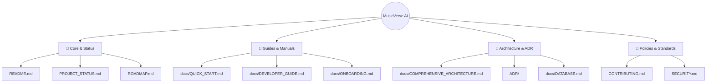

# 📚 Навигатор по документации / Documentation Index

Добро пожаловать в путеводитель по документации проекта **MusicVerse AI**! Этот документ объединяет все руководства, архитектурные описания и стандарты разработки в единую интерактивную карту.

---

## 🗺️ Быстрая навигация / Quick Navigation

---

## 📂 Разделы документации / Documentation Sections

### 1. 🚀 Начало работы / Getting Started
*   [**README.md**](README.md) — Главный обзор проекта, стек технологий, быстрый запуск.
*   [**docs/QUICK_START.md**](docs/QUICK_START.md) — Руководство по быстрому созданию музыки и работе с интерфейсом плеера.
*   [**docs/ONBOARDING.md**](docs/ONBOARDING.md) — Инструкция по локальной настройке окружения для новых разработчиков.
*   [**docs/DEVELOPER_GUIDE.md**](docs/DEVELOPER_GUIDE.md) — Свод правил разработки, стандартов TypeScript, настройки IDE и команд.
*   [**docs/QUICK_REFERENCE.md**](docs/QUICK_REFERENCE.md) — Быстрый справочник рецептов для частых задач разработки.

### 2. 📊 Статус и планы / Status & Roadmap
*   [**PROJECT_STATUS.md**](PROJECT_STATUS.md) — Текущее состояние проекта, выполненные этапы и цели текущего спринта.
*   [**ROADMAP.md**](ROADMAP.md) — Стратегическая дорожная карта развития MusicVerse AI на 2026 год.
*   [**CHANGELOG.md**](CHANGELOG.md) — Хронологическая история версий и изменений.

### 3. 🏗️ Архитектура системы / Architecture & System Design
*   [**docs/COMPREHENSIVE_ARCHITECTURE.md**](docs/COMPREHENSIVE_ARCHITECTURE.md) — Детальное описание архитектурных слоев, сервисов и потока данных.
*   [**docs/DATABASE.md**](docs/DATABASE.md) — Схема базы данных PostgreSQL, ERD-диаграммы и политики безопасности RLS.
*   [**docs/PLAYER_ARCHITECTURE.md**](docs/PLAYER_ARCHITECTURE.md) — Архитектура аудио-подсистемы, single audio source паттерн и интеграция с Tone.js / Wavesurfer.js.
*   [**docs/ERROR_HANDLING_INFRASTRUCTURE.md**](docs/ERROR_HANDLING_INFRASTRUCTURE.md) — Инфраструктура типизации и обработки ошибок приложения.
*   [**docs/Z_INDEX_HIERARCHY.md**](docs/Z_INDEX_HIERARCHY.md) — Документированная иерархия z-index слоев во избежание визуальных багов перекрытия.

### 4. 🔌 Интеграции и API / Integrations & API Layer
*   [**docs/API.md**](docs/API.md) — Спецификация REST API и Supabase Edge Functions.
*   [**docs/SUNO_API.md**](docs/SUNO_API.md) — Спецификация интеграции с Suno AI v5 API для генерации аудио.
*   [**docs/KLANG_IO.md**](docs/KLANG_IO.md) — Интеграция с сервисом Klang.io для MIDI-транскрипции.
*   [**docs/TELEGRAM_BOT_ARCHITECTURE.md**](docs/TELEGRAM_BOT_ARCHITECTURE.md) — Архитектура и команды Telegram-бота, взаимодействующего с Mini App.

### 5. 🎨 UI/UX и дизайн-система / UI/UX & Styling
*   [**docs/SAFE_AREA_GUIDELINES.md**](docs/SAFE_AREA_GUIDELINES.md) — Руководство по интеграции Telegram Safe Areas и адаптивности под iOS/Android.
*   [**docs/MOBILE_COMPONENTS.md**](docs/MOBILE_COMPONENTS.md) — Библиотека переиспользуемых мобильных сенсорных компонентов.
*   [**docs/LAYOUT_SYSTEM.md**](docs/LAYOUT_SYSTEM.md) — Описание глобальной сетки отступов, позиционирования и адаптивности.

### 6. 🧠 Архитектурные решения / Architecture Decision Records (ADR)
Директория [**ADR/**](ADR/) содержит ключевые проектные решения:
*   [ADR-001: Выбор технологического стека](ADR/ADR-001-TECHNOLOGY-STACK-CHOICE.md)
*   [ADR-002: Архитектура фронтенда](ADR/ADR-002-Frontend-Architecture-And-Stack.md)
*   [ADR-003: Архитектура оптимизации производительности](ADR/ADR-003-Performance-Optimization-Architecture.md)
*   [ADR-004: Логика воспроизведения аудио](ADR/ADR-004-Audio-Playback-Optimization.md)
*   [ADR-004 (доп.): Архитектура обработки ошибок](ADR/ADR-004-Error-Handling-Architecture.md)
*   [ADR-005: Архитектура конечных автоматов](ADR/ADR-005-State-Machine-Architecture.md)
*   [ADR-006: Типизированный контекст Audio Context](ADR/ADR-006-Type-Safe-Audio-Context.md)
*   [ADR-011: Архитектура Unified Studio](ADR/ADR-011-UNIFIED-STUDIO-ARCHITECTURE.md)
*   [ADR-012: Компактный интерфейс генерации](ADR/ADR-012-GENERATION-FORM-COMPACT-UI.md)

### 7. 🛡️ Политики и стандарты / Policies & Standards
*   [**CONTRIBUTING.md**](CONTRIBUTING.md) — Правила разработки, создания веток, именования коммитов и код-ревью.
*   [**SECURITY.md**](SECURITY.md) — Политика безопасности, сообщение об уязвимостях и шифрование данных.
*   [**MAINTENANCE.md**](MAINTENANCE.md) — Документ о поддержке инфраструктуры, резервном копировании и мониторинге.
*   [**CODE_OF_CONDUCT.md**](CODE_OF_CONDUCT.md) — Кодекс поведения участников сообщества MusicVerse AI.

---

## 🗂️ Интерактивная визуальная карта / Visual Navigation Index
Для тех, кто предпочитает визуальное исследование документации, доступна интерактивная карта с диаграммами по различным сценариям:
*   [**docs/NAVIGATION_INDEX.md**](docs/NAVIGATION_INDEX.md)
