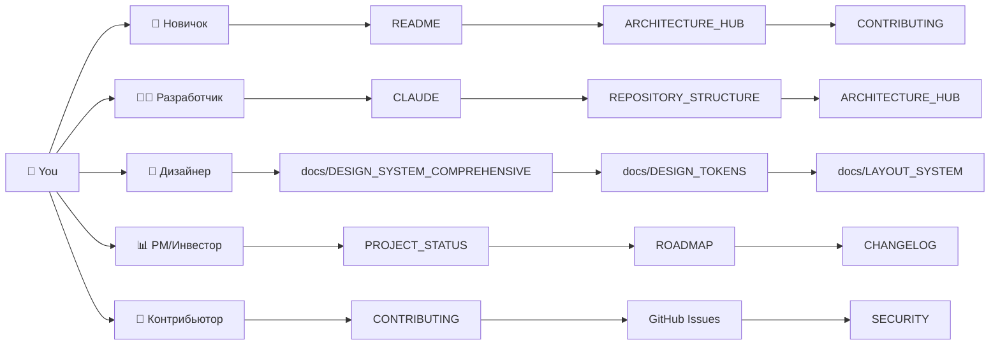
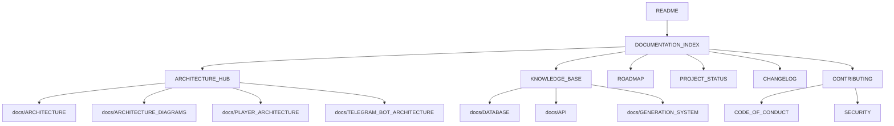

# 📚 Documentation Index

**Single navigation hub for every document in the MusicVerse AI repository.**

  
  
  
  

  <a href="README.md">🏠 Home</a> ·
  <a href="ARCHITECTURE_HUB.md">🏛 Architecture</a> ·
  <a href="ROADMAP.md">🗺 Roadmap</a> ·
  <a href="CHANGELOG.md">📝 Changelog</a> ·
  <a href="CONTRIBUTING.md">🤝 Contributing</a>

---

> [!TIP]
> **Choose your path** — every role-based onboarding flow is below. New here? Start with the **Newcomer** lane.

## 🚦 Role-based onboarding

---

## 🗺 Categories

### 1️⃣ Getting Started

| Doc                                             | Description          | Status |
| ----------------------------------------------- | -------------------- | :----: |
| [README](README.md)                             | Project overview     |   ✅   |
| [docs/ONBOARDING](docs/ONBOARDING.md)           | Developer onboarding |   ✅   |
| [docs/DEVELOPER_GUIDE](docs/DEVELOPER_GUIDE.md) | Best practices       |   ✅   |

### 2️⃣ Architecture

| Doc                                                                   | Description                  | Status |
| --------------------------------------------------------------------- | ---------------------------- | :----: |
| [ARCHITECTURE_HUB](ARCHITECTURE_HUB.md)                               | Canonical architecture entry |   ✅   |
| [REPOSITORY_STRUCTURE](REPOSITORY_STRUCTURE.md)                       | Repo tree & purpose          |   ✅   |
| [docs/ARCHITECTURE](docs/ARCHITECTURE.md)                             | High-level architecture      |   ✅   |
| [docs/ARCHITECTURE_DIAGRAMS](docs/ARCHITECTURE_DIAGRAMS.md)           | Visual diagrams              |   ✅   |
| [docs/PLAYER_ARCHITECTURE](docs/PLAYER_ARCHITECTURE.md)               | Audio player                 |   ✅   |
| [docs/AUDIO_ARCHITECTURE_DIAGRAM](docs/AUDIO_ARCHITECTURE_DIAGRAM.md) | Audio dataflow               |   ✅   |
| [docs/TELEGRAM_BOT_ARCHITECTURE](docs/TELEGRAM_BOT_ARCHITECTURE.md)   | Bot architecture             |   ✅   |
| [docs/Z_INDEX_HIERARCHY](docs/Z_INDEX_HIERARCHY.md)                   | z-index strategy             |   ✅   |
| [docs/LAYOUT_SYSTEM](docs/LAYOUT_SYSTEM.md)                           | Layout primitives            |   ✅   |

### 3️⃣ Features

| Doc                                                             | Description          | Status |
| --------------------------------------------------------------- | -------------------- | :----: |
| [docs/GENERATION_SYSTEM](docs/GENERATION_SYSTEM.md)             | Suno generation flow |   ✅   |
| [docs/AI_LYRICS_ASSISTANT](docs/AI_LYRICS_ASSISTANT.md)         | Lyrics AI            |   ✅   |
| [docs/CREATIVE_TOOLS](docs/CREATIVE_TOOLS.md)                   | Creative toolkit     |   ✅   |
| [docs/STEM_STUDIO](docs/STEM_STUDIO.md)                         | Stem separation      |   ✅   |
| [docs/AUDIO_UPLOAD_FLOW](docs/AUDIO_UPLOAD_FLOW.md)             | Upload pipeline      |   ✅   |
| [docs/CONTEXTUAL_HINTS_SYSTEM](docs/CONTEXTUAL_HINTS_SYSTEM.md) | Hints engine         |   ✅   |
| [docs/DEMO_MODE](docs/DEMO_MODE.md)                             | Demo mode            |   ✅   |

### 4️⃣ API & Integrations

| Doc                                                         | Description        | Status |
| ----------------------------------------------------------- | ------------------ | :----: |
| [docs/API](docs/API.md)                                     | Edge Functions API |   ✅   |
| [docs/SUNO_API](docs/SUNO_API.md)                           | Suno integration   |   ✅   |
| [docs/KLANG_IO](docs/KLANG_IO.md)                           | MIDI transcription |   ✅   |
| [docs/KLANG_IO_API_GUIDE_RU](docs/KLANG_IO_API_GUIDE_RU.md) | Klang RU guide     |   ✅   |
| [docs/DATABASE](docs/DATABASE.md)                           | DB schema          |   ✅   |
| [docs/ENVIRONMENT_VARIABLES](docs/ENVIRONMENT_VARIABLES.md) | Env vars           |   ✅   |
| [docs/ERROR_CODES](docs/ERROR_CODES.md)                     | Error catalogue    |   ✅   |
| [docs/META_TAGS](docs/META_TAGS.md)                         | SEO meta           |   ✅   |

### 5️⃣ Design & UI

| Doc                                                                     | Description                        | Status |
| ----------------------------------------------------------------------- | ---------------------------------- | :----: |
| [docs/DESIGN_SYSTEM_COMPREHENSIVE](docs/DESIGN_SYSTEM_COMPREHENSIVE.md) | Full design system                 |   ✅   |
| [docs/DESIGN_TOKENS](docs/DESIGN_TOKENS.md)                             | Tokens reference                   |   ✅   |
| [docs/STYLES](docs/STYLES.md)                                           | Styling conventions                |   ✅   |
| [docs/MOBILE_COMPONENTS](docs/MOBILE_COMPONENTS.md)                     | Mobile primitives                  |   ✅   |
| [docs/HOOKS_REFERENCE](docs/HOOKS_REFERENCE.md)                         | Hook catalogue                     |   ✅   |
| [docs/FORMATTING_GUIDE](docs/FORMATTING_GUIDE.md)                       | Code formatting                    |   ✅   |
| [docs/NAVIGATION](docs/NAVIGATION.md)                                   | Navigation system                  |   ✅   |
| [docs/LANGUAGES](docs/LANGUAGES.md)                                     | i18n strategy                      |   ✅   |
| [DESIGN_AUDIT_2026-06-29](DESIGN_AUDIT_2026-06-29.md)                   | Design audit (Q2)                  |   ✅   |
| [UI_AUDIT_REPORT_2026-07-03](UI_AUDIT_REPORT_2026-07-03.md)             | UI audit (WCAG 2.1 AA, 14 patches) |   ✅   |

### 6️⃣ Operations

| Doc                                                                       | Description           | Status |
| ------------------------------------------------------------------------- | --------------------- | :----: |
| [docs/DEPLOYMENT_GUIDE](docs/DEPLOYMENT_GUIDE.md)                         | Deployment            |   ✅   |
| [docs/DEPLOYMENT_CHECKLIST](docs/DEPLOYMENT_CHECKLIST.md)                 | Release checklist     |   ✅   |
| [docs/BUNDLE_ANALYSIS](docs/BUNDLE_ANALYSIS.md)                           | Bundle audit          |   ✅   |
| [docs/BUNDLE_OPTIMIZATION](docs/BUNDLE_OPTIMIZATION.md)                   | Optimisation playbook |   ✅   |
| [docs/PERFORMANCE_OPTIMIZATION](docs/PERFORMANCE_OPTIMIZATION.md)         | Perf guide            |   ✅   |
| [docs/PERFORMANCE_MONITORING_SETUP](docs/PERFORMANCE_MONITORING_SETUP.md) | Monitoring setup      |   ✅   |
| [docs/AUDIT_SYSTEM](docs/AUDIT_SYSTEM.md)                                 | Audit tooling         |   ✅   |
| [docs/SECURITY_SUMMARY](docs/SECURITY_SUMMARY.md)                         | Security summary      |   ✅   |
| [docs/TELEGRAM_BOT_MONITORING](docs/TELEGRAM_BOT_MONITORING.md)           | Bot observability     |   ✅   |
| [MAINTENANCE](MAINTENANCE.md)                                             | Maintenance plan      |   ✅   |

### 7️⃣ Process & Governance

| Doc                                                       | Description       | Status |
| --------------------------------------------------------- | ----------------- | :----: |
| [CONTRIBUTING](CONTRIBUTING.md)                           | Contribution flow |   ✅   |
| [CODE_OF_CONDUCT](CODE_OF_CONDUCT.md)                     | Code of conduct   |   ✅   |
| [SECURITY](SECURITY.md)                                   | Vuln disclosure   |   ✅   |
| [CHANGELOG](CHANGELOG.md)                                 | Release notes     |   ✅   |
| [ROADMAP](ROADMAP.md)                                     | Roadmap           |   ✅   |
| [PROJECT_STATUS](PROJECT_STATUS.md)                       | Current status    |   ✅   |
| [KNOWN_ISSUES_TRACKED](KNOWN_ISSUES_TRACKED.md)           | Known issues      |   ✅   |
| [AGENTS](AGENTS.md)                                       | Agent notes       |   ✅   |
| [docs/DEVELOPMENT_WORKFLOW](docs/DEVELOPMENT_WORKFLOW.md) | Dev workflow      |   ✅   |
| [docs/CRITICAL_FILES](docs/CRITICAL_FILES.md)             | Don't-touch list  |   ✅   |

### 8️⃣ Telegram Mini App

| Doc                                                                   | Description        | Status |
| --------------------------------------------------------------------- | ------------------ | :----: |
| [docs/TELEGRAM_MINI_APP_FEATURES](docs/TELEGRAM_MINI_APP_FEATURES.md) | Mini App features  |   ✅   |
| [docs/TELEGRAM_MINI_APP/](docs/TELEGRAM_MINI_APP/)                    | Integration guides |   ✅   |
| [docs/TELEGRAM_BOT_ARCHITECTURE](docs/TELEGRAM_BOT_ARCHITECTURE.md)   | Bot architecture   |   ✅   |
| [docs/TELEGRAM_BOT_MONITORING](docs/TELEGRAM_BOT_MONITORING.md)       | Bot monitoring     |   ✅   |

---

## 🗄 Archive

Historical docs live under [`docs/archive/`](docs/archive/). The 2026-06-27 cleanup moved 9 duplicate files there — see [`docs/_audit/REPO_DOCS_AUDIT_2026-06-27.md`](docs/_audit/REPO_DOCS_AUDIT_2026-06-27.md).

---

## 🔍 Dependency map

---

### 🔗 Related Documentation

|       🏠 Home       |       🏛 Architecture       |       🗺 Roadmap       |         🤝 Contributing         |       🔒 Security       |       📝 Changelog        |
| :-----------------: | :------------------------: | :-------------------: | :-----------------------------: | :---------------------: | :-----------------------: |
| [README](README.md) | [Hub](ARCHITECTURE_HUB.md) | [Roadmap](ROADMAP.md) | [Contributing](CONTRIBUTING.md) | [Security](SECURITY.md) | [Changelog](CHANGELOG.md) |

Last updated: 2026-07-03

