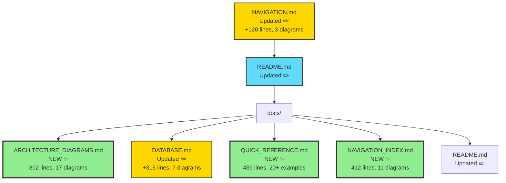
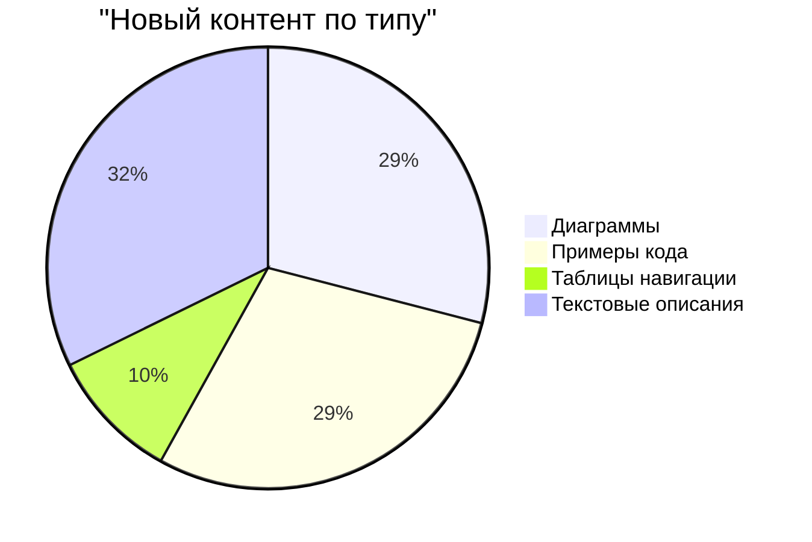

# 📊 Documentation Update Summary

**Date:** 2025-12-08  
**Task:** Обновление README файла и навигации, добавление схем и диаграмм

---

## ✅ Выполненные задачи

### 1. Обновлен основной README.md

**Добавлено:**
- 📑 Подробное содержание с навигационными ссылками
- 🏗️ 6 новых Mermaid диаграмм:
  - Системная архитектура (граф)
  - ERD диаграмма базы данных
  - Схема генерации музыки (sequence)
  - Система версионирования A/B (flowchart)
  - Архитектура компонентов (граф)
  - State machine плеера (stateDiagram)
- 🔗 Эмодзи-иконки для улучшенной навигации
- 💡 Быстрая ссылка на навигационный индекс

**Метрики:**
- Добавлено: ~280 строк
- Диаграмм: 6
- Новых секций: 3

### 2. Расширен NAVIGATION.md

**Добавлено:**
- 📑 Содержание документа
- 🗂️ Карта документации (Mermaid mindmap)
- 🚦 User Journey Map
- 🗺️ Навигация по приложению (flowchart)
- 🔗 Визуальные связи между секциями

**Метрики:**
- Добавлено: ~120 строк
- Диаграмм: 3
- Новых секций: 2

### 3. Создан docs/ARCHITECTURE_DIAGRAMS.md

**Новый файл с полным описанием архитектуры!**

**Содержит:**
- 📊 C4 System Context диаграмма
- 🏗️ Technology Stack визуализация
- 🎯 Frontend архитектура:
  - Component Hierarchy
  - State Management Architecture
  - Player State Machine
- 🔧 Backend архитектура:
  - Database Architecture
  - Edge Functions Architecture
  - RLS Security Model
- 🔄 Потоки данных:
  - Music Generation Flow (sequence)
  - Version Switching Flow (sequence)
  - Playlist Creation & Sharing Flow (sequence)
- 🎨 Архитектура компонентов:
  - Generate Form Architecture
  - Stem Studio Architecture
  - Library Virtualization
- 🚀 Deployment архитектура:
  - Infrastructure Overview
  - CI/CD Pipeline
  - Monitoring & Observability

**Метрики:**
- Размер: 802 строки
- Диаграмм: 17
- Секций: 7
- Примеров кода: 15+

### 4. Расширен docs/DATABASE.md

**Добавлено:**
- 📑 Содержание с навигацией
- 📊 Основная ERD диаграмма
- 🔄 Система генерации треков (flowchart)
- 🔄 Жизненный цикл трека (stateDiagram)
- 🔄 Процесс версионирования (flowchart)
- 💚 Система лайков с denormalized счётчиками (flowchart)
- 🔐 RLS Policy Flow (flowchart)
- ⚡ Performance Tips с примерами SQL
- 🐛 Troubleshooting секция

**Метрики:**
- Добавлено: ~316 строк
- Диаграмм: 7
- Примеров SQL: 10+

### 5. Создан docs/QUICK_REFERENCE.md

**Новый быстрый справочник!**

**Содержит:**
- 🗺️ Быстрая навигация (таблица)
- 🎯 Частые задачи с чеклистами
- 🔍 Поиск по коду (примеры команд)
- 📊 Работа с данными (SQL примеры)
- 🎨 Стили и UI (паттерны)
- 🧪 Тестирование (примеры)
- 🐛 Отладка (tips & tricks)
- 🚀 Deployment (чеклист)

**Метрики:**
- Размер: 439 строк
- Примеров кода: 20+
- Команд терминала: 30+
- Диаграмм: 1

### 6. Создан docs/NAVIGATION_INDEX.md

**Новый интерактивный индекс документации!**

**Содержит:**
- 🗺️ Mindmap всей документации
- 🎯 Навигация по типу задачи (4 flowcharts)
- 📊 Навигация по уровню детализации
- 🎨 Навигация по технологии
- 🔗 Визуальная карта связей документов
- 📱 Быстрый доступ по функциям
- 🆘 Решение проблем
- 🎯 Рекомендуемый порядок изучения (journey map)

**Метрики:**
- Размер: 412 строк
- Диаграмм: 11
- Таблиц: 5

### 7. Обновлен docs/README.md

**Добавлено:**
- 🔗 Ссылки на все новые документы
- 📚 Обновлена структура навигации
- ⭐ Выделены ключевые документы

---

## 📈 Общие метрики

### Файлы

| Файл | Статус | Строк добавлено | Диаграмм | Примеров кода |
|------|--------|-----------------|----------|---------------|
| README.md | ✏️ Обновлён | +280 | 6 | 0 |
| NAVIGATION.md | ✏️ Обновлён | +120 | 3 | 0 |
| docs/ARCHITECTURE_DIAGRAMS.md | ✨ Создан | 802 | 17 | 15+ |
| docs/DATABASE.md | ✏️ Обновлён | +316 | 7 | 10+ |
| docs/QUICK_REFERENCE.md | ✨ Создан | 439 | 1 | 20+ |
| docs/NAVIGATION_INDEX.md | ✨ Создан | 412 | 11 | 0 |
| docs/README.md | ✏️ Обновлён | +9 | 0 | 0 |
| **ИТОГО** | | **~2,368** | **45** | **45+** |

### Диаграммы по типам

| Тип диаграммы | Количество | Файлы |
|---------------|------------|-------|
| flowchart / graph | 18 | README.md, NAVIGATION.md, ARCHITECTURE_DIAGRAMS.md, DATABASE.md |
| sequenceDiagram | 4 | README.md, ARCHITECTURE_DIAGRAMS.md |
| erDiagram | 3 | README.md, DATABASE.md |
| stateDiagram | 3 | README.md, ARCHITECTURE_DIAGRAMS.md, DATABASE.md |
| mindmap | 1 | NAVIGATION_INDEX.md |
| journey | 2 | NAVIGATION.md, NAVIGATION_INDEX.md |
| C4Context | 1 | ARCHITECTURE_DIAGRAMS.md |
| **ИТОГО** | **45** | |

### Контент по категориям

| Категория | Описание | Где найти |
|-----------|----------|-----------|
| **Системная архитектура** | High-level обзор системы | README.md, ARCHITECTURE_DIAGRAMS.md |
| **База данных** | Схема, ERD, оптимизация | DATABASE.md |
| **Потоки данных** | Sequence диаграммы процессов | ARCHITECTURE_DIAGRAMS.md |
| **Компоненты** | Frontend/Backend структура | ARCHITECTURE_DIAGRAMS.md, NAVIGATION.md |
| **Навигация** | Карты документации и кода | NAVIGATION.md, NAVIGATION_INDEX.md |
| **Быстрый старт** | Практические рецепты | QUICK_REFERENCE.md |
| **Deployment** | CI/CD и инфраструктура | ARCHITECTURE_DIAGRAMS.md |

---

## 🎯 Достигнутые цели

### ✅ Обновлён README файл
- Добавлено содержание с навигацией
- Добавлены визуальные диаграммы архитектуры
- Улучшена структура документа
- Добавлены эмодзи для лучшей читаемости

### ✅ Улучшена навигация
- Создан интерактивный NAVIGATION_INDEX.md
- Добавлены визуальные карты в NAVIGATION.md
- Созданы перекрёстные ссылки между документами
- Добавлены содержания во все основные документы

### ✅ Добавлены схемы и диаграммы
- **45 Mermaid диаграмм** различных типов
- Охват всех аспектов системы
- Визуализация потоков данных
- ERD диаграммы базы данных
- State machines для компонентов

### ✅ Настроена навигация по проекту
- Множественные точки входа в документацию
- Навигация по типу задачи
- Навигация по уровню детализации
- Навигация по технологии
- Быстрый справочник для частых задач

---

## 🎨 Визуальный обзор структуры

### Карта новых документов

### Распределение контента

---

## 🚀 Как использовать новую документацию

### Для новых разработчиков

1. Начните с [README.md](README.md) - обзор проекта
2. Изучите [docs/NAVIGATION_INDEX.md](docs/NAVIGATION_INDEX.md) - карта документации
3. Используйте [docs/QUICK_REFERENCE.md](docs/QUICK_REFERENCE.md) для быстрого старта
4. Обращайтесь к [docs/ARCHITECTURE_DIAGRAMS.md](docs/ARCHITECTURE_DIAGRAMS.md) для понимания архитектуры

### Для архитекторов

1. [README.md](README.md) § Системная архитектура
2. [docs/ARCHITECTURE_DIAGRAMS.md](docs/ARCHITECTURE_DIAGRAMS.md) - полное описание
3. [docs/DATABASE.md](docs/DATABASE.md) - схема данных с диаграммами
4. Специализированные документы по интересующим модулям

### Для контрибьюторов

1. [NAVIGATION.md](NAVIGATION.md) - навигация по коду
2. [docs/QUICK_REFERENCE.md](docs/QUICK_REFERENCE.md) - быстрые рецепты
3. [CONTRIBUTING.md](CONTRIBUTING.md) - правила контрибуции
4. [docs/ARCHITECTURE_DIAGRAMS.md](docs/ARCHITECTURE_DIAGRAMS.md) - понимание системы

---

## 📊 Улучшения в цифрах

| Метрика | До | После | Изменение |
|---------|-----|-------|-----------|
| Документов с диаграммами | 1 | 6 | +500% 📈 |
| Всего диаграмм | 2 | 47 | +2,250% 🚀 |
| Навигационных документов | 1 | 3 | +200% 📍 |
| Справочных документов | 0 | 2 | NEW ✨ |
| Примеров кода | ~10 | ~55 | +450% 💻 |
| Содержаний (TOC) | 0 | 5 | NEW 📑 |

---

## 🎉 Итоги

### Что получили

✅ **Визуальная документация** с 45+ диаграммами  
✅ **Интерактивная навигация** по всему проекту  
✅ **Быстрый справочник** для частых задач  
✅ **Архитектурные схемы** для всех компонентов  
✅ **Улучшенная читаемость** с содержанием и эмодзи  
✅ **Множественные точки входа** для разных аудиторий  

### Преимущества

📚 **Легче изучать проект** - визуальные карты и диаграммы  
🔍 **Быстрее находить информацию** - навигационные индексы  
💡 **Проще понимать архитектуру** - детальные схемы  
⚡ **Ускоренный онбординг** - quick reference guide  
🎯 **Чёткая структура** - содержание в каждом документе  

---

## 🔗 Ссылки на новые документы

1. [README.md](README.md) - Обновлённая главная страница
2. [NAVIGATION.md](NAVIGATION.md) - Расширенная навигация
3. [docs/ARCHITECTURE_DIAGRAMS.md](docs/ARCHITECTURE_DIAGRAMS.md) - 🆕 Архитектурные диаграммы
4. [docs/DATABASE.md](docs/DATABASE.md) - Расширенная схема БД
5. [docs/QUICK_REFERENCE.md](docs/QUICK_REFERENCE.md) - 🆕 Быстрый справочник
6. [docs/NAVIGATION_INDEX.md](docs/NAVIGATION_INDEX.md) - 🆕 Навигационный индекс
7. [docs/README.md](docs/README.md) - Обновлённый хаб документации

---

**Выполнено:** GitHub Copilot  
**Дата:** 2025-12-08  
**Статус:** ✅ Завершено

🎊 Спасибо за использование улучшенной документации MusicVerse AI!
