# 📱 MusicVerse AI - Mobile UX Optimization Roadmap 2026

**Version:** 2.0  
**Date:** 2026-01-04  
**Status:** Active Development

---

## 📋 Table of Contents

1. [Executive Summary](#executive-summary)
2. [Current State Analysis](#current-state-analysis)
3. [Mobile-First Design Principles](#mobile-first-design-principles)
4. [Optimization Phases](#optimization-phases)
5. [Telegram Mini App Integration](#telegram-mini-app-integration)
6. [Performance Targets](#performance-targets)
7. [Testing Strategy](#testing-strategy)
8. [Implementation Timeline](#implementation-timeline)

---

## Executive Summary

MusicVerse AI as a Telegram Mini App requires exceptional mobile UX to compete with native music applications. This roadmap outlines a comprehensive strategy to optimize the mobile experience across all touchpoints.

### Key Statistics

| Metric | Current | Target | Gap |
|--------|---------|--------|-----|
| **Mobile Users** | 85% | 90% | +5% |
| **Touch Target Compliance** | 85% | 100% | +15% |
| **Mobile Form Completion** | 65% | 85% | +20% |
| **Time to First Action** | 8.5s | 5s | -41% |
| **Mobile Performance Score** | 78/100 | 90/100 | +12 |
| **Haptic Feedback Coverage** | 40% | 95% | +55% |

### Core Objectives

1. **✅ 100% Touch Target Compliance** (44-56px minimum)
2. **✅ Telegram Native Feel** (haptic, theme integration)
3. **✅ One-Handed Operation** (bottom navigation, reachable controls)
4. **✅ Performance** (< 500ms interactions, 60 FPS animations)
5. **✅ Accessibility** (WCAG 2.1 AA compliance)

---

## Current State Analysis

### Mobile Component Inventory

**Existing Mobile Components: 19**

```
src/components/mobile/
├── MobilePageTransition.tsx       ✅
├── MobileBottomSheet.tsx          ✅
└── MobileActionSheet.tsx          ✅

src/components/player/
└── MobileFullscreenPlayer.tsx     ✅ (Enhanced in Sprint 029)

src/components/studio/unified/
├── MobileStudioLayout.tsx         ✅
├── MobileStudioTabs.tsx           ✅
├── MobilePlayerContent.tsx        ✅
├── MobileSectionsContent.tsx      ✅
├── MobileTracksContent.tsx        ✅
├── MobileMixerContent.tsx         ✅
└── MobileActionsContent.tsx       ✅

// Other mobile components...
```

### Touch Target Audit Results

**Audit Date:** 2026-01-04  
**Total Interactive Elements:** 342  
**Compliant (≥44px):** 291 (85%)  
**Non-Compliant (<44px):** 51 (15%)

#### Critical Issues Found:

1. **TrackCard Actions** (28 instances)
   - Like button: 36×36px → Need 44×44px
   - Menu button: 32×32px → Need 44×44px
   - Play button: 40×40px → Need 48×48px

2. **Version Switcher** (12 instances)
   - Version badge: 28px height → Need 44px
   - Inline switcher too small for touch

3. **Player Controls** (8 instances)
   - Volume slider: 12px height → Need 20px
   - Progress bar: 8px height → Need 16px
   - Secondary buttons: 36×36px → Need 44×44px

4. **Form Fields** (3 instances)
   - Checkbox: 16×16px → Need 24×24px
   - Radio: 16×16px → Need 24×24px
   - Switch: 32px width → Need 44px

### User Journey Analysis

#### Current Mobile Flow Issues:

```mermaid
graph TD
    A[Open App] --> B{First Time?}
    B -->|Yes| C[❌ Long Onboarding<br/>9 steps, 2-3 min]
    B -->|No| D[Homepage]
    
    C --> D
    D --> E[❌ Overwhelming Content<br/>4 sections, lots of scrolling]
    
    E --> F{Want to Generate?}
    F -->|Yes| G[❌ Complex Form<br/>Long scroll, many fields]
    G --> H[❌ Unclear Submit<br/>Button below fold]
    
    F -->|No| I[Browse Library]
    I --> J[❌ Small Touch Targets<br/>Hard to tap actions]
    
    J --> K[Play Track]
    K --> L[❌ Compact Player<br/>Small controls]
    
    L --> M{Fullscreen?}
    M -->|Yes| N[❌ Lyrics Hidden<br/>Requires scroll]
```



**Pain Points Identified:**

1. **Discovery:** Users struggle to find generation form (23% bounce rate)
2. **Generation:** Form completion rate only 65%
3. **Playback:** 40% of users never discover fullscreen player
4. **Actions:** Like/share actions have low engagement (touch target issue)

---

## Mobile-First Design Principles

### 1. Thumb Zone Optimization

```
┌─────────────────────────────┐
│                             │ ← Hard to reach
│        HARD ZONE            │
│                             │
│─────────────────────────────│
│                             │
│       NATURAL ZONE          │ ← Easy to reach
│     (Primary Actions)       │
│                             │
│─────────────────────────────│
│                             │
│       EASY ZONE             │ ← Very easy
│  (Bottom Nav, FAB, CTAs)    │
└─────────────────────────────┘
```

**Implementation:**
- Bottom 1/3: Primary CTAs, navigation, player
- Middle 1/3: Content, scrollable lists
- Top 1/3: Header, secondary actions

### 2. Touch Target Hierarchy

```typescript
export const touchTargetSize = {
  // Primary actions (Generate, Play, Save)
  primary: {
    minWidth: '56px',
    minHeight: '56px',
    padding: '16px',
  },
  
  // Secondary actions (Like, Share, Menu)
  secondary: {
    minWidth: '48px',
    minHeight: '48px',
    padding: '12px',
  },
  
  // Tertiary actions (Tags, Badges)
  tertiary: {
    minWidth: '44px',
    minHeight: '44px',
    padding: '10px',
  },
  
  // Dense mode (List items, toolbars)
  dense: {
    minWidth: '44px',
    minHeight: '40px',
    padding: '8px',
  },
};
```

### 3. One-Handed Operation

**Guidelines:**
- Primary actions within 75mm (3 inches) from bottom
- Swipe gestures for secondary actions
- No critical buttons in top corners
- Landscape mode gracefully degraded

### 4. Gesture-First Interface

**Supported Gestures:**

| Gesture | Action | Context |
|---------|--------|---------|
| **Tap** | Primary action | Buttons, cards, links |
| **Long Press** | Context menu | Track cards, messages |
| **Swipe Left/Right** | Navigate, Delete | Track list, fullscreen player |
| **Swipe Up** | Expand player, Show more | Compact player, lists |
| **Swipe Down** | Collapse player, Refresh | Fullscreen player, homepage |
| **Double Tap** | Like, Seek ±10s | Track cards, player |
| **Pinch** | Zoom | Images, waveforms |
| **Pull Down** | Refresh | Lists, homepage |

### 5. Keyboard-Aware Forms

```typescript
// Auto-scroll to keep focused field visible
useKeyboardAware({
  offset: 20, // px above keyboard
  duration: 250, // ms
  easing: 'ease-out',
});

// Keyboard toolbar for quick actions
<KeyboardToolbar>
  <Button>Done</Button>
  <Button>Next Field</Button>
  <Button>Generate</Button>
</KeyboardToolbar>
```

---

## Optimization Phases

### Phase 1: Foundation (Sprint 029) ✅ 90% Complete

**Duration:** 2 weeks  
**Status:** In Progress  
**Goal:** Telegram SDK integration, basic mobile optimizations

#### Completed Tasks ✅

1. **Telegram SDK 8.0 Integration**
   - CloudStorage API ✅
   - Haptic Feedback ✅
   - Theme Integration ✅
   - Deep Links ✅

2. **Touch Target Audit**
   - Automated audit script ✅
   - BottomNavigation 56px ✅
   - Button component haptic prop ✅

3. **Fullscreen Player Enhancements**
   - Horizontal swipe navigation ✅
   - Double-tap seek ±10s ✅
   - Karaoke mode ✅
   - Cover prefetching ✅

4. **Mobile Navigation**
   - Pull-to-refresh (Library, Homepage) ✅
   - useKeyboardAware hook ✅
   - Safe-area padding ✅

#### Remaining Tasks 🔄

5. **Touch Target Fixes**
   - [ ] TrackCard actions (28 instances)
   - [ ] Version switcher (12 instances)
   - [ ] Player controls (8 instances)
   - [ ] Form fields (3 instances)

6. **E2E Testing**
   - [ ] Mobile-specific test suite
   - [ ] Real device testing
   - [ ] Performance benchmarks

---

### Phase 2: Core UX Optimization (4 weeks)

**Duration:** 4 weeks  
**Start Date:** January 20, 2026  
**Goal:** Fix identified pain points, improve user flows

#### Week 1: Homepage & Discovery

**Tasks:**
- [ ] Simplify homepage layout
  - Reduce sections from 4 to 2 (Trending + Quick Actions)
  - Add prominent "Generate Music" FAB
  - Persistent search bar
- [ ] Quick Actions Bar
  - Generate
  - My Library
  - Explore
  - Profile
- [ ] Improve Featured section
  - Horizontal scroll (not vertical)
  - Larger cards (200×200px)
  - Autoplay on tap

**Deliverables:**
- New homepage design
- FAB component
- Quick actions bar
- A/B test results

---

#### Week 2: Library & Track Cards

**Tasks:**
- [ ] Fix all touch targets in TrackCard
  - Play button: 48×48px
  - Like button: 44×44px
  - Menu button: 44×44px
  - Version badge: 44px height
- [ ] Implement swipe actions
  - Swipe left: Delete, Remove from playlist
  - Swipe right: Like, Add to queue
- [ ] Multi-select mode
  - Long press to enter
  - Bulk actions toolbar
  - Select all/none
- [ ] Persistent filters
  - Sticky filter bar
  - Quick filters (My tracks, Liked, Recent)
  - Search history

**Deliverables:**
- Updated TrackCard component
- Swipe actions library
- Multi-select mode
- Filter system

---

#### Week 3: Player Optimization

**Tasks:**
- [ ] Compact Player
  - Fix waveform fallback (shimmer instead of random)
  - Increase progress bar to 20px
  - Larger like button (44×44px)
  - Swipe up to expand
- [ ] Expanded Player
  - Touch targets 48×48px minimum
  - Haptic on all controls
  - Version switcher 56×56px
  - Queue panel optimization
- [ ] Fullscreen Player Polish
  - Lyrics in center (blur background)
  - Larger controls (56×56px)
  - Hide volume on mobile
  - Timeline with time display

**Deliverables:**
- Updated player components
- Shimmer skeleton loader
- Haptic feedback integration
- User testing results

---

#### Week 4: Generation Flow

**Tasks:**
- [ ] GenerateSheet Redesign
  - 3-step wizard (Description → Style → Advanced)
  - Progress indicator
  - Quick presets (8 cards)
  - Keyboard toolbar
- [ ] Form Optimization
  - Auto-save every 30s
  - Floating submit button
  - Inline validation
  - Character counters
- [ ] Voice Input
  - Whisper API integration
  - Telegram voice message support
  - Real-time transcription
  - Edit after transcribe

**Deliverables:**
- 3-step wizard component
- Quick presets
- Voice input feature
- Form completion metrics

---

### Phase 3: Unified Studio Mobile (Sprint 030, 2 weeks)

**Duration:** 2 weeks  
**Start Date:** February 10, 2026  
**Goal:** Unify studio interfaces for mobile

See [SPRINT-030-UNIFIED-STUDIO-MOBILE.md](./SPRINTS/SPRINT-030-UNIFIED-STUDIO-MOBILE.md) for full details.

#### Key Deliverables:
- [ ] UnifiedStudioMobile component
- [ ] 7 optimized tabs
- [ ] Touch-first controls
- [ ] Gesture navigation

---

### Phase 4: Advanced Features (3 weeks)

**Duration:** 3 weeks  
**Start Date:** February 24, 2026  
**Goal:** PWA features, offline mode, advanced gestures

#### Week 8: PWA Foundation

**Tasks:**
- [ ] Service Worker setup
- [ ] Offline fallback page
- [ ] Install prompt
- [ ] App manifest
- [ ] Push notifications (opt-in)

#### Week 9: Offline Mode

**Tasks:**
- [ ] IndexedDB expansion
  - Cache 50 most played tracks
  - Store user preferences
  - Queue offline actions
- [ ] Background sync
  - Upload when online
  - Retry failed requests
  - Conflict resolution
- [ ] Offline UI
  - Status indicator
  - Cached content badge
  - Sync status

#### Week 10: Advanced Gestures

**Tasks:**
- [ ] Swipe between tabs
  - Tabs component
  - Smooth transitions
  - Momentum scrolling
- [ ] Pinch to zoom
  - Waveform viewer
  - Cover images
  - Lyrics panel
- [ ] 3D Touch / Haptic
  - Preview on long press
  - Context-aware haptic
  - Pressure-sensitive (iOS)

---

## Telegram Mini App Integration

### SDK 8.0 Features

#### CloudStorage API ✅ Implemented

```typescript
import { useCloudStorage } from '@/hooks/useCloudStorage';

function MyComponent() {
  const [settings, setSettings] = useCloudStorage('user-settings', {
    theme: 'auto',
    quality: 'high',
  });
  
  // Auto-syncs across devices
  // Falls back to localStorage
}
```

#### Haptic Feedback ✅ Implemented

```typescript
import { haptic } from '@/lib/haptic';

<Button
  onClick={() => {
    haptic.medium();
    onGenerate();
  }}
>
  Generate
</Button>
```

**Coverage Target:** 95%
- All buttons
- All swipe actions
- All state changes (success, error)
- All selections

#### Deep Links ✅ Partial

**Current Support:**
- Tracks: `t.me/AIMusicVerseBot/app?startapp=track_<ID>`
- Playlists: `t.me/AIMusicVerseBot/app?startapp=playlist_<ID>`
- Player: `t.me/AIMusicVerseBot/app?startapp=play_<ID>` ✅ NEW

**To Add:**
- [ ] Projects: `startapp=project_<ID>`
- [ ] Artists: `startapp=artist_<ID>`
- [ ] Studio: `startapp=studio_<TRACK_ID>`
- [ ] Generate with preset: `startapp=generate_<PRESET>`

#### Native Sharing

```typescript
// Telegram Stories
TelegramWebApp.shareToStory(mediaUrl, {
  text: 'Check out my new track!',
  widget_link: {
    url: deepLink,
    name: 'Listen Now',
  },
});

// Share to chat
TelegramWebApp.shareMessage(text, deepLink);

// Download file
TelegramWebApp.downloadFile(audioUrl, filename);
```

### Theme Integration

```typescript
// React to Telegram theme changes
useEffect(() => {
  const handleThemeChange = () => {
    const theme = TelegramWebApp.colorScheme;
    document.documentElement.setAttribute('data-theme', theme);
  };
  
  TelegramWebApp.onEvent('themeChanged', handleThemeChange);
  return () => TelegramWebApp.offEvent('themeChanged', handleThemeChange);
}, []);
```

### Safe Area

```css
/* Respect Telegram safe areas */
.mobile-layout {
  padding-top: env(safe-area-inset-top);
  padding-bottom: env(safe-area-inset-bottom);
  padding-left: env(safe-area-inset-left);
  padding-right: env(safe-area-inset-right);
}

/* Bottom navigation */
.bottom-nav {
  padding-bottom: calc(env(safe-area-inset-bottom) + 16px);
}
```

---

## Performance Targets

### Mobile Performance Budget

| Metric | Target | Stretch | Current |
|--------|--------|---------|---------|
| **First Contentful Paint** | < 1.2s | < 1.0s | 1.2s |
| **Largest Contentful Paint** | < 2.0s | < 1.8s | 2.1s |
| **Time to Interactive** | < 3.0s | < 2.5s | 3.5s |
| **Total Bundle Size (gzip)** | < 450KB | < 400KB | 500KB |
| **Mobile Performance Score** | > 85 | > 90 | 78 |

### Network Optimization

```typescript
// Adaptive loading based on connection
const connection = navigator.connection;

const imageQuality = {
  '4g': 'high', // 100% quality
  '3g': 'medium', // 75% quality
  '2g': 'low', // 50% quality
  'slow-2g': 'low', // 50% quality
};

const quality = imageQuality[connection.effectiveType] || 'medium';
```

### Battery Optimization

```typescript
// Reduce animations on low battery
const battery = await navigator.getBattery();

if (battery.level < 0.2) {
  // Disable heavy animations
  document.documentElement.classList.add('low-battery-mode');
}
```

---

## Testing Strategy

### Device Matrix

#### Priority 1 (Must Support)
- iPhone 13/14/15 (iOS 16-17)
- Samsung Galaxy S21/S22/S23 (Android 12-14)
- Google Pixel 6/7/8 (Android 13-14)

#### Priority 2 (Should Support)
- iPhone 11/12 (iOS 15-16)
- OnePlus 9/10 (Android 11-13)
- Xiaomi Mi 11/12 (Android 11-13)

#### Priority 3 (Nice to Support)
- iPad Pro (iPadOS 16-17)
- Samsung Galaxy Tab (Android 12-13)
- Budget Android devices (< $300)

### Test Coverage

```typescript
// Mobile-specific E2E tests
describe('Mobile Touch Interactions', () => {
  test('All touch targets >= 44px', async () => {
    const elements = await page.$$('[role="button"]');
    for (const el of elements) {
      const box = await el.boundingBox();
      expect(box.width).toBeGreaterThanOrEqual(44);
      expect(box.height).toBeGreaterThanOrEqual(44);
    }
  });
  
  test('Swipe navigation works', async () => {
    await page.swipe({ direction: 'left' });
    await expect(page).toHaveURL(/next-track/);
  });
  
  test('Haptic feedback triggers', async () => {
    const hapticSpy = jest.spyOn(TelegramWebApp.HapticFeedback, 'impactOccurred');
    await page.click('[data-testid="generate-button"]');
    expect(hapticSpy).toHaveBeenCalledWith('medium');
  });
});
```

### Real Device Testing

**Tools:**
- BrowserStack (cross-device testing)
- Telegram Test Environment
- Local devices (team devices)

**Process:**
1. Deploy to staging
2. Test on 3 devices per priority tier
3. Document issues
4. Fix and re-test
5. Production deploy

---

## Implementation Timeline

### Q1 2026 Gantt Chart


### Milestones

| Date | Milestone | Success Criteria |
|------|-----------|------------------|
| **Jan 19** | Phase 1 Complete | 100% touch compliance, haptic coverage 95% |
| **Feb 9** | Phase 2 Complete | Form completion 85%, Time to first track < 5 min |
| **Feb 23** | Phase 3 Complete | Unified studio, 35% UX improvement |
| **Mar 23** | Phase 4 Complete | PWA ready, offline mode, 90+ performance score |

---

## Success Metrics

### User Metrics

| KPI | Baseline | Target | Measurement |
|-----|----------|--------|-------------|
| **Mobile User Retention** | 62% (D7) | 75% | Analytics |
| **Form Completion Rate** | 65% | 85% | Funnel tracking |
| **Average Session Duration** | 4.2 min | 6 min | Analytics |
| **User Satisfaction (NPS)** | 42 | 55 | Survey |

### Technical Metrics

| KPI | Baseline | Target | Tool |
|-----|----------|--------|------|
| **Touch Target Compliance** | 85% | 100% | Audit script |
| **Mobile Performance Score** | 78 | 90 | Lighthouse CI |
| **Bundle Size** | 500KB | 400KB | Webpack analyzer |
| **Crash-Free Sessions** | 99.2% | 99.8% | Sentry |

---

## Appendix

### Resources

**Internal:**
- [Design System](./DESIGN_SYSTEM_SPECIFICATION.md)
- [UX/UI Improvement Plan](./UX_UI_IMPROVEMENT_PLAN_2026.md)
- [Sprint 029 Plan](./SPRINTS/SPRINT-029-TELEGRAM-MOBILE-OPTIMIZATION.md)
- [Sprint 030 Plan](./SPRINTS/SPRINT-030-UNIFIED-STUDIO-MOBILE.md)

**External:**
- [Telegram Mini App Docs](https://core.telegram.org/bots/webapps)
- [iOS Human Interface Guidelines](https://developer.apple.com/design/human-interface-guidelines/)
- [Material Design (Mobile)](https://material.io/design/platform-guidance/android-mobile.html)
- [Web.dev Mobile Guide](https://web.dev/mobile/)

---

**Living Document**  
Last Updated: 2026-01-04  
Next Review: 2026-01-20
