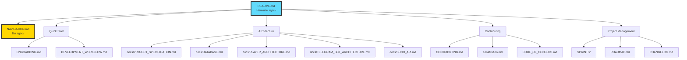
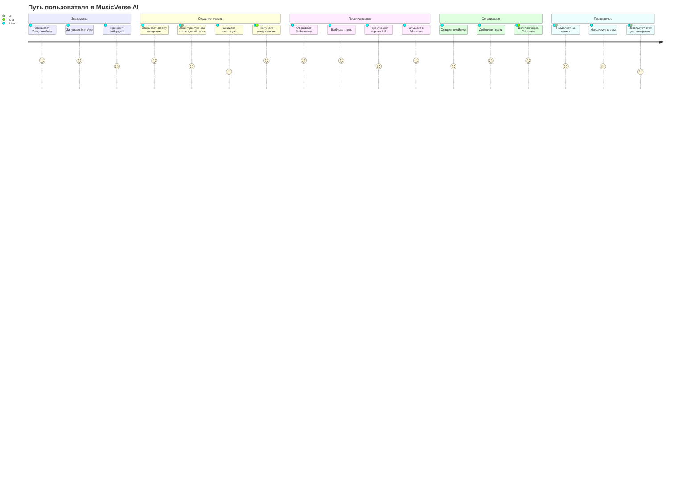
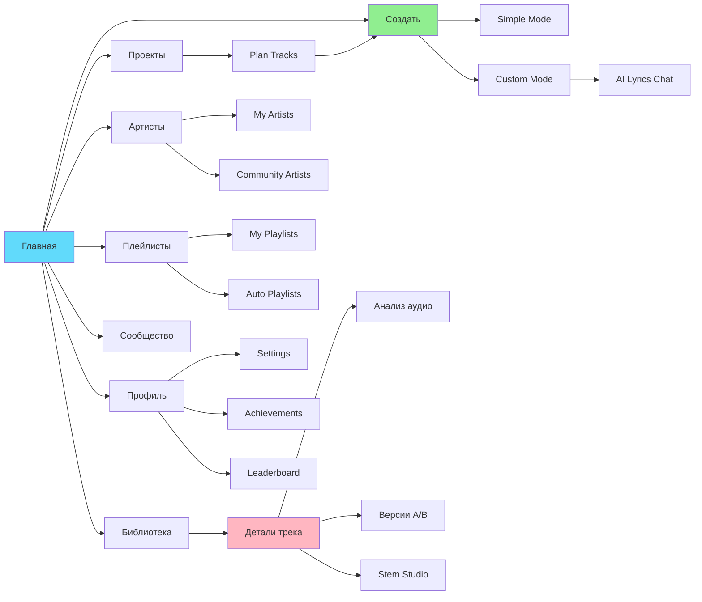

# 🗺️ Путеводитель по проекту MusicVerse

Добро пожаловать в MusicVerse AI! Этот документ — ваша карта по репозиторию.

---

## 📑 Содержание

- [🚀 Ключевые документы](#-ключевые-документы)
- [🗂️ Карта документации](#️-карта-документации)
- [📂 Структура репозитория](#-структура-репозитория)
- [🎯 Навигация по задачам](#-навигация-по-задачам)
- [🔑 Ключевые компоненты](#-ключевые-компоненты)
- [🚦 Путь пользователя](#-путь-пользователя)
- [❓ Как...](#-как)

---

## 🗂️ Карта документации



---

## 🚀 Ключевые документы

| Файл | Описание |
|------|----------|
| [**README.md**](README.md) | **Начните отсюда.** Обзор проекта и возможностей |
| [**CONTRIBUTING.md**](CONTRIBUTING.md) | Правила контрибуции |
| [**DEVELOPMENT_WORKFLOW.md**](DEVELOPMENT_WORKFLOW.md) | Рабочий процесс, GitFlow, стандарты |
| [**ONBOARDING.md**](ONBOARDING.md) | Настройка окружения для новых разработчиков |
| [**CHANGELOG.md**](CHANGELOG.md) | История изменений |

---

## 📂 Структура репозитория

```
/
├── src/                      # 🎯 Исходный код фронтенда
│   ├── components/           # React компоненты (150+)
│   │   ├── ui/              # Базовые UI (shadcn + custom)
│   │   ├── player/          # Плеер (Compact/Expanded/Fullscreen)
│   │   ├── library/         # Библиотека треков
│   │   ├── playlist/        # Плейлисты
│   │   ├── stem-studio/     # Stem Studio
│   │   ├── generate-form/   # Форма генерации
│   │   │   └── lyrics-chat/ # AI Lyrics Assistant (модули)
│   │   ├── track-detail/    # Детали трека (Analysis, Versions)
│   │   ├── track-actions/   # Унифицированные меню действий
│   │   ├── gamification/    # Награды, достижения, лидерборд
│   │   ├── admin/           # Admin Dashboard
│   │   └── home/            # Секции главной страницы
│   │
│   ├── hooks/               # Кастомные хуки (60+)
│   │   ├── usePlayerStore.ts
│   │   ├── useTracksInfinite.ts
│   │   ├── useAudioAnalysis.tsx
│   │   ├── useGenerateForm.ts
│   │   └── ...
│   │
│   ├── stores/              # Zustand stores
│   │   ├── playerStore.ts   # Состояние плеера
│   │   ├── queueStore.ts    # Очередь воспроизведения
│   │   └── planTrackStore.ts
│   │
│   ├── pages/               # Страницы приложения
│   │   ├── Index.tsx        # Главная (discovery)
│   │   ├── Library.tsx      # Библиотека
│   │   ├── Artists.tsx      # Артисты (My/Community tabs)
│   │   ├── Projects.tsx     # Проекты
│   │   ├── Playlists.tsx    # Плейлисты
│   │   ├── Community.tsx    # Сообщество
│   │   ├── Profile.tsx      # Профиль
│   │   └── Admin.tsx        # Админ-панель
│   │
│   ├── lib/                 # Утилиты
│   │   ├── logger.ts        # Structured logging
│   │   ├── utils.ts         # cn(), formatDuration()
│   │   └── telegram.ts      # Telegram SDK helpers
│   │
│   └── integrations/        # Внешние интеграции
│       └── supabase/        # Supabase client + types
│
├── supabase/                # 🔧 Backend
│   └── functions/           # Edge Functions (45+)
│       ├── suno-music-generate/
│       ├── suno-music-callback/
│       ├── suno-upload-cover/
│       ├── suno-upload-extend/
│       ├── ai-lyrics-assistant/
│       ├── ai-blog-assistant/
│       ├── analyze-audio-flamingo/
│       ├── generate-track-cover/
│       ├── generate-artist-portrait/
│       ├── telegram-bot/
│       ├── telegram-send-notification/
│       └── ...
│
├── docs/                    # 📚 Документация
│   ├── PROJECT_SPECIFICATION.md
│   ├── DATABASE.md
│   ├── SUNO_API.md
│   ├── TELEGRAM_BOT_ARCHITECTURE.md
│   ├── PLAYER_ARCHITECTURE.md
│   └── ...
│
├── ADR/                     # 🏛️ Architectural Decision Records
│   ├── ADR-001-Telegram-Integration-Strategy.md
│   ├── ADR-002-Frontend-Architecture-And-Stack.md
│   └── ADR-003-Project-Management-in-Markdown.md
│
├── SPRINTS/                 # 📋 Sprint management
└── tests/                   # 🧪 Тесты
```

---

## 🎯 Навигация по задачам

### Frontend-разработка

| Задача | Где искать |
|--------|------------|
| UI компоненты | `src/components/ui/` |
| Дизайн-система | `tailwind.config.ts`, `src/index.css` |
| Плеер | `src/components/player/`, `src/hooks/usePlayerStore.ts` |
| Библиотека | `src/components/library/`, `src/pages/Library.tsx` |
| Плейлисты | `src/components/playlist/` |
| Генерация | `src/components/GenerateSheet.tsx`, `src/components/generate-form/` |
| AI Lyrics | `src/components/generate-form/lyrics-chat/` |
| Анализ аудио | `src/components/track-detail/TrackAnalysisTab.tsx` |
| Stem Studio | `src/components/stem-studio/` |
| Gamification | `src/components/gamification/` |
| Admin | `src/components/admin/` |

### Backend-разработка

| Задача | Где искать |
|--------|------------|
| Генерация музыки | `supabase/functions/suno-*` |
| Telegram бот | `supabase/functions/telegram-*` |
| AI ассистенты | `supabase/functions/ai-*` |
| Анализ аудио | `supabase/functions/analyze-*` |
| Схема БД | `supabase/migrations/` |

---

## 🔑 Ключевые компоненты

### Плеер
```
GlobalAudioProvider (src/components/GlobalAudioProvider.tsx)
├── CompactPlayer (src/components/CompactPlayer.tsx)
├── ExpandedPlayer (src/components/player/ExpandedPlayer.tsx)
└── MobileFullscreenPlayer (src/components/player/MobileFullscreenPlayer.tsx)
```

### Форма генерации (рефакторинг)
```
GenerateSheet.tsx (~250 строк)
├── hooks/useGenerateForm.ts (логика)
├── generate-form/GenerateFormSimple.tsx
├── generate-form/GenerateFormCustom.tsx
├── generate-form/GenerateFormHeader.tsx
├── generate-form/GenerateFormReferences.tsx
└── generate-form/GenerateFormActions.tsx
```

### AI Lyrics Assistant (рефакторинг)
```
LyricsChatAssistant.tsx (~200 строк)
└── lyrics-chat/
    ├── types.ts
    ├── constants.ts
    ├── useLyricsChat.ts (логика)
    ├── ChatComponents.tsx (GenreSelector, MoodSelector, etc.)
    └── index.ts
```

### Анализ аудио
```
TrackAnalysisTab.tsx
├── AnalysisQuickStats.tsx (BPM, Key, Genre cards)
├── EmotionalMap.tsx (arousal/valence)
├── BeatsVisualization.tsx
└── AdvancedMusicAnalytics.tsx
```

---

## 🚦 Путь пользователя

### User Journey Map



### Навигация по приложению



---

## ❓ Как...

### ...добавить новую команду в бот?
1. Создайте handler в `supabase/functions/telegram-bot/handlers/`
2. Зарегистрируйте в `supabase/functions/telegram-bot/index.ts`
3. Добавьте документацию в `docs/TELEGRAM_BOT_ARCHITECTURE.md`

### ...внести изменения в базу данных?
1. Используйте Lovable migration tool (supabase--migration)
2. Миграции применяются автоматически после одобрения
3. Обновите `docs/DATABASE.md`

### ...создать новый экран?
1. Создайте страницу в `src/pages/`
2. Добавьте маршрут в `src/App.tsx`
3. При необходимости добавьте в навигацию (`BottomNavigation.tsx` или `NavigationMenuSheet.tsx`)

### ...добавить новый UI компонент?
1. Для базовых — `src/components/ui/`
2. Для feature-specific — соответствующая папка в `src/components/`
3. Используйте дизайн-токены из `tailwind.config.ts`

### ...рефакторить большой компонент?
1. Выделите типы в отдельный файл `types.ts`
2. Константы в `constants.ts`
3. Логику в кастомный хук `use*.ts`
4. UI подкомпоненты в отдельные файлы
5. Создайте `index.ts` для экспортов

---

## 📋 Чеклисты

### Перед PR
- [ ] Типы TypeScript корректны
- [ ] Нет console.log (используйте logger)
- [ ] Используются дизайн-токены (не прямые цвета)
- [ ] Компонент не превышает 300 строк
- [ ] Добавлена документация для новых функций

### После рефакторинга
- [ ] Функциональность сохранена
- [ ] Удалён мёртвый код
- [ ] Обновлена документация
- [ ] Проверены импорты во всех местах использования

---

*Этот документ — живой. Если вы заметили неточность, пожалуйста, обновите его.*

*Last Updated: 2025-12-08*
