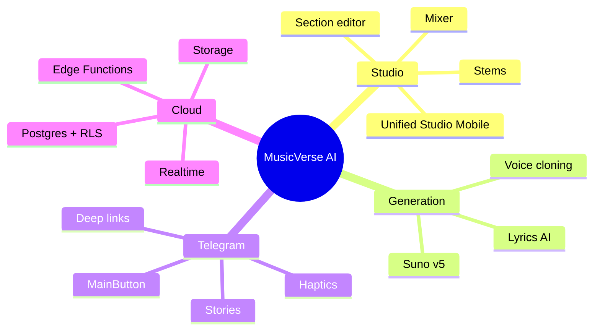

# 📊 Project Status

**Snapshot of the project's current health, sprint progress, and key metrics.**

  
  
  
  
  

  <a href="README.md">🏠 Home</a> ·
  <a href="DOCUMENTATION_INDEX.md">📚 Docs</a> ·
  <a href="ROADMAP.md">🗺 Roadmap</a> ·
  <a href="CHANGELOG.md">📝 Changelog</a>

---

> [!NOTE]
> Updated weekly during sprint review. For real-time CI status see the [Actions tab](https://github.com/HOW2AI-AGENCY/aimusicverse/actions).

## 🚦 Current sprint — `033` Interface Audit & UX Overhaul ✅

| Track                                      | Progress                                                          |
| ------------------------------------------ | ----------------------------------------------------------------- |
| Dialog→BottomSheet mobile default          |  |
| Touch targets ≥ 44px audit                 |  |
| Generation wizard 6→4 steps                |  |
| Library inline filters                     |  |
| Monetization throttling                    |  |
| Micro-interactions (like burst, PTR pulse) |  |
| Studio Lite/Pro mode                       |  |
| Timestamped comments                       |  |

## 🚦 Next up — `034` Generation Reliability (Q3 2026)

| Track                    | Progress                                                        |
| ------------------------ | --------------------------------------------------------------- |
| Failure rate 12% → <8%   |  |
| Retry logic improvements |  |
| E2E test coverage        |  |

## 🧮 Key metrics

| Metric                  |   Value    |   Target    |
| ----------------------- | :--------: | :---------: |
| Components              |    935+    |      —      |
| Hooks                   |    200+    |      —      |
| Edge Functions          |    80+     |      —      |
| Bundle size (gzip)      | **918 KB** | ≤ 950 KB ✅ |
| Unit test coverage      |  **82%**   |  ≥ 80% ✅   |
| E2E specs               |     47     |      —      |
| Lighthouse (mobile)     |     92     |   ≥ 90 ✅   |
| Accessibility (axe)     | 0 critical |    0 ✅     |
| Sentry error rate (24h) |   0.04%    |  < 0.1% ✅  |

## 🏗 Architecture pillars

## ✅ Recent wins (last 30 days)

- ✅ Sprint 033: Complete interface audit — 18 tasks across 4 phases.
- ✅ Generation wizard simplified from 6 to 4 steps.
- ✅ Studio Lite/Pro mode for reduced cognitive load.
- ✅ Timestamped comments (SoundCloud-style).
- ✅ Monetization throttling — max 1 banner/session.
- 🚀 Bundle reduced from 1.02 MB → 918 KB.
- ✅ E2E mobile job stabilised (Mobile Chrome + Mobile Safari).
- ✅ Dev-overlay hardened: pointer-events guard, IME-safe hotkey.
- ✅ Stems-ready auto-modal removed (memory constraint added).
- 📝 Documentation overhaul (this redesign).

## 🚨 Active blockers

None at the time of writing. Watch list:

- iOS Safari audio element pool nearing 9/10 in heavy sessions.
- Suno API rate-limits during peak hours.

---

### 🔗 Related Documentation

|            📚 Index             |      🗺 Roadmap       |       📝 Changelog        |             🪲 Issues             |         🤝 Contributing         |
| :-----------------------------: | :-------------------: | :-----------------------: | :-------------------------------: | :-----------------------------: |
| [Index](DOCUMENTATION_INDEX.md) | [Roadmap](ROADMAP.md) | [Changelog](CHANGELOG.md) | [Issues](KNOWN_ISSUES_TRACKED.md) | [Contributing](CONTRIBUTING.md) |

Last updated: 2026-06-28

