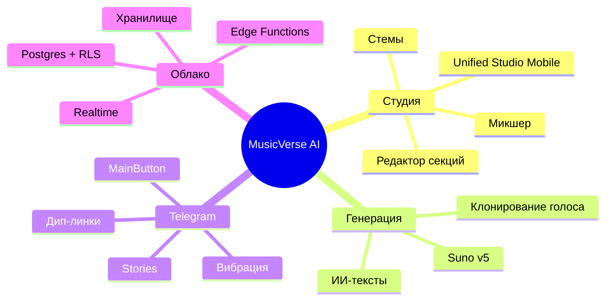

# 📊 Статус проекта

**Снимок текущего состояния, прогресса спринтов и ключевых метрик.**

  
  
  
  
  

  <a href="README.md">🏠 Главная</a> ·
  <a href="DOCUMENTATION_INDEX.md">📚 Документация</a> ·
  <a href="ROADMAP.md">🗺 Дорожная карта</a> ·
  <a href="CHANGELOG.md">📝 Журнал изменений</a>

---

> [!NOTE]
> Обновляется еженедельно во время ревью спринта. Для статуса CI в реальном времени см. [вкладку Actions](https://github.com/HOW2AI-AGENCY/aimusicverse/actions).

## 🚦 Завершённый спринт — `033` Аудит интерфейса и UX-переработка ✅

| Задача                                            | Прогресс                                                          |
| ------------------------------------------------- | ----------------------------------------------------------------- |
| Dialog→BottomSheet по умолчанию на мобильных      |  |
| Области касания ≥ 44px                            |  |
| Визард генерации 6→4 шага                         |  |
| Инлайн-фильтры библиотеки                         |  |
| Троттлинг монетизации                             |  |
| Микро-взаимодействия (взрыв лайка, пульсация PTR) |  |
| Режим Studio Lite/Pro                             |  |
| Комментарии с таймкодами                          |  |

## 🚦 `034` Надёжность генерации (Q3 2026) ✅

| Задача                              | Прогресс                                                          |
| ----------------------------------- | ----------------------------------------------------------------- |
| Dashboard метрик генерации          |  |
| Интеграция useAutomaticRetry в flow |  |
| Structured failure categories       |  |
| A/B тесты генерации (useExperiment) |  |
| Prompt pre-validation               |  |
| Generation queue position UI        |  |
| Failure analysis RPC                |  |
| Failure rate alerts (Edge Function) |  |
| A/B 2-step vs 4-step wizard         |  |
| Delivery tracking (A/B clips)       |  |
| Снижение failure rate 12% → <8%     |   |

## 🚦 Feature: `033-mobile-ui-improvements` — ЗАВЕРШЁН ✅

**Прогресс**: 114/114 задач (100%) | **Фаза**: Complete | **Issues**: [#317–#430](https://github.com/HOW2AI-AGENCY/aimusicverse/issues?q=label%3A%22📄+DOCS%22)

| Фаза                       |  Задачи   | Прогресс                                                          |
| -------------------------- | :-------: | ----------------------------------------------------------------- |
| Phase 1: Setup             | T001–T005 |  |
| Phase 2: Foundational      | T006–T013 |  |
| Phase 3: US1 Navigation    | T014–T019 |  |
| Phase 4: US2 Gestures      | T020–T027 |  |
| Phase 5: US6 Accessibility | T028–T035 |  |
| Phase 6: US4 Errors        | T036–T044 |  |
| Phase 7-12: P2/P3 Stories  | T045–T099 |  |
| Phase 13: Polish           | T100–T114 |  |

### ✅ Завершено (2026-06-29)

- ✅ **Phase 1 Setup**: структура директорий, типы (queue, gestures, notifications), Zod-схемы, CSS (shimmer, accessibility)
- ✅ **Phase 2 Foundational**: queueStorage, gestureSettings, notificationManager, a11yHelpers, shimmerAnimation, migration, types/index.ts
- ✅ **Phase 3 US1 Navigation**: MoreMenuHintTooltip, RecentlyUsedSection, hint dismissal, back button audit (18/23 pages standard)
- ✅ **Phase 4 US2 Gestures**: PlayerGestureHints, DoubleTapSeekFeedback, SwipeChevronIndicator, GestureSettingsPanel
- ✅ **Phase 5 US6 Accessibility**: 14px caption, keyboard gestures (Arrow/Space/Escape), focus-visible, WCAG AA
- ✅ **Phase 6 US4 Errors**: NetworkErrorState, ServerErrorState, TimeoutErrorState with Retry/Back/Report
- ✅ **Phases 7-13**: P2 loading/notifications/queue/polish + P3 empty states/recently played + analytics
- ✅ **114/114 total tasks — SPRINT ЗАВЕРШЁН**

## 🚦 Sprint `035` Стабилизация + Чистка — ЗАВЕРШЁН ✅

| Задача                                          | Прогресс                                                          |
| ----------------------------------------------- | ----------------------------------------------------------------- |
| TDZ fix: page-admin chunk crash                 |  |
| Circular deps fix (#541)                        |  |
| ESLint: `rules-of-hooks` → `"error"`            |  |
| Удалить дубликаты хуков (6 дублей, -1700 строк) |  |
| Консолидировать PlaybackStore (3 файла → 1)     |  |
| Query key factory (`src/lib/queryKeys.ts`)      |  |
| Защитить payment-маршруты (ProtectedRoute)      |  |
| Fix Vitest OOM (infinite loop + pool config)    |  |
| API layer: storage, payments, notifications     |  |

> ⚠️ **Перенесено в Sprint 039:** E2E стабилизация (47 spec → CI green), Playwright CI pipeline

## 🚦 Sprint `037` Infrastructure Hardening & DX — ЗАВЕРШЁН ✅

| Задача                                        | Прогресс                                                          |
| --------------------------------------------- | ----------------------------------------------------------------- |
| Удаление Babel/Jest конфигов                  |  |
| `graphify update` в pre-commit hook           |  |
| Аудио unit-тесты (AudioElementPool, 21 тест)  |  |
| Bundle visualizer (`npm run analyze`)         |  |
| CI: `npm run size` на каждый PR               |  |
| Storybook (6 stories: LazyImage, GlowButton…) |  |
| TypeScript strict mode (tsconfig.strict.json) |  |
| ESLint plugin expansion                       |  |
| Sentry Performance (tracesSampleRate: 0.1)   |  |
| ARCHITECTURE_HUB.md верификация               |  |
| FSM state schema документация                 |  |
| Telegram cold start оптимизация               |  |

## 🚦 Sprint `038` Design System Unification — ЗАВЕРШЁН ✅

**Прогресс: 28/28 задач завершено (100%)**

| Фаза                                    | Прогресс                                                          |
| --------------------------------------- | ----------------------------------------------------------------- |
| **A: Foundation** — EmptyState, Skeleton, Touch, Z-index |  |
| Unified EmptyState (3→1 компонент)      |  |
| Unified Loading (7→4 компонента)        |  |
| OnboardingFlow state machine (5 шагов) |  |
| Touch target audit (≥44px)             |  |
| Z-index audit (магические числа → токены) |  |
| **B: Navigation & Responsive**         |  |
| NavigationShell (adaptive)             |  |
| Container queries (5+ компонентов)     |  |
| Safe area + Safari 100vh fix           |  |
| Responsive typography (clamp)          |  |
| **C: Animation & Polish**              |  |
| Animation standards (duration/easing)  |  |
| Reduced motion (useSafeMotion)         |  |
| Player shared element transition       |  |
| Telegram haptics integration           |  |
| **D: Visual Polish**                   |  |
| Typography pass (5 семантических классов) |  |
| Elevation system (4 уровня)            |  |
| Color token audit                      |  |
| Icon consistency (lucide-only)         |  |
| Storybook 20+ stories                  |  |
| LazyImage audit                        |  |
| Lighthouse baseline                    |  |

## 🚦 `039` Архитектурный рефакторинг + Type Safety (Q3 2026) — ЗАВЕРШЁН ✅

**Прогресс: 13/14 задач завершено (93%)** · [Детальный план](SPRINTS/SPRINT-039-PLAN.md) · [Аудит](docs/audit/SPRINT-039-AUDIT-2026-06-30.md)

| Задача                                                          | Прогресс                                                          |
| --------------------------------------------------------------- | ----------------------------------------------------------------- |
| Вынести прямые вызовы Supabase из компонентов (35 → 0)          |  |
| `useGenerateForm.ts` → 4 хука (280 строк)                       |  |
| Разбить `GlobalAudioProvider.tsx` (982 → 79 строк)              |  |
| Generic undo/redo middleware для Zustand                        |  |
| Типизировать API-слой + services (`any` = 0)                    |  |
| E2E pipeline (workflow добавлен, ждём GitHub Secrets)           |   |
| DnD унификация (@hello-pangea/dnd удалён)                       |  |
| `tsc --noEmit` зелёный                                          |  |

## 🚦 `040` Тестовое покрытие + Export (Q4 2026) — ЗАПЛАНИРОВАН

| Задача                                             | Прогресс                                                        |
| -------------------------------------------------- | --------------------------------------------------------------- |
| Unit-тесты API-слоя (20 файлов → тесты)            |  |
| Unit-тесты сервисов (18 файлов → тесты)            |  |
| Unit-тесты god-хуков (после рефакторинга 039)      |  |
| Export service (WAV/MP3/FLAC)                      |  |
| Result-паттерн для API обработки ошибок            |  |
| Service Worker + оффлайн-режим                     |  |
| Lighthouse CI budget enforcement                   |  |

## 🧮 Ключевые метрики

| Метрика                |   Значение    |    Цель      | Статус |
| ---------------------- | :-----------: | :----------: | :----: |
| Компоненты             |     1003      |      —       |   —    |
| Хуки                   |      347      |      —       |   —    |
| Edge Functions         |      246      |      —       |   —    |
| Zustand Stores         |  12 + 8 sub   |      —       |   —    |
| API-файлов             |      20       |      —       |   —    |
| Сервисов               |      18       |      —       |   —    |
| Размер бандла (gzip)   |  **918 КБ**   |  ≤ 950 КБ    |  ⚠️   |
| Unit-тест файлов       |    **25**     |    200+      |  ❌    |
| Unit-тестов (штук)     |    **341**    |    1000+     |  ❌    |
| E2E спецификации       |    **47**     |  47 pass CI  |  ❌    |
| Файлов >800 строк      |     **6**     |      0       |  ❌    |
| Использований `any`    |    **447**    |     <50      |  ❌    |
| Нарушений слоёв (components+stores) |    **0**     |      0       |  ✅    |
| DnD библиотек          |     **2**     |      1       |  ❌    |
| Lighthouse (мобильный) |    **92**     |    ≥ 90      |  ✅    |
| Доступность (axe)      | 0 критических |      0       |  ✅    |
| Ошибки Sentry (24ч)    |    0.04%      |  < 0.1%      |  ✅    |
| Cold start (Telegram)  |    < 3s       |    < 3s      |  ✅    |

## 🏗 Архитектурные столпы

## ✅ Последние достижения (Sprint 037-038, июнь 2026)

- ✅ **Sprint 037 (100%):** Infrastructure Hardening — babel/jest clean-up, bundle visualizer, Sentry Perf, TS strict mode, Storybook 6 stories, FSM docs, cold start оптимизация.
- ✅ **Sprint 038 Phase A (70%):** Unified EmptyState (3→1), Unified Loading (7→4), Touch targets ≥44px, Z-index токены, Safe area + Safari 100vh fix.
- ✅ **Sprint 038 Phase C (75%):** Animation standards (duration/easing constants), useSafeMotion + reduced motion, Telegram haptics (5+ взаимодействий).
- ✅ **Sprint 038 Phase B (33%):** Responsive typography (clamp), Safe area global.
- ✅ Реальные скриншоты добавлены в README.
- ✅ Обложки треков, timing и waveform исправлены (последний коммит).

**Предыдущие Sprint 033-035:**
- ✅ Спринт 034: Надёжность генерации — 13/13 задач (auto-retry, A/B framework, failure alerts).
- ✅ Спринт 033: Полный аудит интерфейса — 114 задач в 13 фазах.
- ✅ Миграция Jest → Vitest + Husky pre-commit hooks.
- ✅ Удаление мёртвого кода (196 файлов, 45K строк).
- ✅ `useUnifiedStudioStore` рефакторинг: монолит 1361 строк → 6 слайсов.
- 🚀 Бандл уменьшен с 1.02 МБ → 918 КБ.

## 🗓 Дорожная карта спринтов (обновлено 2026-06-30)

| Спринт  | Фокус                                    | Статус          | Срок    |
| ------- | ---------------------------------------- | --------------- | ------- |
| **038** | Design System Unification (Phase B, C, D) | 🟡 В РАБОТЕ    | Июль    |
| **039** | Архитектурный рефакторинг + Type Safety   | 📋 Запланирован | Авг     |
| **040** | Тестовое покрытие + Audio Export          | 📋 Запланирован | Сен     |

**Ключевые долги, блокирующие 039:**
- 🔴 30+ компонентов с прямым `supabase.from()` — обход API-слоя
- 🔴 God-хуки: `useGenerateForm.ts` (1218 строк), `GlobalAudioProvider.tsx` (982 строки)
- 🔴 342 использования `any` — TypeScript без реального контроля типов
- 🔴 E2E тесты не проходят в CI (47 spec = 0% green)
- ⚠️ Бандл 918/950 КБ — 32 КБ запаса, риск при добавлении фич
- ⚠️ 2 DnD-библиотеки одновременно (`@dnd-kit` + `@hello-pangea/dnd`, ~50 КБ)

---

## 🔍 Архитектурный аудит (2026-06-28)

Проведён всесторонний аудит тремя параллельными агентами. Ключевые находки:

**Критические проблемы:**

- 🔴 **7 unit-тест файлов** на 940+ компонентов (покрытие <1%)
- 🔴 **30+ компонентов** вызывают `supabase.from()` напрямую, минуя API-слой
- 🔴 **God-хуки:** `useGenerateForm.ts` (1218 строк), `usePromptDJEnhanced.ts` (1070 строк)
- 🔴 **6 пар дублированного кода** (useMixExport, useOptimizedAudioPlayer, PromptDJ, PlaybackStore)

**Средние проблемы:**

- 🟠 342 использования `any` в src/
- 🟠 `react-hooks/rules-of-hooks` понижено до `"warn"` (должно быть `"error"`)
- 🟠 Нет query key factory для TanStack Query
- 🟠 33 файла >500 строк (из них 9 хуков, 24 компонента)
- 🟠 2 DnD-библиотеки одновременно (`@dnd-kit` + `@hello-pangea/dnd`)

**Положительные стороны:**

- ✅ Code splitting: 15+ vendor-чанков, все маршруты lazy-loaded
- ✅ `useUnifiedStudioStore` уже рефакторен из 1361-строчного монолита
- ✅ Дизайн-система с design tokens, семантическими цветами
- ✅ CI/CD: 5 jobs, smoke-тесты в 3 браузерах
- ✅ Нет захардкоженных секретов, минимальный XSS-риск
- ✅ Telegram Bot — модульная архитектура (commands/callbacks/handlers)

**Общая оценка: 6.1/10 → план улучшений до 8.4/10**

Подробный план: `SPRINTS/SPRINT-035-038-PLAN.md`

## 🚨 Активные блокеры

| Блокер | Критичность | Целевой спринт |
| ------ | ----------- | -------------- |
| 30+ компонентов вызывают `supabase.from()` напрямую | 🔴 Critical | 039 |
| God-хуки >1000 строк (useGenerateForm, GlobalAudioProvider) | 🔴 Critical | 039 |
| 342 `any` — TypeScript не защищает от ошибок типов | 🔴 Critical | 039 |
| E2E 47 spec, 0% CI green — нет автоматической регрессии | 🔴 Critical | 039 |
| Бандл 918/950 КБ, запас 32 КБ | 🟠 High | 039 (DnD) |
| 2 DnD-библиотеки (~50 КБ), нарушает бандл-бюджет | 🟠 High | 039 |
| Onboarding: 2 несовместимых компонента (Sprint 038 WIP) | 🟡 Medium | 038 |
| NavigationShell не реализован (Sprint 038 WIP) | 🟡 Medium | 038 |

Под наблюдением (не блокируют):
- Пул аудио-элементов iOS Safari ~9/10 в тяжёлых сессиях
- Лимиты Suno API в часы пик

---

### 🔗 Связанная документация

|            📚 Указатель             |       🗺 Дорожная карта       |  📝 Журнал изменений   |             🪲 Проблемы             |         🤝 Контрибуция         |
| :---------------------------------: | :--------------------------: | :--------------------: | :---------------------------------: | :----------------------------: |
| [Указатель](DOCUMENTATION_INDEX.md) | [Дорожная карта](ROADMAP.md) | [Журнал](CHANGELOG.md) | [Проблемы](KNOWN_ISSUES_TRACKED.md) | [Контрибуция](CONTRIBUTING.md) |

Последнее обновление: 2026-06-30 (Sprint 039 закрыт ✅, планы 040 Type Safety + 041 UX)

