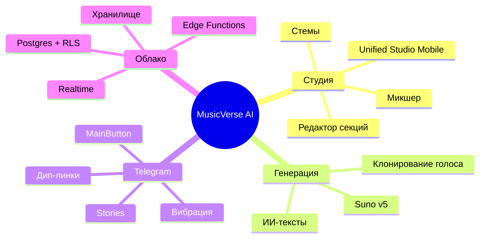

# 📊 Статус проекта

**Снимок текущего состояния, прогресса спринтов и ключевых метрик.**

  
  
  
  
  

  <a href="README.md">🏠 Главная</a> ·
  <a href="DOCUMENTATION_INDEX.md">📚 Документация</a> ·
  <a href="ROADMAP.md">🗺 Дорожная карта</a> ·
  <a href="CHANGELOG.md">📝 Журнал изменений</a>

---

> [!NOTE]
> Обновляется еженедельно во время ревью спринта. Для статуса CI в реальном времени см. [вкладку Actions](https://github.com/HOW2AI-AGENCY/aimusicverse/actions).

## 🚦 Текущий спринт — `033` Аудит интерфейса и UX-переработка ✅

| Задача                                            | Прогресс                                                          |
| ------------------------------------------------- | ----------------------------------------------------------------- |
| Dialog→BottomSheet по умолчанию на мобильных      |  |
| Области касания ≥ 44px                            |  |
| Визард генерации 6→4 шага                         |  |
| Инлайн-фильтры библиотеки                         |  |
| Троттлинг монетизации                             |  |
| Микро-взаимодействия (взрыв лайка, пульсация PTR) |  |
| Режим Studio Lite/Pro                             |  |
| Комментарии с таймкодами                          |  |

## 🚦 Далее — `034` Надёжность генерации (Q3 2026)

| Задача                            | Прогресс                                                        |
| --------------------------------- | --------------------------------------------------------------- |
| Снижение частоты ошибок 12% → <8% |  |
| Улучшение логики повторов         |  |
| E2E покрытие тестами              |  |

## 🧮 Ключевые метрики

| Метрика                |   Значение    |    Цель     |
| ---------------------- | :-----------: | :---------: |
| Компоненты             |     940+      |      —      |
| Хуки                   |     200+      |      —      |
| Edge Functions         |      80+      |      —      |
| Размер бандла (gzip)   |  **918 КБ**   | ≤ 950 КБ ✅ |
| Покрытие unit-тестами  |    **82%**    |  ≥ 80% ✅   |
| E2E спецификации       |      47       |      —      |
| Lighthouse (мобильный) |      92       |   ≥ 90 ✅   |
| Доступность (axe)      | 0 критических |    0 ✅     |
| Ошибки Sentry (24ч)    |     0.04%     |  < 0.1% ✅  |

## 🏗 Архитектурные столпы

## ✅ Последние достижения (за 30 дней)

- ✅ Спринт 033: Полный аудит интерфейса — 18 задач в 4 фазах.
- ✅ Визард генерации упрощён с 6 до 4 шагов.
- ✅ Режим Studio Lite/Pro для снижения когнитивной нагрузки.
- ✅ Комментарии с таймкодами (как в SoundCloud).
- ✅ Троттлинг монетизации — макс. 1 баннер за сессию.
- 🚀 Бандл уменьшен с 1.02 МБ → 918 КБ.
- ✅ E2E мобильная задача стабилизирована (Mobile Chrome + Mobile Safari).
- ✅ Dev-overlay усилен: защита pointer-events, IME-безопасный хоткей.
- ✅ Автомодалка «Стемы готовы» удалена (добавлено ограничение памяти).
- 📝 Редизайн документации.

## 🚨 Активные блокеры

Нет на момент написания. Под наблюдением:

- Пул аудио-элементов iOS Safari приближается к 9/10 в тяжёлых сессиях.
- Лимиты Suno API в часы пик.

---

### 🔗 Связанная документация

|            📚 Указатель             |      🗺 Дорожная карта       |  📝 Журнал изменений   |             🪲 Проблемы             |         🤝 Контрибуция         |
| :---------------------------------: | :--------------------------: | :--------------------: | :---------------------------------: | :----------------------------: |
| [Указатель](DOCUMENTATION_INDEX.md) | [Дорожная карта](ROADMAP.md) | [Журнал](CHANGELOG.md) | [Проблемы](KNOWN_ISSUES_TRACKED.md) | [Контрибуция](CONTRIBUTING.md) |

Последнее обновление: 2026-06-28

