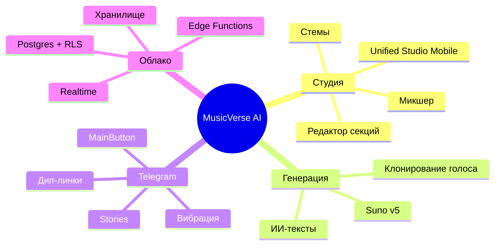

# 📊 Статус проекта

**Снимок текущего состояния, прогресса спринтов и ключевых метрик.**

  
  
  
  
  

  <a href="README.md">🏠 Главная</a> ·
  <a href="DOCUMENTATION_INDEX.md">📚 Документация</a> ·
  <a href="ROADMAP.md">🗺 Дорожная карта</a> ·
  <a href="CHANGELOG.md">📝 Журнал изменений</a>

---

> [!NOTE]
> Обновляется еженедельно во время ревью спринта. Для статуса CI в реальном времени см. [вкладку Actions](https://github.com/HOW2AI-AGENCY/aimusicverse/actions).

## 🚦 Завершённый спринт — `033` Аудит интерфейса и UX-переработка ✅

| Задача                                            | Прогресс                                                          |
| ------------------------------------------------- | ----------------------------------------------------------------- |
| Dialog→BottomSheet по умолчанию на мобильных      |  |
| Области касания ≥ 44px                            |  |
| Визард генерации 6→4 шага                         |  |
| Инлайн-фильтры библиотеки                         |  |
| Троттлинг монетизации                             |  |
| Микро-взаимодействия (взрыв лайка, пульсация PTR) |  |
| Режим Studio Lite/Pro                             |  |
| Комментарии с таймкодами                          |  |

## 🚦 `034` Надёжность генерации (Q3 2026) ✅

| Задача                              | Прогресс                                                          |
| ----------------------------------- | ----------------------------------------------------------------- |
| Dashboard метрик генерации          |  |
| Интеграция useAutomaticRetry в flow |  |
| Structured failure categories       |  |
| A/B тесты генерации (useExperiment) |  |
| Prompt pre-validation               |  |
| Generation queue position UI        |  |
| Failure analysis RPC                |  |
| Failure rate alerts (Edge Function) |  |
| A/B 2-step vs 4-step wizard         |  |
| Delivery tracking (A/B clips)       |  |
| Снижение failure rate 12% → <8%     |   |

## 🚦 `035` E2E + Экспорт (Q3 2026)

| Задача                                | Прогресс                                                        |
| ------------------------------------- | --------------------------------------------------------------- |
| E2E стабилизация (47 spec → CI green) |  |
| Playwright CI pipeline                |  |
| Export service (WAV/MP3/FLAC)         |  |
| Устранение 484 `any` типов (→ <50)    |  |
| ESLint strict rules                   |  |
| npm run build в CI (zero warnings)    |  |
| Удаление неиспользуемых зависимостей  |  |

## 🚦 `036` Рефакторинг и архитектура (Q3 2026)

| Задача                                          | Прогресс                                                        |
| ----------------------------------------------- | --------------------------------------------------------------- |
| Разбить файлы >500 строк (30+ файлов)           |  |
| Разделить useUnifiedStudioStore (38KB)          |  |
| Устранить нарушения слоёв (компоненты→supabase) |  |
| Консолидация lyrics-компонентов (6→2 папки)     |  |
| Организация components/ui (90+ файлов)          |  |

## 🚦 `037` Тестовое покрытие (Q3–Q4 2026)

| Задача                                     | Прогресс                                                        |
| ------------------------------------------ | --------------------------------------------------------------- |
| Unit-тесты 362 → 500+                      |  |
| Покрытие критических хуков (audio, studio) |  |
| Тесты API/Service слоёв                    |  |
| Mutation testing (Stryker)                 |  |

## 🚦 `038` DX и инфраструктура (Q4 2026)

| Задача                               | Прогресс                                                        |
| ------------------------------------ | --------------------------------------------------------------- |
| Service Worker + оффлайн             |  |
| Lighthouse CI budget enforcement     |  |
| Storybook coverage (50+ компонентов) |  |
| Bundle size regression CI gate       |  |

## 🧮 Ключевые метрики

| Метрика                |   Значение    |    Цель     |
| ---------------------- | :-----------: | :---------: |
| Компоненты             |      987      |      —      |
| Хуки                   |      347      |      —      |
| Edge Functions         |      130      |      —      |
| Размер бандла (gzip)   |  **918 КБ**   | ≤ 950 КБ ✅ |
| Покрытие unit-тестами  |    **82%**    |  ≥ 80% ✅   |
| E2E спецификации       |      47       |      —      |
| Lighthouse (мобильный) |      92       |   ≥ 90 ✅   |
| Доступность (axe)      | 0 критических |    0 ✅     |
| Ошибки Sentry (24ч)    |     0.04%     |  < 0.1% ✅  |

## 🏗 Архитектурные столпы

## ✅ Последние достижения (за 30 дней)

- ✅ Спринт 034: Надёжность генерации — 13/13 задач, спринт завершён.
- ✅ Auto-retry интегрирован в handleGenerate() (2 попытки + exponential backoff).
- ✅ Dashboard метрик генерации (/admin/generation-metrics).
- ✅ Structured failure tracking (failure_category, retry_count, generation_params).
- ✅ Prompt pre-validation (длина, кодировка, запрещённый контент).
- ✅ A/B framework активирован — PROMPT_SUGGESTIONS + WIZARD_STEPS (50/50).
- ✅ Generation queue position UI с rate-limit awareness.
- ✅ Failure pattern analysis RPC (get_generation_failure_patterns).
- ✅ Sentry breadcrumbs для полного flow генерации.
- ✅ Failure rate alerts — Edge Function + Telegram уведомления админам.
- ✅ A/B тест 2-step vs 4-step wizard (WIZARD_STEPS experiment).
- ✅ Delivery tracking — partial_delivery status + useDeliveryTracking hook.
- ✅ Спринт 033: Полный аудит интерфейса — 18 задач в 4 фазах.
- ✅ Миграция тестовой инфраструктуры Jest → Vitest + Husky pre-commit hooks.
- ✅ Централизация экспортов lucide-react для оптимизации бандла.
- ✅ Исправление TDZ-ошибки в analytics chunk.
- ✅ Удаление мёртвого кода (196 файлов, 45K строк).
- 🚀 Бандл уменьшен с 1.02 МБ → 918 КБ.

## 🚨 Активные блокеры

Нет на момент написания. Под наблюдением:

- Пул аудио-элементов iOS Safari приближается к 9/10 в тяжёлых сессиях.
- Лимиты Suno API в часы пик.

---

### 🔗 Связанная документация

|            📚 Указатель             |       🗺 Дорожная карта       |  📝 Журнал изменений   |             🪲 Проблемы             |         🤝 Контрибуция         |
| :---------------------------------: | :--------------------------: | :--------------------: | :---------------------------------: | :----------------------------: |
| [Указатель](DOCUMENTATION_INDEX.md) | [Дорожная карта](ROADMAP.md) | [Журнал](CHANGELOG.md) | [Проблемы](KNOWN_ISSUES_TRACKED.md) | [Контрибуция](CONTRIBUTING.md) |

Последнее обновление: 2026-06-28

