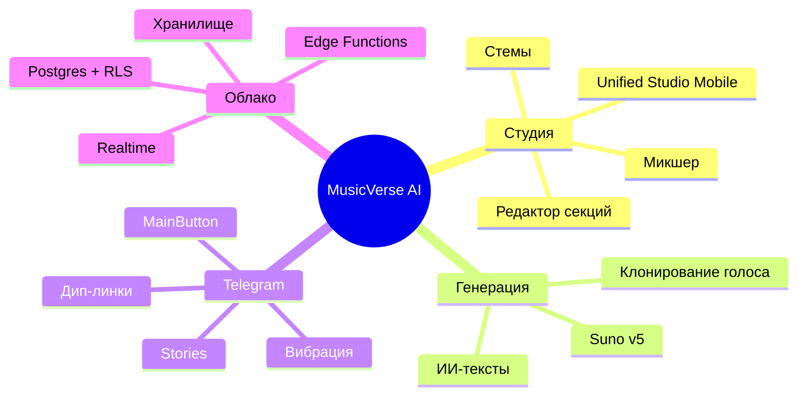

# 📊 Статус проекта

**Снимок текущего состояния, прогресса спринтов и ключевых метрик.**

  
  
  
  
  

  <a href="README.md">🏠 Главная</a> ·
  <a href="DOCUMENTATION_INDEX.md">📚 Документация</a> ·
  <a href="ROADMAP.md">🗺 Дорожная карта</a> ·
  <a href="CHANGELOG.md">📝 Журнал изменений</a>

---

> [!NOTE]
> Обновляется еженедельно во время ревью спринта. Для статуса CI в реальном времени см. [вкладку Actions](https://github.com/HOW2AI-AGENCY/aimusicverse/actions).

## 🚦 Завершённый спринт — `033` Аудит интерфейса и UX-переработка ✅

| Задача                                            | Прогресс                                                          |
| ------------------------------------------------- | ----------------------------------------------------------------- |
| Dialog→BottomSheet по умолчанию на мобильных      |  |
| Области касания ≥ 44px                            |  |
| Визард генерации 6→4 шага                         |  |
| Инлайн-фильтры библиотеки                         |  |
| Троттлинг монетизации                             |  |
| Микро-взаимодействия (взрыв лайка, пульсация PTR) |  |
| Режим Studio Lite/Pro                             |  |
| Комментарии с таймкодами                          |  |

## 🚦 `034` Надёжность генерации (Q3 2026) ✅

| Задача                              | Прогресс                                                          |
| ----------------------------------- | ----------------------------------------------------------------- |
| Dashboard метрик генерации          |  |
| Интеграция useAutomaticRetry в flow |  |
| Structured failure categories       |  |
| A/B тесты генерации (useExperiment) |  |
| Prompt pre-validation               |  |
| Generation queue position UI        |  |
| Failure analysis RPC                |  |
| Failure rate alerts (Edge Function) |  |
| A/B 2-step vs 4-step wizard         |  |
| Delivery tracking (A/B clips)       |  |
| Снижение failure rate 12% → <8%     |   |

## 🚦 Feature: `033-mobile-ui-improvements` — ЗАВЕРШЁН ✅

**Прогресс**: 114/114 задач (100%) | **Фаза**: Complete | **Issues**: [#317–#430](https://github.com/HOW2AI-AGENCY/aimusicverse/issues?q=label%3A%22📄+DOCS%22)

| Фаза                       |  Задачи   | Прогресс                                                          |
| -------------------------- | :-------: | ----------------------------------------------------------------- |
| Phase 1: Setup             | T001–T005 |  |
| Phase 2: Foundational      | T006–T013 |  |
| Phase 3: US1 Navigation    | T014–T019 |  |
| Phase 4: US2 Gestures      | T020–T027 |  |
| Phase 5: US6 Accessibility | T028–T035 |  |
| Phase 6: US4 Errors        | T036–T044 |  |
| Phase 7-12: P2/P3 Stories  | T045–T099 |  |
| Phase 13: Polish           | T100–T114 |  |

### ✅ Завершено (2026-06-29)

- ✅ **Phase 1 Setup**: структура директорий, типы (queue, gestures, notifications), Zod-схемы, CSS (shimmer, accessibility)
- ✅ **Phase 2 Foundational**: queueStorage, gestureSettings, notificationManager, a11yHelpers, shimmerAnimation, migration, types/index.ts
- ✅ **Phase 3 US1 Navigation**: MoreMenuHintTooltip, RecentlyUsedSection, hint dismissal, back button audit (18/23 pages standard)
- ✅ **Phase 4 US2 Gestures**: PlayerGestureHints, DoubleTapSeekFeedback, SwipeChevronIndicator, GestureSettingsPanel
- ✅ **Phase 5 US6 Accessibility**: 14px caption, keyboard gestures (Arrow/Space/Escape), focus-visible, WCAG AA
- ✅ **Phase 6 US4 Errors**: NetworkErrorState, ServerErrorState, TimeoutErrorState with Retry/Back/Report
- ✅ **Phases 7-13**: P2 loading/notifications/queue/polish + P3 empty states/recently played + analytics
- ✅ **114/114 total tasks — SPRINT ЗАВЕРШЁН**

## 🚦 Feature: `035-repo-docs-revamp` — В РАБОТЕ 🟡

**Прогресс**: задачи в процессе | **Фаза**: Phase 2 Foundational | **Тип**: Documentation

| Задача                                      |                            Прогресс                             |
| ------------------------------------------- | :-------------------------------------------------------------: |
| README redesign (инвесторы + клиенты)       |  |
| DOCUMENTATION_INDEX role-based navigation   |  |
| KNOWLEDGE_BASE.md deletion + redistribution |  |
| MAINTENANCE.md overhaul                     |  |
| Unified footers across all .md files        |  |
| Screenshots (4 screens)                     |  |

## 🚦 Sprint `035` Стабилизация + Чистка — В РАБОТЕ 🟡

| Задача                                          | Прогресс                                                          |
| ----------------------------------------------- | ----------------------------------------------------------------- |
| TDZ fix: page-admin chunk crash                 |  |
| Circular deps fix (#541)                        |  |
| ESLint: `rules-of-hooks` → `"error"`            |  |
| Удалить дубликаты хуков (6 дублей, -1700 строк) |    |
| Консолидировать PlaybackStore (3 файла → 1)     |    |
| Query key factory (`src/lib/queryKeys.ts`)      |    |
| Защитить payment-маршруты (ProtectedRoute)      |    |
| E2E стабилизация (47 spec → CI green)           |    |
| Playwright CI pipeline                          |    |

## 🚦 `036` Рефакторинг слоёв + Type Safety (Q3 2026)

| Задача                                                  | Прогресс                                                        |
| ------------------------------------------------------- | --------------------------------------------------------------- |
| Вынести 30+ прямых вызовов Supabase из компонентов      |  |
| Разбить `useGenerateForm.ts` (1218 строк → 4 хука)      |  |
| Разбить `usePromptDJEnhanced.ts` (1070 строк → 2 хука)  |  |
| Создать недостающие API-файлы (payments, notifications) |  |
| Типизировать API-слой (342 `any` → <50)                 |  |
| Разбить 8 oversized-компонентов (>800 строк)            |  |
| Generic undo/redo middleware для Zustand                |  |

## 🚦 `037` Тестовое покрытие (Q3–Q4 2026)

| Задача                                             | Прогресс                                                        |
| -------------------------------------------------- | --------------------------------------------------------------- |
| Unit-тесты API-слоя и сервисов (7 → 50+ файлов)    |  |
| Unit-тесты для god-хуков (после рефакторинга)      |  |
| Унификация обработки ошибок в API (Result-паттерн) |  |
| Выбрать одну DnD-библиотеку (-50KB бандла)         |  |
| Export service (WAV/MP3/FLAC)                      |  |

## 🚦 `038` DX и инфраструктура (Q4 2026)

| Задача                                | Прогресс                                                        |
| ------------------------------------- | --------------------------------------------------------------- |
| `structuredClone()` вместо JSON хаков |  |
| Согласовать staleTime/gcTime defaults |  |
| Service Worker + оффлайн              |  |
| Lighthouse CI budget enforcement      |  |
| Storybook coverage (20+ компонентов)  |  |

## 🧮 Ключевые метрики

| Метрика                |   Значение    |    Цель     |
| ---------------------- | :-----------: | :---------: |
| Компоненты             |      987      |      —      |
| Хуки                   |      347      |      —      |
| Edge Functions         |      120      |      —      |
| Zustand Stores         |  12 + 8 sub   |      —      |
| API-файлов             |      20       |      —      |
| Сервисов               |      18       |      —      |
| Размер бандла (gzip)   |  **918 КБ**   | ≤ 950 КБ ✅ |
| Unit-тест файлов       |     **7**     |   200+ ❌   |
| E2E спецификации       |      47       | 47 pass ❌  |
| Файлов >500 строк      |    **33**     |    0 ❌     |
| Использований `any`    |    **342**    |   <50 ❌    |
| Дубликатов кода        |   **6 пар**   |    0 ❌     |
| Нарушений слоёв        |    **30+**    |    0 ❌     |
| Lighthouse (мобильный) |      92       |   ≥ 90 ✅   |
| Доступность (axe)      | 0 критических |    0 ✅     |
| Ошибки Sentry (24ч)    |     0.04%     |  < 0.1% ✅  |

## 🏗 Архитектурные столпы

## ✅ Последние достижения (за 30 дней)

- ✅ Спринт 034: Надёжность генерации — 13/13 задач, спринт завершён.
- ✅ Auto-retry интегрирован в handleGenerate() (2 попытки + exponential backoff).
- ✅ Dashboard метрик генерации (/admin/generation-metrics).
- ✅ Structured failure tracking (failure_category, retry_count, generation_params).
- ✅ A/B framework активирован — PROMPT_SUGGESTIONS + WIZARD_STEPS (50/50).
- ✅ Failure rate alerts — Edge Function + Telegram уведомления админам.
- ✅ Delivery tracking — partial_delivery status + useDeliveryTracking hook.
- ✅ Спринт 033: Полный аудит интерфейса — 18 задач в 4 фазах.
- ✅ Миграция тестовой инфраструктуры Jest → Vitest + Husky pre-commit hooks.
- ✅ Удаление мёртвого кода (196 файлов, 45K строк).
- ✅ `useUnifiedStudioStore` рефакторинг: монолит 1361 строк → 6 слайсов.
- 🚀 Бандл уменьшен с 1.02 МБ → 918 КБ.

## 🔍 Архитектурный аудит (2026-06-28)

Проведён всесторонний аудит тремя параллельными агентами. Ключевые находки:

**Критические проблемы:**

- 🔴 **7 unit-тест файлов** на 940+ компонентов (покрытие <1%)
- 🔴 **30+ компонентов** вызывают `supabase.from()` напрямую, минуя API-слой
- 🔴 **God-хуки:** `useGenerateForm.ts` (1218 строк), `usePromptDJEnhanced.ts` (1070 строк)
- 🔴 **6 пар дублированного кода** (useMixExport, useOptimizedAudioPlayer, PromptDJ, PlaybackStore)

**Средние проблемы:**

- 🟠 342 использования `any` в src/
- 🟠 `react-hooks/rules-of-hooks` понижено до `"warn"` (должно быть `"error"`)
- 🟠 Нет query key factory для TanStack Query
- 🟠 33 файла >500 строк (из них 9 хуков, 24 компонента)
- 🟠 2 DnD-библиотеки одновременно (`@dnd-kit` + `@hello-pangea/dnd`)

**Положительные стороны:**

- ✅ Code splitting: 15+ vendor-чанков, все маршруты lazy-loaded
- ✅ `useUnifiedStudioStore` уже рефакторен из 1361-строчного монолита
- ✅ Дизайн-система с design tokens, семантическими цветами
- ✅ CI/CD: 5 jobs, smoke-тесты в 3 браузерах
- ✅ Нет захардкоженных секретов, минимальный XSS-риск
- ✅ Telegram Bot — модульная архитектура (commands/callbacks/handlers)

**Общая оценка: 6.1/10 → план улучшений до 8.4/10**

Подробный план: `SPRINTS/SPRINT-035-038-PLAN.md`

## 🚨 Активные блокеры

Нет критических блокеров. Под наблюдением:

- Пул аудио-элементов iOS Safari приближается к 9/10 в тяжёлых сессиях.
- Лимиты Suno API в часы пик.
- `react-hooks/rules-of-hooks: "warn"` — потенциальные runtime-краши.

---

### 🔗 Связанная документация

|            📚 Указатель             |      🗺 Дорожная карта       |  📝 Журнал изменений   |             🪲 Проблемы             |         🤝 Контрибуция         |
| :---------------------------------: | :--------------------------: | :--------------------: | :---------------------------------: | :----------------------------: |
| [Указатель](DOCUMENTATION_INDEX.md) | [Дорожная карта](ROADMAP.md) | [Журнал](CHANGELOG.md) | [Проблемы](KNOWN_ISSUES_TRACKED.md) | [Контрибуция](CONTRIBUTING.md) |

Последнее обновление: 2026-06-28 (архитектурный аудит)

