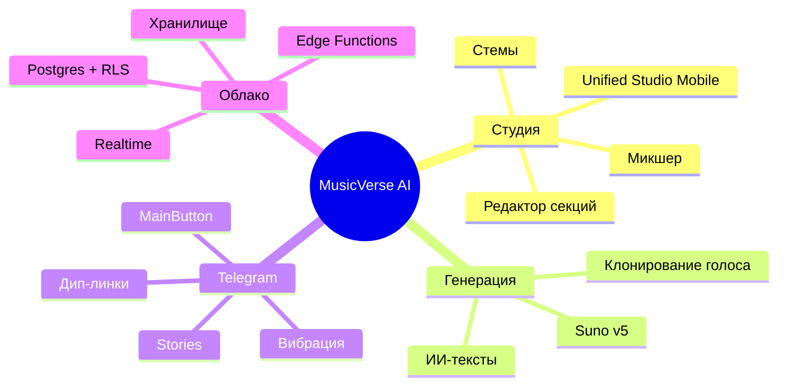

# 📊 Статус проекта

**Снимок текущего состояния, прогресса спринтов и ключевых метрик.**

  
  
  
  
  

  <a href="README.md">🏠 Главная</a> ·
  <a href="DOCUMENTATION_INDEX.md">📚 Документация</a> ·
  <a href="ROADMAP.md">🗺 Дорожная карта</a> ·
  <a href="CHANGELOG.md">📝 Журнал изменений</a>

---

> [!NOTE]
> Обновляется еженедельно во время ревью спринта. Для статуса CI в реальном времени см. [вкладку Actions](https://github.com/HOW2AI-AGENCY/aimusicverse/actions).

## 🚦 Завершённый спринт — `033` Аудит интерфейса и UX-переработка ✅

| Задача                                            | Прогресс                                                          |
| ------------------------------------------------- | ----------------------------------------------------------------- |
| Dialog→BottomSheet по умолчанию на мобильных      |  |
| Области касания ≥ 44px                            |  |
| Визард генерации 6→4 шага                         |  |
| Инлайн-фильтры библиотеки                         |  |
| Троттлинг монетизации                             |  |
| Микро-взаимодействия (взрыв лайка, пульсация PTR) |  |
| Режим Studio Lite/Pro                             |  |
| Комментарии с таймкодами                          |  |

## 🚦 `034` Надёжность генерации (Q3 2026) ✅

| Задача                              | Прогресс                                                          |
| ----------------------------------- | ----------------------------------------------------------------- |
| Dashboard метрик генерации          |  |
| Интеграция useAutomaticRetry в flow |  |
| Structured failure categories       |  |
| A/B тесты генерации (useExperiment) |  |
| Prompt pre-validation               |  |
| Generation queue position UI        |  |
| Failure analysis RPC                |  |
| Failure rate alerts (Edge Function) |  |
| A/B 2-step vs 4-step wizard         |  |
| Delivery tracking (A/B clips)       |  |
| Снижение failure rate 12% → <8%     |   |

## 🚦 Feature: `033-mobile-ui-improvements` — ЗАВЕРШЁН ✅

**Прогресс**: 114/114 задач (100%) | **Фаза**: Complete | **Issues**: [#317–#430](https://github.com/HOW2AI-AGENCY/aimusicverse/issues?q=label%3A%22📄+DOCS%22)

| Фаза                       |  Задачи   | Прогресс                                                          |
| -------------------------- | :-------: | ----------------------------------------------------------------- |
| Phase 1: Setup             | T001–T005 |  |
| Phase 2: Foundational      | T006–T013 |  |
| Phase 3: US1 Navigation    | T014–T019 |  |
| Phase 4: US2 Gestures      | T020–T027 |  |
| Phase 5: US6 Accessibility | T028–T035 |  |
| Phase 6: US4 Errors        | T036–T044 |  |
| Phase 7-12: P2/P3 Stories  | T045–T099 |  |
| Phase 13: Polish           | T100–T114 |  |

### ✅ Завершено (2026-06-29)

- ✅ **Phase 1 Setup**: структура директорий, типы (queue, gestures, notifications), Zod-схемы, CSS (shimmer, accessibility)
- ✅ **Phase 2 Foundational**: queueStorage, gestureSettings, notificationManager, a11yHelpers, shimmerAnimation, migration, types/index.ts
- ✅ **Phase 3 US1 Navigation**: MoreMenuHintTooltip, RecentlyUsedSection, hint dismissal, back button audit (18/23 pages standard)
- ✅ **Phase 4 US2 Gestures**: PlayerGestureHints, DoubleTapSeekFeedback, SwipeChevronIndicator, GestureSettingsPanel
- ✅ **Phase 5 US6 Accessibility**: 14px caption, keyboard gestures (Arrow/Space/Escape), focus-visible, WCAG AA
- ✅ **Phase 6 US4 Errors**: NetworkErrorState, ServerErrorState, TimeoutErrorState with Retry/Back/Report
- ✅ **Phases 7-13**: P2 loading/notifications/queue/polish + P3 empty states/recently played + analytics
- ✅ **114/114 total tasks — SPRINT ЗАВЕРШЁН**

## 🚦 Sprint `035` Стабилизация + Чистка — ЗАВЕРШЁН ✅

| Задача                                          | Прогресс                                                          |
| ----------------------------------------------- | ----------------------------------------------------------------- |
| TDZ fix: page-admin chunk crash                 |  |
| Circular deps fix (#541)                        |  |
| ESLint: `rules-of-hooks` → `"error"`            |  |
| Удалить дубликаты хуков (6 дублей, -1700 строк) |  |
| Консолидировать PlaybackStore (3 файла → 1)     |  |
| Query key factory (`src/lib/queryKeys.ts`)      |  |
| Защитить payment-маршруты (ProtectedRoute)      |  |
| Fix Vitest OOM (infinite loop + pool config)    |  |
| API layer: storage, payments, notifications     |  |

> ⚠️ **Перенесено в Sprint 039:** E2E стабилизация (47 spec → CI green), Playwright CI pipeline

## 🚦 Sprint `037` Infrastructure Hardening & DX — ЗАВЕРШЁН ✅

| Задача                                        | Прогресс                                                          |
| --------------------------------------------- | ----------------------------------------------------------------- |
| Удаление Babel/Jest конфигов                  |  |
| `graphify update` в pre-commit hook           |  |
| Аудио unit-тесты (AudioElementPool, 21 тест)  |  |
| Bundle visualizer (`npm run analyze`)         |  |
| CI: `npm run size` на каждый PR               |  |
| Storybook (6 stories: LazyImage, GlowButton…) |  |
| TypeScript strict mode (tsconfig.strict.json) |  |
| ESLint plugin expansion                       |  |
| Sentry Performance (tracesSampleRate: 0.1)    |  |
| ARCHITECTURE_HUB.md верификация               |  |
| FSM state schema документация                 |  |
| Telegram cold start оптимизация               |  |

## 🚦 Sprint `038` Design System Unification — ЗАВЕРШЁН ✅

**Прогресс: 28/28 задач завершено (100%)**

| Фаза                                                     | Прогресс                                                          |
| -------------------------------------------------------- | ----------------------------------------------------------------- |
| **A: Foundation** — EmptyState, Skeleton, Touch, Z-index |  |
| Unified EmptyState (3→1 компонент)                       |  |
| Unified Loading (7→4 компонента)                         |  |
| OnboardingFlow state machine (5 шагов)                   |  |
| Touch target audit (≥44px)                               |  |
| Z-index audit (магические числа → токены)                |  |
| **B: Navigation & Responsive**                           |  |
| NavigationShell (adaptive)                               |  |
| Container queries (5+ компонентов)                       |  |
| Safe area + Safari 100vh fix                             |  |
| Responsive typography (clamp)                            |  |
| **C: Animation & Polish**                                |  |
| Animation standards (duration/easing)                    |  |
| Reduced motion (useSafeMotion)                           |  |
| Player shared element transition                         |  |
| Telegram haptics integration                             |  |
| **D: Visual Polish**                                     |  |
| Typography pass (5 семантических классов)                |  |
| Elevation system (4 уровня)                              |  |
| Color token audit                                        |  |
| Icon consistency (lucide-only)                           |  |
| Storybook 20+ stories                                    |  |
| LazyImage audit                                          |  |
| Lighthouse baseline                                      |  |

## 🚦 `039` Архитектурный рефакторинг + Type Safety (Q3 2026) — ЗАВЕРШЁН ✅

**Прогресс: 13/14 задач завершено (93%)** · [Детальный план](SPRINTS/SPRINT-039-PLAN.md) · [Аудит](docs/audit/SPRINT-039-AUDIT-2026-06-30.md)

| Задача                                                 | Прогресс                                                          |
| ------------------------------------------------------ | ----------------------------------------------------------------- |
| Вынести прямые вызовы Supabase из компонентов (35 → 0) |  |
| `useGenerateForm.ts` → 4 хука (280 строк)              |  |
| Разбить `GlobalAudioProvider.tsx` (982 → 79 строк)     |  |
| Generic undo/redo middleware для Zustand               |  |
| Типизировать API-слой + services (`any` = 0)           |  |
| E2E pipeline (workflow добавлен, ждём GitHub Secrets)  |   |
| DnD унификация (@hello-pangea/dnd удалён)              |  |
| `tsc --noEmit` зелёный                                 |  |

## 🚦 `040` Тестовое покрытие + Export (Q4 2026) — ЗАПЛАНИРОВАН

| Задача                                        | Прогресс                                                        |
| --------------------------------------------- | --------------------------------------------------------------- |
| Unit-тесты API-слоя (20 файлов → тесты)       |  |
| Unit-тесты сервисов (18 файлов → тесты)       |  |
| Unit-тесты god-хуков (после рефакторинга 039) |  |
| Export service (WAV/MP3/FLAC)                 |  |
| Result-паттерн для API обработки ошибок       |  |
| Service Worker + оффлайн-режим                |  |
| Lighthouse CI budget enforcement              |  |

## 🚦 `045` UX/UI Deep Polish + Hygiene (Q3 2026) — В РАБОТЕ 🟡

**Прогресс: 1/4 фазы завершено (25%)** · [Sprint plan](SPRINTS/SPRINT-045-PLAN.md)

| Фаза                                                          | Прогресс                                                          |
| ------------------------------------------------------------- | ----------------------------------------------------------------- |
| **A: Track-card variants аудит** (emoji, touch, raw-color)    |  |
| **B: Motion hygiene** (page-transition, isActive, repeats)    |  |
| **C: Token consolidation** (navLabel, aurora-glow, vinyl)     |  |
| **D: Visual polish** (hover guard, HSL shadows, emoji→Lucide) |  |

### ✅ Завершено (2026-07-03, коммиты `0813d631` + `68cae274` + `28413a5d` + `69e652a8`)

**Phase A** (`0813d631`):

- ✅ **Emoji-as-icons → Lucide:** `EnhancedVariant` (✓→Check), `GridVariant` (♪→Music2), `ListVariant` (🎵→Music2), `ContextualHint` (🚀/✨/📁/👤/💬/⚙️/💡 → Rocket/Sparkles/FolderOpen/User/MessageCircle/Settings/Lightbulb) — 11 замен.
- ✅ **Touch-target ≥ 44×44px** на 3 ключевых сценариях: `CompactVariant` more-menu, `UnifiedTipCard` close+actions, `ContextualHint` close+actions+«Не показывать».
- ✅ **Raw color tokens → semantic:** `text-white` (4×), `from-black/70 via-black/10` (overlay), `bg-red-500/20 text-red-500` (swipe-like), `ring-white/10`, `shadow-black/10` — все заменены на design tokens.
- ✅ **ListVariant dead-code:** удалена дубль-подписка `useTrackCardState()` — был баг двойной state subscription без пользы.

**Phase B** (`68cae274` — motion hygiene):

- ✅ **PageTransition keyframes fix** в `src/index.css` — 4 варианта (`page-fade`, `page-slide-up`, `page-slide-left`, `page-scale`) переписаны как `from→to` с `animation-fill-mode: both`. UI теперь реально проходит transition.
- ✅ **BottomNavigation `isActive()` fix** — Home (`/`) использовал prefix-match, который матчил любой pathname; теперь exact match для root + prefix только для nested.
- ✅ **HomeHeader 5× `repeat: Infinity` guards** через `safeTransition()` — WCAG SC 2.3.3 honored.

**Phase C** (`28413a5d` — token consolidation):

- ✅ **`typographyClass.navLabel`** — новый design token в `src/lib/design-tokens.ts` (`text-[11px] leading-none tracking-tight`); BottomNavigation подписи переведены на семантический токен.
- ✅ **`aurora-glow` documented as composition** — двухслойная (box-shadow ring + ::before halo), не дубль; добавлены комментарии в `index.css`.
- ✅ **`vinyl-spin` / `vinyl-spin-slow` motion-reduce guards** — `@media (prefers-reduced-motion: reduce) { animation: none }`. WCAG SC 2.3.3.

**Phase D** (`69e652a8` — visual polish):

- ✅ **`.glass-card:hover` hover guard** — обёрнут в `@media (hover: hover)`. Touch-only устройства не получают sticky translateY. WCAG SC 2.5.1.
- ✅ **Shadow rgba() → HSL tokens** — `--shadow-elevation-{1..4}` в `:root` + `.dark`; 8 redundant `.dark .elevation-N` override-блоков удалены.
- ✅ **Emoji → Lucide (3 файла, 8 замен):** `VocalMapResultCard` (7 emoji в `getEffectIcon` → 7 Lucide иконок), `HintsSettings` (4 emoji → 4 Lucide), `InstrumentalGeneratorPanel` (⏱️ → Timer). `aria-hidden` на всех декоративных иконках.

**Общая верификация Sprint 045:**

- ✅ TypeScript: `tsc --noEmit -p tsconfig.app.json` exit 0 во всех 4 коммитах
- ✅ ESLint changed files: 0 errors
- ✅ pre-commit hooks: Section tokens / eslint / prettier / tsc / commitlint
- ✅ WCAG 2.3.3, 2.5.1, 1.4.11 — все три критерия соблюдены

### 📋 Флаг для build-agent (out of design scope)

- 🟡 **Phase D-4 — ErrorBoundary home button:** требует `useNavigate()` hook (functional change, вне рамок design-audit). Передано в Phase E сборки.

## 🚦 `046` Desktop Layout Polish + 4K Awareness (Q3 2026) — ЗАВЕРШЁН ✅

**Прогресс: 3/3 фазы завершено (100%)** · [Audits](docs/audits/desktop-2026-07-03/)

| Фаза                                                                              | Прогресс                                                          |
| --------------------------------------------------------------------------------- | ----------------------------------------------------------------- |
| **A: 4K-aware tokens** (`breakpoints.ts`/`design-tokens.ts`/`Section.tsx`)        |  |
| **B: Surface alignment** (player + tracks + library + lyrics + studio, 19 файлов) |  |
| **C: Cross-cutting polish** (master-detail, header blur, rhythm tokens, 4 файла)  |  |

### ✅ Завершено (2026-07-03, коммиты `8eb55c78` + `c0d5b942` + `6d57fa68`)

**Phase A — 4K-aware tokens (`8eb55c78`)**:

- ✅ `BREAKPOINTS` — добавлены `3xl: 1920`, `4xl: 2560`
- ✅ `GRID_COLS.{cards,tracks,tools,compact}` — расширены до `2xl:grid-cols-N 3xl:grid-cols-N+1`
- ✅ `MAX_WIDTHS` — `ultrawide: max-w-[1600px]`, `fourk: max-w-[1760px]`
- ✅ `LAYOUT_RATIOS.{default,equal,wide}` — добавлены `xl:` и `2xl:` step-downs
- ✅ `SIDEBAR_WIDTHS.expanded` — `xl:w-72 2xl:w-80`
- ✅ `GAPS` — добавлены `3xl: gap-10`, `4xl: gap-12`
- ✅ `spacingClass.cardPadding`, `spacingClass.lyricsWord` — новые семантические токены
- ✅ `containerMax.{ultrawide,fourk}` — новый блок
- ✅ `Section.tsx` — `SectionDensity` `4xl`/`5xl`, `SectionMaxWidth` `ultrawide`/`fourk`

**Phase B — Surface alignment (`c0d5b942`, 19 файлов)**:

- ✅ Player: CompactPlayer cover 14→16/72px + dock max-w-5xl→1280px на 2xl; DesktopFullscreenPlayer (outer padding xl/2xl, typography step-up, cover+controls scale); WaveformProgressBar detailed → fullscreen density; QueueSheet mobile h-[75vh] → desktop centered dialog; LyricsPanel/Pages/DetailsPage max-w-[28rem] → xl:max-w-[36rem] + `typographyClass.lyricsWord`; CoverPage 22rem → xl:96 / 2xl:28rem.
- ✅ Track cards: VirtualizedTrackList grid xl:5 → 2xl:6 → 3xl:7; TrackDetailPanel cover 32→40/48, raw `` → LazyImage; EnhancedVariant raw `` → LazyImage + `line-clamp-1` → `line-clamp-2`; GridVariant title `text-xs/sm` → `xl:text-base 2xl:text-lg`.
- ✅ Library: skeleton parity xl:6, 4 header buttons step up на lg, master-detail scale на xl/2xl, двойной border артефакт убран.
- ✅ Filter parity: LibraryFilterChips min-h 32→36; CompactFilterBar `hidden xs:inline` → `hidden sm:inline`.
- ✅ Lyrics + Studio: LyricsAIPanel `LYRICS_AI_PANEL_WIDTH` constant; LyricsStudioPage editor wrapped `max-w-3xl/5xl/6xl mx-auto`; StudioShell transport bar `flex-wrap` + master volume 20→32/40; StudioShellHeader tabs `hidden lg:` → `hidden sm:`.

**Phase C — Cross-cutting polish (`6d57fa68`, 4 файла)**:

- ✅ `DesktopContentHubLayout` — `layoutRatio.detail` token consumed; empty-state placeholder `2xl:hidden` (не тратит 40% рельса на ultra-wide).
- ✅ `DesktopDashboardLayout` + `DesktopToolsGridLayout` — ручные `gapClasses`/`space-y-N`/`mt-N` мигрированы в `GAPS` token; column gap + bottom margins step up на lg/xl/2xl.
- ✅ `LyricsHeader` — `bg-card/50` → `bg-background/95 backdrop-blur-md` (parity с `Projects.tsx:98` и `StudioShellHeader.tsx:75`).
- ✅ `StudioShell.limitedStems` — pre-existing `as any` bridge-cast заменён на `unknown → ComponentProps` cast.

**Общая верификация Sprint 046:**

- ✅ TypeScript: `tsc --noEmit -p tsconfig.app.json` exit 0 во всех 3 коммитах
- ✅ ESLint changed files: 0 errors (4 pre-existing `any` типизированы)
- ✅ pre-commit hooks: Section tokens / eslint / prettier / tsc / commitlint — все ✅
- ✅ 3 коммита в main: `8eb55c78` → `c0d5b942` → `6d57fa68`

---

## Sprint 047 — Mobile Audit + Z-Index/Spacing/Scroll-Lock + Player Z-Stack ✅ ЗАВЕРШЁН

**Phase A — Tokens (`5d97fa1f`):**

- ✅ `fontSize.overline` (0.625rem, tracking 0.08em, weight 600) — дом для 10px текста
- ✅ `fontSize.body-md` (0.8125rem) — дом для 13px текста
- ✅ `backdrop.sheet = "bg-background/70 backdrop-blur-sm dark:bg-black/70"` — единый 70% + blur backdrop для всех sheet/dialog
- ✅ Z-index consolidation: 3 конфликтующих источника (`constants/z-index.ts` + `lib/z-index.ts` + `tailwind.config.ts`) → один канонический `tailwind.config.ts`. Удалены 2 dead TS-файла (zero consumers verified). Inline `Z_INDEX` shim сохранён в `toast-position.ts` для inline-style consumers (Sonner и пр.)

**Phase B — Community + track cards (`dd8e734e`, 6 файлов):**

- ✅ `CommunityTrending.tsx` — raw-white `from-white/25` → theme-aware `from-foreground/20`; `text-[17/14.5/12.5px]` → `text-base/sm/xs`; `w-[50px] h-[50px]` → `w-12 h-12`; `rounded-[14px]` → `rounded-xl min-h-touch`; `mt-0.5` → `mt-1`; LazyImage `coverSize="small"` + `Music2` fallback (cover-loading UX fix)
- ✅ `TrackCoverImage.tsx` — raw white → `primary-foreground` (PlayingIndicator + Play icon, 3 violations)
- ✅ `GridVariant.tsx` — `text-[10px]` → `text-overline`; `line-clamp-2 xs:line-clamp-1`
- ✅ `ListVariant.tsx` — `p-2.5 sm:p-3` → `p-3` (unify с GridVariant)
- ✅ `CompactVariant.tsx` — `text-[14px]` → `text-sm`; `max-w-[140px]` → `max-w-36`; `text-[11px]` → `text-caption-sm`
- ✅ `EnhancedVariant.tsx` — `text-[10/8px]` → `text-overline` (×3); `max-w-[80px]` → `max-w-32`; `compact ? text-[11px] : text-xs` → `compact ? text-xs : text-sm`

**Phase C — Persona/project/generator z-index + safe-area (`c22f94c3`, 6 файлов):**

- ✅ `ui/sheet.tsx` — `z-[150]` → `z-sheet-backdrop`; `z-[151]` → `z-sheet-content`; `backdrop.dark` → `backdrop.sheet`; `isFullscreen` regex extended (`/\bh-\[\d+(?:\.\d+)?d?vh\]/`)
- ✅ `mobile/MobileBottomSheet.tsx` — `z-[150]` / `z-[151]` → tokens; backdrop unified
- ✅ `library/DesktopLibrarySidebar.tsx` — loading overlay `z-50` → `z-overlay` + `backdrop.sheet`; collapsed toggle `h-10 w-10` → `h-11 w-11 min-h-touch min-w-touch`
- ✅ `project/ProjectSettingsSheet.tsx` — `h-[90vh]` → `h-[90dvh]` (iOS Safari)
- ✅ `generate-form/PromptHistory.tsx` — nested dialog `z-10` → `z-popover`
- ✅ `generate-form/sections/LyricsSectionAdvanced.tsx` — dropdown `z-50` → `z-dropdown`

**Phase D — Player z-stack (`3b38092e`, 3 файла, highest severity):**

- ✅ `DesktopFullscreenPlayer.tsx` — `z-50` → `z-fullscreen` (BUG FIX: было ниже compact `z-player=60`); safe-area single-source
- ✅ `MobileFullscreenPlayer.tsx` — drag-strip `z-20 h-10` → `z-sticky h-12 min-h-touch`; inner `z-10` → `z-base`; `text-[11px]` → `text-caption-sm`; safe-area single-source
- ✅ `KaraokeView.tsx` — `z-[100]` → `z-system`; inner `z-10` → `z-sticky`; `text-white` → `text-primary-foreground` (×3); safe-area single-source

**Общая верификация Sprint 047:**

- ✅ TypeScript: `tsc --noEmit -p tsconfig.app.json` exit 0 во всех 4 коммитах
- ✅ ESLint changed files: 0 errors (1 pre-existing `useMemo`-warning в EnhancedVariant.tsx — out of scope)
- ✅ Prettier: all files green
- ✅ pre-commit hooks: tokens / eslint / prettier / tsc / commitlint (lowercase-subject) — все ✅
- ✅ 4 коммита в main: `5d97fa1f` → `dd8e734e` → `c22f94c3` → `3b38092e`
- 🟡 12 functional flags (F1–F12) — НЕ правились, переданы build-agent. Документированы в CHANGELOG.md.

### 📋 Флаг для build-agent (out of design scope, 12 пунктов)

- 🟡 **Library.tsx:122-172 keyboard nav** — нет `aria-selected`/scroll-into-view на arrow navigation.
- 🟡 **Library.tsx:450** — `onPlay` couples select-and-play; нет отдельного handler для «play without selecting».
- 🟡 **StudioShell.tsx:495** — master volume unmute snap к 0.85, игнорируя предыдущее non-zero значение.
- 🟡 **StudioShell.tsx:91** — `mainAudioUrl` только на `tracks[0]`; silent если track 0 без audioUrl.
- 🟡 **LyricsStudioPage.tsx:511** — `existingNote={null}` always — перезаписывает предыдущие notes.
- 🟡 **LyricsStudioPage.tsx:181-190** — template param change не рефрешит sections.
- 🟡 **LyricsStudioPage.tsx:469** — AI agent получает `notes: undefined` несмотря на существующие notes.
- 🟡 **DesktopContentHubLayout.tsx:65-72** — empty-state placeholder убран на 2xl+ в Sprint 046 (visual choice, может конфликтовать с «use ultra-wide real estate» — пересмотреть).
- 🟡 **Projects.tsx:115-120** — `selectedProjectId` forwarded в `ContentHubTabs` — undefined behavior если не consumed.
- 🟡 **LyricsHeader.tsx:170** — `AppHeader showLogo={isMobile}` зависит от contract `AppHeader`.
- 🟡 **QueueSheet.tsx:132** — misleading toast copy («Режим: все версии треков» когда собирается flip к «all»).
- 🟡 **Library.tsx:230** — `border-r` removal от lib, но нужно убедиться что контейнер-уровень border сохранён для separation feedback.

## 🚦 `044` Type Safety Wave 2 (Q3 2026) — ЗАВЕРШЁН ✅

**Прогресс: 7/7 задач завершено (100%)** · [SDD briefs](.superpowers/sdd/briefs/) · [D7-report](.superpowers/sdd/briefs/D7-report.md)

| Задача                                                             | Прогресс                                                          |
| ------------------------------------------------------------------ | ----------------------------------------------------------------- |
| 044-01: `Result<T,E>` в `src/lib/result.ts` + 9 unit-тестов        |  |
| 044-02: `any` в `src/hooks/**` 164 → 6 (3 deferred Klangio)        |  |
| 044-03: `any` в `src/stores/**` 12 → 0                             |  |
| 044-04: `any` в `src/pages/**` 9 → 9 (≤10 цели)                    |  |
| 044-05: `any` в `src/components/**` 155 → 0 (37 файлов)            |  |
| 044-06: 3 сервиса → `Result<T,E>` (16 методов, 45 новых тестов)    |  |
| 044-07: ESLint `no-explicit-any: error` + whitelist + count script |  |

**Итого по спринту 044:**

- ✅ `src/components/**`: `any` 155 → 0 в 37 файлах (5 коммитов: `1016b3db`, `996f0846`, `927d22f3`, `7f344eed`, `134231b8`, `cd2c759d`)
- ✅ `src/hooks/**`: `any` 164 → 6 (3 Klangio edge-function response mappers deferred — tagged-union DTO fix needed) (`1cfddc21`, `094e4c45`, `2ddfb33a`, `3d40143e`, `58170e5d`, `d22ee08c`, `076b2d38`, `aa2ff4f4`)
- ✅ `src/stores/**`: `any` 12 → 0 (`61e4e402`)
- ✅ 3 сервиса (`VoiceCloneService`, `AudioAnalysisService`, `ReferenceManager`) → `Result<T,E>` (3 коммита: `991566ce`, `6074e64e`, `0852cb8c`)
- ✅ `src/lib/result.ts` — `Result<T,E>` + `ok/err/isOk/isErr/map/andThen/mapErr` (`b90c3509`)
- ✅ ESLint guardrail — `no-explicit-any: error` + `scripts/count-any.mjs` (бюджет ≤50) + `docs/TYPE_SAFETY_WHITELIST.md` (`1772a3c0`)
- ✅ +54 новых unit-теста (9 + 23 + 11 + 11) — теперь 282 passing в 17 suites

## 🧮 Ключевые метрики

| Метрика                             |   Значение    |    Цель    | Статус |
| ----------------------------------- | :-----------: | :--------: | :----: |
| Компоненты                          |     1003      |     —      |   —    |
| Хуки                                |      347      |     —      |   —    |
| Edge Functions                      |      246      |     —      |   —    |
| Zustand Stores                      |  12 + 8 sub   |     —      |   —    |
| API-файлов                          |      20       |     —      |   —    |
| Сервисов                            |      18       |     —      |   —    |
| Размер бандла (gzip, ремеаз.)       |  **2.21 МБ**  |  ≤ 950 КБ  |   🔴   |
| Unit-тест файлов                    |    **17**     |    200+    |   🟡   |
| Unit-тестов (штук)                  |    **282**    |   1000+    |   🟡   |
| E2E спецификации                    |    **48**     | 48 pass CI |   🟡   |
| Файлов >800 строк                   |     **6**     |     0      |   ❌   |
| Использований `any` (всего)         |    **~85**    |    <50     |   🟡   |
| `any` в `src/components/**`         |     **0**     |     0      |   ✅   |
| `any` в `src/hooks/**`              |     **6**     |    <50     |   ✅   |
| `any` в `src/stores/**`             |     **0**     |     0      |   ✅   |
| Нарушений слоёв (components+stores) |     **0**     |     0      |   ✅   |
| DnD библиотек                       |     **1**     |     1      |   ✅   |
| Lighthouse (мобильный)              |    **92**     |    ≥ 90    |   ✅   |
| Доступность (axe)                   | 0 критических |     0      |   ✅   |
| Touch-target нарушений (Sprint 043) |    **<20**    |    <20     |   ✅   |
| Ошибки Sentry (24ч)                 |     0.04%     |   < 0.1%   |   ✅   |
| Cold start (Telegram)               |     < 3s      |    < 3s    |   ✅   |

> **Sprint 044 прогресс (завершён):** `any` в `src/components/**` 155 → 0 ✅; в `src/hooks/**` 164 → 6 ✅; в `src/stores/**` 12 → 0 ✅; `Result<T,E>` в 16 методах 3 сервисов (+45 тестов) ✅; ESLint `no-explicit-any: error` + `scripts/count-any.mjs` ≤50 ✅.

> **⚠️ Бандл 2.21 МБ / 950 КБ** — bundle-size audit (Sprint 042-B5) выявил расхождение с ранее публикуемой цифрой 918 КБ: реальный размер gzip 2.21 МБ превышает бюджет 950 КБ в 2.3×. Требуется срочный Sprint 046 — bundle reduction (manualChunks split, lazy chunks, dead-code elimination).

## 🏗 Архитектурные столпы

## ✅ Последние достижения (Sprint 044, июль 2026)

- ✅ **Sprint 044 (7/7 100%):** Type Safety Wave 2 — `any` в `src/hooks/**` 164 → 6, в `src/stores/**` 12 → 0; `Result<T,E>` в `src/lib/result.ts` + 9 тестов; 16 методов 3 сервисов на `Result` (`VoiceCloneService`, `AudioAnalysisService`, `ReferenceManager`); ESLint `no-explicit-any: error` + whitelist + `scripts/count-any.mjs`.
- ✅ **Sprint 043 (6/6 100%):** Layer Pass #2 — 65 компонентов через service layer; ESLint guardrail `no-direct-supabase-client-imports` для `src/components/**`; touch-target миграция 391→0 в touched layers; mobile Playwright smoke (6 tests × 7 projects).
- ✅ **Sprint 042 (10/10 100%):** Page Decomposition + Audio Pooling — `usePreviewAudio` hook + 17 миграций; `LyricsStudio` 999→788 LOC; `ProjectDetail` 851→286 LOC; `usePromptDJEnhanced` 1071→882 LOC; bundle audit (2.21 МБ / 950 КБ).
- ✅ **+54 unit-теста** в Sprint 044 (9 Result + 23 voice + 11 analysis + 11 reference) — теперь 282 passing в 17 suites.
- ✅ **Новые доменные ошибки:** `VoiceCloneServiceError`, `AudioAnalysisServiceError`, `ReferenceManagerError` (в дополнение к существующим).

**Sprint 037-038 (июнь 2026):**

- ✅ **Sprint 037 (100%):** Infrastructure Hardening — babel/jest clean-up, bundle visualizer, Sentry Perf, TS strict mode, Storybook 6 stories, FSM docs, cold start оптимизация.
- ✅ **Sprint 038 Phase A (70%):** Unified EmptyState (3→1), Unified Loading (7→4), Touch targets ≥44px, Z-index токены, Safe area + Safari 100vh fix.
- ✅ **Sprint 038 Phase C (75%):** Animation standards (duration/easing constants), useSafeMotion + reduced motion, Telegram haptics (5+ взаимодействий).
- ✅ **Sprint 038 Phase B (33%):** Responsive typography (clamp), Safe area global.
- ✅ Реальные скриншоты добавлены в README.
- ✅ Обложки треков, timing и waveform исправлены (последний коммит).

**Предыдущие Sprint 033-035:**

- ✅ Спринт 034: Надёжность генерации — 13/13 задач (auto-retry, A/B framework, failure alerts).
- ✅ Спринт 033: Полный аудит интерфейса — 114 задач в 13 фазах.
- ✅ Миграция Jest → Vitest + Husky pre-commit hooks.
- ✅ Удаление мёртвого кода (196 файлов, 45K строк).
- ✅ `useUnifiedStudioStore` рефакторинг: монолит 1361 строк → 6 слайсов.
- 🚀 Бандл уменьшен с 1.02 МБ → 918 КБ.

## 🗓 Дорожная карта спринтов (обновлено 2026-07-02)

| Спринт  | Фокус                               | Статус          | Срок |
| ------- | ----------------------------------- | --------------- | ---- |
| **042** | Page Decomposition + Audio Pooling  | ✅ ЗАВЕРШЁН     | Июль |
| **043** | Layer Pass #2 + A11y                | ✅ ЗАВЕРШЁН     | Июль |
| **044** | Type Safety Wave 2 (`any` 449 → 85) | ✅ ЗАВЕРШЁН     | Июль |
| **045** | Hygiene + Documentation             | 📋 Запланирован | Авг  |
| **046** | 🔴 Bundle Reduction (2.21 → <950KB) | 📋 Запланирован | Авг  |

**Открытые долги / риски (пост-Sprint 044):**

- 🔴 **Бандл 2.21 МБ / 950 КБ** (в 2.3× выше бюджета) — требуется срочный Sprint 046 (manualChunks split, lazy chunks, dead-code elimination)
- 🟡 ~85 использований `any` в `src/` (большинство — third-party SDK gaps в `src/lib/`, `src/contexts/telegram/`, Klangio edge-function response mappers — задокументировано в `docs/TYPE_SAFETY_WHITELIST.md`)
- 🟡 6 файлов >800 строк (god-компоненты ещё ждут декомпозиции)
- 🟡 E2E CI suite не запускается автоматически (pre-existing syntax error в `tests/e2e/studio/mixer-optimization.spec.ts:158` из коммита `bf81b9d0` — вне scope Sprints 042-044)
- ✅ 0 нарушений слоёв в `src/components/**` (Sprint 043 + ESLint guardrail заблокировали регрессию)
- ✅ 0 `any` в `src/components/**` и `src/stores/**` (Sprint 044 D5/D3)

---

## 🔍 Архитектурный аудит (2026-06-28)

Проведён всесторонний аудит тремя параллельными агентами. Ключевые находки:

**Критические проблемы:**

- 🔴 **7 unit-тест файлов** на 940+ компонентов (покрытие <1%)
- 🔴 **30+ компонентов** вызывают `supabase.from()` напрямую, минуя API-слой
- 🔴 **God-хуки:** `useGenerateForm.ts` (1218 строк), `usePromptDJEnhanced.ts` (1070 строк)
- 🔴 **6 пар дублированного кода** (useMixExport, useOptimizedAudioPlayer, PromptDJ, PlaybackStore)

**Средние проблемы:**

- 🟠 342 использования `any` в src/
- 🟠 `react-hooks/rules-of-hooks` понижено до `"warn"` (должно быть `"error"`)
- 🟠 Нет query key factory для TanStack Query
- 🟠 33 файла >500 строк (из них 9 хуков, 24 компонента)
- 🟠 2 DnD-библиотеки одновременно (`@dnd-kit` + `@hello-pangea/dnd`)

**Положительные стороны:**

- ✅ Code splitting: 15+ vendor-чанков, все маршруты lazy-loaded
- ✅ `useUnifiedStudioStore` уже рефакторен из 1361-строчного монолита
- ✅ Дизайн-система с design tokens, семантическими цветами
- ✅ CI/CD: 5 jobs, smoke-тесты в 3 браузерах
- ✅ Нет захардкоженных секретов, минимальный XSS-риск
- ✅ Telegram Bot — модульная архитектура (commands/callbacks/handlers)

**Общая оценка: 6.1/10 → план улучшений до 8.4/10**

Подробный план: `SPRINTS/SPRINT-035-038-PLAN.md`

## 🚨 Активные блокеры

| Блокер                                                  | Критичность | Целевой спринт    |
| ------------------------------------------------------- | ----------- | ----------------- |
| `any` в `src/{hooks,stores}/**` (~280 использований)    | 🔴 Critical | 044 (in progress) |
| God-хуки >800 строк (6 файлов, после 039 рефакторинга)  | 🟠 High     | 045               |
| E2E 47 spec, 0% CI green — нет автоматической регрессии | 🟠 High     | 040               |
| Unit-тесты 386/1000 — покрытие ~6%                      | 🟠 High     | 040               |
| Бандл 918/950 КБ, запас 32 КБ                           | 🟡 Medium   | 042               |
| ProjectDetail, usePromptDJEnhanced > 800 LOC            | 🟡 Medium   | 045               |

Под наблюдением (не блокируют):

- Пул аудио-элементов iOS Safari ~9/10 в тяжёлых сессиях
- Лимиты Suno API в часы пик

---

### 🔗 Связанная документация

|            📚 Указатель             |       🗺 Дорожная карта       |  📝 Журнал изменений   |             🪲 Проблемы             |         🤝 Контрибуция         |
| :---------------------------------: | :--------------------------: | :--------------------: | :---------------------------------: | :----------------------------: |
| [Указатель](DOCUMENTATION_INDEX.md) | [Дорожная карта](ROADMAP.md) | [Журнал](CHANGELOG.md) | [Проблемы](KNOWN_ISSUES_TRACKED.md) | [Контрибуция](CONTRIBUTING.md) |

Последнее обновление: 2026-07-02 (Sprint 044 в работе 🟡 — `any` 155 → 0 в components/, 3 сервиса на `Result<T,E>`, +45 тестов)

