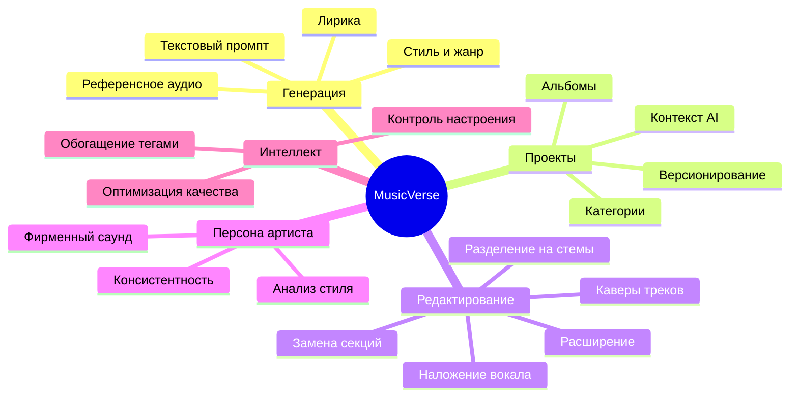
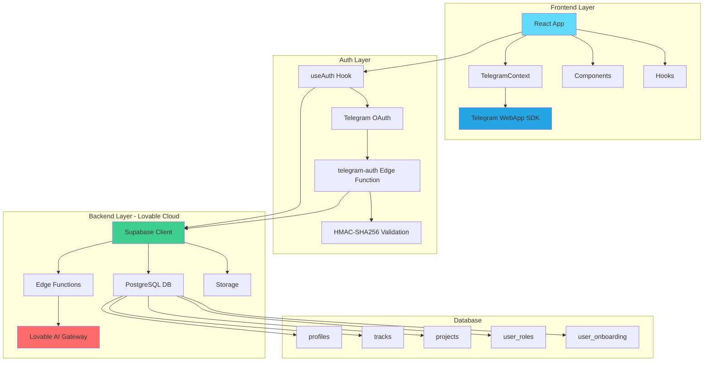

<div align="center">

# 🎵 MusicVerse AI

### Создавайте музыку с помощью искусственного интеллекта

[](https://lovable.dev)
[](LICENSE)
[](https://www.typescriptlang.org/)
[](https://react.dev/)
[](https://core.telegram.org/bots/webapps)
[](https://supabase.com/)

[📖 Документация](TELEGRAM_MINI_APP_INTEGRATION.md) | [🐛 Issues](https://github.com/yourusername/musicverse/issues) | [💡 Feature Request](https://github.com/yourusername/musicverse/issues/new)

</div>

---

## 📑 Содержание

- [О проекте](#-о-проекте)
- [Возможности](#-возможности)
- [Архитектура](#-архитектура)
- [Быстрый старт](#-быстрый-старт)
- [Технологии](#-технологии)
- [Структура проекта](#-структура-проекта)
- [Документация](#-документация)
- [Разработка](#-разработка)
- [Deployment](#-deployment)
- [Лицензия](#-лицензия)

---

## 🎯 О проекте

**MusicVerse AI** — это инновационная платформа для создания музыки с помощью искусственного интеллекта, реализованная как Telegram Mini App. Платформа предоставляет профессиональные инструменты для генерации, редактирования и управления музыкальными треками.

### ✨ Ключевые особенности

- 🤖 **AI-генерация музыки** из текстовых описаний
- 🎭 **Создание персоны артиста** для единого стиля
- 🎚️ **Профессиональное редактирование** треков
- 📱 **Telegram Mini App** интеграция
- 🔐 **Безопасная авторизация** через Telegram OAuth
- ☁️ **Облачное хранилище** для всех композиций

---

## 🎨 Возможности

<div align="center">



</div>

### 🎼 Генерация треков

- **Из текста**: Опишите желаемую музыку, и AI создаст трек
- **Стиль и лирика**: Полный контроль над жанром, настроением и текстом
- **Референс**: Загрузите пример для точного воспроизведения стиля
- **Параметры**: Настройка темпа, инструментов, вокала

### 📁 Проекты и контекст

- **Альбомы**: Группируйте треки в проекты
- **Контекстная генерация**: AI учитывает стиль проекта
- **Единая стилистика**: Все треки в едином ключе
- **Категории**: Автоматическая организация

### ✂️ Разделение на стемы

- **Высокое качество**: Профессиональное разделение
- **Вокал и инструменты**: Отдельные дорожки
- **Экспорт**: Сохранение стемов для DAW
- **Ремиксы**: Идеально для обработки

### 🎛️ Продвинутое редактирование

- **Замена секций**: Изменение частей трека
- **Наложение**: Добавление вокала или инструментов
- **Каверы**: Создание версий существующих треков
- **Расширение**: Увеличение длительности композиций

### 🎤 Персона артиста

- **AI анализ**: Изучение ваших треков
- **Фирменный стиль**: Создание уникального саунда
- **Консистентность**: Все треки в едином стиле
- **Генерация**: Новые треки в вашей манере

### 🏷️ Интеллектуальные теги

- **Автообогащение**: Умные теги для лирики
- **Контроль**: Точная настройка генерации
- **Настроение**: Управление эмоциями трека
- **Качество**: Профессиональный результат

---

## 🏗️ Архитектура

<div align="center">



</div>

### Компоненты системы

#### Frontend
- **React 18.3** с TypeScript
- **Vite** для быстрой сборки
- **Tailwind CSS** для стилизации
- **Framer Motion** для анимаций
- **TanStack Query** для управления состоянием

#### Backend (Lovable Cloud)
- **Supabase** для базы данных и аутентификации
- **Edge Functions** для серверной логики
- **PostgreSQL** для хранения данных
- **Row Level Security (RLS)** для безопасности

#### AI/ML
- **Lovable AI Gateway** для генерации
- **Google Gemini** модели
- **OpenAI GPT-5** для текста
- **Whisper** для распознавания речи

---

## 🚀 Быстрый старт

### Предварительные требования

```bash
Node.js >= 18.0.0
npm >= 9.0.0
```

### Установка

1. **Клонировать репозиторий**
```bash
git clone https://github.com/yourusername/musicverse.git
cd musicverse
```

2. **Установить зависимости**
```bash
npm install
```

3. **Настроить окружение**

Lovable Cloud автоматически настраивает все переменные окружения. Файл `.env` создается автоматически.

4. **Запустить в режиме разработки**
```bash
npm run dev
```

Приложение будет доступно по адресу `http://localhost:5173`

### Development Mode

В режиме разработки автоматически включается mock-режим для Telegram:
- Mock данные пользователя
- Email/password аутентификация
- Полная функциональность без Telegram

---

## 🛠️ Технологии

<div align="center">

| Категория | Технологии |
|-----------|-----------|
| **Frontend** |    |
| **Styling** |   |
| **Backend** |   |
| **AI** |   |
| **Platform** |  |

</div>

### Детальный стек

<details>
<summary>🎨 Frontend</summary>

- **React 18.3** - UI библиотека
- **TypeScript 5.0** - Типизация
- **Vite** - Сборщик и dev-сервер
- **Tailwind CSS** - Утилитарный CSS
- **Framer Motion** - Анимации
- **Radix UI** - Доступные компоненты
- **Shadcn/ui** - UI компоненты
- **TanStack Query** - Управление данными
- **React Router** - Маршрутизация
- **Lucide Icons** - Иконки
- **Sonner** - Toast уведомления

</details>

<details>
<summary>⚙️ Backend</summary>

- **Supabase** - BaaS платформа
- **PostgreSQL** - База данных
- **Supabase Auth** - Аутентификация
- **Edge Functions** - Serverless функции
- **Row Level Security** - Безопасность данных
- **Supabase Storage** - Файловое хранилище
- **Realtime** - WebSocket подписки

</details>

<details>
<summary>🤖 AI/ML</summary>

- **Lovable AI Gateway** - Единая точка доступа к AI
- **Google Gemini 2.5** - Генерация текста и музыки
- **OpenAI GPT-5** - Обработка естественного языка
- **Whisper** - Транскрибация аудио
- **Vision Models** - Анализ изображений

</details>

<details>
<summary>📱 Platform</summary>

- **Telegram Mini Apps** - Платформа
- **Telegram Bot API** - Интеграция с ботом
- **Telegram WebApp SDK** - SDK для Mini Apps
- **OAuth 2.0** - Авторизация через Telegram

</details>

---

## 📂 Структура проекта

```
musicverse/
├── 📁 public/                 # Статические файлы
│   ├── icon.png              # Иконка приложения
│   ├── logo.png              # Логотип
│   └── robots.txt            # SEO
├── 📁 src/
│   ├── 📁 assets/            # Ресурсы (изображения, шрифты)
│   ├── 📁 components/        # React компоненты
│   │   ├── 📁 ui/           # Базовые UI компоненты
│   │   ├── OnboardingSlider.tsx
│   │   ├── SplashScreen.tsx
│   │   ├── TelegramInfo.tsx
│   │   └── ...
│   ├── 📁 contexts/          # React контексты
│   │   └── TelegramContext.tsx
│   ├── 📁 hooks/             # Кастомные хуки
│   │   ├── useAuth.tsx
│   │   ├── useOnboarding.tsx
│   │   ├── useUserRole.tsx
│   │   └── ...
│   ├── 📁 integrations/      # Интеграции
│   │   └── 📁 supabase/
│   │       ├── client.ts     # Supabase клиент
│   │       └── types.ts      # Типы БД
│   ├── 📁 lib/               # Утилиты
│   │   └── utils.ts
│   ├── 📁 pages/             # Страницы приложения
│   │   ├── Index.tsx         # Главная
│   │   ├── Generate.tsx      # Генерация
│   │   ├── Library.tsx       # Библиотека
│   │   ├── Projects.tsx      # Проекты
│   │   ├── Profile.tsx       # Профиль
│   │   └── ...
│   ├── 📁 types/             # TypeScript типы
│   │   └── telegram.d.ts
│   ├── App.tsx               # Корневой компонент
│   ├── index.css             # Глобальные стили
│   └── main.tsx              # Точка входа
├── 📁 supabase/
│   ├── 📁 functions/         # Edge Functions
│   │   ├── telegram-auth/   # Telegram OAuth
│   │   └── generate-music/  # Генерация музыки
│   ├── 📁 migrations/        # Миграции БД
│   └── config.toml           # Конфигурация
├── 📄 TELEGRAM_MINI_APP_INTEGRATION.md  # Документация
├── 📄 TELEGRAM_INTEGRATION.md
├── 📄 README.md
├── 📄 package.json
├── 📄 tsconfig.json
├── 📄 vite.config.ts
└── 📄 tailwind.config.ts
```

---

## 📚 Документация

### Основные документы

- 📘 [**Интеграция Telegram Mini App**](TELEGRAM_MINI_APP_INTEGRATION.md) - Полное руководство по интеграции
  - OAuth Flow
  - Telegram WebApp API
  - Safe Area адаптация
  - HapticFeedback
  - MainButton/BackButton
  - CloudStorage

- 📗 [**Telegram Integration**](TELEGRAM_INTEGRATION.md) - Детали OAuth
  - HMAC-SHA256 валидация
  - JWT генерация
  - Edge Functions
  - Troubleshooting

### API Reference

<details>
<summary>Telegram WebApp API</summary>

#### Основные методы

```typescript
// Инициализация
webApp.ready();
webApp.expand();

// Кнопки
webApp.MainButton.setText('Текст');
webApp.MainButton.show();
webApp.BackButton.show();

// Вибрация
webApp.HapticFeedback.impactOccurred('light');
webApp.HapticFeedback.notificationOccurred('success');

// Попапы
webApp.showAlert('Сообщение');
webApp.showConfirm('Вопрос?', (confirmed) => {});

// Цвета
webApp.setHeaderColor('bg_color');
webApp.setBackgroundColor('#FFFFFF');
```

</details>

<details>
<summary>Supabase Edge Functions</summary>

#### telegram-auth

```typescript
POST /functions/v1/telegram-auth
Content-Type: text/plain

Request Body: initData (Telegram initData string)

Response:
{
  "access_token": "jwt_token",
  "refresh_token": "refresh_token",
  "user": { ... },
  "session": { ... }
}
```

#### generate-music

```typescript
POST /functions/v1/generate-music
Authorization: Bearer <token>
Content-Type: application/json

Request Body:
{
  "prompt": "описание трека",
  "style": "жанр",
  "lyrics": "текст песни (опционально)"
}

Response:
{
  "track_id": "uuid",
  "status": "pending"
}
```

</details>

---

## 💻 Разработка

### Команды

```bash
# Development
npm run dev              # Запуск dev-сервера
npm run build            # Сборка для продакшена
npm run preview          # Предпросмотр сборки

# Linting
npm run lint             # Проверка кода
```

### Git Flow

```bash
# Feature branch
git checkout -b feature/new-feature
git add .
git commit -m "feat: add new feature"
git push origin feature/new-feature
```

### Стандарты кода

- **TypeScript** для всех файлов
- **ESLint** для линтинга
- **Conventional Commits** для коммитов

---

## 🚢 Deployment

### Lovable Platform

Приложение автоматически деплоится на Lovable платформе:

1. **Push в main** → автоматический деплой
2. **Preview** доступен на `*.lovable.app`
3. **Production** на кастомном домене

### Настройка Telegram Bot

1. Создать бота через [@BotFather](https://t.me/BotFather)
2. Настроить Mini App URL
3. Добавить `TELEGRAM_BOT_TOKEN` в секреты Lovable Cloud

### Environment Variables

Все переменные настраиваются автоматически через Lovable Cloud:

- `VITE_SUPABASE_URL` - URL Supabase проекта
- `VITE_SUPABASE_PUBLISHABLE_KEY` - Публичный ключ
- `TELEGRAM_BOT_TOKEN` - Токен Telegram бота (секрет)
- `LOVABLE_API_KEY` - Ключ Lovable AI (секрет)

---

## 📄 Лицензия

MIT License - см. [LICENSE](LICENSE)

---

## 🙏 Благодарности

- [Lovable](https://lovable.dev) - за платформу разработки
- [Supabase](https://supabase.com) - за Backend-as-a-Service
- [Telegram](https://telegram.org) - за Mini Apps платформу
- [Shadcn/ui](https://ui.shadcn.com) - за UI компоненты

---

## 📞 Контакты

- **Telegram**: [@phuketguruadmin](https://t.me/Phuketguruadmin)

---

<div align="center">

**Создано с ❤️ командой MusicVerse**

[⬆ Наверх](#-musicverse-ai)

</div>
