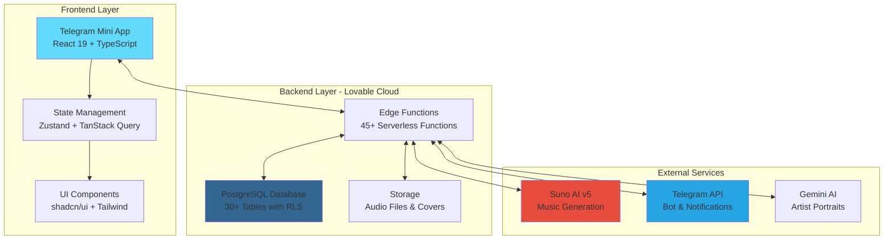
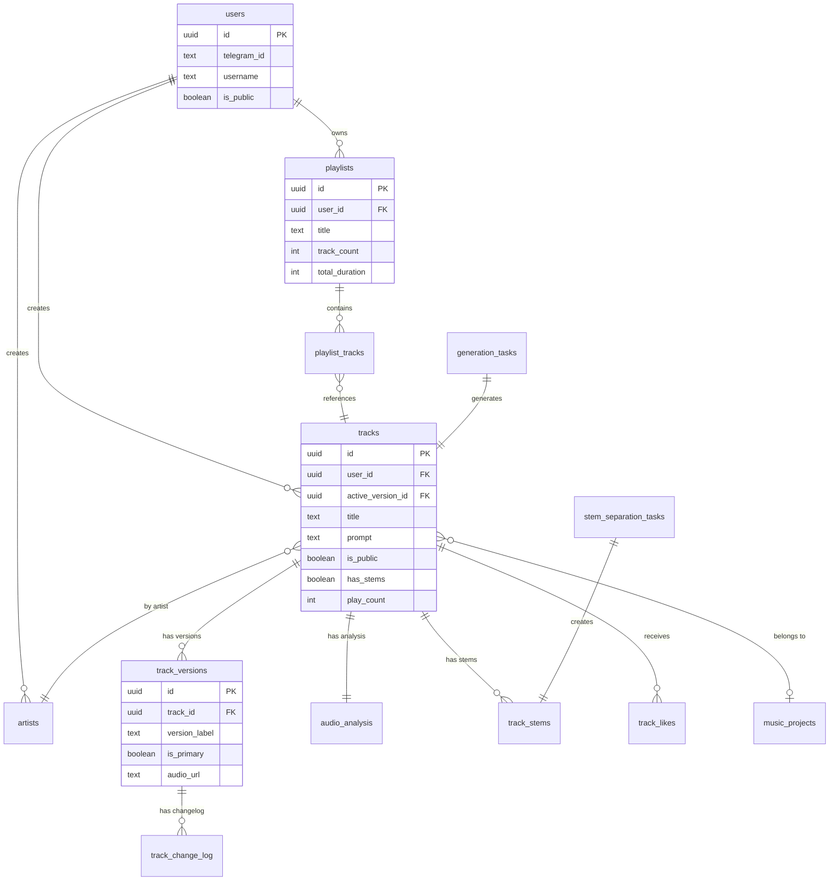
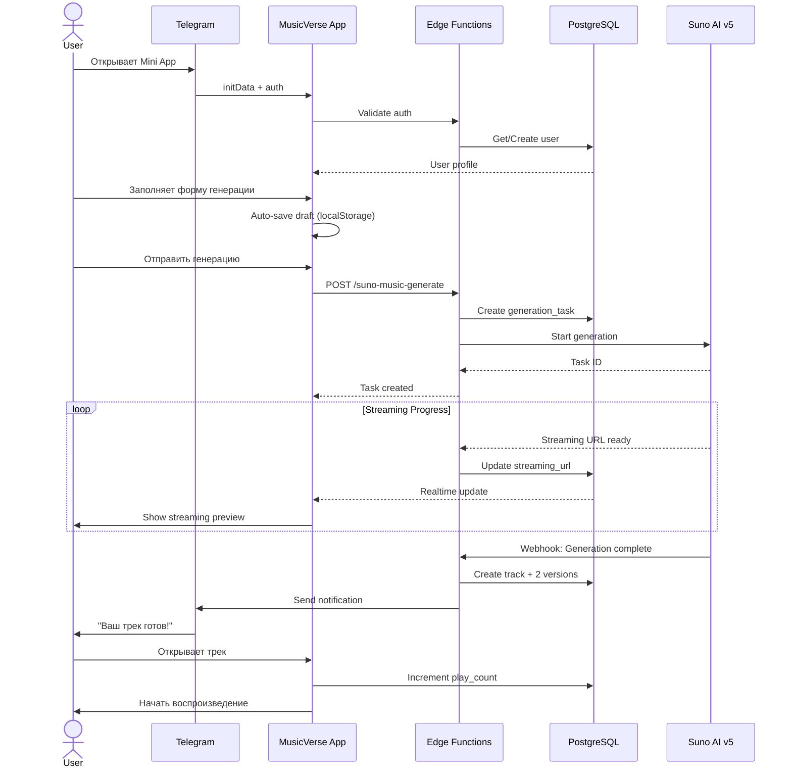
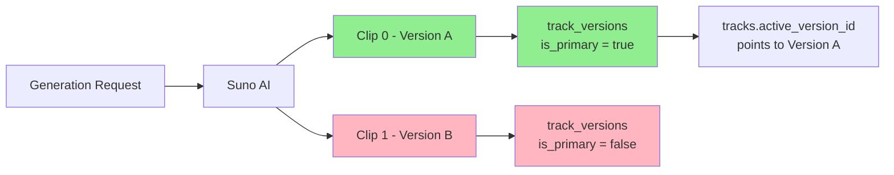
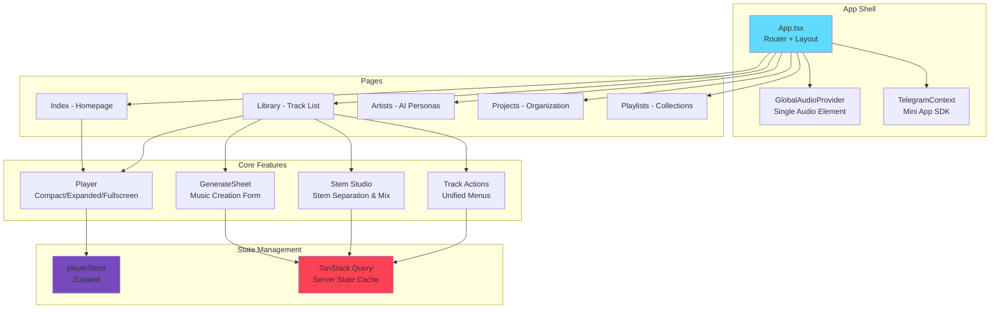
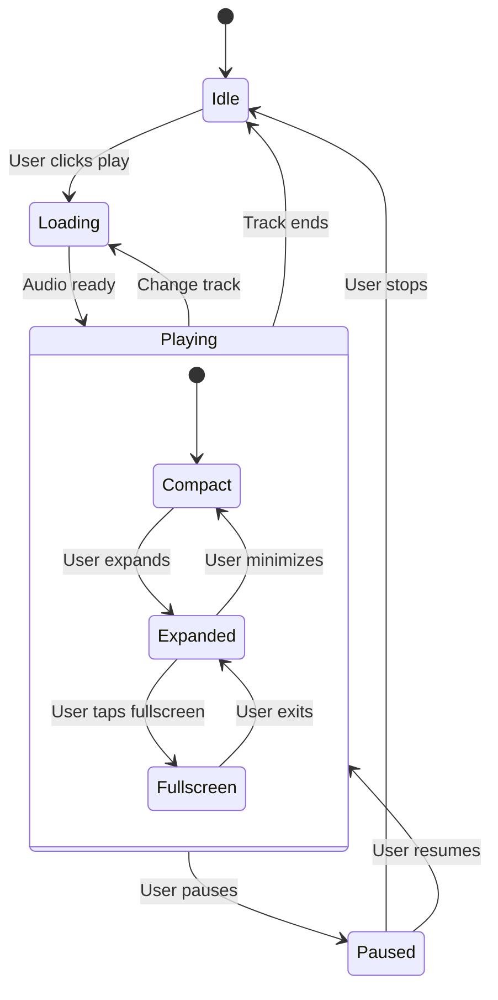

<div align="center">


# 🎵 MusicVerse AI

### 🚀 Профессиональная AI-платформа для создания музыки в Telegram

<p align="center">
  <strong>Создавайте музыку с помощью искусственного интеллекта</strong><br>
  <em>Suno AI v5 • Telegram Mini App • A/B Versioning • Unified Studio • AI Artists • 277+ Styles</em>
</p>

---

<p align="center">
  <a href="http://t.me/AIMusicVerseBot/app">
    
  </a>
  <a href="https://t.me/AIMusicVerse">
    
  </a>
</p>

---

<p align="center">
  
  
  
  
  
  
</p>

<p align="center">
  
  
  
  
</p>

</div>

---

## 📑 Содержание

<table>
<tr>
<td width="50%">

**🎯 Начало работы**
- [✨ Возможности](#-возможности)
- [🚀 Быстрый старт](#-быстрый-старт)
- [📊 Ключевые метрики](#-ключевые-метрики)

**🏗️ Архитектура**
- [Системная архитектура](#-системная-архитектура)
- [Поток данных](#-поток-данных)
- [Архитектура компонентов](#-архитектура-компонентов)

</td>
<td width="50%">

**📱 Разработка**
- [📁 Структура проекта](#-структура-проекта)
- [📖 Документация](#-документация)
- [Мобильная разработка](#-мобильная-разработка)

**🔧 Дополнительно**
- [🔒 Безопасность](#-безопасность)
- [🛠️ Недавние улучшения](#️-недавние-улучшения)
- [📞 Контакты](#-контакты)

</td>
</tr>
</table>

---

## 📍 Быстрая навигация

> 💡 **Полная карта документации:** [DOCUMENTATION_INDEX.md](DOCUMENTATION_INDEX.md)
> 
> 🎯 **Текущий статус:** Sprint 030 (Unified Studio Mobile) - 🟢 In Progress (45%)  
> 📊 **Статус спринтов:** [SPRINT_STATUS.md](SPRINT_STATUS.md) | **Статус проекта:** [PROJECT_STATUS.md](PROJECT_STATUS.md)
>
> 🗺️ **Планы развития:**
> - [IMPLEMENTATION_ROADMAP_2026.md](IMPLEMENTATION_ROADMAP_2026.md) - Roadmap Q1-Q2 2026
> - [SPRINTS/SPRINT-030-UNIFIED-STUDIO-MOBILE.md](SPRINTS/SPRINT-030-UNIFIED-STUDIO-MOBILE.md) - Unified Studio Mobile (Current)
> - [SPRINTS/SPRINT-029-TELEGRAM-MOBILE-OPTIMIZATION.md](SPRINTS/SPRINT-029-TELEGRAM-MOBILE-OPTIMIZATION.md) - Mobile Optimization (Completed)
>
> 📚 **Ключевая документация:**
> - [PROJECT_STATUS.md](PROJECT_STATUS.md) - Единый источник правды о статусе проекта
> - [KNOWLEDGE_BASE.md](KNOWLEDGE_BASE.md) - База знаний проекта
> - [SPRINTS/](SPRINTS/) - Планирование спринтов и задачи
> - [specs/](specs/) - Технические спецификации и SDD
> - [docs/guides/](docs/guides/) - Технические руководства
> - [docs/mobile/](docs/mobile/) - Мобильная оптимизация

---

## ✨ Возможности

### 🎹 Генерация музыки
- **Suno AI v5** — создание треков по текстовому описанию
- **A/B версии** — каждая генерация создаёт 2 варианта
- **Streaming preview** — предпрослушивание во время генерации
- **Custom режим** — полный контроль над lyrics и стилем
- **AI Lyrics Agent** — 10+ инструментов для работы с текстами (NEW)
- **AI Lyrics Chat** — чат-ассистент для написания текстов
- **Голосовой ввод** — диктовка описания через Whisper API
- **Авто-сохранение** — черновики формы сохраняются 30 минут

### 📚 Библиотека треков
- **Виртуализация** — плавная работа с 1000+ треков (react-virtuoso)
- **Lazy loading** — LazyImage компонент с blur-эффектом для всех обложек
- **Grid/List режимы** — адаптивное отображение
- **Swipe-действия** — быстрые операции на мобильных
- **Version управление** — A/B версии с is_primary флагом, переключение inline
- **Лайки** — оптимистичные обновления с denormalized счётчиками
- **Mobile-first дизайн** — адаптивные карточки с touch targets 44×44px

### 🎧 Плеер
- **Глобальный аудио** — один источник звука для всего приложения
- **3 режима** — compact / expanded / fullscreen с плавными переходами
- **📜 Синхронизированные lyrics** — подсветка активной строки с точностью ±0.05s
- **🎯 Умный авто-скролл** — распознавание user scroll с 5s resume delay
- **Очередь воспроизведения** — Play Next, Add to Queue, Shuffle, QueuePanel
- **Audio Visualizer** — визуализация частот в реальном времени
- **Version playback** — режимы воспроизведения версий, переключение в плеере
- **Lazy image loading** — оптимизированная загрузка обложек во всех режимах

### 🎛️ Unified Studio (NEW!)
- **Единый интерфейс** — работа с отдельными треками и проектами
- **Замена секций** — перегенерация отдельных фрагментов трека
- **Stem separation** — разделение на vocals, drums, bass, instruments
- **Микширование** — volume, pan, solo, mute для каждого стема
- **MIDI транскрипция** — экспорт в MIDI, GP5, PDF, MusicXML (6 AI моделей)
- **Waveform editing** — визуализация и редактирование волновой формы
- **Effects processing** — реверб, эквалайзер, компрессия
- **Multi-track playback** — синхронизированное воспроизведение стемов
- **A/B comparison** — сравнение оригинала и изменений
- **Mobile-optimized** — адаптивные контролы для сенсорных экранов
- **Gesture navigation** — swipe, long-press, pinch-to-zoom
- **История изменений** — undo/redo с 30 уровнями

### 📝 Плейлисты
- **CRUD операции** — создание, редактирование, удаление
- **Drag-drop** — перетаскивание треков для сортировки с dnd-kit
- **AI-обложки** — генерация обложек через Lovable AI
- **Auto-playlists** — автоматические плейлисты по жанрам из публичных треков
- **Deep links** — шаринг через Telegram
- **Статистика** — track_count, total_duration обновляются триггерами

### 🎛️ Stem Studio
- **Разделение на стемы** — vocals, drums, bass, guitar и др.
- **Микширование** — громкость, mute, solo для каждого стема
- **🔄 Синхронное воспроизведение** — точная синхронизация всех стемов с drift detection (0.1s)
- **Waveform** — визуализация волновой формы (wavesurfer.js)
- **🆕 klang.io транскрипция** — экспорт в MIDI, GP5, PDF, MusicXML (6 AI моделей)
- **Reference генерация** — использование стема для нового трека
- **🆕 Замена секций** — перегенерация отдельных фрагментов трека
- **🎯 Автоопределение секций** — Levenshtein distance для точного матчинга (RU/EN)
- **A/B сравнение** — сравнение оригинала и замены в реальном времени
- **История замен** — просмотр всех версий секций

### 🎨 AI Аудио Анализ
- **BPM detection** — определение темпа
- **Key signature** — определение тональности
- **Genre/Mood** — классификация жанра и настроения
- **Emotional map** — arousal/valence визуализация
- **Structure analysis** — анализ структуры трека

### 🎸 Creative Tools (NEW)
- **Realtime Chord Detection** — распознавание аккордов через микрофон
- **Guitar Tab Editor** — интерактивный редактор табулатур
- **Melody Mixer** — DJ-style инструмент для создания референсов
- **Export** — GP5, PDF, MIDI форматы
- **Audio Reference** — использование созданных мелодий для генерации

### 🤖 Telegram интеграция
- **Mini App SDK 2.0** — нативное приложение в Telegram
- **Bot commands** — /generate, /cover, /extend, /library
- **Inline queries** — поиск и шаринг треков
- **Уведомления** — оповещения о готовности треков
- **Stories sharing** — публикация в Telegram Stories
- **Deep linking** — прямые ссылки на треки/плейлисты/студию

### 👤 AI-артисты
- **Персоны** — создание AI-артистов с bio и стилем
- **Портреты** — генерация аватаров через Gemini
- **Публичный каталог** — discovery артистов сообщества
- **Мои артисты / Сообщество** — табы на странице Artists

### 🎮 Gamification
- **Daily check-in** — ежедневные награды
- **Streaks** — отслеживание серий
- **Уровни** — прогрессия с опытом
- **Achievements** — достижения с наградами
- **Leaderboard** — 5 категорий рейтинга
- **Credits** — внутренняя валюта

### 👨‍💼 Admin Dashboard
- **Overview** — статистика пользователей/треков
- **Generation Stats** — статистика генерации (NEW)
- **Bot Metrics** — мониторинг Telegram бота
- **User Management** — управление ролями
- **Broadcast** — рассылка уведомлений
- **Blog** — AI-ассистент для статей
- **Analytics** — расширенная аналитика

### ⚙️ User Settings
- **Profile** — управление профилем
- **Statistics** — персональная статистика (NEW)
- **Notifications** — настройки уведомлений
- **Privacy** — настройки приватности

---

## 📊 Системная архитектура

### Общая схема системы



### Архитектура базы данных



---

## 🔄 Поток данных

### Процесс генерации музыки



### Система версионирования (A/B)



---

## 🎯 Архитектура компонентов

### Frontend структура



### Архитектура плеера



---

## 🏗️ Архитектура

### Frontend
```
React 19 + TypeScript 5 + Vite
├── Tailwind CSS + shadcn/ui (дизайн-система)
├── TanStack Query (кэширование данных)
├── Zustand (глобальное состояние)
├── Framer Motion (оптимизированные анимации через @/lib/motion)
├── react-virtuoso (виртуализация списков)
└── wavesurfer.js (аудио визуализация)
```

### Backend (Lovable Cloud)
```
PostgreSQL + Edge Functions
├── Row Level Security (защита данных)
├── Realtime subscriptions (обновления)
├── Storage buckets (медиафайлы)
└── 59 Edge Functions (бизнес-логика)
```

### Ключевые паттерны
- **Single Audio Source** — GlobalAudioProvider с единым audio элементом
- **Optimized Caching** — staleTime 30s, gcTime 10min для TanStack Query
- **Batch Queries** — usePublicContentOptimized для homepage
- **Lazy Images** — LazyImage компонент с blur placeholder, shimmer effect
- **Denormalized Counters** — likes_count, play_count с триггерами
- **Modular Components** — разбиение на подкомпоненты и хуки
- **Lazy Loading** — `src/components/lazy/` для тяжёлых компонентов
- **Optimized Motion** — `@/lib/motion` для tree-shaking framer-motion
- **Skeleton Loaders** — 200+ использований для async состояний
- **Mobile-first** — touch targets 44×44px, swipe gestures, responsive breakpoints

---

## 🚀 Быстрый старт

### Telegram Mini App
Откройте [@AIMusicVerseBot](http://t.me/AIMusicVerseBot) → нажмите "Открыть приложение"

### 🎭 Гостевой режим (Demo Mode)
Попробуйте интерфейс **без авторизации**:
1. Откройте приложение
2. Нажмите **"Попробовать без авторизации"** на странице входа
3. Просматривайте интерфейс и публичный контент

> 📖 Подробнее: [docs/DEMO_MODE.md](docs/DEMO_MODE.md)

### Локальная разработка
```bash
git clone https://github.com/HOW2AI-AGENCY/aimusicverse.git
cd aimusicverse
npm install
npm run dev
```

---

## 📊 Ключевые метрики

| Метрика | Значение |
|---------|----------|
| Мета-теги Suno | 174+ |
| Музыкальные стили | 277+ |
| Языки | 75+ |
| Edge Functions | 99 |
| Таблиц в БД | 30+ |
| React компонентов | 150+ |
| Кастомных хуков | 80+ |

---

## 📁 Структура проекта

```
├── src/
│   ├── components/           # React компоненты
│   │   ├── ui/              # shadcn/ui + GlowButton, GlassCard и др.
│   │   ├── player/          # CompactPlayer, ExpandedPlayer, MobileFullscreen
│   │   ├── library/         # TrackCard, TrackRow, filters
│   │   ├── playlist/        # Playlist management
│   │   ├── stem-studio/     # Stem mixing и waveforms
│   │   ├── generate-form/   # GenerateSheet modules
│   │   │   └── lyrics-chat/ # LyricsChatAssistant (refactored)
│   │   ├── track-detail/    # TrackAnalysisTab, VersionsTab
│   │   ├── track-actions/   # Unified action menus
│   │   ├── gamification/    # Rewards, Leaderboard, Achievements
│   │   ├── admin/           # AdminDashboard tabs
│   │   └── home/            # Homepage sections
│   ├── hooks/               # 60+ кастомных хуков
│   │   ├── usePlayerStore   # Zustand player state
│   │   ├── useTracksInfinite# Infinite scroll tracks
│   │   ├── useLyricsChat    # Lyrics assistant logic
│   │   └── ...
│   ├── stores/              # Zustand stores
│   │   ├── playerStore      # Audio playback state
│   │   ├── queueStore       # Track queue
│   │   └── planTrackStore   # Project track context
│   ├── pages/               # Страницы приложения
│   │   ├── Index.tsx        # Homepage with discovery
│   │   ├── Library.tsx      # Track library
│   │   ├── Artists.tsx      # My Artists + Community tabs
│   │   ├── Projects.tsx     # Music projects
│   │   └── ...
│   └── lib/                 # Utilities
│       └── logger.ts        # Structured logging
├── supabase/
│   └── functions/           # 45+ Edge Functions
│       ├── suno-*/          # Music generation
│       ├── ai-*/            # AI assistants
│       ├── telegram-*/      # Bot handlers
│       └── analyze-*/       # Audio analysis
├── docs/                    # Документация
└── ADR/                     # Architecture Decision Records
```

---

## 📖 Документация

| Категория | Документ | Описание |
|-----------|----------|----------|
| **📚 Навигация** | [DOCUMENTATION_INDEX.md](DOCUMENTATION_INDEX.md) | 🗺️ **Полная карта документации** |
| | [NAVIGATION.md](NAVIGATION.md) | Путеводитель по репозиторию |
| **📊 Статус** | [SPRINT_STATUS.md](SPRINT_STATUS.md) | 🎯 **Текущий статус спринтов** |
| | [RECENT_IMPROVEMENTS.md](RECENT_IMPROVEMENTS.md) | 🚀 **Недавние улучшения (Декабрь 2025)** |
| | [CHANGELOG.md](CHANGELOG.md) | История изменений |
| **🏗️ Архитектура** | [docs/ARCHITECTURE_DIAGRAMS.md](docs/ARCHITECTURE_DIAGRAMS.md) | Визуальные диаграммы |
| | [docs/PROJECT_SPECIFICATION.md](docs/PROJECT_SPECIFICATION.md) | Спецификация проекта |
| | [docs/DATABASE.md](docs/DATABASE.md) | Схема базы данных с ERD |
| | [docs/PLAYER_ARCHITECTURE.md](docs/PLAYER_ARCHITECTURE.md) | Архитектура плеера |
| | [docs/TELEGRAM_BOT_ARCHITECTURE.md](docs/TELEGRAM_BOT_ARCHITECTURE.md) | Архитектура бота |
| **🎵 Функции** | [docs/SUNO_API.md](docs/SUNO_API.md) | Интеграция Suno AI |
| | [docs/STEM_STUDIO.md](docs/STEM_STUDIO.md) | Stem Studio функции |
| | [docs/SECTION_REPLACEMENT.md](docs/SECTION_REPLACEMENT.md) | Замена секций |
| | [docs/DEMO_MODE.md](docs/DEMO_MODE.md) | Гостевой режим |
| **🎨 UX/Design** | [UX_AUDIT_MOBILE_STUDIO_DESIGN.md](UX_AUDIT_MOBILE_STUDIO_DESIGN.md) | 🆕 Профессиональный мобильный UX аудит |
| **🛠️ Разработка** | [CONTRIBUTING.md](CONTRIBUTING.md) | Правила контрибуции |
| | [DEVELOPMENT_WORKFLOW.md](DEVELOPMENT_WORKFLOW.md) | Рабочий процесс |
| | [ONBOARDING.md](ONBOARDING.md) | Onboarding новых разработчиков |

---

## 📱 Мобильная разработка

### 🎯 Telegram Mini App — Native Experience

MusicVerse AI построен как **полноценное Telegram Mini App** с глубокой интеграцией платформы:

<table>
<tr>
<td width="50%">

**🔧 Текущие возможности**
- ✅ **19 мобильных компонентов** - Специализированные UI
- ✅ **~450KB bundle** - Оптимизированный размер
- ✅ **Touch targets 44-56px** - Удобство использования
- ✅ **iOS Safari audio pooling** - Предотвращение крашей
- ✅ **Keyboard-aware forms** - Умная обработка клавиатуры
- ✅ **Gesture system** - Swipe, long-press, pull-to-refresh
- ✅ **Safe-area padding** - Поддержка notch/island
- ✅ **Native sharing** - Stories, chat, clipboard

</td>
<td width="50%">

**🚀 В разработке (Sprint 029-030)**
- 🚧 **Haptic Feedback** - Тактильная обратная связь
- 🚧 **CloudStorage API** - Синхронизация настроек
- 🚧 **Voice input** - Диктовка описания
- 🚧 **Unified Studio Mobile** - Мобильная студия
- 🚧 **Gesture navigation** - Swipe между табами
- 🚧 **Offline mode** - Работа без интернета
- 🚧 **PWA features** - Install prompt, offline
- 🚧 **Media Session API** - Lock screen controls

</td>
</tr>
</table>

### 📊 Performance Targets Q1 2026

| Метрика | Текущее | Цель Q1 2026 | Улучшение |
|---------|---------|--------------|-----------|
| **First Contentful Paint** | 1.2s | 1.0s | -17% ⬇️ |
| **Largest Contentful Paint** | 2.1s | 1.8s | -14% ⬇️ |
| **Time to Interactive** | 3.5s | 2.5s | -29% ⬇️ |
| **Bundle Size (gzip)** | 500KB | 400KB | -20% ⬇️ |
| **Touch Accuracy** | 85% | 95% | +12% ⬆️ |
| **Form Completion** | 65% | 85% | +31% ⬆️ |

### 🗂️ Mobile Components Structure

```
src/components/
├── mobile/                          # Общие мобильные компоненты
│   ├── MobilePageTransition.tsx     # Анимации переходов
│   └── MobileBottomNav.tsx          # Нижняя навигация
├── player/
│   └── MobileFullscreenPlayer.tsx   # Полноэкранный плеер
├── stem-studio/mobile/              # Мобильная версия студии
│   ├── SectionEditorMobile.tsx
│   └── MobileActionsTab.tsx
├── studio/unified/                  # Unified Studio Mobile
│   ├── MobileStudioTabs.tsx
│   ├── MobilePlayerTab.tsx
│   ├── MobileSectionsTab.tsx
│   ├── MobileStemMixer.tsx
│   └── MobileActionsContent.tsx
└── */Mobile*.tsx                    # Специфичные компоненты (19 total)
```

### 📚 Документация по мобильной разработке

#### Планы и Roadmaps
- **[Mobile Optimization Roadmap 2026](docs/mobile/OPTIMIZATION_ROADMAP_2026.md)** - Комплексный план оптимизации (4 фазы, 16 недель)
- **[Sprint 029: Telegram Mobile Optimization](SPRINTS/SPRINT-029-TELEGRAM-MOBILE-OPTIMIZATION.md)** - Telegram SDK интеграция, haptics, CloudStorage
- **[Sprint 030: Unified Studio Mobile](SPRINTS/SPRINT-030-UNIFIED-STUDIO-MOBILE.md)** - Унификация студии для мобильных

#### Технические руководства
- **[Mobile UI Audit](docs/MOBILE_UI_AUDIT_2025_12.md)** - Аудит мобильного интерфейса
- **[Mobile Optimization Summary](MOBILE_OPTIMIZATION_SUMMARY.md)** - Итоги Sprint 028
- **[Safe Area Guidelines](docs/SAFE_AREA_GUIDELINES.md)** - Руководство по безопасным зонам
- **[Telegram Mini App Features](docs/TELEGRAM_MINI_APP_FEATURES.md)** - Функции Telegram Mini App
- **[Telegram Bot Architecture](docs/TELEGRAM_BOT_ARCHITECTURE.md)** - Архитектура бота

### 🎨 Design System для Mobile

- **Touch Targets:** 44-56px minimum (iOS HIG / Material Design)
- **Typography:** Responsive scale от 14px до 24px
- **Spacing:** 8px grid system
- **Colors:** Telegram theme aware (light/dark)
- **Animations:** 60 FPS с Framer Motion
- **Icons:** Lucide React (tree-shakeable)
- **Gestures:** @use-gesture/react для touch

### 🧪 Mobile Testing Strategy

**Devices:**
- iOS: iPhone 13, 14, 15 Pro (Safari)
- Android: Pixel 6, Samsung S22 (Chrome)
- Tablets: iPad Pro, Samsung Tab (landscape)

**Tools:**
- Playwright для E2E
- Lighthouse CI для performance
- BrowserStack для cross-browser
- Telegram Test Environment

---

## 🔒 Безопасность

- RLS политики на всех таблицах
- Валидация Telegram initData через HMAC
- Секреты только в Edge Functions
- DOMPurify для санитизации HTML
- `is_public` флаги для контроля доступа
- Logger utility вместо console.log

---

## 🛠️ Недавние улучшения

> 📄 **Полный отчёт:** [RECENT_IMPROVEMENTS.md](RECENT_IMPROVEMENTS.md) - Все улучшения декабря 2025

### Декабрь 2025 (Highlights)

#### 🎨 UI/UX Optimization Sprint (Dec 12)
- ✅ **Database & Type System** - Все миграции и интерфейсы завершены
  - `active_version_id` field на tracks для быстрого доступа к активной версии
  - `is_primary` field на track_versions (renamed from is_master)
  - `track_changelog` table для аудита изменений версий
  - `playlists` + `playlist_tracks` с автообновлением счетчиков
- ✅ **LazyImage Expansion** - Оптимизация загрузки изображений
  - Внедрено в QueueItem, AudioPlayer, CompactPlayer, FullscreenPlayer
  - Blur placeholder + shimmer animation для лучшего UX
  - Graceful fallback при ошибках загрузки
- ✅ **Code Splitting** - Bundle optimization
  - feature-generate: 244KB → 68KB (gzip)
  - feature-stem-studio: 280KB → 72KB (gzip)
  - Brotli compression: ~500KB total
- ✅ **Skeleton Loaders** - 200+ использований для async состояний
- ✅ **Mobile Touch Targets** - Все интерактивные элементы 44×44px minimum

#### 🎨 Mobile UX & Stem Studio Cleanup (Dec 10)
- 🗑️ **Removed 80KB+ broken MIDI code** - 5 non-working components deleted
  - StemMidiPanel, MidiVisualizationPanel, MidiPianoRoll, MidiSection
  - mobile/MidiVisualizationMobile - all attempted to transcribe AI tracks (doesn't work)
- 🗑️ **Removed duplicates** - StemStudioMobileLayout, MobileSectionTimeline
- ✨ **New TranscriptionExportPanel** - Working klang.io integration
  - 6 AI models: universal, guitar, piano, bass, drums, vocal
  - 5 export formats: MIDI, MIDI quantized, GP5, PDF, MusicXML
  - Mobile-first design with progress tracking
- 📄 **Professional UX Audit** - 800+ lines comprehensive analysis
  - 3 user personas (Guitarist, Creator, Producer)
  - Journey maps (current vs ideal)
  - Mobile-first design recommendations
  - Implementation roadmap with metrics
- 📊 **Impact**: -3,011 lines removed, +442 lines added, net -85% reduction

#### 🎵 Аудио и плеер (Dec 9-10)
- ✅ **6 критических багов исправлено** - RAF утечки, crossfade утечки, race conditions
- 🆕 **6 новых функций** - Position persistence, buffer monitor, queue history, smart shuffle
- ⚡ **80% reduction** в re-renders через debounced audio updates
- 🎯 **IndexedDB кэширование** - 500MB, LRU eviction, prefetch 2 треков
- 🎨 **Swipeable mini-player** - Gesture controls с тактильной обратной связью

#### 🎛️ Stem Studio (Dec 9)
- ✅ **Модульная архитектура** - 4 core компонента, 3 оптимизированных хука
- ⚡ **Drift detection** - Автосинхронизация с 0.1s threshold
- 🎯 **Throttled updates** - StemWaveform обновляется только при необходимости
- ⌨️ **Keyboard shortcuts** - Полная навигация с клавиатуры

#### 🎨 Professional Interface (Dec 9)
- 🆕 **6 новых компонентов** - Dashboard, Workflow Visualizer, Presets Manager
- 📱 **Mobile-first** - 44px touch targets, gradient colors
- ✨ **Framer Motion** - Плавные анимации

#### 📦 Bundle Optimization (Sprint 022)
- 🌳 **Tree-shaking** - `@/lib/motion` wrapper, target esnext
- 📅 **date-fns chunking** - Разделение core/locale
- 🔄 **Lazy loading** - `src/components/lazy/` директория

### Текущая разработка (Sprint 013)
- 🟢 **Phase 1 Complete** - Waveform + MIDI transcription
- 🔄 **Phase 2 In Progress** - Advanced mixing & effects

---

## 📞 Контакты

- **Telegram Bot:** [@AIMusicVerseBot](https://t.me/AIMusicVerseBot)
- **Mini App:** [Открыть](http://t.me/AIMusicVerseBot/app)
- **Официальный Канал:** [@AIMusicVerse](https://t.me/AIMusicVerse) - Новости, обновления, примеры треков

---

## 📢 Официальный Канал

Подпишитесь на [@AIMusicVerse](https://t.me/AIMusicVerse) для:
- 📰 **Новости и обновления** — узнавайте первыми о новых функциях
- 🎵 **Примеры треков сообщества** — вдохновляйтесь работами других пользователей
- 💡 **Советы по генерации музыки** — лайфхаки и best practices
- 🚀 **Анонсы релизов** — что нового в каждой версии

---

<div align="center">

**Сделано с ❤️ командой MusicVerse AI**

*Last Updated: 2026-01-04 (Sprint 029 in progress)*

</div>
