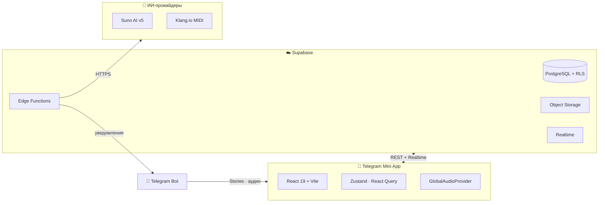
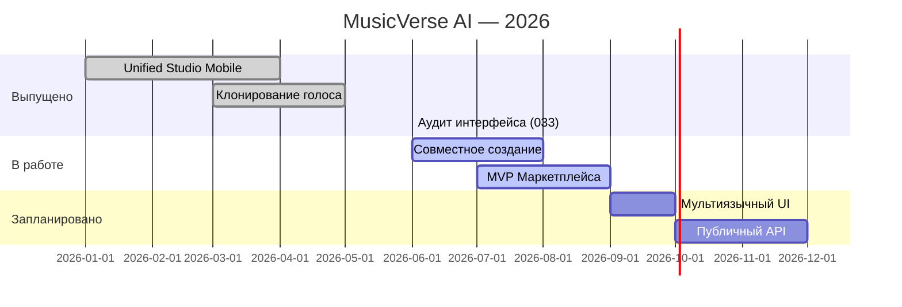

<div align="center">


# 🎵 MusicVerse AI

**Профессиональная платформа для создания музыки с ИИ — в формате Telegram Mini App.**

Генерируйте, редактируйте, сводите и публикуйте музыку, не выходя из Telegram.

<p>
  <a href="https://github.com/HOW2AI-AGENCY/aimusicverse/actions"></a>
  <a href="https://github.com/HOW2AI-AGENCY/aimusicverse/releases"></a>
  <a href="LICENSE"></a>
  <a href="https://codecov.io/gh/HOW2AI-AGENCY/aimusicverse"></a>
  
  <a href="https://t.me/AIMusicVerseBot"></a>
</p>

<!-- BADGES:START -->
      
<!-- BADGES:END -->

<p>
  <a href="#-быстрый-старт"></a>
  <a href="#-возможности"></a>
  <a href="#-архитектура"></a>
  <a href="DOCUMENTATION_INDEX.md"></a>
  <a href="CONTRIBUTING.md"></a>
  <a href="ROADMAP.md"></a>
</p>

[🌐 Демо](https://aimusicverse.lovable.app) · [💬 Telegram бот](https://t.me/AIMusicVerseBot)

</div>

---

> [!NOTE]
> **MusicVerse AI** объединяет **Suno AI v5** с полноценной мобильной DAW-студией, ИИ-текстами, разделением стемов, MIDI-транскрипцией, геймификацией и нативным Telegram UX (вибрация, MainButton, публикация в Stories) — всё внутри Telegram.

## Содержание

- [Почему MusicVerse](#-почему-musicverse)
- [Возможности](#-возможности)
- [Демо](#-демо)
- [Быстрый старт](#-быстрый-старт)
- [Архитектура](#-архитектура)
- [Стек технологий](#-стек-технологий)
- [Структура проекта](#-структура-проекта)
- [Тестирование и качество](#-тестирование-и-качество)
- [Документация](#-документация)
- [Дорожная карта](#-дорожная-карта)
- [Контрибуция](#-контрибуция)
- [Лицензия](#-лицензия)

---

## 💡 Почему MusicVerse

Большинство ИИ-инструментов для музыки — отдельные веб-приложения, требующие переключения контекста. MusicVerse переносит **весь процесс создания музыки** прямо в Telegram:

- **Без барьеров** — никаких регистраций и установок. Откройте бота, нажмите «Создать» и вперёд.
- **Полноценная студия на мобильном** — 16-канальный микшер, разделение стемов, MIDI-экспорт, редактор волновой формы. Не игрушка.
- **Социальность по умолчанию** — делитесь в Stories, работайте совместно в реальном времени, набирайте аудиторию — всё в мессенджере, где ваши слушатели уже есть.
- **A/B тестирование** — каждая генерация создаёт две версии. Сравнивайте, продлевайте, ремиксуйте, итерируйте.

---

## ✨ Возможности

| Категория                  | Функционал                                                                          | Статус |
| -------------------------- | ----------------------------------------------------------------------------------- | :----: |
| 🤖 **Генерация**           | Suno v5 — 277+ стилей, свои тексты, инструменталы, A/B версии, продление и ремиксы  |   ✅   |
| 🎙️ **Клонирование голоса** | 6-шаговый процесс, персонализированная генерация, кросс-жанровая библиотека         |   ✅   |
| 🎛️ **Студия**              | 16-канальный микшер, таймлайн, перегенерация секций, A/B сравнение, режимы Lite/Pro |   ✅   |
| 🪓 **Стемы**               | 4-стемное разделение (вокал · ударные · бас · другое) с микшером                    |   ✅   |
| 🎼 **MIDI**                | 6 ИИ-моделей транскрипции, многодорожечный экспорт                                  |   ✅   |
| 📝 **ИИ-тексты**           | 10+ инструментов — ритм, рифма, структура, перевод, генерация                       |   ✅   |
| 👥 **Социальное**          | Профили, лайки, комментарии (с таймкодами), подписки, рейтинги, рефералы            |   ✅   |
| 🎮 **Геймификация**        | Ежедневные чек-ины, серии, XP, 20+ достижений, награды Stars                        |   ✅   |
| 💳 **Монетизация**         | Telegram Stars, тарифные подписки, пакеты кредитов, умный троттлинг                 |   ✅   |
| 📱 **Telegram-нативный**   | MainButton, BackButton, вибрация, Stories, дип-линки                                |   ✅   |
| 🧠 **Совместное создание** | Коллаборативные сессии, присутствие, live-волновая форма                            |   🚧   |
| 🌍 **Маркетплейс**         | Продажа битов / лупов / голосов                                                     |   📋   |

---

## 🖼 Демо

<!-- Замените на скриншоты или GIF-запись приложения -->

<div align="center">

> Скриншоты и демо-видео скоро будут. Попробуйте приложение: [@AIMusicVerseBot](https://t.me/AIMusicVerseBot).

</div>

---

## 🏛 Архитектура


```mermaid
flowchart LR
    subgraph Client["📱 Telegram Mini App"]
        UI[React 19 + Vite]
        State[Zustand · React Query]
        Audio[GlobalAudioProvider]
    end
    subgraph Cloud["☁️ Supabase"]
        DB[(PostgreSQL + RLS)]
        Edge[Edge Functions]
        Storage[Object Storage]
        Realtime[Realtime]
    end
    subgraph AI["🤖 ИИ-провайдеры"]
        Suno[Suno AI v5]
        Klang[Klang.io MIDI]
    end
    Client <-->|REST + Realtime| Cloud
    Edge -->|HTTPS| AI
    Edge -->|уведомления| Bot[🤖 Telegram Bot]
    Bot -->|Stories · аудио| Client
```

<details>
<summary><b>Паттерн потока данных</b></summary>

```
API Layer (src/api/) → Service Layer (src/services/) → Hooks (src/hooks/) → Components (src/components/)
```

- **API Layer** — прямые запросы к Supabase, типизированные
- **Service Layer** — бизнес-логика, трансформация данных
- **Hook Layer** — интеграция с React Query, управление состоянием
- **Component Layer** — UI-представление (940+ компонентов)

</details>

Полные диаграммы: [`ARCHITECTURE_HUB.md`](ARCHITECTURE_HUB.md) · [`docs/ARCHITECTURE_DIAGRAMS.md`](docs/ARCHITECTURE_DIAGRAMS.md)

---

## 🚀 Быстрый старт

<details open>
<summary><b>Предварительные требования</b></summary>

- Node.js **>= 20**
- npm **>= 10** (или pnpm / bun)
- Telegram Desktop / мобильный клиент (для тестирования Mini App)

</details>

<details open>
<summary><b>Установка и запуск</b></summary>

```bash
git clone https://github.com/HOW2AI-AGENCY/aimusicverse.git
cd aimusicverse
npm install
npm run dev          # → http://localhost:8080
```

</details>

<details>
<summary><b>Все команды</b></summary>

| Команда                   | Назначение                                  |
| ------------------------- | ------------------------------------------- |
| `npm run dev`             | Dev-сервер Vite (порт 8080)                 |
| `npm run build`           | Продакшн-сборка                             |
| `npm run preview`         | Предпросмотр продакшн-сборки                |
| `npm test`                | Unit-тесты Vitest                           |
| `npm run test:coverage`   | Отчёт о покрытии                            |
| `npm run test:e2e`        | E2E-тесты Playwright                        |
| `npm run test:e2e:mobile` | E2E мобильная эмуляция (Pixel 5, iPhone 12) |
| `npm run lint`            | ESLint                                      |
| `npm run format`          | Prettier                                    |
| `npm run size`            | Контроль размера бандла (макс. 950 КБ)      |
| `npm run storybook`       | Storybook на :6006                          |

</details>

<details>
<summary><b>Переменные окружения</b></summary>

См. [`docs/ENVIRONMENT_VARIABLES.md`](docs/ENVIRONMENT_VARIABLES.md). Данные Supabase (`VITE_SUPABASE_URL`, `VITE_SUPABASE_PUBLISHABLE_KEY`, `VITE_SUPABASE_PROJECT_ID`) автоматически подставляются в Lovable Cloud. Никогда не коммитьте `.env` файлы.

</details>

---

## 🧱 Стек технологий

<table>
<tr>
<td valign="top" width="50%">

**Фронтенд**

- React 19.2 · TypeScript 5.9 · Vite 5
- Tailwind 3.4 · shadcn/ui · Radix UI
- Zustand 5 · TanStack Query 5.90
- Framer Motion (tree-shaking через `@/lib/motion`)
- React Hook Form + Zod
- react-virtuoso · vaul

</td>
<td valign="top" width="50%">

**Бэкенд и ИИ**

- Supabase — Postgres · Edge Functions · Storage · Realtime
- Suno AI v5 · Klang.io MIDI
- 80+ Deno Edge Functions
- Telegram Bot API · @twa-dev/sdk 8.0

</td>
</tr>
<tr>
<td valign="top">

**Аудио**

- Tone.js 14.9 · Wavesurfer.js 7.8
- Единый элемент `<audio>` через `GlobalAudioProvider`
- Безопасный для iOS пул аудио-элементов
- Кэш волновых форм в IndexedDB

</td>
<td valign="top">

**Качество**

- Vitest 4 · Playwright 1.57
- ESLint · Prettier · Husky · commitlint
- size-limit (бюджет 950 КБ)
- axe-core a11y · Storybook

</td>
</tr>
</table>

---

## 📂 Структура проекта

```text
aimusicverse/
├── src/
│   ├── components/       # 940+ React-компонентов (плеер, студия, генерация, тексты, ...)
│   ├── hooks/            # 200+ пользовательских хуков (аудио, генерация, студия, telegram)
│   ├── stores/           # 8 Zustand-хранилищ (плеер, студия, тексты, микшер)
│   ├── services/         # 13 сервисных модулей (бизнес-логика)
│   ├── api/              # 13 API-модулей (запросы к Supabase)
│   ├── pages/            # 40+ страниц с ленивой загрузкой
│   ├── contexts/         # React Context провайдеры (Auth, Theme, Telegram)
│   └── lib/              # Утилиты (логгер, ошибки, аудио, анимации)
├── supabase/             # 80+ Edge Functions, миграции, конфиг
├── docs/                 # Архитектура, API, гайды, дизайн-система
├── tests/                # Unit (Vitest) + E2E (Playwright)
├── ADR/                  # Записи архитектурных решений
├── SPRINTS/              # Планирование и отслеживание спринтов
└── specs/                # Технические спецификации
```

Подробная структура: [`REPOSITORY_STRUCTURE.md`](REPOSITORY_STRUCTURE.md)

---

## 🧪 Тестирование и качество

```bash
npm test                  # Unit-тесты (Vitest)
npm run test:coverage     # Отчёт о покрытии
npm run test:e2e          # E2E — десктоп + мобильный (Playwright)
npm run test:e2e:mobile   # Только мобильные — Pixel 5 + iPhone 12
npm run size              # Контроль бюджета бандла (макс. 950 КБ)
```

> [!IMPORTANT]
> CI разделяет задачи на `e2e` + `e2e-mobile` с повторами. Z-index, IME и dev-overlay тесты обязательны. См. [`.github/workflows/ci.yml`](.github/workflows/ci.yml).

---

## 🛟 Устранение неполадок: белый экран / приложение не загружается

Используйте эти скрипты, когда приложение не загружается, вы видите белый экран или `Загрузка занимает больше времени...` зависает в браузере.

```bash
npm run check:css-imports   # Проверка порядка @import в src/index.css
npm run clean:cache         # Очистка node_modules/.vite, dist, .turbo, coverage
npm run reset               # clean:cache + npm install + полная пересборка
```

| Симптом                                             | Первая команда                             | Причина                                                                                                                                            |
| --------------------------------------------------- | ------------------------------------------ | -------------------------------------------------------------------------------------------------------------------------------------------------- |
| Белый экран после правки CSS                        | `npm run check:css-imports`                | Неправильный `@import` в `src/index.css` тихо отбрасывается Vite и ломает все стили. Скрипт указывает на строку и показывает правильную структуру. |
| Dev-сервер завис / устаревшие модули / странный HMR | `npm run clean:cache`, затем `npm run dev` | Очищает `node_modules/.vite` и другие кэши, которые переживают изменения кода.                                                                     |
| «Работает в проде, сломано локально» или наоборот   | `npm run reset`                            | Полная чистая установка + продакшн-сборка с нуля.                                                                                                  |
| CI-сборка падает с CSS-ошибками                     | Читайте артефакт `vite-build-log` в PR     | Полный stdout/stderr `vite build` загружается в каждом PR.                                                                                         |

`check:css-imports` запускается автоматически:

- на каждом коммите через Husky `pre-commit` (коммит блокируется при нарушении),
- перед каждым `npm run build` (хук `prebuild`),
- в CI перед `vite build`.

### Smoke-тесты (локально, аналогично CI)

```bash
npm run test:smoke              # последовательно: chromium + firefox + webkit
npm run test:smoke:matrix       # параллельная матрица (3 воркера, 1 на браузер)
npm run test:smoke:chromium     # один движок, самый быстрый
npm run test:smoke:report       # открыть последний HTML-отчёт
bash scripts/e2e.sh --parallel  # эквивалентный хелпер с stdout-логами по браузерам
BROWSERS="chromium webkit" bash scripts/e2e.sh
```

Smoke-спецификация запускает реальный React Router, проверяет гостевой UI (`<main>` + nav landmark из `MainLayout`), открывает `/auth` (авторизация) и переходит на `/studio-v2` для проверки клиентского роутинга.

При **ошибке** создаётся папка для каждого браузера со всем необходимым для отладки:

`test-results/smoke/<browser>/`

- `boot-log.json` — `musicverse_boot_log` из `sessionStorage`
- `early-errors.json` — `window.__EARLY_ERRORS`, захваченные `index.html`
- `console-errors.log` / `page-errors.log` — стек-трейсы
- `failed-requests.log` — 4xx/5xx + события `requestfailed`
- `dom-map.json` — подсчёты для `main`, `nav`, `[data-testid]` и т.д.
- `failure-<ts>.png` — полноэкранный скриншот
- Playwright `trace.zip` + `video.webm` (`retain-on-failure`)

В каждый PR автоматически публикуется комментарий CI с ссылками на артефакты `smoke-<browser>`.

### Автоматический перезапуск только упавшего браузера

Если параллельная матрица упала, повторите **только** сломанный проект с `trace=on` + `video=on`:

```bash
npm run e2e:smoke:rerun                    # параллельно, автоперезапуск упавшего браузера
bash scripts/e2e.sh --rerun-failed         # то же самое
bash scripts/e2e.sh --rerun-failed chromium firefox   # ограничить матрицу
```

Артефакты перезапуска попадают в `test-results/smoke/pw-output-<browser>-rerun/`, не перезаписывая оригинальные логи.

### Дизайн-токены секций (защита от яркости)

Общий layout с `bg-primary` / `bg-accent` / `bg-gradient-primary` делает всё приложение неоново-ярким. Два защитных механизма:

| Команда                                 | Когда запускать                                                                                        |
| --------------------------------------- | ------------------------------------------------------------------------------------------------------ |
| `npm run check:section-tokens`          | Перед коммитом изменений в `src/components/layout/Section.tsx` (также в `prebuild` + pre-commit + CI). |
| `npm run check:section-tokens -- --fix` | **Кодмод** — автозамена запрещённых токенов (`bg-primary` → `bg-card/60` и т.д.).                      |
| `npm run check:design-tokens`           | Агрегат: порядок CSS `@import` + токены секций.                                                        |

Нужно исключение? Добавьте `// section-tokens-allow-next-line` над строкой.

ESLint дублирует это правило как локальный плагин **`section-tokens/no-saturated-brand`** с автофиксом. Unit-тесты: `tests/unit/check-section-tokens.test.ts` и `tests/unit/eslint-section-tokens.test.ts`.

### Визуальная регрессия (секции + карточки)

Ловит «слишком яркие» регрессии и дрифт градиентов без ручного просмотра скриншотов. Два слоя: пиксельный снапшот и проверка средней яркости (`< 0.32` в тёмной теме).

```bash
npm run test:visual              # запуск на текущем коде
npm run test:visual:update       # обновить базовые снапшоты после НАМЕРЕННОГО изменения цвета
```

Запускайте `test:visual` при изменениях в:

- `src/index.css` (цветовые токены)
- `tailwind.config.ts`
- `src/components/layout/Section.tsx` или любых общих компонентах карточек/секций

При ошибке `avg luminance … > 0.32` — поверхность слишком яркая, исправьте токен. При пиксельном расхождении из-за намеренного изменения — запустите `test:visual:update` и закоммитьте снапшоты.

### Что запускать (CI упал?)

| Симптом                                                | Первая команда                                                                 |
| ------------------------------------------------------ | ------------------------------------------------------------------------------ |
| Белый экран / приложение не загружается                | `npm run check:css-imports`, затем `npm run test:smoke:chromium`               |
| Smoke зелёный локально, красный в CI на одном браузере | `npm run e2e:smoke:rerun` (соответствует матрице CI)                           |
| Секции слишком яркие / насыщенные                      | `npm run check:section-tokens` (затем `-- --fix`), затем `npm run test:visual` |
| Бандлер / кэш ведёт себя странно                       | `npm run clean:cache` или `npm run reset`                                      |

---

## 📚 Документация

| Раздел                       | Файл                                                 |
| ---------------------------- | ---------------------------------------------------- |
| 📖 **Полный указатель**      | [`DOCUMENTATION_INDEX.md`](DOCUMENTATION_INDEX.md)   |
| 🏛 **Архитектурный хаб**     | [`ARCHITECTURE_HUB.md`](ARCHITECTURE_HUB.md)         |
| 🧩 **База знаний**           | [`KNOWLEDGE_BASE.md`](KNOWLEDGE_BASE.md)             |
| 🗂 **Структура репозитория** | [`REPOSITORY_STRUCTURE.md`](REPOSITORY_STRUCTURE.md) |
| 🗺 **Дорожная карта**        | [`ROADMAP.md`](ROADMAP.md)                           |
| 📊 **Статус проекта**        | [`PROJECT_STATUS.md`](PROJECT_STATUS.md)             |
| 🪲 **Известные проблемы**    | [`KNOWN_ISSUES_TRACKED.md`](KNOWN_ISSUES_TRACKED.md) |
| 🤝 **Контрибуция**           | [`CONTRIBUTING.md`](CONTRIBUTING.md)                 |
| 🔒 **Безопасность**          | [`SECURITY.md`](SECURITY.md)                         |
| 📝 **Журнал изменений**      | [`CHANGELOG.md`](CHANGELOG.md)                       |

> [!TIP]
> **Новичок?** Начните с [`KNOWLEDGE_BASE.md`](KNOWLEDGE_BASE.md), затем [`ARCHITECTURE_HUB.md`](ARCHITECTURE_HUB.md), затем [`CONTRIBUTING.md`](CONTRIBUTING.md).
> **Разрабатываете фичу?** Откройте [`DOCUMENTATION_INDEX.md`](DOCUMENTATION_INDEX.md) и выберите путь онбординга по роли (Фронтенд, Бэкенд, Дизайн, PM, DevOps).

---

## 🗺 Дорожная карта


```mermaid
gantt
    title MusicVerse AI — 2026
    dateFormat YYYY-MM
    section Выпущено
    Unified Studio Mobile     :done, 2026-01, 2026-04
    Клонирование голоса       :done, 2026-03, 2026-05
    Аудит интерфейса (033)    :done, 2026-06, 2026-06
    section В работе
    Совместное создание       :active, 2026-06, 2026-08
    MVP Маркетплейса          :active, 2026-07, 2026-09
    section Запланировано
    Мультиязычный UI          : 2026-09, 2026-10
    Публичный API             : 2026-10, 2026-12
```

Полная доска: [`ROADMAP.md`](ROADMAP.md)

---

## 🤝 Контрибуция

Пулл-реквесты, баг-репорты и идеи по дизайну приветствуются.

1. Прочтите [`CONTRIBUTING.md`](CONTRIBUTING.md) — стиль коммитов, политика веток, процесс ревью.
2. Ознакомьтесь с [`CODE_OF_CONDUCT.md`](CODE_OF_CONDUCT.md).
3. Создайте [issue](https://github.com/HOW2AI-AGENCY/aimusicverse/issues) или начните [обсуждение](https://github.com/HOW2AI-AGENCY/aimusicverse/discussions).

<a href="https://github.com/HOW2AI-AGENCY/aimusicverse/graphs/contributors">
  
</a>

---

## 📄 Лицензия

Проект лицензирован под [MIT License](LICENSE).

Раскрытие уязвимостей: [`SECURITY.md`](SECURITY.md)

---

<div align="center">

|            📚 Указатель             |       🏛 Архитектура       |      🗺 Дорожная карта       |         🤝 Контрибуция         |       🔒 Безопасность       |  📝 Журнал изменений   |
| :---------------------------------: | :------------------------: | :--------------------------: | :----------------------------: | :-------------------------: | :--------------------: |
| [Указатель](DOCUMENTATION_INDEX.md) | [Хаб](ARCHITECTURE_HUB.md) | [Дорожная карта](ROADMAP.md) | [Контрибуция](CONTRIBUTING.md) | [Безопасность](SECURITY.md) | [Журнал](CHANGELOG.md) |

**Сделано с ❤️ командой MusicVerse AI**


[](https://github.com/IVAN-MEER) [](https://how2ai.agency)

[](https://github.com/IVAN-MEER?tab=followers) [](https://github.com/IVAN-MEER?tab=repositories) [](https://github.com/IVAN-MEER?tab=repositories) 

</div>

     

---


<sub>[Сообщить о проблеме](https://github.com/HOW2AI-AGENCY/aimusicverse/issues/new) · [Обсудить](https://github.com/HOW2AI-AGENCY/aimusicverse/discussions)</sub>

[](https://star-history.com/#HOW2AI-AGENCY/aimusicverse&Date)

</div>
