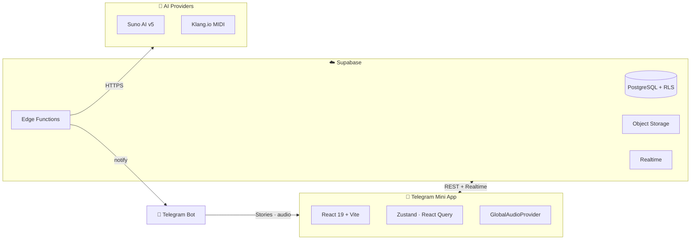
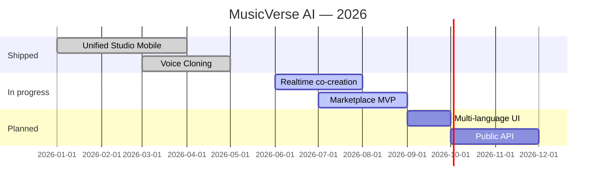

<div align="center">


# 🎵 MusicVerse AI

**Professional AI-powered music creation — delivered as a Telegram Mini App.**

Generate, edit, mix, and publish music end-to-end without leaving Telegram.

<p>
  <a href="https://github.com/HOW2AI-AGENCY/aimusicverse/actions"></a>
  <a href="https://github.com/HOW2AI-AGENCY/aimusicverse/releases"></a>
  <a href="LICENSE"></a>
  <a href="https://codecov.io/gh/HOW2AI-AGENCY/aimusicverse"></a>
  
  <a href="https://t.me/AIMusicVerseBot"></a>
</p>

<!-- BADGES:START -->
<p>
  
  
  
  
  
  
</p>
<!-- BADGES:END -->

<p>
  <a href="#-quick-start"></a>
  <a href="#-features"></a>
  <a href="#-architecture"></a>
  <a href="DOCUMENTATION_INDEX.md"></a>
  <a href="CONTRIBUTING.md"></a>
  <a href="ROADMAP.md"></a>
</p>

[🇷🇺 Русская версия](README_RU.md) · [🌐 Live preview](https://aimusicverse.lovable.app) · [💬 Telegram bot](https://t.me/AIMusicVerseBot)

</div>

---

> [!NOTE]
> **MusicVerse AI** pairs **Suno AI v5** with a full DAW-style mobile studio, AI-assisted lyrics, stem separation, MIDI transcription, gamification, and Telegram-native UX (haptics, MainButton, Stories sharing) — all inside Telegram.

## Table of Contents

- [Why MusicVerse](#-why-musicverse)
- [Features](#-features)
- [Demo](#-demo)
- [Quick Start](#-quick-start)
- [Architecture](#-architecture)
- [Tech Stack](#-tech-stack)
- [Project Structure](#-project-structure)
- [Testing & Quality](#-testing--quality)
- [Documentation](#-documentation)
- [Roadmap](#-roadmap-snapshot)
- [Contributing](#-contributing)
- [License](#-license)

---

## 💡 Why MusicVerse

Most AI music tools are standalone web apps that require context-switching. MusicVerse brings **the entire music creation workflow** directly into Telegram:

- **Zero friction** — no sign-up forms, no app installs. Open the bot, tap "Create," and go.
- **Full studio on mobile** — 16-channel mixer, stem separation, MIDI export, waveform editing. Not a toy.
- **Social by default** — share to Stories, collaborate in real-time, build a following — all inside the messenger your audience already uses.
- **A/B everything** — every generation produces two versions. Compare, extend, remix, iterate.

---

## ✨ Features

| Category | Capability | Status |
| --- | --- | :---: |
| 🤖 **Generation** | Suno v5 — 277+ styles, custom lyrics, instrumentals, A/B versions, extend & remix | ✅ |
| 🎙️ **Voice Cloning** | 6-step voice clone, personalised generation, cross-genre library | ✅ |
| 🎛️ **Studio** | 16-channel mixer, timeline, section regeneration, A/B comparison | ✅ |
| 🪓 **Stems** | 4-stem separation (vocals · drums · bass · other) with mixer | ✅ |
| 🎼 **MIDI** | 6 AI transcription models, multi-track export | ✅ |
| 📝 **Lyrics AI** | 10+ tools — rhythm, rhyme, structure, translate, generate | ✅ |
| 👥 **Social** | Profiles, likes, comments, follows, leaderboards, referrals | ✅ |
| 🎮 **Gamification** | Daily check-ins, streaks, XP, 20+ achievements, Stars rewards | ✅ |
| 💳 **Monetisation** | Telegram Stars, tiered subscriptions, credit packs | ✅ |
| 📱 **Telegram-native** | MainButton, BackButton, haptics, Stories share, deep-links | ✅ |
| 🧠 **Realtime co-creation** | Collaborative session, presence, live waveform | 🚧 |
| 🌍 **Marketplace** | Sell beats / loops / voices | 📋 |

---

## 🖼 Demo

<!-- Replace with actual screenshots or a GIF recording of the app -->

<div align="center">

> Screenshots and demo video coming soon. Try the live app at [@AIMusicVerseBot](https://t.me/AIMusicVerseBot).

</div>

---

## 🏛 Architecture


```mermaid
flowchart LR
    subgraph Client["📱 Telegram Mini App"]
        UI[React 19 + Vite]
        State[Zustand · React Query]
        Audio[GlobalAudioProvider]
    end
    subgraph Cloud["☁️ Supabase"]
        DB[(PostgreSQL + RLS)]
        Edge[Edge Functions]
        Storage[Object Storage]
        Realtime[Realtime]
    end
    subgraph AI["🤖 AI Providers"]
        Suno[Suno AI v5]
        Klang[Klang.io MIDI]
    end
    Client <-->|REST + Realtime| Cloud
    Edge -->|HTTPS| AI
    Edge -->|notify| Bot[🤖 Telegram Bot]
    Bot -->|Stories · audio| Client
```

<details>
<summary><b>Data flow pattern</b></summary>

```
API Layer (src/api/) → Service Layer (src/services/) → Hooks (src/hooks/) → Components (src/components/)
```

- **API Layer** — Direct Supabase queries, type-safe
- **Service Layer** — Business logic, data transformation
- **Hook Layer** — React Query integration, state management
- **Component Layer** — UI presentation (935+ components)

</details>

Full diagrams: [`ARCHITECTURE_HUB.md`](ARCHITECTURE_HUB.md) · [`docs/ARCHITECTURE_DIAGRAMS.md`](docs/ARCHITECTURE_DIAGRAMS.md)

---

## 🚀 Quick Start

<details open>
<summary><b>Prerequisites</b></summary>

- Node.js **>= 20**
- npm **>= 10** (or pnpm / bun)
- Telegram desktop / mobile client (for Mini App testing)

</details>

<details open>
<summary><b>Install &amp; run</b></summary>

```bash
git clone https://github.com/HOW2AI-AGENCY/aimusicverse.git
cd aimusicverse
npm install
npm run dev          # → http://localhost:8080
```

</details>

<details>
<summary><b>All scripts</b></summary>

| Command | Purpose |
| --- | --- |
| `npm run dev` | Vite dev server (port 8080) |
| `npm run build` | Production build |
| `npm run preview` | Preview production build |
| `npm test` | Vitest unit tests |
| `npm run test:coverage` | Coverage report |
| `npm run test:e2e` | Playwright E2E |
| `npm run test:e2e:mobile` | Mobile emulation E2E (Pixel 5, iPhone 12) |
| `npm run lint` | ESLint |
| `npm run format` | Prettier |
| `npm run size` | Bundle-size guard (max 950 KB) |
| `npm run storybook` | Storybook on :6006 |

</details>

<details>
<summary><b>Environment variables</b></summary>

See [`docs/ENVIRONMENT_VARIABLES.md`](docs/ENVIRONMENT_VARIABLES.md). Supabase credentials (`VITE_SUPABASE_URL`, `VITE_SUPABASE_PUBLISHABLE_KEY`, `VITE_SUPABASE_PROJECT_ID`) are auto-injected in Lovable Cloud. Never commit `.env` files.

</details>

---

## 🧱 Tech Stack

<table>
<tr>
<td valign="top" width="50%">

**Frontend**
- React 19.2 · TypeScript 5.9 · Vite 5
- Tailwind 3.4 · shadcn/ui · Radix UI
- Zustand 5 · TanStack Query 5.90
- Framer Motion (tree-shaken via `@/lib/motion`)
- React Hook Form + Zod
- react-virtuoso · vaul

</td>
<td valign="top" width="50%">

**Backend & AI**
- Supabase — Postgres · Edge Functions · Storage · Realtime
- Suno AI v5 · Klang.io MIDI
- 80+ Deno Edge Functions
- Telegram Bot API · @twa-dev/sdk 8.0

</td>
</tr>
<tr>
<td valign="top">

**Audio**
- Tone.js 14.9 · Wavesurfer.js 7.8
- Single `<audio>` element via `GlobalAudioProvider`
- iOS-safe audio element pool
- IndexedDB waveform cache

</td>
<td valign="top">

**Quality**
- Vitest 4 · Playwright 1.57
- ESLint · Prettier · Husky · commitlint
- size-limit (950 KB budget)
- axe-core a11y · Storybook

</td>
</tr>
</table>

---

## 📂 Project Structure

```text
aimusicverse/
├── src/
│   ├── components/       # 935+ React components (player, studio, generate, lyrics, ...)
│   ├── hooks/            # 200+ custom hooks (audio, generation, studio, telegram)
│   ├── stores/           # 8 Zustand stores (player, studio, lyrics, mixer)
│   ├── services/         # 13 service modules (business logic)
│   ├── api/              # 13 API modules (Supabase queries)
│   ├── pages/            # 40+ lazy-loaded route pages
│   ├── contexts/         # React Context providers (Auth, Theme, Telegram)
│   └── lib/              # Utilities (logger, errors, audio, motion)
├── supabase/             # 80+ Edge Functions, migrations, config
├── docs/                 # Architecture, API, guides, design system
├── tests/                # Unit (Vitest) + E2E (Playwright)
├── ADR/                  # Architecture decision records
├── SPRINTS/              # Sprint planning & tracking
└── specs/                # Technical specifications
```

Detailed tree: [`REPOSITORY_STRUCTURE.md`](REPOSITORY_STRUCTURE.md)

---

## 🧪 Testing & Quality

```bash
npm test                  # Unit tests (Vitest)
npm run test:coverage     # Coverage report
npm run test:e2e          # E2E — desktop + mobile (Playwright)
npm run test:e2e:mobile   # Mobile only — Pixel 5 + iPhone 12
npm run size              # Bundle budget guard (max 950 KB)
```

> [!IMPORTANT]
> CI runs split jobs for desktop E2E and mobile E2E (Chrome + Safari). Z-index, IME, and dev-overlay specs are mandatory gates. See [`.github/workflows/ci.yml`](.github/workflows/ci.yml).

---

## 🛟 Troubleshooting: white screen / app won't load

Use these scripts when the app refuses to boot, you see a blank screen,
or `Загрузка занимает больше времени...` hangs in the browser.

```bash
npm run check:css-imports   # Validate @import order in src/index.css
npm run clean:cache         # Wipe node_modules/.vite, dist, .turbo, coverage
npm run reset               # clean:cache + npm install + full rebuild
```

| Symptom | Run first | Why |
| --- | --- | --- |
| White screen after a CSS edit | `npm run check:css-imports` | Misplaced `@import` in `src/index.css` is silently dropped by Vite and breaks all styles. The script points at the exact line and shows the correct structure. |
| Dev server stuck / stale modules / weird HMR | `npm run clean:cache` then `npm run dev` | Clears `node_modules/.vite` + other caches that survive code changes. |
| "Works in prod, broken locally" or vice versa | `npm run reset` | Full clean install + production build from scratch. |
| CI build fails with CSS errors | Read the `vite-build-log` artifact in the PR | Full `vite build` stdout/stderr is uploaded on every PR; the `smoke-boot-log` artifact also contains `musicverse_boot_log` and any captured stack traces. |

`check:css-imports` runs automatically:

- on every commit via Husky `pre-commit` (commit is blocked on violation),
- before every `npm run build` (`prebuild` hook),
- in CI before `vite build`.

### Smoke tests (local, same as CI)

```bash
npm run test:smoke              # serial: chromium + firefox + webkit
npm run test:smoke:matrix       # parallel matrix (3 workers, 1 per browser)
npm run test:smoke:chromium     # one engine, fastest
npm run test:smoke:report       # open the latest HTML report
bash scripts/e2e.sh --parallel  # equivalent helper with per-browser stdout logs
BROWSERS="chromium webkit" bash scripts/e2e.sh
```

The smoke spec boots the real React Router, validates the guest UI
(`<main>` + nav landmark from `MainLayout`), opens `/auth` (auth surface),
and visits `/studio-v2` to prove client-side routing.

On **failure** it dumps a per-browser folder with everything needed to
debug without re-running locally:

`test-results/smoke/<browser>/`
- `boot-log.json` — `musicverse_boot_log` from `sessionStorage`
- `early-errors.json` — `window.__EARLY_ERRORS` captured by `index.html`
- `console-errors.log` / `page-errors.log` — stack traces
- `failed-requests.log` — 4xx/5xx + `requestfailed` events
- `dom-map.json` — counts + samples for `main`, `nav`, `[data-testid]`, etc.
- `failure-<ts>.png` — full-page screenshot
- Playwright `trace.zip` + `video.webm` (`retain-on-failure`)

Every PR also gets an auto-posted CI summary comment with one-click links to the `smoke-<browser>` artifacts.

### Auto-rerun only the failed browser

If the parallel matrix fails, replay **only** the broken project locally with forced `trace=on` + `video=on` — no need to re-run the whole matrix:

```bash
npm run e2e:smoke:rerun                    # parallel, auto-reruns the failed browser
bash scripts/e2e.sh --rerun-failed         # same thing
bash scripts/e2e.sh --rerun-failed chromium firefox   # restrict the matrix
```

Rerun artifacts land in `test-results/smoke/pw-output-<browser>-rerun/` so they don't overwrite the original logs.

### Section design tokens (anti-brightness guard)

A shared layout shell that paints itself with `bg-primary` / `bg-accent` / `bg-gradient-primary` makes the whole app neon-bright. Two guards stop that from coming back:

| Command | When to run |
| --- | --- |
| `npm run check:section-tokens` | Before committing changes to `src/components/layout/Section.tsx` (also runs in `prebuild` + pre-commit + CI). |
| `npm run check:section-tokens -- --fix` | **Codemod** — auto-replaces forbidden tokens (`bg-primary` → `bg-card/60`, `bg-gradient-primary` → `bg-gradient-to-br from-card/60 via-background to-muted/40`, etc.). |
| `npm run check:design-tokens` | Aggregate: CSS `@import` order + Section tokens. |

Need a one-off exception? Add `// section-tokens-allow-next-line` directly above the line (justify it in the PR — these should be rare). The same opt-out works inline: `bg-primary // section-tokens-allow`.

The ESLint config mirrors this rule as a local plugin **`section-tokens/no-saturated-brand`** (rule id) wired for the same files (`Section.tsx`, `PageContainer.tsx`, `SafeLayout.tsx`). It is **auto-fixable**: `npm run lint:fix` (or "Fix on save" in your editor) rewrites forbidden tokens through the exact same codemod as `check:section-tokens -- --fix` — single source of truth lives in `scripts/check-section-tokens.mjs` (`FORBIDDEN` table + `rewriteText`). Unit tests: `tests/unit/check-section-tokens.test.ts` and `tests/unit/eslint-section-tokens.test.ts`.

### Visual regression (Section + cards)

Catches "too bright" regressions and gradient drift without a human eyeballing screenshots. Two layers: pixel snapshot per Section **and** an average-luminance assertion (`< 0.32` on the dark theme).

```bash
npm run test:visual              # run against current code
npm run test:visual:update       # refresh baselines after an INTENTIONAL color change
```

Run `test:visual` whenever you touch:
- `src/index.css` (color tokens)
- `tailwind.config.ts`
- `src/components/layout/Section.tsx` or any shared card/section component

If it fails with `avg luminance … > 0.32`, the surface is too bright — fix the token, don't bump the threshold. If it fails on pixel diff but the change is intentional, run `test:visual:update` and commit the snapshots under `tests/e2e/visual.section.spec.ts-snapshots/`.

### When to run what (CI failed?)

| Symptom | First command |
| --- | --- |
| White screen / app won't load | `npm run check:css-imports` then `npm run test:smoke:chromium` |
| Smoke green locally, red in CI on one browser only | `npm run e2e:smoke:rerun` (matches CI matrix, retains video/trace) |
| Sections look too bright / saturated | `npm run check:section-tokens` (then `-- --fix`), then `npm run test:visual` |
| Bundler / cache acting weird | `npm run clean:cache` or `npm run reset` |

---


## 📚 Documentation

| Section | Entry point |
| --- | --- |
| 📖 **Full index** | [`DOCUMENTATION_INDEX.md`](DOCUMENTATION_INDEX.md) |
| 🏛 **Architecture hub** | [`ARCHITECTURE_HUB.md`](ARCHITECTURE_HUB.md) |
| 🧩 **Knowledge base** | [`KNOWLEDGE_BASE.md`](KNOWLEDGE_BASE.md) |
| 🗂 **Repo structure** | [`REPOSITORY_STRUCTURE.md`](REPOSITORY_STRUCTURE.md) |
| 🗺 **Roadmap** | [`ROADMAP.md`](ROADMAP.md) |
| 📊 **Project status** | [`PROJECT_STATUS.md`](PROJECT_STATUS.md) |
| 🪲 **Known issues** | [`KNOWN_ISSUES_TRACKED.md`](KNOWN_ISSUES_TRACKED.md) |
| 🤝 **Contributing** | [`CONTRIBUTING.md`](CONTRIBUTING.md) |
| 🔒 **Security** | [`SECURITY.md`](SECURITY.md) |
| 📝 **Changelog** | [`CHANGELOG.md`](CHANGELOG.md) |

> [!TIP]
> **New here?** Start with [`KNOWLEDGE_BASE.md`](KNOWLEDGE_BASE.md) then [`ARCHITECTURE_HUB.md`](ARCHITECTURE_HUB.md) then [`CONTRIBUTING.md`](CONTRIBUTING.md).
> **Building a feature?** Open [`DOCUMENTATION_INDEX.md`](DOCUMENTATION_INDEX.md) and pick your role-based onboarding path (Frontend, Backend, Design, PM, DevOps).

---

## 🗺 Roadmap snapshot


```mermaid
gantt
    title MusicVerse AI — 2026
    dateFormat YYYY-MM
    section Shipped
    Unified Studio Mobile     :done, 2026-01, 2026-04
    Voice Cloning             :done, 2026-03, 2026-05
    section In progress
    Realtime co-creation      :active, 2026-06, 2026-08
    Marketplace MVP           :active, 2026-07, 2026-09
    section Planned
    Multi-language UI         : 2026-09, 2026-10
    Public API                : 2026-10, 2026-12
```

Full board: [`ROADMAP.md`](ROADMAP.md)

---

## 🤝 Contributing

Pull requests, bug reports, and design ideas are welcome.

1. Read [`CONTRIBUTING.md`](CONTRIBUTING.md) for commit style, branch policy, and review process.
2. Review [`CODE_OF_CONDUCT.md`](CODE_OF_CONDUCT.md).
3. Open an [issue](https://github.com/HOW2AI-AGENCY/aimusicverse/issues) or start a [discussion](https://github.com/HOW2AI-AGENCY/aimusicverse/discussions).

<a href="https://github.com/HOW2AI-AGENCY/aimusicverse/graphs/contributors">
  
</a>

---

## 📄 License

This project is licensed under the [MIT License](LICENSE).

Vulnerability disclosure: [`SECURITY.md`](SECURITY.md)

---

<div align="center">

| 📚 Index | 🏛 Architecture | 🗺 Roadmap | 🤝 Contributing | 🔒 Security | 📝 Changelog |
| :---: | :---: | :---: | :---: | :---: | :---: |
| [Index](DOCUMENTATION_INDEX.md) | [Hub](ARCHITECTURE_HUB.md) | [Roadmap](ROADMAP.md) | [Contributing](CONTRIBUTING.md) | [Security](SECURITY.md) | [Changelog](CHANGELOG.md) |

**Made with ❤️ by the MusicVerse AI team**

<sub>[Report issue](https://github.com/HOW2AI-AGENCY/aimusicverse/issues/new) · [Discuss](https://github.com/HOW2AI-AGENCY/aimusicverse/discussions)</sub>

[](https://star-history.com/#HOW2AI-AGENCY/aimusicverse&Date)

</div>
