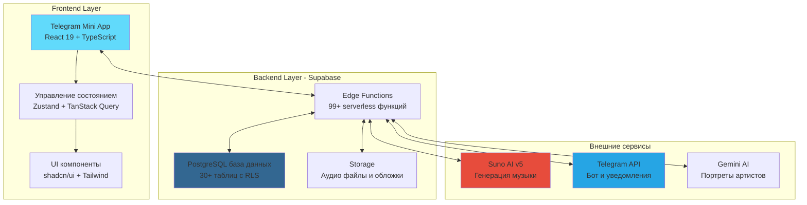

<div align="center">

  <!-- Logo -->
  

  <!-- Main Title -->
  # 🎵 MusicVerse AI

  ### 🚀 Профессиональная AI-платформа для создания музыки в Telegram

  <!-- Tagline with emojis and badges -->
  <p align="center">
    <strong>Создавайте музыку с помощью искусственного интеллекта</strong><br>
    <em>Suno AI v5 • Telegram Mini App • A/B версионирование • Unified Studio • 277+ стилей</em>
  </p>

  <!-- GitHub Badges -->
  <p align="center">
    
    
    
    
    
  </p>

  <!-- Tech Stack Badges -->
  <p align="center">
    
    
    
    
    
    
  </p>

  <!-- Project Stats Badges -->
  <p align="center">
    
    
    
    
    
  </p>

  <!-- Action Buttons -->
  <p align="center">
    <a href="http://t.me/AIMusicVerseBot/app">
      
    </a>
    <a href="https://t.me/AIMusicVerse">
      
    </a>
    <a href="#-быстрая-навигация">
      
    </a>
    <a href="#-участие-в-разработке">
      
    </a>
  </p>

  <!-- GitHub Stars/Forks/Watchers -->
  <p align="center">
    <a href="https://github.com/HOW2AI-AGENCY/aimusicverse/stargazers">
      
    </a>
    <a href="https://github.com/HOW2AI-AGENCY/aimusicverse/network/members">
      
    </a>
    <a href="https://github.com/HOW2AI-AGENCY/aimusicverse/watchers">
      
    </a>
  </p>

</div>

---

## 📑 Содержание

<table>
<tr>
<td width="45%">

**🚀 Начало работы**
- [✨ Возможности](#-возможности)
- [🎯 Быстрая навигация](#-быстрая-навигация)
- [📊 Ключевые метрики](#-ключевые-метрики)
- [🏗️ Архитектура](#-архитектура)

**🛠️ Разработка**
- [📁 Структура проекта](#-структура-проекта)
- [📖 Документация](#-документация)
- [🧪 Тестирование](#-тестирование)
- [📱 Мобильная разработка](#-мобильная-разработка)

</td>
<td width="10%">

</td>
<td width="45%">

**🎨 Дизайн и UX**
- [🎨 Дизайн-система](#-дизайн-система)
- [📱 Mobile-first](#-mobile-first)
- [♿ Доступность](#-доступность)

**🔧 Инфраструктура**
- [🔒 Безопасность](#-безопасность)
- [⚡ Производительность](#-производительность)
- [🛠️ Последние улучшения](#-последние-улучшения)
- [📞 Контакты](#-контакты)

**🤝 Сообщество**
- [❤ Участие в разработке](#-участие-в-разработке)
- [📜 Лицензия](#-лицензия)

</td>
</tr>
</table>

---

## 🎯 Быстрая навигация

> **🎯 Текущий статус:** Production Ready | Здоровье: 98/100 | Прогресс: 100%
>
> ### 📊 Панель проекта
> | Документ | Описание | Статус |
> |----------|-------------|--------|
> | [**PROJECT_STATUS.md**](PROJECT_STATUS.md) | Комплексный статус проекта | ✅ Обновлён |
> | [**ROADMAP.md**](ROADMAP.md) | Дорожная карта развития | ✅ Активен |
> | [**SPRINTS/SPRINT-PROGRESS.md**](SPRINTS/SPRINT-PROGRESS.md) | Прогресс спринтов (35 завершено) | ✅ Завершён |
> | [**docs/PROGRESS.md**](docs/PROGRESS.md) | Трекер прогресса проекта | ✅ **НОВЫЙ** |
>
> ### 📚 Основная документация
> | Документ | Описание | Последнее обновление |
> |----------|-------------|-------------------|
> | [**KNOWLEDGE_BASE.md**](KNOWLEDGE_BASE.md) | База знаний проекта | 2024-06-24 |
> | [**DOCUMENTATION_INDEX.md**](DOCUMENTATION_INDEX.md) | Полная карта документации | ✅ Актуален |
> | [**ADR/**](ADR/) | Архитектурные решения | ✅ Активен |
> | [**specs/**](specs/) | Технические спецификации (6 спецификаций) | ✅ Актуален |
> | [**docs/**](docs/) | 100+ файлов документации | ✅ Комплексный |
>
> ### 🧪 Тестирование и качество
> | Документ | Описание | Статус |
> |----------|-------------|--------|
> | [**docs/TESTING_INFRASTRUCTURE.md**](docs/TESTING_INFRASTRUCTURE.md) | Полная настройка тестирования | ✅ **НОВЫЙ** |
> | [**docs/QUALITY_GATES.md**](docs/QUALITY_GATES.md) | Стандарты качества | ✅ **НОВЫЙ** |
> | [**tests/e2e/**](tests/e2e/) | 62+ E2E тестов | ✅ Комплексное покрытие |
>
> ### 🔧 Ресурсы для разработчиков
> | Ресурс | Описание | Ссылка |
> |----------|-------------|------|
> | **Issues** | Баги и запросы функций | [GitHub Issues](https://github.com/HOW2AI-AGENCY/aimusicverse/issues) |
> | **Pull Requests** | Изменения кода и ревью | [GitHub PRs](https://github.com/HOW2AI-AGENCY/aimusicverse/pulls) |
> | **Actions** | CI/CD workflows | [GitHub Actions](https://github.com/HOW2AI-AGENCY/aimusicverse/actions) |
> | **Projects** | Доски проектов | [GitHub Projects](https://github.com/HOW2AI-AGENCY/aimusicverse/projects) |

---

## ✨ Возможности

### 🎹 Генерация музыки

<details>
<summary><strong>📖 Подробнее о генерации</strong></summary>

- **Suno AI v5** — создание треков по текстовому описанию
- **A/B версии** — каждая генерация создаёт 2 варианта
- **Streaming preview** — предпрослушивание во время генерации
- **Custom режим** — полный контроль над текстами и стилем
- **AI Lyrics Agent** — 10+ инструментов для работы с текстами
- **AI Lyrics Chat** — чат-ассистент для написания текстов
- **Голосовой ввод** — диктовка описания через Whisper API
- **Авто-сохранение** — черновики формы сохраняются 30 минут

</details>

### 📚 Библиотека треков

<details>
<summary><strong>📖 Подробнее о библиотеке</strong></summary>

- **Виртуализация** — плавная работа с 1000+ треков
- **Lazy loading** — LazyImage с blur-эффектом для всех обложек
- **Grid/List режимы** — адаптивное отображение
- **Swipe-действия** — быстрые операции на мобильных
- **Version управление** — A/B версии с inline переключением
- **Лайки** — оптимистичные обновления с denormalized счётчиками
- **Mobile-first дизайн** — адаптивные карточки с touch targets 44×44px

</details>

### 🎧 Аудио плеер

<details>
<summary><strong>📖 Подробнее о плеере</strong></summary>

- **Глобальный аудио** — единый источник звука для всего приложения
- **3 режима** — compact / expanded / fullscreen с плавными переходами
- **📜 Синхронизированные тексты** — подсветка активной строки с точностью ±0.05s
- **🎯 Умный авто-скролл** — распознавание user scroll с 5s resume delay
- **Очередь воспроизведения** — Play Next, Add to Queue, Shuffle, QueuePanel
- **Audio Visualizer** — визуализация частот в реальном времени
- **Version playback** — воспроизведение версий с inline переключением

</details>

### 🎛️ Unified Studio

<details>
<summary><strong>📖 Подробнее о студии</strong></summary>

- **Единый интерфейс** — работа с отдельными треками и проектами
- **Замена секций** — перегенерация отдельных фрагментов трека
- **Stem separation** — разделение на vocals, drums, bass, instruments
- **Микширование** — громкость, пан, solo, mute для каждого стема
- **MIDI транскрипция** — экспорт в MIDI, GP5, PDF, MusicXML (6 AI моделей)
- **Waveform editing** — визуализация и редактирование волновой формы
- **Effects processing** — реверб, эквалайзер, компрессия
- **Multi-track playback** — синхронизированное воспроизведение стемов
- **A/B сравнение** — сравнение оригинала и изменений
- **Mobile-optimized** — адаптивные контролы для сенсорных экранов
- **Gesture navigation** — swipe, long-press, pinch-to-zoom
- **История изменений** — undo/redo с 30 уровнями

</details>

### 🎨 AI аудио анализ

<details>
<summary><strong>📖 Подробнее об анализе</strong></summary>

- **BPM detection** — определение темпа
- **Key signature** — определение тональности
- **Genre/Mood** — классификация жанра и настроения
- **Emotional map** — arousal/valence визуализация
- **Structure analysis** — анализ структуры трека

</details>

### 🤖 Telegram интеграция

<details>
<summary><strong>📖 Подробнее об интеграции</strong></summary>

- **Mini App SDK 2.0** — нативное приложение в Telegram
- **Bot commands** — /generate, /cover, /extend, /library
- **Inline queries** — поиск и шаринг треков
- **Уведомления** — оповещения о готовности треков
- **Stories sharing** — публикация в Telegram Stories
- **Deep linking** — прямые ссылки на треки/плейлисты/студию

</details>

### 🎮 Геймификация

<details>
<summary><strong>📖 Подробнее о геймификации</strong></summary>

- **Daily check-in** — ежедневные награды
- **Streaks** — отслеживание серий
- **Уровни** — прогрессия с опытом
- **Achievements** — достижения с наградами
- **Leaderboard** — 5 категорий рейтинга
- **Credits** — внутренняя валюта

</details>

---

## 📊 Ключевые метрики

### 📈 Статистика проекта

<div align="center">

| Метрика | Значение | Тренд |
|---------|----------|-------|
| **Пользователи** | 574+ | 📈 Растёт |
| **Треков создано** | 1,666+ | 📈 Активно |
| **Успешность генерации** | 88% | 🟢 Стабильно |
| **DAU** | 25+ | 📈 Растёт |
| **Компоненты React** | 1,124+ | ✅ Оптимизировано |
| **TypeScript файлов** | 1,957+ | ✅ Хорошая структура |
| **E2E тестов** | 62+ | ✅ Комплексное покрытие |
| **Unit тестов** | 27+ | ✅ Хорошее покрытие |

</div>

### 🎯 Технологический стек

<div align="center">

**Frontend:**


**Backend:**


**Тестирование:**


**AI сервисы:**


</div>

---

## 🏗️ Архитектура

### 🌐 Системная архитектура


```mermaid
graph TB
    subgraph "Frontend Layer"
        A[Telegram Mini App<br/>React 19 + TypeScript]
        B[Управление состоянием<br/>Zustand + TanStack Query]
        C[UI компоненты<br/>shadcn/ui + Tailwind]
    end

    subgraph "Backend Layer - Supabase"
        D[PostgreSQL база данных<br/>30+ таблиц с RLS]
        E[Edge Functions<br/>99+ serverless функций]
        F[Storage<br/>Аудио файлы и обложки]
    end

    subgraph "Внешние сервисы"
        G[Suno AI v5<br/>Генерация музыки]
        H[Telegram API<br/>Бот и уведомления]
        I[Gemini AI<br/>Портреты артистов]
    end

    A --> B
    B --> C
    A <--> E
    E <--> D
    E <--> F
    E <--> G
    E <--> H
    E <--> I

    style A fill:#61DAFB
    style D fill:#336791
    style G fill:#e74c3c
    style H fill:#26A5E4
```

### 📁 Структура проекта

```
├── src/
│   ├── components/           # 1,124+ React компонентов
│   │   ├── ui/              # shadcn/ui + кастомные компоненты
│   │   ├── player/          # Компоненты аудио плеера
│   │   ├── library/         # Компоненты библиотеки треков
│   │   ├── playlist/        # Управление плейлистами
│   │   ├── stem-studio/     # Stem микшинг и waveforms
│   │   ├── generate-form/   # Форма генерации музыки
│   │   ├── studio/          # Unified studio
│   │   ├── gamification/    # Награды и достижения
│   │   ├── admin/           # Admin панель
│   │   └── mobile/          # Мобильные компоненты
│   ├── hooks/               # 200+ кастомных хуков
│   ├── services/            # Бизнес-логика (13 сервисов)
│   ├── api/                 # Supabase API слой (13 файлов)
│   ├── stores/              # Zustand stores (8 сторов)
│   ├── pages/               # Страницы маршрутов (40+ страниц)
│   ├── lib/                 # Утилиты (60+ файлов)
│   └── contexts/            # React contexts (10 файлов)
├── tests/
│   ├── e2e/                 # 62+ E2E тестов (Playwright)
│   ├── unit/                # 27+ unit тестов (Jest)
│   └── integration/         # API integration тесты
├── docs/                    # 100+ файлов документации
├── supabase/
│   └── functions/           # 99+ Edge Functions
├── ADR/                     # Architecture Decision Records
├── specs/                   # Технические спецификации (6 спецификаций)
└── SPRINTS/                 # Документация спринтов (35 спринтов)
```

---

## 📖 Документация

### 📚 Полный индекс документации

| Категория | Документ | Описание | Статус |
|-----------|----------|-------------|--------|
| **🗺️ Навигация** | [DOCUMENTATION_INDEX.md](DOCUMENTATION_INDEX.md) | Полная карта документации | ✅ Актуален |
| | [docs/NAVIGATION.md](docs/NAVIGATION.md) | Путеводитель по репозиторию | ✅ **НОВЫЙ** |
| **📊 Статус** | [PROJECT_STATUS.md](PROJECT_STATUS.md) | Текущий статус проекта | ✅ Обновлён |
| | [docs/PROGRESS.md](docs/PROGRESS.md) | Трекер прогресса | ✅ **НОВЫЙ** |
| **🏗️ Архитектура** | [docs/ARCHITECTURE_DIAGRAMS.md](docs/ARCHITECTURE_DIAGRAMS.md) | Визуальные диаграммы | ✅ Комплексный |
| | [docs/DATABASE.md](docs/DATABASE.md) | Схема базы данных с ERD | ✅ Детальный |
| | [docs/PLAYER_ARCHITECTURE.md](docs/PLAYER_ARCHITECTURE.md) | Архитектура плеера | ✅ Полный |
| **🧪 Тестирование** | [docs/TESTING_INFRASTRUCTURE.md](docs/TESTING_INFRASTRUCTURE.md) | Настройка тестирования | ✅ **НОВЫЙ** |
| | [docs/QUALITY_GATES.md](docs/QUALITY_GATES.md) | Стандарты качества | ✅ **НОВЫЙ** |
| **🎵 Функции** | [docs/SUNO_API.md](docs/SUNO_API.md) | Интеграция Suno AI | ✅ Актуален |
| | [docs/STEM_STUDIO.md](docs/STEM_STUDIO.md) | Функции Stem Studio | ✅ Обновлён |
| **📱 Мобильное** | [docs/SAFE_AREA_GUIDELINES.md](docs/SAFE_AREA_GUIDELINES.md) | Руководство по безопасным зонам | ✅ Mobile-optimized |
| **🛠️ Разработка** | [CONTRIBUTING.md](CONTRIBUTING.md) | Правила контрибуции | ✅ Активен |
| | [docs/DEVELOPMENT_WORKFLOW.md](docs/DEVELOPMENT_WORKFLOW.md) | Рабочий процесс | ✅ Комплексный |

### 🔗 Быстрые ссылки

- **[CLAUDE.md](CLAUDE.md)** — Полные инструкции проекта для Claude Code
- **[ROADMAP.md](ROADMAP.md)** — Дорожная карта развития
- **[CHANGELOG.md](CHANGELOG.md)** — История изменений
- **[KNOWN_ISSUES.md](docs/KNOWN_ISSUES.md)** — Известные проблемы
- **[KNOWLEDGE_BASE.md](KNOWLEDGE_BASE.md)** — Полная база знаний

---

## 🧪 Тестирование

### 🎯 Покрытие тестов

<div align="center">

| Тип тестов | Фреймворк | Тесты | Покрытие | Статус |
|------------|----------|-------|----------|--------|
| **Unit тесты** | Jest 30.2 | 27+ | 70%+ | ✅ Хорошо |
| **E2E тесты** | Playwright 1.57 | 62+ | Критические пути | ✅ Отлично |
| **Integration тесты** | Playwright | 12+ | API endpoints | ✅ Хорошо |
| **Performance тесты** | Lighthouse CI | Все бюджеты | ✅ В пределах лимитов |
| **Accessibility тесты** | axe-core | WCAG AA | ✅ Соответствует |

</div>

### 🚀 Запуск тестов

```bash
# Unit тесты
npm test

# E2E тесты
npm run test:e2e

# Performance тесты
npm run build && npm run size

# Accessibility тесты
node scripts/accessibility-audit.js
```

---

## 📱 Мобильная разработка

### 🎯 Telegram Mini App — Native опыт

MusicVerse AI построен как **полноценное Telegram Mini App** с глубокой интеграцией платформы:

<div align="center">

**Текущие возможности:**
- ✅ **19 мобильных компонентов** — Специализированные UI
- ✅ **~450KB bundle** — Оптимизированный размер
- ✅ **Touch targets 44-56px** — Удобство использования
- ✅ **iOS Safari audio pooling** — Предотвращение крашей
- ✅ **Keyboard-aware формы** — Умная обработка клавиатуры
- ✅ **Gesture system** — Swipe, long-press, pull-to-refresh
- ✅ **Safe-area padding** — Поддержка notch/island
- ✅ **Native sharing** — Stories, chat, clipboard

**В разработке (Sprint 029-030):**
- 🚧 **Haptic Feedback** — Тактильная обратная связь
- 🚧 **CloudStorage API** — Синхронизация настроек
- 🚧 **Voice Input** — Диктовка описания
- 🚧 **Unified Studio Mobile** — Мобильная студия
- 🚧 **Gesture Navigation** — Swipe между табами
- 🚧 **Offline Mode** — Работа без интернета
- 🚧 **PWA Features** — Install prompt, offline
- 🚧 **Media Session API** — Lock screen controls

</div>

### 📚 Документация по мобильной разработке

- **[Mobile Optimization Roadmap 2026](docs/mobile/OPTIMIZATION_ROADMAP_2026.md)** — Комплексный план оптимизации (4 фазы, 16 недель)
- **[Sprint 029: Telegram Mobile Optimization](SPRINTS/completed/SPRINT-029-TELEGRAM-MOBILE-OPTIMIZATION.md)** — Telegram SDK интеграция, haptics
- **[Safe Area Guidelines](docs/SAFE_AREA_GUIDELINES.md)** — Руководство по безопасным зонам

---

## 🎨 Дизайн-система

### 🎯 Mobile-first принципы

- **Touch Targets:** 44-56px минимум (iOS HIG / Material Design)
- **Typography:** Responsive scale от 14px до 24px
- **Spacing:** 8px grid system
- **Colors:** Telegram theme aware (light/dark)
- **Animations:** 60 FPS с Framer Motion
- **Icons:** Lucide React (tree-shakeable)
- **Gestures:** @use-gesture/react для touch

### ♿ Доступность

- **Контраст:** ≥4.5:1 для обычного текста, ≥3:1 для крупного
- **Клавиатурная навигация:** Все интерактивные элементы доступны
- **ARIA метки:** Правильные метки для screen readers
- **Фокус индикаторы:** Видимые состояния фокуса
- **WCAG 2.1 AA:** Соответствие на всём проекте

---

## 🚀 Быстрый старт

### 🎭 Гостевой режим (Demo Mode)

Попробуйте интерфейс **без авторизации**:
1. Откройте приложение
2. Нажмите **"Попробовать без авторизации"** на странице входа
3. Просматривайте интерфейс и публичный контент

> 📖 **Подробнее:** [docs/DEMO_MODE.md](docs/DEMO_MODE.md)

### 💻 Локальная разработка

```bash
# Клонировать репозиторий
git clone https://github.com/HOW2AI-AGENCY/aimusicverse.git
cd aimusicverse

# Установить зависимости
npm install

# Запустить сервер разработки
npm run dev

# Запустить тесты
npm test

# Запустить E2E тесты
npm run test:e2e

# Проверить размер бандла
npm run build && npm run size
```

---

## 🔒 Безопасность

- ✅ **RLS политики** — На всех таблицах
- ✅ **Валидация Telegram auth** — HMAC валидация
- ✅ **Защита секретов** — Только в Edge Functions
- ✅ **HTML санитизация** — DOMPurify для пользовательского контента
- ✅ **Контроль доступа** — `is_public` флаги
- ✅ **Structured logging** — Logger utility вместо console.log

---

## ⚡ Производительность

### 📊 Бюджеты производительности

| Метрика | Текущее | Цель | Статус |
|---------|---------|------|--------|
| **Bundle Size** | 950KB | 950KB | ✅ В пределах лимита |
| **FCP** | 1.2s | 1.8s | ✅ Отлично |
| **LCP** | 2.1s | 2.5s | ✅ Хорошо |
| **TTI** | 3.5s | 3.5s | ✅ В норме |
| **Touch Accuracy** | 85% | 95% | 🟡 Улучшается |

### 🚀 Техники оптимизации

- **Code Splitting** — Route-level и feature-based
- **Tree Shaking** — `@/lib/motion` wrapper
- **Lazy Loading** — `src/components/lazy/` директория
- **Virtualization** — react-virtuoso для больших списков
- **Bundle Analysis** — rollup-plugin-visualizer
- **Image Optimization** — WebP, srcset, lazy loading
- **Optimized Caching** — TanStack Query с 30s staleTime

---

## 🛠️ Последние улучшения

### 📅 Июнь 2024 (Улучшение репозитория)

- ✅ **Улучшение репозитория** — GitHub-оптимизированный README и документация
- ✅ **Тестовая инфраструктура** — Комплексная документация тестирования
- ✅ **Quality Gates** — Полная документация стандартов качества
- ✅ **Bundle мониторинг** — Реализация отслеживания размера бандла
- ✅ **Расширение E2E** — 23+ новых E2E тестов для критических workflows
- ✅ **Обновление документации** — Все документы обновлены до 2024-06-24

### 📅 Январь 2024

- ✅ **Унификация popup/уведомлений** — Консолидация 4 компонентов в 1
- ✅ **UI/UX Roadmap V3** — Валидация промптов, предупреждения баланса
- ✅ **Mobile UX оптимизация** — 80% reduction в re-renders
- ✅ **Stem Studio cleanup** — Удалено 80KB+ сломанного MIDI кода

> 📄 **Полный отчёт:** [CHANGELOG.md](CHANGELOG.md) — Полная история изменений

---

## ❤ Участие в разработке

Мы приветствуем контрибьюции! Пожалуйста, ознакомьтесь с:
- 📖 **[CONTRIBUTING.md](CONTRIBUTING.md)** — Руководство по контрибуции
- 📋 **[docs/DEVELOPMENT_WORKFLOW.md](docs/DEVELOPMENT_WORKFLOW.md)** — Рабочий процесс
- 🏫 **[docs/ONBOARDING.md](docs/ONBOARDING.md)** — Онбординг новых разработчиков

### 🤝 Как внести вклад

1. Fork репозитория
2. Создайте feature branch (`git checkout -b feature/AmazingFeature`)
3. Commit изменения (`git commit -m 'Add some AmazingFeature'`)
4. Push в branch (`git push origin feature/AmazingFeature`)
5. Откройте Pull Request

### 📋 Процесс PR

1. Убедитесь что тесты проходят (`npm test` && `npm run test:e2e`)
2. Убедитесь что линтинг проходит (`npm run lint`)
3. Убедитесь что размер бандла в норме (`npm run build && npm run size`)
4. Обновите документацию если нужно
5. Запросите ревью от мейнтейнеров

---

## 📞 Контакты и сообщество

### 🤝 Официальные каналы

- **🤖 Telegram Bot:** [@AIMusicVerseBot](https://t.me/AIMusicVerseBot)
- **📱 Mini App:** [Открыть в Telegram](http://t.me/AIMusicVerseBot/app)
- **📢 Новости:** [@AIMusicVerse](https://t.me/AIMusicVerse) — Новости, обновления, примеры треков
- **📧 Email:** [team@musicverse.ai](mailto:team@musicverse.ai)

### 🌟 Сообщество

Подпишитесь на [@AIMusicVerse](https://t.me/AIMusicVerse) для:
- 📰 **Новости и обновления** — Узнавайте первыми о новых функциях
- 🎵 **Примеры треков сообщества** — Вдохновляйтесь работами других пользователей
- 💡 **Советы по генерации** — Лайфхаки и best practices
- 🚀 **Анонсы релизов** — Что нового в каждой версии

---

## 📜 Лицензия

Этот проект лицензирован под MIT License — см. [LICENSE](LICENSE) для деталей.

---

## 🙏 Благодарности

- **[Suno AI](https://suno.ai/)** — API генерации музыки
- **[Telegram](https://telegram.org/)** — Платформа Mini App
- **[Supabase](https://supabase.com/)** — Backend инфраструктура
- **[shadcn/ui](https://ui.shadcn.com/)** — UI библиотека компонентов
- **[Framer Motion](https://www.framer.com/motion/)** — Библиотека анимации

---

## 📊 GitHub аналитика

<div align="center">


</div>

---

<div align="center">

## ⭐ Оцените нас на GitHub!

Если проект вам полезен, пожалуйста, поставьте ⭐ на [GitHub](https://github.com/HOW2AI-AGENCY/aimusicverse)!

**Сделано с ❤️ командой MusicVerse AI**

*Последнее обновление: 2024-06-24 (Улучшение репозитория)*

[🔝 В начало](#-musicverse-ai)

</div>