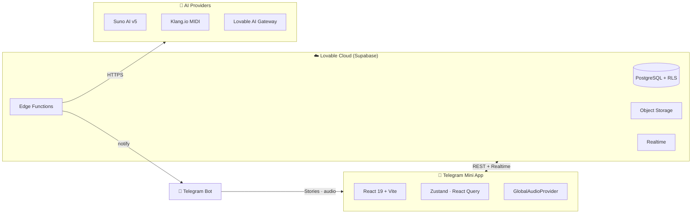
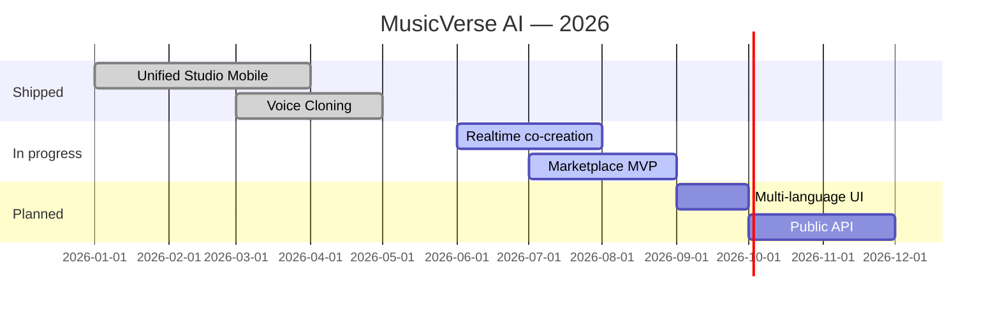

<div align="center">


# 🎵 MusicVerse AI

**Professional AI-powered music creation — delivered as a Telegram Mini App.**

<p>
  <a href="https://github.com/HOW2AI-AGENCY/aimusicverse/actions"></a>
  <a href="https://github.com/HOW2AI-AGENCY/aimusicverse/releases"></a>
  <a href="LICENSE"></a>
  <a href="https://codecov.io/gh/HOW2AI-AGENCY/aimusicverse"></a>
  
  <a href="https://t.me/AIMusicVerseBot"></a>
</p>

<p>
  
  
  
  
  
  
</p>

<p>
  <a href="#-quick-start"></a>
  <a href="#-features"></a>
  <a href="#-architecture"></a>
  <a href="DOCUMENTATION_INDEX.md"></a>
  <a href="CONTRIBUTING.md"></a>
  <a href="ROADMAP.md"></a>
</p>

[🇷🇺 Русская версия](README_RU.md) · [🌐 Live preview](https://aimusicverse.lovable.app) · [💬 Telegram bot](https://t.me/AIMusicVerseBot)

</div>

---

> [!NOTE]
> **MusicVerse AI** generates, edits, mixes, and ships music end-to-end inside Telegram. It pairs **Suno AI v5** with a full DAW-style mobile studio, AI-assisted lyrics, stem separation, MIDI transcription, gamification, and Telegram-native UX (haptics, MainButton, Stories sharing).

---

## ✨ Features

| Category | Capability | Status |
| --- | --- | :---: |
| 🤖 **Generation** | Suno v5 — 277+ styles, custom lyrics, instrumentals, A/B versions, extend & remix | ✅ |
| 🎙️ **Voice Cloning** | 6-step voice clone, personalised generation, cross-genre library | ✅ |
| 🎛️ **Studio** | 16-channel mixer, timeline, section regeneration, A/B comparison | ✅ |
| 🪓 **Stems** | 4-stem separation (vocals · drums · bass · other) with mixer | ✅ |
| 🎼 **MIDI** | 6 AI transcription models, multi-track export | ✅ |
| 📝 **Lyrics AI** | 10+ tools — rhythm, rhyme, structure, translate, generate | ✅ |
| 👥 **Social** | Profiles, likes, comments, follows, leaderboards, referrals | ✅ |
| 🎮 **Gamification** | Daily check-ins, streaks, XP, 20+ achievements, Stars rewards | ✅ |
| 💳 **Monetisation** | Telegram Stars, tiered subscriptions, credit packs | ✅ |
| 📱 **Telegram-native** | MainButton, BackButton, haptics, Stories share, deep-links | ✅ |
| 🧠 **Realtime co-creation** | Collaborative session, presence, live waveform | 🚧 |
| 🌍 **Marketplace** | Sell beats / loops / voices | 📋 |

---

## 🏛 Architecture


```mermaid
flowchart LR
    subgraph Client["📱 Telegram Mini App"]
        UI[React 19 + Vite]
        State[Zustand · React Query]
        Audio[GlobalAudioProvider]
    end
    subgraph Cloud["☁️ Lovable Cloud (Supabase)"]
        DB[(PostgreSQL + RLS)]
        Edge[Edge Functions]
        Storage[Object Storage]
        Realtime[Realtime]
    end
    subgraph AI["🤖 AI Providers"]
        Suno[Suno AI v5]
        Klang[Klang.io MIDI]
        Gateway[Lovable AI Gateway]
    end
    Client <-->|REST + Realtime| Cloud
    Edge -->|HTTPS| AI
    Edge -->|notify| Bot[🤖 Telegram Bot]
    Bot -->|Stories · audio| Client
```

➡️ Full diagrams in [`ARCHITECTURE_HUB.md`](ARCHITECTURE_HUB.md) · [`docs/ARCHITECTURE_DIAGRAMS.md`](docs/ARCHITECTURE_DIAGRAMS.md)

---

## 🚀 Quick Start

<details open>
<summary><b>Prerequisites</b></summary>

- Node.js **≥ 20**
- npm **≥ 10** (or pnpm / bun)
- Telegram desktop / mobile client (for Mini App testing)

</details>

<details open>
<summary><b>Install &amp; run</b></summary>

```bash
git clone https://github.com/HOW2AI-AGENCY/aimusicverse.git
cd aimusicverse
npm install
npm run dev          # → http://localhost:8080
```

</details>

<details>
<summary><b>Scripts</b></summary>

| Command | Purpose |
| --- | --- |
| `npm run dev` | Vite dev server (port 8080) |
| `npm run build` | Production build |
| `npm run preview` | Preview production build |
| `npm test` | Vitest unit tests |
| `npm run test:coverage` | Coverage report |
| `npm run test:e2e` | Playwright E2E |
| `npm run test:e2e:mobile` | Mobile emulation E2E |
| `npm run lint` | ESLint |
| `npm run format` | Prettier |
| `npm run size` | Bundle-size guard (≤ 950 KB) |
| `npm run storybook` | Storybook on :6006 |

</details>

<details>
<summary><b>Environment variables</b></summary>

See [`docs/ENVIRONMENT_VARIABLES.md`](docs/ENVIRONMENT_VARIABLES.md). Lovable Cloud auto-injects `VITE_SUPABASE_URL` / `VITE_SUPABASE_PUBLISHABLE_KEY` / `VITE_SUPABASE_PROJECT_ID`. Never edit `.env` manually.

</details>

---

## 🧱 Tech Stack

<table>
<tr>
<td valign="top" width="50%">

**Frontend**
- React 19.2 · TypeScript 5.9 · Vite 5
- Tailwind 3.4 · shadcn/ui · Radix UI
- Zustand 5 · TanStack Query 5.90
- Framer Motion (tree-shaken via `@/lib/motion`)
- React Hook Form + Zod
- react-virtuoso · vaul

</td>
<td valign="top" width="50%">

**Backend & AI**
- Lovable Cloud (Supabase) — Postgres · Edge · Storage · Realtime
- Suno AI v5 · Klang.io · Lovable AI Gateway
- Deno Edge Functions (80+)
- Telegram Bot API · @twa-dev/sdk 8.0

</td>
</tr>
<tr>
<td valign="top">

**Audio**
- Tone.js · Wavesurfer.js
- Single `<audio>` via `GlobalAudioProvider`
- iOS-safe audio element pool
- IndexedDB waveform cache

</td>
<td valign="top">

**Quality**
- Vitest 4 · Playwright 1.57
- ESLint · Prettier · Husky · commitlint
- size-limit (950 KB budget)
- axe-core a11y · Storybook

</td>
</tr>
</table>

---

## 📂 Project Structure

```text
aimusicverse/
├── src/                  # React app (935+ components, 200+ hooks, 8 Zustand stores)
│   ├── components/       # UI + features (player, studio, generate, lyrics, …)
│   ├── hooks/            # Audio · generation · studio · telegram
│   ├── stores/           # Zustand (player · studio · lyrics · mixer)
│   ├── services/         # Business logic
│   ├── api/              # Supabase queries
│   ├── pages/            # Lazy-loaded routes
│   └── lib/              # logger · errors · audio utils · motion
├── supabase/             # 80+ Edge Functions + migrations + config
├── docs/                 # Long-form docs (architecture · API · guides)
├── tests/                # Unit (Vitest) + E2E (Playwright)
├── ADR/                  # Architecture decision records
├── SPRINTS/              # Sprint planning
└── specs/                # SDD specs
```

Detailed tree in [`REPOSITORY_STRUCTURE.md`](REPOSITORY_STRUCTURE.md).

---

## 📚 Documentation

| Section | Entry point |
| --- | --- |
| 📖 **Full index** | [`DOCUMENTATION_INDEX.md`](DOCUMENTATION_INDEX.md) |
| 🏛 **Architecture hub** | [`ARCHITECTURE_HUB.md`](ARCHITECTURE_HUB.md) |
| 🧩 **Knowledge base** | [`KNOWLEDGE_BASE.md`](KNOWLEDGE_BASE.md) |
| 🗂 **Repo structure** | [`REPOSITORY_STRUCTURE.md`](REPOSITORY_STRUCTURE.md) |
| 🗺 **Roadmap** | [`ROADMAP.md`](ROADMAP.md) |
| 📊 **Project status** | [`PROJECT_STATUS.md`](PROJECT_STATUS.md) |
| 🪲 **Known issues** | [`KNOWN_ISSUES_TRACKED.md`](KNOWN_ISSUES_TRACKED.md) |
| 🤝 **Contributing** | [`CONTRIBUTING.md`](CONTRIBUTING.md) |
| 🔒 **Security** | [`SECURITY.md`](SECURITY.md) |
| 📝 **Changelog** | [`CHANGELOG.md`](CHANGELOG.md) |

> [!TIP]
> New to the project? Start with [`KNOWLEDGE_BASE.md`](KNOWLEDGE_BASE.md) → [`ARCHITECTURE_HUB.md`](ARCHITECTURE_HUB.md) → [`CONTRIBUTING.md`](CONTRIBUTING.md). Building a feature? Open [`DOCUMENTATION_INDEX.md`](DOCUMENTATION_INDEX.md) and pick your role-based onboarding path.

---

## 🧪 Testing & Quality

```bash
npm test                  # unit (Vitest)
npm run test:coverage     # coverage
npm run test:e2e          # E2E (desktop + mobile projects)
npm run test:e2e:mobile   # Pixel 5 + iPhone 12
npm run size              # bundle budget guard
```

> [!IMPORTANT]
> CI runs split jobs for `e2e` (desktop) and `e2e-mobile` (Mobile Chrome + Mobile Safari). Z-index, IME, and dev-overlay specs are mandatory gates — see [`.github/workflows/ci.yml`](.github/workflows/ci.yml).

---

## 🗺 Roadmap snapshot


```mermaid
gantt
    title MusicVerse AI — 2026
    dateFormat YYYY-MM
    section Shipped
    Unified Studio Mobile     :done, 2026-01, 2026-04
    Voice Cloning             :done, 2026-03, 2026-05
    section In progress
    Realtime co-creation      :active, 2026-06, 2026-08
    Marketplace MVP           :active, 2026-07, 2026-09
    section Planned
    Multi-language UI         : 2026-09, 2026-10
    Public API                : 2026-10, 2026-12
```

Full board: [`ROADMAP.md`](ROADMAP.md).

---

## 🤝 Contributing

Pull requests, bug reports, and design ideas are welcome.

1. Read [`CONTRIBUTING.md`](CONTRIBUTING.md) (commit style, branch policy, review).
2. Check [`CODE_OF_CONDUCT.md`](CODE_OF_CONDUCT.md).
3. Open an [issue](https://github.com/HOW2AI-AGENCY/aimusicverse/issues) or [discussion](https://github.com/HOW2AI-AGENCY/aimusicverse/discussions).

<a href="https://github.com/HOW2AI-AGENCY/aimusicverse/graphs/contributors">
  
</a>

---

## 🔒 Security & License

- Vulnerability disclosure → [`SECURITY.md`](SECURITY.md).
- Project licensed under terms in [`LICENSE`](LICENSE).

---

<div align="center">

### 🔗 Related Documentation

| 📚 Index | 🏛 Architecture | 🗺 Roadmap | 🤝 Contributing | 🔒 Security | 📝 Changelog |
| :---: | :---: | :---: | :---: | :---: | :---: |
| [Index](DOCUMENTATION_INDEX.md) | [Hub](ARCHITECTURE_HUB.md) | [Roadmap](ROADMAP.md) | [Contributing](CONTRIBUTING.md) | [Security](SECURITY.md) | [Changelog](CHANGELOG.md) |

**Made with ❤️ by the MusicVerse AI team**

<sub>Last updated: 2026-06-27 · [Report issue](https://github.com/HOW2AI-AGENCY/aimusicverse/issues/new) · [Discuss](https://github.com/HOW2AI-AGENCY/aimusicverse/discussions)</sub>

[](https://star-history.com/#HOW2AI-AGENCY/aimusicverse&Date)

</div>
