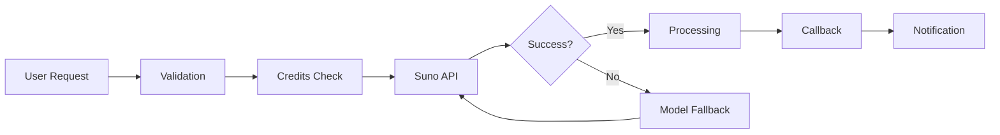

# MusicVerse AI

<div align="center">


**AI-платформа для создания музыки в Telegram Mini App**

[Возможности](#возможности) • [Архитектура](#архитектура) • [Документация](#документация) • [Разработка](#разработка) • [Дорожная карта](#дорожная-карта)

</div>

---

## 🎯 О проекте

**MusicVerse AI** — профессиональная платформа для создания музыки с использованием искусственного интеллекта. Платформа позволяет генерировать, редактировать и делиться музыкой, используя передовые AI-модели (Suno AI v5). Построена как Telegram Mini App для глубокой интеграции с экосистемой Telegram.

### 🎁 Ключевые возможности

<table>
<tr>
<td width="50%">

#### 🤖 AI-генерация музыки
- Suno AI v5 с 277+ стилями
- Собственные тексты песен
- Инструментальные треки
- Версионирование (A/B тесты)
- Ремиксы и продолжения

#### 🎛️ Профессиональный студия
- Микшер с 16+ каналами
- Временная шкала (timeline)
- Разделение на stems (4 stems)
- Редактирование секций
- MIDI-транскрипция

#### 📝 AI-ассистент текстов
- 10+ инструментов для написания
- Ритм-анализ и рифмы
- Структура песен
- Перевод языков
- Генерация по жанру

</td>
<td width="50%">

#### 👥 Социальные функции
- Профили артистов
- Комментарии и лайки
- Подписки и активность
- Приглашения (рефералы)
- Лидерборды

#### 🎮 Геймификация
- Ежедневные чекины
- Стрики (серии посещений)
- Уровни и опыт
- 20+ достижений
- Балльная система

#### 💳 Монетизация
- Tinkoff платежи (RUB)
- Кредитная система
- Подписки PRO/PREMIUM
- Тарифные пакеты
- Бонусы за активность

#### 📱 Мобильная оптимизация
- Haptic feedback
- Swipe-жесты
- Safe areas (iOS/Android)
- 44x44px touch targets
- Офлайн-режим

</td>
</tr>
</table>

---

## 📊 Статус проекта

| Метрика | Текущее | Цель | Прогресс |
|---------|---------|------|----------|
| 👥 Пользователи | 574 | 1,000+ | 🟡 57% |
| 🎵 Треков создано | 1,666+ | 5,000+ | 🟡 33% |
| 📈 Месячных генераций | 1,217 | 2,000+ | 🟡 61% |
| ✅ Успешность | ~88% | >92% | 🔴 Улучшается |
| 📱 DAU | ~25 | 50+ | 🟡 50% |

**Общее состояние**: 🟢 **95/100** — Production Ready

**Текущий спринт**: [Sprint A — Надёжность и стабильность](docs/SPRINT_A_PROGRESS.md)

---

## 🏗️ Архитектура

### Tech Stack

<div align="center">

| Категория | Технологии |
|-----------|-----------|
| **Frontend** | React 19.2 • TypeScript 5.9 • Vite 5.0 • Tailwind CSS 3.4 |
| **Backend** | Supabase (PostgreSQL) • Edge Functions (Deno) |
| **AI/ML** | Suno API v5 • Tone.js • Web Audio API |
| **State** | Zustand • TanStack Query v5 |
| **UI** | Radix UI • shadcn/ui • Framer Motion 12 |
| **Audio** | wavesurfer.js • Tone.js • lamejs • MIDI.js |
| **Testing** | Jest • Playwright • Vitest • axe-core |
| **Monitoring** | Sentry • custom logging • api_usage_logs |

</div>

### Структура проекта

```
MusicVerse AI/
├── src/
│   ├── api/              # API-клиенты и интеграции
│   ├── components/       # 180+ React-компонентов
│   │   ├── ui/          # Базовые UI-компоненты (shadcn)
│   │   ├── studio/      # Студия: микшер, timeline, editor
│   │   ├── lyrics/      # Lyrics wizard и tools
│   │   ├── generate/    # Форма генерации
│   │   ├── library/     # Библиотека треков
│   │   └── social/      # Социальные компоненты
│   ├── hooks/           # 180+ кастомных хуков
│   │   ├── studio/      # Студийные хуки
│   │   ├── generation/  # Хуки генерации
│   │   └── ui/          # UI-хуки
│   ├── pages/           # 38+ страниц
│   │   ├── Studio.tsx
│   │   ├── StemStudio.tsx
│   │   ├── LyricsStudio.tsx
│   │   ├── Projects.tsx
│   │   └── Analytics.tsx
│   ├── stores/          # Zustand stores
│   ├── lib/             # Утилиты и оптимизации
│   │   ├── motion.ts    # Framer Motion оптимизации
│   │   ├── icons.ts     # Централизованные иконки
│   │   ├── performance.ts # Debounce, throttle, memoize
│   │   ├── errors/      # Type-safe error handling
│   │   └── stateMachine.ts # State machine для complex flows
│   ├── types/           # TypeScript типы
│   │   ├── branded.ts   # Branded types (TrackId, UserId)
│   │   └── audio.ts     # Audio-типы
│   └── workers/         # Web Workers
├── supabase/
│   ├── functions/       # 110+ Edge Functions (Deno)
│   │   ├── suno-music-generate/     # Основная генерация
│   │   ├── suno-callbacks/          # Обработка callback
│   │   ├── klangio-*/               # Анализ аудио
│   │   ├── tinkoff-*/               # Платежи
│   │   └── telegram-*/              # Telegram Bot
│   ├── migrations/      # Database schema
│   └── config.toml
├── docs/                # 65+ документов
├── tests/               # Unit и E2E тесты
└── graphify-out/        # Knowledge graph
```

### Ключевые особенности архитектуры

#### 1. Music Generation Pipeline


```mermaid
graph LR
    A[User Request] --> B[Validation]
    B --> C[Credits Check]
    C --> D[Suno API]
    D --> E{Success?}
    E -->|Yes| F[Processing]
    E -->|No| G[Model Fallback]
    G --> D
    F --> H[Callback]
    H --> I[Notification]
```

**Возможности**:
- SunoAI v5 с автоматическим fallback (V5 → V4_5PLUS → V4_5 → V4 → V3_5)
- Exponential backoff retry (3 попытки, задержки 1с-8с)
- 30-секундный timeout protection
- Автоматическое восстановление после ошибок
- Пользовательские сообщения об ошибках

#### 2. Performance Optimizations

| Оптимизация | Реализация | Эффект |
|-------------|-----------|--------|
| **Bundle Splitting** | vendor-react, vendor-framer, vendor-tone | Быстрая загрузка |
| **Lazy Loading** | 15+ тяжелых компонентов | Меньший initial bundle |
| **React.memo** | TrackCard, MixerChannel, Waveform | -60% re-renders |
| **Waveform Cache** | IndexedDB + LRU (7 дней TTL) | Мгновенный доступ |
| **RAF Playback** | Оптимизированные time updates | 55+ FPS scrolling |

#### 3. Type Safety

- **Branded Types**: `TrackId`, `UserId`, `StemId`, `ProjectId`
- **Type-safe Context**: WebKit fallback для AudioContext
- **Error Typing**: `AppError`, `NetworkError`, `APIError`, `GenerationError`

---

## 🚀 Быстрый старт

### Предrequisites

```bash
# Требования
- Node.js 22.15+
- npm 10.8+
- Supabase CLI (опционально для локальной разработки)
```

### Установка

```bash
# 1. Клонирование репозитория
git clone https://github.com/HOW2AI-AGENCY/aimusicverse.git
cd aimusicverse

# 2. Установка зависимостей
npm install

# 3. Настройка окружения
cp .env.example .env
# Отредактируйте .env с вашими ключами

# 4. Запуск dev-сервера
npm run dev
# → http://localhost:8080
```

### Доступные команды

#### Разработка
```bash
npm run dev              # Dev-сервер (порт 8080)
npm run build            # Production build
npm run preview          # Превью production сборки
```

#### Тестирование
```bash
npm test                 # Jest unit-тесты
npm run test:coverage    # С отчётом покрытия
npm run test:e2e         # Playwright E2E (все браузеры)
npm run test:e2e:mobile  # Мобильные тесты
npm run test:e2e:ui      # С UI-интерфейсом
```

#### Качество кода
```bash
npm run lint             # ESLint проверка
npm run format           # Prettier форматирование
npm run size             # Bundle size анализ
npm run size:why         # Подробный анализ состава
```

---

## 📚 Документация

### 📖 Основная документация

| Документ | Описание |
|----------|----------|
| [Архитектура](docs/ARCHITECTURE.md) | Системная архитектура и паттерны проектирования |
| [Производительность](docs/PERFORMANCE_OPTIMIZATION.md) | Оптимизации: memoization, caching, lazy loading |
| [Bundle оптимизация](docs/BUNDLE_OPTIMIZATION.md) | Сплиттинг, tree-shaking, оптимизация импортов |
| [Тестирование](docs/TESTING_INFRASTRUCTURE.md) | Стратегия тестирования и инфраструктура |
| [Обработка ошибок](docs/ERROR_HANDLING_INFRASTRUCTURE.md) | Type-safe error handling |
| [База данных](docs/DATABASE.md) | Схема Supabase и связи |

### 🎨 Feature-документация

| Документ | Описание |
|----------|----------|
| [AI Lyrics Assistant](docs/AI_LYRICS_ASSISTANT.md) | Инструменты для написания текстов |
| [Студия](docs/STEM_STUDIO.md) | Микшер, timeline, stem separation |
| [Telegram Bot](docs/TELEGRAM_BOT_ARCHITECTURE.md) | Архитектура бота |
| [Платежи](docs/TELEGRAM_PAYMENTS.md) | Tinkoff интеграция |
| [Mobile UI](docs/MOBILE_COMPONENTS.md) | Мобильная оптимизация |

### 🛠️ Руководства для разработчиков

| Документ | Описание |
|----------|----------|
| [Быстрый старт](docs/QUICK_START.md) | Руководство по разработке |
| [Design System](docs/DESIGN_SYSTEM_COMPREHENSIVE.md) | Дизайн-система и токены |
| [Навигация](docs/NAVIGATION_SYSTEM.md) | Система навигации |
| [Hooks Reference](docs/HOOKS_REFERENCE.md) | Референс кастомных хуков |
| [Contributing](CONTRIBUTING.md) | Гайд по контрибьюции |

### 📋 Sprint-документация

| Sprint | Статус | Документ |
|--------|--------|----------|
| **Sprint A** | 🟢 In Progress | [Reliability & Stability](docs/SPRINT_A_PROGRESS.md) |
| **Sprint B** | ⏳ Planned | Performance Scaling |
| **Sprint C** | 📋 Q2 2026 | Platform Integrations |
| **Sprint D** | 📋 Q2 2026 | Monitoring & Alerts |

---

## 🎨 Дизайн-система

### Design Tokens

```css
/* Цвета */
--bg-primary: #0a0a0f;
--bg-secondary: #12121a;
--bg-glass: rgba(255, 255, 255, 0.05);
--text-primary: #ffffff;
--text-secondary: #a0a0b0;
--accent-primary: #6366f1;
--accent-success: #10b981;
--accent-warning: #f59e0b;
--accent-error: #ef4444;

--radius-sm: 8px;
--radius-md: 12px;
--radius-lg: 16px;
--radius-full: 9999px;
```

### Компоненты

- **shadcn/ui** — базовые компоненты (Button, Dialog, Sheet, etc.)
- **Кастомные** — TrackCard, MixerChannel, Waveform, LyricsEditor
- **Анимации** — Framer Motion presets (fadeIn, slideUp, scaleIn)
- **Иконки** — lucide-react (централизованные через `@/lib/icons`)

### Принципы

- **Mobile-first** — touch targets 44x44px минимум
- **Safe Areas** — обработка iOS/Android безопасных зон
- **Glassmorphism** — glass-эффекты с backdrop-blur
- **Accessibility** — WCAG 2.1 AA compliance

---

## 🧪 Тестирование

### Покрытие

<div align="center">

| Тип | Framework | Тестов | Покрытие |
|-----|-----------|--------|----------|
| **Unit** | Jest + Testing Library | 27+ files | 70%+ |
| **E2E** | Playwright | 62+ tests | 7 browsers |
| **Component** | Storybook | 50+ stories | Interactions |
| **Performance** | Custom | 4 benchmarks | FPS, Memory |

</div>

### Запуск тестов

```bash
# Unit-тесты
npm test

# С покрытием
npm run test:coverage

# E2E (все браузеры)
npm run test:e2e

# Конкретный браузер
npm run test:e2e:chromium
npm run test:e2e:firefox
npm run test:e2e:webkit

# Мобильные
npm run test:e2e:mobile

# С UI
npm run test:e2e:ui

# Hints-система
npm run test:e2e:hints
```

---

## 🔧 Конфигурация

### Environment Variables

```env
# Supabase
SUPABASE_URL=https://xxx.supabase.co
SUPABASE_ANON_KEY=eyJxxx...

# Suno AI
SUNO_API_KEY=sk-xxx

# Telegram
TELEGRAM_BOT_TOKEN=1234567890:ABCdef...
MINI_APP_URL=https://your-app.vercel.app

# Sentry (optional)
SENTRY_DSN=https://xxx@sentry.io/xxx
```

### Bun vs npm

Проект поддерживает оба менеджера:

```bash
# npm
npm install
npm run dev

# bun (быстрее)
bun install
bun run dev
```

---

## 🤝 Контрибьюция

### Workflow

1. **Создайте ветку** от `main`
   ```bash
   git checkout -b feature/amazing-feature
   ```

2. **Внесите изменения** и протестируйте локально
   ```bash
   npm run dev
   npm test
   ```

3. **Проверьте код**
   ```bash
   npm run lint
   npm run format
   ```

4. **Закоммитьте** с описательным сообщением
   ```bash
   git add .
   git commit -m "feat: add amazing feature"
   ```

5. **Push и PR**
   ```bash
   git push origin feature/amazing-feature
   ```

### Стандарты кода

- **TypeScript** — strict mode (target 100%)
- **ESLint** — все правила обязательны
- **Prettier** — автоматическое форматирование
- **Commit messages** — Conventional Commits

---

## 📈 Дорожная карта

### Q2 2026 (Апрель-Июнь)

#### Sprint A: Надёжность и стабильность 🔄
- [x] Улучшение reliability генерации (retry + backoff + model fallback)
- [ ] Bundle анализ и оптимизация
- [ ] TypeScript strict mode аудит
- [ ] Мониторинг и алертинг

#### Sprint B: Performance Scaling ⏳
- [ ] Оптимизация компонентов (PlaylistTrackItem, LyricsLine)
- [ ] Database query оптимизация
- [ ] Advanced caching (Service Worker)
- [ ] CDN интеграция

#### Q2 Goals
- [ ] Spec 032: Professional UI enhancements
- [ ] Spec 031: Mobile Studio V2
- [ ] Platform integrations (Spotify, Apple Music)
- [ ] Public API development

### Q3 2026 (Июль-Сентябрь)

#### Sprint C: Platform Integrations 📋
- [ ] Spotify / Apple Music / YouTube export
- [ ] OAuth 2.0 flows
- [ ] Release scheduling
- [ ] Distribution tracking

#### Sprint D: Analytics & Monitoring 📋
- [ ] Business metrics dashboard
- [ ] Real-time success rate monitoring
- [ ] Automated alerting
- [ ] On-call runbooks

---

## 🚨 Известные проблемы

### P1 — Критические (решённые)
- ✅ Все P1-P4 issues закрыты (28 issues resolved)
- ✅ Generation reliability improved (F1.1 complete)

### P2 — В процессе улучшения
- 🔴 Generation failure rate ~12% → target <8%
- 🟡 Bundle size optimisation pending (npm issue on Windows)
- 🟡 TypeScript strict mode gaps

### P3 — Плановые
- 📋 Platform integrations
- 📋 Public API
- 📋 Advanced studio features

---

## 📄 Лицензия

Proprietary software. All rights reserved.

---

## 🙏 Благодарности

- [Suno AI](https://suno.com) — Music generation API
- [Supabase](https://supabase.com) — Backend infrastructure
- [Telegram](https://telegram.org) — Mini App platform
- [shadcn/ui](https://ui.shadcn.com) — Component library
- [Radix UI](https://www.radix-ui.com) — Accessible primitives

---

<div align="center">

**Сделано с ❤️ командой MusicVerse**

[Website](https://musicspace.vercel.app) • [Telegram](https://t.me/musicspaceapp) • [Twitter](https://twitter.com/musicspaceapp)

</div>