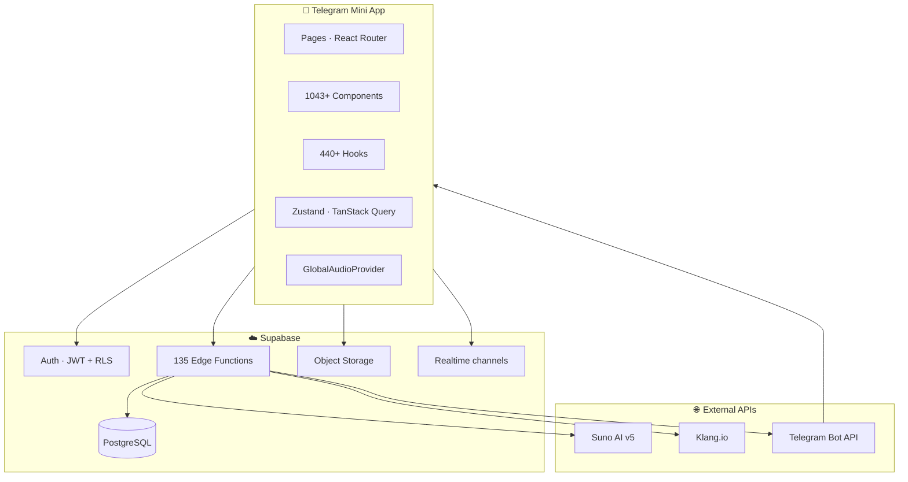
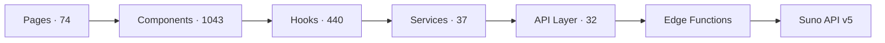
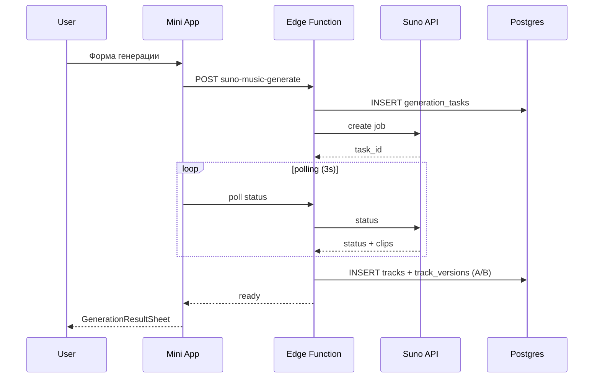
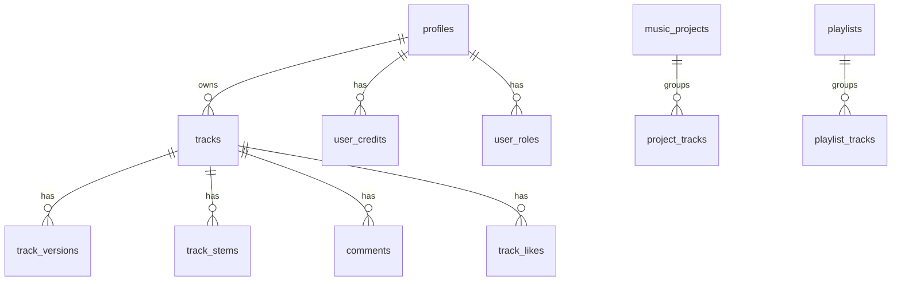

<!-- ╔══════════════════════════════════════════════════╗ -->
<!-- ║  NAVIGATION HEADER                               ║ -->
<!-- ╚══════════════════════════════════════════════════╝ -->

<div align="center">

# 🎵 MusicVerse AI — Music Creation in Telegram

**Профессиональная AI-генерация музыки прямо в Telegram Mini App. Suno AI v5, мультитрек-студия, A/B версии, MIDI, вокальный клон — без единого перехода во внешний сервис.**


<p>
  
  
  
  
  
  
  
  
  
</p>

<p>
  <a href="#🚀-быстрый-старт">🚀 Быстрый старт</a> ·
  <a href="#✨-возможности">✨ Возможности</a> ·
  <a href="#📱-скриншоты">📱 Скриншоты</a> ·
  <a href="#🏛-архитектура">🏛 Архитектура</a> ·
  <a href="#📊-прогресс-проекта">📊 Прогресс</a> ·
  <a href="#🛠-технический-стек">🛠 Стек</a> ·
  <a href="#📁-структура-проекта">📁 Структура</a> ·
  <a href="#📖-документация">📖 Документация</a>
</p>

</div>

---

<!-- ╔══════════════════════════════════════════════════╗ -->
<!-- ║  SITE NAVIGATION (next-prev between sections)    ║ -->
<!-- ╚══════════════════════════════════════════════════╝ -->

<div align="center">

| ← [DOCUMENTATION_INDEX](DOCUMENTATION_INDEX.md) | [ARCHITECTURE_HUB](ARCHITECTURE_HUB.md) → |
| :---------------------------------------------: | :---------------------------------------: |

</div>

---

> [!IMPORTANT]
> **Передаёте или принимаете проект?** Начните с [**🤝 HANDOFF.md**](HANDOFF.md) — что передаётся, какие аккаунты переоформить, как развернуть и принять проект.

---

## 📱 Скриншоты

<div align="center">

|                                                  Главная                                                   |                                                    Библиотека                                                    |                                                    Проекты                                                     |                                                   Студия                                                    |
| :--------------------------------------------------------------------------------------------------------: | :--------------------------------------------------------------------------------------------------------------: | :------------------------------------------------------------------------------------------------------------: | :---------------------------------------------------------------------------------------------------------: |
|  |  |  |  |

<sub>Реальные скриншоты приложения на мобильном viewport 390×844 (iPhone-class). Сгенерированы автоматически через Playwright из живого preview.</sub>

</div>

<sub><a href="#top">↑ К началу</a> · <a href="#✨-возможности">Далее: Возможности →</a></sub>

---

## ✨ Возможности

| Категория         | Функция                                      | Статус |
| ----------------- | -------------------------------------------- | :----: |
| 🎵 AI-генерация   | Suno API v5 с A/B версиями                   |   ✅   |
| 🎤 Voice Clone    | Клонирование голоса                          |   ✅   |
| 📝 Lyrics AI      | AI-помощник для текстов                      |   ✅   |
| 🎸 Инструменты    | Гитара, драм-машина, микшер                  |   ✅   |
| 🏗 Студия         | Мультитрек-редактор (Studio Lite/Pro)        |   ✅   |
| 👥 Сообщество     | Лента, артисты, блог                         |   ✅   |
| 🎛 MIDI           | Klang.io транскрипция (6 моделей)            |   ✅   |
| 🔀 Стем-сепарация | Извлечение вокала/барабанов/баса             |   ✅   |
| 💎 Монетизация    | Telegram Stars + Tinkoff, подписки           |   ✅   |
| 📊 Аналитика      | Dashboard, A/B тесты                         |   ✅   |
| 🔔 Уведомления    | In-app + Push (завершение генерации)         |   ✅   |
| ♿ Доступность    | WCAG AA, 14px min, клавиатурная навигация    |   ✅   |
| 📱 Telegram       | MainButton, BackButton, Haptic, CloudStorage |   ✅   |
| 🌐 Локализация    | i18n EN/RU (react-i18next)                   |   ✅   |

<sub><a href="#📱-скриншоты">← Назад: Скриншоты</a> · <a href="#top">↑ К началу</a> · <a href="#🏛-архитектура">Далее: Архитектура →</a></sub>

---

## 🏛 Архитектура


### Системная архитектура


```mermaid
flowchart TB
    subgraph Client["📱 Telegram Mini App"]
        Pages[Pages · React Router]
        Comps[1043+ Components]
        Hooks[440+ Hooks]
        State[Zustand · TanStack Query]
        Audio[GlobalAudioProvider]
    end
    subgraph Backend["☁️ Supabase"]
        Auth[Auth · JWT + RLS]
        DB[(PostgreSQL)]
        Edge[135 Edge Functions]
        Storage[Object Storage]
        Realtime[Realtime channels]
    end
    subgraph External["🌐 External APIs"]
        Suno[Suno AI v5]
        Klang[Klang.io]
        Bot[Telegram Bot API]
    end
    Client --> Auth
    Client --> Edge
    Client --> Realtime
    Client --> Storage
    Edge --> DB
    Edge --> Suno
    Edge --> Klang
    Edge --> Bot
    Bot --> Client
```

### Слоёная архитектура (Layered)


```mermaid
flowchart LR
    P[Pages · 74] --> C[Components · 1043]
    C --> H[Hooks · 440]
    H --> Sv[Services · 37]
    Sv --> API[API Layer · 32]
    API --> Edge[Edge Functions]
    Edge --> Suno[Suno API v5]
```

Однонаправленный поток: Pages → Components → Hooks → Services → API → Edge Functions. RLS на всех таблицах с пользовательскими данными.

### Pipeline генерации


```mermaid
sequenceDiagram
    participant U as User
    participant FE as Mini App
    participant EF as Edge Function
    participant SA as Suno API
    participant DB as Postgres
    U->>FE: Форма генерации
    FE->>EF: POST suno-music-generate
    EF->>DB: INSERT generation_tasks
    EF->>SA: create job
    SA-->>EF: task_id
    loop polling (3s)
        FE->>EF: poll status
        EF->>SA: status
        SA-->>EF: status + clips
    end
    EF->>DB: INSERT tracks + track_versions (A/B)
    EF-->>FE: ready
    FE-->>U: GenerationResultSheet
```

### Схема базы данных


```mermaid
erDiagram
    profiles ||--o{ tracks : owns
    tracks ||--o{ track_versions : has
    tracks ||--o{ track_stems : has
    profiles ||--o{ user_credits : has
    profiles ||--o{ user_roles : has
    tracks ||--o{ comments : has
    tracks ||--o{ track_likes : has
    music_projects ||--o{ project_tracks : groups
    playlists ||--o{ playlist_tracks : groups
```

> Подробнее: [`ARCHITECTURE_HUB.md`](ARCHITECTURE_HUB.md) · [`docs/DATABASE.md`](docs/DATABASE.md) · [`docs/SUNO_API.md`](docs/SUNO_API.md)

<sub><a href="#✨-возможности">← Назад: Возможности</a> · <a href="#top">↑ К началу</a> · <a href="#🚀-быстрый-старт">Далее: Быстрый старт →</a></sub>

---

## 🚀 Быстрый старт

```bash
git clone https://github.com/HOW2AI-AGENCY/aimusicverse.git
cd aimusicverse
npm install
npm run dev              # → http://localhost:8080
```

```bash
# Проверка качества перед коммитом
npm run check-all        # lint + format + typecheck
npm test -- --run        # 1810 unit tests
npm run build            # production build
```

> **Требования**: Node.js 22+, npm 11+. Приложение оптимизировано под мобильные устройства (375×812 Telegram WebView).

<sub><a href="#🏛-архитектура">← Назад: Архитектура</a> · <a href="#top">↑ К началу</a> · <a href="#📊-прогресс-проекта">Далее: Прогресс →</a></sub>

---

## 📊 Прогресс проекта

| Метрика                 | Значение                      | Статус |
| ----------------------- | ----------------------------- | :----: |
| Unit тесты              | 1810 passing (166 test files) |   ✅   |
| TypeScript              | 0 errors (`--noEmit`)         |   ✅   |
| E2E specs               | 59                            |   ✅   |
| Components              | 1043                          |   ✅   |
| Hooks                   | 440                           |   ✅   |
| API files               | 32                            |   ✅   |
| Services                | 37 `*.service.ts`             |   ✅   |
| Stores                  | 25                            |   ✅   |
| Suno edge functions     | 46 (28/28 API — 100%)         |   ✅   |
| Files >800 LOC в `src/` | 0                             |   ✅   |
| `any` budget            | 0/50                          |   ✅   |
| Bundle eager JS         | ~508 KB gzip                  |   ✅   |
| Bundle total            | 2.11 MB gzip                  |   🟡   |
| Branch Protection       | активна                       |   ✅   |
| Спринтов завершено      | 50+                           |   ✅   |

### Последние спринты

| Спринт | Фокус                                     | Статус |
| ------ | ----------------------------------------- | :----: |
| 059    | Bundle optimization + API/Service tests   |   ✅   |
| 060    | Design polish (search, search box)        |   ✅   |
| 061    | Vendor splits + barrel cleanup            |   ✅   |
| 062    | UI/UX Audit P0/P1/P2 (A+B+C)              |   ✅   |
| 063    | Homepage UX fixes + card refinement       |   ✅   |
| 064    | P2 polish: tablet cols, error, More       |   ✅   |
| 065    | Generate v2 + Home Redesign + Visual Regr |   🔄   |

<sub><a href="#🚀-быстрый-старт">← Назад: Быстрый старт</a> · <a href="#top">↑ К началу</a> · <a href="#🛠-технический-стек">Далее: Технический стек →</a></sub>

---

## 🛠 Технический стек

| Слой                     | Технология                                        |
| ------------------------ | ------------------------------------------------- |
| **Фреймворк**            | React 19.2, TypeScript 5.9, Vite 6.4.3            |
| **Стилизация**           | Tailwind CSS 3.4, shadcn/ui, Radix UI             |
| **Глобальное состояние** | Zustand 5.0 (25 stores)                           |
| **Серверное состояние**  | TanStack Query 5.90                               |
| **Бэкенд**               | Supabase (PostgreSQL + RLS + Realtime + Storage)  |
| **Serverless**           | 120+ Edge Functions (Deno/TypeScript)             |
| **Аудио**                | Tone.js 14.9, Wavesurfer.js 7.8                   |
| **MIDI**                 | Klang.io (6 моделей транскрипции)                 |
| **Формы**                | React Hook Form + Zod                             |
| **Тесты unit**           | Vitest 4.x (jsdom)                                |
| **Тесты e2e**            | Playwright 1.61 (Chrome, Firefox, Safari, Mobile) |
| **Анимации**             | Framer Motion (через tree-shaking обёртку)        |
| **CI/CD**                | GitHub Actions (5 jobs, 3 браузера)               |
| **Платформа**            | Telegram Mini App (@twa-dev/sdk 8.0.2)            |
| **Локализация**          | react-i18next, i18next-browser-languagedetector   |

<sub><a href="#📊-прогресс-проекта">← Назад: Прогресс</a> · <a href="#top">↑ К началу</a> · <a href="#📁-структура-проекта">Далее: Структура →</a></sub>

---

## 📁 Структура проекта

```
aimusicverse/
├── src/
│   ├── api/              # 32 — Supabase запросы
│   ├── components/       # 1043 — UI + feature компоненты
│   │   ├── ui/           # shadcn/ui primitives
│   │   ├── player/       # Аудиоплеер (compact/expanded/fullscreen)
│   │   ├── generate-form/ # Форма генерации (simple/custom)
│   │   ├── studio/       # Unified Studio + микшер + стемы
│   │   ├── library/      # Библиотека треков
│   │   └── ...
│   ├── hooks/            # 440 — кастомные React хуки
│   ├── pages/            # 74 — роуты с lazy loading
│   ├── services/         # 37 — бизнес-логика
│   ├── stores/           # 25 — Zustand stores
│   ├── contexts/         # 10 — React Context (Auth, Theme, Telegram)
│   ├── lib/              # Утилиты, аудио, логгер
│   ├── i18n/             # Локализация EN/RU
│   └── App.tsx           # Root с lazy-роутами
├── supabase/
│   ├── functions/        # 120+ Edge Functions
│   └── migrations/       # PostgreSQL миграции
├── docs/                 # 100+ файлов документации
├── specs/                # 14 директорий спецификаций
├── SPRINTS/              # Планы спринтов
├── tests/
│   ├── e2e/              # Playwright: 59 specs
│   └── unit/             # Vitest: 1810 test
└── scripts/              # Утилиты CI/CD
```

<sub><a href="#🛠-технический-стек">← Назад: Стек</a> · <a href="#top">↑ К началу</a> · <a href="#📖-документация">Далее: Документация →</a></sub>

## 📖 Документация

| Раздел                       | Адрес                                                                      | Для кого       |
| ---------------------------- | -------------------------------------------------------------------------- | -------------- |
| 🤝 **Передача проекта**      | [HANDOFF.md](HANDOFF.md)                                                   | Заказчик       |
| 📚 **Documentation Index**   | [DOCUMENTATION_INDEX.md](DOCUMENTATION_INDEX.md)                           | Все роли       |
| 🏛 **Архитектура**           | [ARCHITECTURE_HUB.md](ARCHITECTURE_HUB.md)                                 | Разработчики   |
| 🗺 **Roadmap**               | [ROADMAP.md](ROADMAP.md)                                                   | PM / инвесторы |
| 📊 **Статус проекта**        | [PROJECT_STATUS.md](PROJECT_STATUS.md)                                     | Все            |
| 📝 **Changelog**             | [CHANGELOG.md](CHANGELOG.md)                                               | Все            |
| 🤝 **Contributing**          | [CONTRIBUTING.md](CONTRIBUTING.md)                                         | Контрибьюторы  |
| 🔒 **Security**              | [SECURITY.md](SECURITY.md)                                                 | Безопасность   |
| 🗂 **Структура репозитория** | [REPOSITORY_STRUCTURE.md](REPOSITORY_STRUCTURE.md)                         | Онбординг      |
| 🛠 **Dev гайд**              | [docs/DEVELOPER_GUIDE.md](docs/DEVELOPER_GUIDE.md)                         | Разработчики   |
| 🎨 **Design System**         | [docs/DESIGN_SYSTEM_COMPREHENSIVE.md](docs/DESIGN_SYSTEM_COMPREHENSIVE.md) | Дизайнеры      |

<sub><a href="#📁-структура-проекта">← Назад: Структура</a> · <a href="#top">↑ К началу</a> · <a href="#💰-для-инвесторов">Далее: Инвесторам →</a></sub>

---

## 💰 Для инвесторов

| Метрика                        | Значение                            |
| ------------------------------ | ----------------------------------- |
| ⭐ GitHub Stars                | Private repo                        |
| 📦 Eager load (холодный старт) | 508 KB gzip (↓ с 1.19 MB)           |
| 📦 Всего JS (все чанки)        | 2.11 MB gzip                        |
| 🧪 Покрытие кода               | 1810 unit tests                     |
| 🔒 Безопасность                | 6 vulns (1 high, 4 moderate, 1 low) |
| 📊 Спринтов завершено          | 50+                                 |
| 🏗 Компонентов                 | 1043                                |
| 🔧 Хуков                       | 440                                 |
| 🚀 Стадия                      | Pre-Seed / Active Development       |

**MusicVerse AI** демократизирует создание музыки через AI-powered инструменты прямо в Telegram. Первый продукт, который делает профессиональное музыкальное производство доступным для 900М+ пользователей Telegram.

- **Бизнес-модель**: Freemium + подписка (Stars Payment в Telegram)
- **Рынок**: MusicTech + AI + Creator Economy ($12B+ к 2027)
- **Конкурентное преимущество**: Всё в одном — генерация, редактирование, микширование, MIDI, вокальный клон — без выхода из Telegram

<sub><a href="#📖-документация">← Назад: Документация</a> · <a href="#top">↑ К началу</a></sub>

---

<!-- ╔══════════════════════════════════════════════════╗ -->
<!-- ║  FOOTER — полная карта документации и ссылки      ║ -->
<!-- ╚══════════════════════════════════════════════════╝ -->

<div align="center">

### 🗺 Навигация по репозиторию

| Раздел                | Ссылка                              | Описание             |
| --------------------- | ----------------------------------- | -------------------- |
| 🏠 **Главная**        | [README](README.md)                 | Этот документ        |
| 🤝 **Передача**       | [HANDOFF](HANDOFF.md)               | Приёмка заказчиком   |
| 📚 **Документация**   | [Index](DOCUMENTATION_INDEX.md)     | Полный каталог docs/ |
| 🏛 **Архитектура**    | [Hub](ARCHITECTURE_HUB.md)          | ADR, диаграммы, слои |
| 🗺 **Дорожная карта** | [ROADMAP](ROADMAP.md)               | План Q3 2026         |
| 📊 **Статус**         | [PROJECT_STATUS](PROJECT_STATUS.md) | Метрики, спринты     |
| 📝 **Changelog**      | [CHANGELOG](CHANGELOG.md)           | Релизы               |

### 🔁 Быстрые ссылки

| Назначение           | Команда / Ссылка                                 |
| -------------------- | ------------------------------------------------ |
| Запустить dev-сервер | `npm run dev` (порт 8080)                        |
| Запустить тесты      | `npm test -- --run`                              |
| Собрать production   | `npm run build`                                  |
| Проверить бандл      | `npm run size`                                   |
| Storybook            | `npm run storybook` (порт 6006)                  |
| Telegram бот         | [@AIMusicVerseBot](https://t.me/AIMusicVerseBot) |
| Сайт                 | [how2ai.agency](https://how2ai.agency)           |

### 🧭 Потоки онбординга

```
Заказчик    → HANDOFF → DEPLOYMENT_GUIDE → MAINTENANCE
Новичок     → README → ARCHITECTURE_HUB → CONTRIBUTING
Разработчик → CLAUDE.md → REPOSITORY_STRUCTURE → ARCHITECTURE_HUB
Дизайнер    → DESIGN_SYSTEM → DESIGN_TOKENS → LAYOUT_SYSTEM
PM/Инвестор → PROJECT_STATUS → ROADMAP → CHANGELOG
Контрибьютор→ CONTRIBUTING → Issues → SECURITY
```

---

<p>
  <a href="https://github.com/HOW2AI-AGENCY/aimusicverse"></a>
  <a href="https://t.me/AIMusicVerseBot"></a>
  <a href="https://how2ai.agency"></a>
  <a href="mailto:hello@how2ai.agency"></a>
</p>

**Лицензия:** MIT · **Авторские права:** HOW2AI Agency © 2025–2026 · **Безопасность:** `security@how2ai.agency`

<sub>Последнее обновление: 2026-07-24 · Sprint 065 (Generate v2 + Home Redesign + Visual Regression) · tsc 0 errors · 1810 unit tests · 59 E2E specs · Vite 6.4.3 · [🤝 Передача проекта](HANDOFF.md)</sub>

</div>
