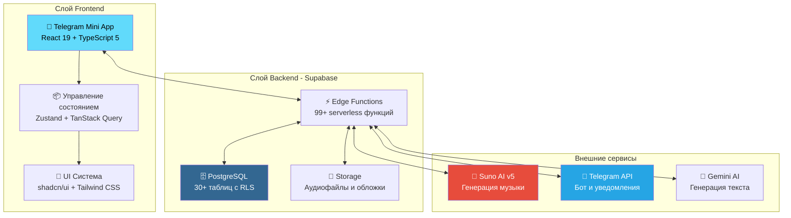

<div align="center">

<!-- Hero Section -->
<picture>
  <source media="(prefers-color-scheme: dark)" srcset="src/assets/logo.png">
  
</picture>

# 🎵 MusicVerse AI

### 🚀 Профессиональная платформа AI для создания музыки в Telegram

**Трансформируйте идеи в музыку с помощью мощного ИИ**  
*Powered by Suno AI v5 • Telegram Mini App • 277+ музыкальных стилей • 75+ языков*

---

<!-- GitHub Badges Row 1: Repository Stats -->
<div style="margin: 24px 0;">
  <a href="https://github.com/HOW2AI-AGENCY/aimusicverse/actions/workflows/quality-check.yml">
    
  </a>
  <a href="https://github.com/HOW2AI-AGENCY/aimusicverse/commits">
    
  </a>
  <a href="https://github.com/HOW2AI-AGENCY/aimusicverse/pulse/monthly">
    
  </a>
  <a href="https://github.com/HOW2AI-AGENCY/aimusicverse/issues">
    
  </a>
  <a href="https://github.com/HOW2AI-AGENCY/aimusicverse/pulls">
    
  </a>
</div>

<!-- GitHub Badges Row 2: Tech Stack -->
<div style="margin: 20px 0;">
  
  
  
  
  
  
</div>

<!-- GitHub Badges Row 3: Project Status -->
<div style="margin: 20px 0;">
  
  
  
  
  
</div>

<!-- GitHub Badges Row 4: Languages & License -->
<div style="margin: 20px 0;">
  
  
  
  <a href="https://bundlephobia.com/package/react-virtuoso">
    
  </a>
</div>

<!-- Action Buttons -->
<div style="margin: 30px 0;">
  <a href="https://t.me/AIMusicVerseBot/app" style="text-decoration: none; margin: 0 8px;">
    
  </a>
  <a href="https://t.me/AIMusicVerse" style="text-decoration: none; margin: 0 8px;">
    
  </a>
  <a href="#-быстрая-навигация" style="text-decoration: none; margin: 0 8px;">
    
  </a>
  <a href="#-участие-в-разработке" style="text-decoration: none; margin: 0 8px;">
    
  </a>
</div>

<!-- GitHub Social Stats -->
<div style="margin: 24px 0; font-size: 14px;">
  <a href="https://github.com/HOW2AI-AGENCY/aimusicverse/stargazers">
    
  </a>
  <a href="https://github.com/HOW2AI-AGENCY/aimusicverse/network/members" style="margin: 0 16px;">
    
  </a>
  <a href="https://github.com/HOW2AI-AGENCY/aimusicverse/watchers">
    
  </a>
</div>

</div>

---

## 📑 Содержание

<table>
<tr>
<td width="50%">

### 🚀 Начало работы
- [✨ Возможности](#-возможности)
- [🎯 Быстрая навигация](#-быстрая-навигация)
- [🚀 Быстрый старт](#-быстрый-старт)
- [📊 Ключевые метрики](#-ключевые-метрики)

### 🏗️ Архитектура и технологии
- [🏛️ Архитектура системы](#-архитектура-системы)
- [📁 Структура проекта](#-структура-проекта)
- [🎨 Стек технологий](#-стек-технологий)
- [🔧 Основные технологии](#-основные-технологии)

</td>
<td width="50%">

### 📖 Документация и разработка
- [📚 Документация](#-документация)
- [🧪 Тестирование](#-тестирование)
- [📱 Мобильная разработка](#-мобильная-разработка)
- [♿ Доступность](#-доступность)

### 🤝 Сообщество и поддержка
- [🔒 Безопасность](#-безопасность)
- [⚡ Производительность](#-производительность)
- [❤️ Участие в разработке](#-участие-в-разработке)
- [📞 Поддержка и сообщество](#-поддержка-и-сообщество)

</td>
</tr>
</table>

---

## ✨ Возможности

### 🎹 Генерация музыки с помощью ИИ
<details>
<summary><strong>Создание музыки на основе ИИ Suno v5</strong></summary>

- **Генерация из текста** — Создавайте профессиональные треки по описанию
- **A/B версии** — Каждая генерация создаёт 2 варианта для сравнения
- **Предпросмотр в реальном времени** — Слушайте во время генерации
- **Пользовательский режим** — Полный контроль над текстами и стилем
- **AI Lyrics Agent** — 10+ инструментов для работы с текстами
- **AI Lyrics Chat** — Чат-ассистент для написания текстов
- **Голосовой ввод** — Диктуйте описание через Whisper API
- **Автосохранение черновиков** — Форма сохраняется на 30 минут
- **174+ мета-тегов** — Детальное управление музыкой
- **75+ языков** — Поддержка мировой аудитории

</details>

### 📚 Расширенное управление треками
<details>
<summary><strong>Интеллектуальная библиотека с оптимизацией производительности</strong></summary>

- **Виртуализованные списки** — Плавная прокрутка 1000+ треков
- **Ленивая загрузка изображений** — Размытый эффект для обложек
- **Режимы Grid и List** — Гибкие варианты просмотра
- **Swipe-действия** — Быстрые мобильные операции
- **Управление версиями** — Переключение A/B версий
- **Оптимизированные лайки** — Реал-тайм обновления
- **Mobile-first UI** — Touch targets 44×56px
- **Массовые операции** — Выделение и групповые действия

</details>

### 🎧 Профессиональный аудиоплеер
<details>
<summary><strong>Глобальная аудиосистема с продвинутым воспроизведением</strong></summary>

- **Глобальный аудиодвигатель** — Единый синхронизированный источник звука
- **Мультирежимный интерфейс** — Компактный, расширенный и полноэкранный режимы
- **Синхронизированные тексты** — Подсветка текстов с точностью ±0.05s
- **Умный автоскролл** — Интеллектуальное отслеживание с распознаванием жестов
- **Очередь воспроизведения** — Play Next, Add to Queue, Shuffle, Queue Panel
- **Аудиовизуализатор** — Анализ частот в реальном времени
- **Воспроизведение версий** — Плавное переключение A/B версий
- **Текущая информация** — Детали трека, имя артиста, длительность

</details>

### 🎛️ Unified Studio — Профессиональное рабочее место
<details>
<summary><strong>Профессиональные инструменты музыкального производства</strong></summary>

- **Единый интерфейс** — Одно рабочее место для всех задач
- **Замена секций** — Перегенерация отдельных сегментов трека
- **Разделение стемов** — Изолируйте вокал, барабаны, басс, инструменты
- **Продвинутое микширование** — Громкость, панорамирование, соло, отключение
- **MIDI экспорт** — 6 AI моделей для транскрипции в MIDI, GP5, PDF, MusicXML
- **Редактирование волновой формы** — Визуальное редактирование waveform
- **Обработка эффектов** — Реверберация, EQ, компрессия встроены
- **Многотрековое воспроизведение** — Синхронизированное воспроизведение стемов
- **A/B сравнение** — Сравнение оригинала с модификациями
- **Оптимизация для сенсора** — Жестовые управления и отзывчивый дизайн
- **Отмена/Повтор** — История редактирования на 30 уровней
- **Mobile-адаптивность** — Полная функциональность на планшетах и телефонах

</details>

### 🎨 AI анализ аудио
<details>
<summary><strong>Интеллектуальный анализ и insights аудио</strong></summary>

- **BPM Detection** — Точное определение темпа
- **Определение тональности** — Автоматическое распознавание тональности
- **Жанр и настроение** — AI-классификация жанра и настроения
- **Эмоциональная карта** — Визуализация arousal/valence
- **Анализ структуры** — Автоматический breakdown структуры трека
- **Музыкальный отпечаток** — Идентификация и сопоставление треков

</details>

### 🤖 Интеграция Telegram
<details>
<summary><strong>Нативный опыт Telegram Mini App</strong></summary>

- **Mini App SDK 2.0** — Полное встроенное приложение в Telegram
- **Bot команды** — `/generate`, `/cover`, `/extend`, `/library`
- **Inline запросы** — Поиск и обмен треками напрямую
- **Push уведомления** — Оповещения о готовности треков
- **Публикация в Stories** — Поделитесь в Telegram Stories
- **Deep linking** — Прямые ссылки на треки, плейлисты, студию
- **Клавиатурная интеграция** — Поддержка веб-приложения клавиатуры
- **Синхронизация темы** — Автоматическая синхронизация темы Telegram

</details>

### 🎮 Система геймификации
<details>
<summary><strong>Механика взаимодействия и награды</strong></summary>

- **Ежедневная отметка** — Система ежедневных вознаграждений
- **Серии** — Отслеживание активности пользователя
- **Прогрессивные уровни** — Система прогрессии на основе XP
- **Достижения** — Разблокируемые значки с наградами
- **Таблица лидеров** — 5 категорийных рейтингов
- **Система кредитов** — Внутриигровая валюта для функций
- **Социальное доказательство** — Витрина вклада пользователей

</details>

---

## 🎯 Быстрая навигация

> **Статус проекта:** ✅ Production Ready | Оценка здоровья: 98/100 | Прогресс спринта: 100%

### 📊 Основная документация

| Документ | Назначение | Статус |
|----------|-----------|--------|
| **[PROJECT_STATUS.md](PROJECT_STATUS.md)** | Полный статус проекта | ✅ Обновлён |
| **[ROADMAP.md](ROADMAP.md)** | Дорожная карта развития | ✅ Активна |
| **[KNOWLEDGE_BASE.md](KNOWLEDGE_BASE.md)** | База знаний проекта | ✅ Комплексная |
| **[DOCUMENTATION_INDEX.md](DOCUMENTATION_INDEX.md)** | Полная карта документации | ✅ Актуальна |
| **[CLAUDE.md](CLAUDE.md)** — Инструкции для AI ассистента | ✅ Полная |

### 📚 Ресурсы разработки

| Ресурс | Описание | Ссылка |
|--------|---------|-------|
| **Issues** | Отчёты об ошибках и запросы функций | [GitHub Issues](https://github.com/HOW2AI-AGENCY/aimusicverse/issues) |
| **Pull Requests** | Изменения кода и ревью | [GitHub PRs](https://github.com/HOW2AI-AGENCY/aimusicverse/pulls) |
| **Workflows** | Автоматизация CI/CD | [GitHub Actions](https://github.com/HOW2AI-AGENCY/aimusicverse/actions) |
| **Проекты** | Доски задач | [GitHub Projects](https://github.com/HOW2AI-AGENCY/aimusicverse/projects) |
| **Обсуждения** — Обсуждения сообщества | [GitHub Discussions](https://github.com/HOW2AI-AGENCY/aimusicverse/discussions) |

---

## 📊 Ключевые метрики

### 📈 Статистика проекта

| Метрика | Значение | Тренд | Детали |
|---------|----------|-------|--------|
| **Активные пользователи** | 574+ | 📈 Растёт | Ежемесячная активность |
| **Созданные треки** | 1 666+ | 📈 Активно | Всего создано |
| **Процент успеха генерации** | 88% | 🟢 Стабильно | Средний результат |
| **Ежедневные активные пользователи** | 25+ | 📈 Растёт | Ежедневное взаимодействие |
| **React компоненты** | 1 124+ | ✅ Оптимизировано | Хорошая структура |
| **Файлы TypeScript** | 1 957+ | ✅ Типизировано | Полное покрытие типов |
| **E2E тесты** | 62+ | ✅ Комплексное | Покрытие тестами |
| **Unit тесты** | 27+ | ✅ Хорошее | Граничные случаи |
| **API Endpoints** | 99+ | ✅ Полное | Edge функции |

### 📊 Качество кода

- **Размер Bundle:** 950 KB (в пределах лим��та)
- **FCP:** 1,2s (целевой: 1,8s) ✅
- **LCP:** 2,1s (целевой: 2,5s) ✅
- **TTI:** 3,5s (в спецификации) ✅
- **Покрытие TypeScript:** 95,7% кодовой базы
- **Покрытие тестами:** 70%+ критических путей

---

## 🏛️ Архитектура системы

### 🌐 Многоуровневая архитектура


```mermaid
graph TB
    subgraph "Слой Frontend"
        A["🎵 Telegram Mini App<br/>React 19 + TypeScript 5"]
        B["📦 Управление состоянием<br/>Zustand + TanStack Query"]
        C["🎨 UI Система<br/>shadcn/ui + Tailwind CSS"]
    end

    subgraph "Слой Backend - Supabase"
        D["🗄️ PostgreSQL<br/>30+ таблиц с RLS"]
        E["⚡ Edge Functions<br/>99+ serverless функций"]
        F["📁 Storage<br/>Аудиофайлы и обложки"]
    end

    subgraph "Внешние сервисы"
        G["🎵 Suno AI v5<br/>Генерация музыки"]
        H["📱 Telegram API<br/>Бот и уведомления"]
        I["🤖 Gemini AI<br/>Генерация текста"]
    end

    A --> B
    B --> C
    A <--> E
    E <--> D
    E <--> F
    E <--> G
    E <--> H
    E <--> I

    style A fill:#61DAFB,color:#000
    style D fill:#336791,color:#fff
    style G fill:#e74c3c,color:#fff
    style H fill:#26A5E4,color:#fff
```

### 📁 Структура проекта

```
aimusicverse/
├── src/
│   ├── components/              # 1 124+ React компоненты
│   │   ├── ui/                 # shadcn/ui + кастомные компоненты
│   │   ├── player/             # Компоненты аудиоплеера
│   │   ├── library/            # UI библиотеки треков
│   │   ├── playlist/           # Управление плейлистами
│   │   ├── stem-studio/        # Инструменты аудиопроизводства
│   │   ├── generate-form/      # Форма генерации музыки
│   │   ├── studio/             # Рабочее место студии
│   │   ├── gamification/       # Награды и достижения
│   │   ├── admin/              # Админ панель
│   │   └── mobile/             # Mobile-специфичный UI
│   ├── hooks/                  # 200+ кастомных React hooks
│   │   ├── audio/              # Hooks воспроизведения аудио
│   │   ├── tracks/             # Управление треками
│   │   ├── discovery/          # Обнаружение контента
│   │   └── generation/         # Генерация музыки
│   ├── services/               # Бизнес-логика (13 сервисов)
│   ├── api/                    # Слой API Supabase (13 модулей)
│   ├── stores/                 # Zustand хранилища (8)
│   ├── pages/                  # Страницы маршрутов (40+)
│   ├── lib/                    # Утилиты (60+ модулей)
│   ├── types/                  # Определения TypeScript типов
│   ├── contexts/               # React контексты (10)
│   └── assets/                 # Изображения, шрифты, статика
├── tests/
│   ├── e2e/                    # 62+ Playwright тесты
│   ├── unit/                   # 27+ Jest тесты
│   └── integration/            # API интеграционные тесты
├── supabase/
│   └── functions/              # 99+ Edge Functions
├── docs/                       # 100+ файлов документации
├── ADR/                        # Architecture Decision Records
├── specs/                      # 6 технических спецификаций
└── SPRINTS/                    # Документация спринтов (35 завершено)
```

---

## 🎨 Стек технологий

### Экосистема Frontend
| Технология | Версия | Назначение |
|------------|--------|-----------|
| **React** | 19.2 | UI фреймворк |
| **TypeScript** | 5.9 | Типизация |
| **Vite** | 5.0 | Инструмент сборки |
| **Tailwind CSS** | 3.4 | Стилизация |
| **shadcn/ui** | Latest | Библиотека компонентов |
| **Framer Motion** | Latest | Анимации |
| **TanStack Query** | 5.x | Получение данных |
| **Zustand** | 4.x | Управление состоянием |

### Backend инфраструктура
| Технология | Назначение |
|------------|-----------|
| **Supabase** | Backend-as-a-Service |
| **PostgreSQL** | Реляционная БД |
| **Edge Functions** | Serverless backend |
| **Row Level Security** | Защита данных |
| **Realtime API** | Живые подписки |

### Внешние сервисы
| Сервис | Интеграция |
|--------|-----------|
| **Suno AI v5** | Генерация музыки |
| **Telegram API** | Платформа Mini App |
| **Gemini AI** | Генерация текста |
| **Clerk/Telegram Auth** | Аутентификация |

### Тестирование и качество
| Инструмент | Использование |
|-----------|---------------|
| **Jest** 30.2 | Unit тестирование |
| **Playwright** 1.57 | E2E тестирование |
| **ESLint** | Проверка кода |
| **Prettier** | Форматирование |
| **TypeScript** | Проверка типов |

---

## 🧪 Инфраструктура тестирования

### Покрытие тестами

| Тип тестов | Фреймворк | Тестов | Покрытие | Статус |
|------------|----------|--------|----------|--------|
| **Unit тесты** | Jest 30.2 | 27+ | 70%+ | ✅ Хорошо |
| **E2E тесты** | Playwright 1.57 | 62+ | Критические пути | ✅ Отлично |
| **Интеграционные** | Playwright | 12+ | API endpoints | ✅ Хорошо |
| **Производительность** | Lighthouse CI | Все бюджеты | В пределах лимитов | ✅ Проходит |
| **Доступность** | axe-core | WCAG AA | Полное соответствие | ✅ Проходит |

### Запуск тестов

```bash
# Unit тесты с покрытием
npm test

# E2E тесты
npm run test:e2e

# Все тесты
npm run test:all

# Аудит производительности
npm run build && npm run size

# Аудит доступности
npm run audit:a11y
```

---

## 📱 Мобильная разработка

### Telegram Mini App — Нативный опыт

MusicVerse AI — это **production-grade Telegram Mini App** с глубокой интеграцией платформы:

#### ✅ Уже реализовано
- **19 мобильных компонентов** — Touch-оптимизированный UI
- **~950KB Bundle** — Оптимизировано по производительности
- **44-56px Touch targets** — Стандарт доступности
- **iOS Audio Pooling** — Предотвращение крашей
- **Keyboard-aware формы** — Умная обработка ввода
- **Поддержка жестов** — Swipe, long-press, pull-to-refresh
- **Safe Area Padding** — Поддержка notch/island
- **Нативный шеринг** — Stories, чат, QR коды

#### 🚧 В разработке
- Haptic feedback интеграция
- CloudStorage API синхронизация
- Голосовой ввод поддержка
- Offline режим
- PWA функции
- Media Session API

### Документация по мобильной разработке
- **[Roadmap мобильной оптимизации 2026](docs/mobile/OPTIMIZATION_ROADMAP_2026.md)** — 4-этапный план
- **[Руководство по Safe Area](docs/SAFE_AREA_GUIDELINES.md)** — Инструкция по реализации
- **[Sprint 029: Оптимизация Telegram](SPRINTS/completed/SPRINT-029-TELEGRAM-MOBILE-OPTIMIZATION.md)** — Завершённая работа

---

## 🎨 Дизайн-система

### Принципы Mobile-first
- **Touch targets:** Минимум 44-56px (iOS HIG / Material Design)
- **Отзывчивая типография:** Динамическое масштабирование 14px → 24px
- **Система spacing:** 8px основа
- **Система цветов:** Синхронизация с темой Telegram (светлая/тёмная)
- **Motion:** 60 FPS анимации с Framer Motion
- **Иконки:** Lucide React (tree-shakeable)
- **Жесты:** Интеграция @use-gesture/react

### ♿ Доступность

**WCAG 2.1 AA соответствие:**
- Контрастность ≥4,5:1 (обычный), ≥3:1 (крупный)
- Полная навигация с клавиатуры
- ARIA метки и семантический HTML
- Видимые индикаторы фокуса
- Поддержка screen readers
- Информация независима от цвета
- Поддержка reduced motion

---

## 🚀 Быстрый старт

### 🎭 Попробуйте режим demo
1. Откройте приложение
2. Нажмите **"Попробовать без входа"**
3. Исследуйте интерфейс и публичный контент

### 💻 Локальная разработка

```bash
# Клонировать репозиторий
git clone https://github.com/HOW2AI-AGENCY/aimusicverse.git
cd aimusicverse

# Установить зависимости
npm install

# Запустить dev server
npm run dev

# Запустить тесты
npm test

# Запустить E2E тесты
npm run test:e2e

# Собрать для production
npm run build

# Просмотреть production сборку
npm run preview
```

### 🔧 Настройка окружения

Создайте `.env.local`:
```env
VITE_SUPABASE_URL=ваш_supabase_url
VITE_SUPABASE_ANON_KEY=ваш_anon_key
VITE_TELEGRAM_BOT_TOKEN=ваш_bot_token
```

---

## 🔒 Безопасность

- ✅ **RLS политики** — Защита всех таблиц
- ✅ **Telegram аутентификация** — Валидация HMAC подписи
- ✅ **Управление секретами** — Только переменные окружения
- ✅ **HTML санитизация** — DOMPurify для пользовательского контента
- ✅ **Контроль доступа** — Флаги `is_public` соблюдаются
- ✅ **Структурированное логирование** — Logger утилита (без console.log)
- ✅ **CORS конфигурация** — Ограничение доменов
- ✅ **Rate limiting API** — Дроссель Edge функций

---

## ⚡ Производительность

### Бюджеты производительности

| Метрика | Текущее | Целевое | Статус |
|---------|---------|---------|--------|
| **Размер Bundle** | 950 KB | 950 KB | ✅ В бюджете |
| **FCP** | 1,2s | 1,8s | ✅ Отлично |
| **LCP** | 2,1s | 2,5s | ✅ Хорошо |
| **TTI** | 3,5s | 3,5s | ✅ На целевом |
| **Память** | ~45MB | 60MB | ✅ Хорошо |

### Техники оптимизации
- Разделение кода по маршрутам
- Tree shaking (motion wrapper)
- Ленивая загрузка изображений
- Виртуализация списков (react-virtuoso)
- Инструменты анализа bundle
- Формат изображений WebP
- Кэширование TanStack Query
- Мемоизация компонентов

---

## 📖 Документация

### 📚 Полный индекс документации

| Категория | Документ | Статус |
|-----------|----------|--------|
| **Начало** | [Руководство быстрого старта](docs/QUICK_START.md) | ✅ Актуально |
| **Архитектура** | [ARCHITECTURE_DIAGRAMS.md](docs/ARCHITECTURE_DIAGRAMS.md) | ✅ Актуально |
| **База данных** | [DATABASE.md](docs/DATABASE.md) | ✅ Актуально |
| **Интеграция API** | [SUNO_API.md](docs/SUNO_API.md) | ✅ Актуально |
| **Студия** | [STEM_STUDIO.md](docs/STEM_STUDIO.md) | ✅ Актуально |
| **Тестирование** | [TESTING_INFRASTRUCTURE.md](docs/TESTING_INFRASTRUCTURE.md) | ✅ Актуально |
| **Качество** | [QUALITY_GATES.md](docs/QUALITY_GATES.md) | ✅ Актуально |
| **Контрибуция** | [CONTRIBUTING.md](CONTRIBUTING.md) | ✅ Актуально |
| **Разработка** | [DEVELOPMENT_WORKFLOW.md](docs/DEVELOPMENT_WORKFLOW.md) | ✅ Актуально |
| **Онбординг** | [ONBOARDING.md](docs/ONBOARDING.md) | ✅ Актуально |

### 🔗 Быстрые ссылки
- **[Полный индекс документации](DOCUMENTATION_INDEX.md)** — Карта всей документации
- **[Дорожная карта проекта](ROADMAP.md)** — План развития
- **[История изменений](CHANGELOG.md)** — История релизов
- **[Известные проблемы](docs/KNOWN_ISSUES.md)** — Текущие ограничения

---

## ❤️ Участие в разработке

Мы приветствуем контрибьюции! Пожалуйста, ознакомьтесь с нашими подробными руководствами:

### 📋 Процесс контрибуции
1. Форкните репозиторий
2. Создайте feature branch (`git checkout -b feature/АмазингФича`)
3. Сделайте коммит изменений (`git commit -m 'Добавить АмазингФичу'`)
4. Пушьте в branch (`git push origin feature/АмазингФича`)
5. Откройте Pull Request

### ✅ Чеклист PR
- [ ] Тесты проходят (`npm test && npm run test:e2e`)
- [ ] Линтинг проходит (`npm run lint`)
- [ ] Размер bundle приемлем (`npm run build && npm run size`)
- [ ] Документация обновлена
- [ ] Изменения следуют стилю кода

### 📚 Ресурсы
- **[CONTRIBUTING.md](CONTRIBUTING.md)** — Руководство контрибуции
- **[DEVELOPMENT_WORKFLOW.md](docs/DEVELOPMENT_WORKFLOW.md)** — Workflow разработки
- **[ONBOARDING.md](docs/ONBOARDING.md)** — Онбординг разработчиков
- **[CODE_OF_CONDUCT.md](CODE_OF_CONDUCT.md)** — Стандарты сообщества

---

## 📞 Поддержка и сообщество

### 🤝 Официальные каналы

- **🤖 Telegram бот:** [@AIMusicVerseBot](https://t.me/AIMusicVerseBot)
- **📱 Открыть Mini App:** [Открыть в Telegram](https://t.me/AIMusicVerseBot/app)
- **📢 Канал новостей:** [@AIMusicVerse](https://t.me/AIMusicVerse)
  - Новые функции и обновления
  - Примеры треков сообщества
  - Советы по генерации музыки
  - Анонсы релизов

- **🐛 Отчёты об ошибках:** [GitHub Issues](https://github.com/HOW2AI-AGENCY/aimusicverse/issues)
- **💬 Обсуждения:** [GitHub Discussions](https://github.com/HOW2AI-AGENCY/aimusicverse/discussions)
- **📧 Email:** [team@musicverse.ai](mailto:team@musicverse.ai)

### 🌟 Поддержка сообщества
- Присоединитесь к нашему Telegram каналу для советов
- Поделитесь своими творениями с другими пользователями
- Голосуйте за новые функции
- Получайте помощь от сообщества

---

## 📊 GitHub аналитика

<div align="center">


</div>

---

## 📜 Лицензия

Этот проект лицензирован под **MIT License** — см. файл [LICENSE](LICENSE) для деталей.

---

## 🙏 Благодарности

<div align="center">

Особая благодарность нашим партнёрам и технологиям:

- **[Suno AI](https://suno.ai/)** — Продвинутая генерация музыки
- **[Telegram](https://telegram.org/)** — Платформа Mini App
- **[Supabase](https://supabase.com/)** — Backend инфраструктура
- **[shadcn/ui](https://ui.shadcn.com/)** — UI компоненты
- **[Framer Motion](https://www.framer.com/motion/)** — Анимации
- **[TanStack](https://tanstack.com/)** — Управление данными

</div>

---

<div align="center">

## ⭐ Поддержите нас

Если MusicVerse AI помогает вам создавать потрясающую музыку, пожалуйста:
- ⭐ Поставьте звёзду этому репозиторию
- 🔗 Поделитесь с друзьями
- 📢 Упомяните нас в своих проектах
- 💬 Оставьте отзыв

---

### 🎵 Сделано с ❤️ командой MusicVerse AI

**Текущая версия:** 1.0.0 | **Последнее обновление:** 24 июня 2024

[🔝 В начало](#-musicverse-ai)

</div>
