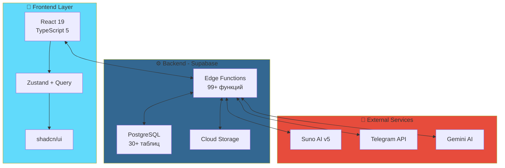

<p align="center">
  
</p>

<h1 align="center">🎵 AI MusicVerse</h1>

<p align="center">
  <strong>Профессиональная платформа AI для создания музыки в Telegram</strong><br>
  <em>Трансформируйте идеи в музыку с помощью мощного ИИ</em><br>
  <sub>Powered by Suno AI v5 • Telegram Mini App • 277+ музыкальных стилей • 75+ языков</sub>
</p>

<p align="center">
  <a href="https://github.com/HOW2AI-AGENCY/aimusicverse/actions">
    
  </a>
  <a href="https://github.com/HOW2AI-AGENCY/aimusicverse/commits">
    
  </a>
  <a href="https://github.com/HOW2AI-AGENCY/aimusicverse/pulse">
    
  </a>
  <a href="https://github.com/HOW2AI-AGENCY/aimusicverse/issues">
    
  </a>
  <a href="https://github.com/HOW2AI-AGENCY/aimusicverse/pulls">
    
  </a>
</p>

<p align="center">
  
  
  
  
  
  
</p>

<p align="center">
  
  
  
  
  
</p>

<p align="center">
  
  
  
</p>

<p align="center">
  <a href="https://t.me/AIMusicVerseBot/app">
    
  </a>
  <a href="https://t.me/AIMusicVerse">
    
  </a>
  <a href="#-документация">
    
  </a>
  <a href="#-участие-в-разработке">
    
  </a>
</p>

<p align="center">
  <a href="https://github.com/HOW2AI-AGENCY/aimusicverse/stargazers">
    
  </a>
  <a href="https://github.com/HOW2AI-AGENCY/aimusicverse/network/members">
    
  </a>
  <a href="https://github.com/HOW2AI-AGENCY/aimusicverse/watchers">
    
  </a>
</p>

---

## 📑 Содержание

<table>
<tr>
<td width="50%">

### 🚀 Начало работы
- [✨ Возможности](#-возможности)
- [🎯 Быстрая навигация](#-быстрая-навигация)
- [🚀 Быстрый старт](#-быстрый-старт)
- [📊 Ключевые метрики](#-ключевые-метрики)

### 🏗️ Архитектура и технологии
- [🏛️ Архитектура системы](#-архитектура-системы)
- [📁 Структура проекта](#-структура-проекта)
- [🎨 Стек технологий](#-стек-технологий)

</td>
<td width="50%">

### 📖 Документация и разработка
- [📚 Документация](#-документация)
- [🧪 Тестирование](#-тестирование)
- [📱 Мобильная разработка](#-мобильная-разработка)
- [♿ Доступность](#-доступность)

### 🤝 Сообщество и поддержка
- [🔒 Безопасность](#-безопасность)
- [⚡ Производительность](#-производительность)
- [❤️ Участие в разработке](#-участие-в-разработке)
- [📞 Поддержка и сообщество](#-поддержка-и-сообщество)

</td>
</tr>
</table>

---

## ✨ Возможности

### 🎹 Генерация музыки с помощью ИИ
<details>
<summary><strong>Создание музыки на основе ИИ Suno v5</strong></summary>

- **Генерация из текста** — Создавайте профессиональные треки по описанию
- **A/B версии** — Каждая генерация создаёт 2 варианта для сравнения
- **Предпросмотр в реальном времени** — Слушайте во время генерации
- **Пользовательский режим** — Полный контроль над текстами и стилем
- **AI Lyrics Agent** — 10+ инструментов для работы с текстами
- **AI Lyrics Chat** — Чат-ассистент для написания текстов
- **Голосовой ввод** — Диктуйте описание через Whisper API
- **Автосохранение черновиков** — Форма сохраняется на 30 минут
- **174+ мета-тегов** — Детальное управление музыкой
- **75+ языков** — Поддержка мировой аудитории

</details>

### 📚 Расширенное управление треками
<details>
<summary><strong>Интеллектуальная библиотека с оптимизацией производительности</strong></summary>

- **Виртуализованные списки** — Плавная прокрутка 1000+ треков
- **Ленивая загрузка изображений** — Размытый эффект для обложек
- **Режимы Grid и List** — Гибкие варианты просмотра
- **Swipe-действия** — Быстрые мобильные операции
- **Управление версиями** — Переключение A/B версий
- **Оптимизированные лайки** — Реал-тайм обновления
- **Mobile-first UI** — Touch targets 44×56px
- **Массовые операции** — Выделение и групповые действия

</details>

### 🎧 Профессиональный аудиоплеер
<details>
<summary><strong>Глобальная аудиосистема с продвинутым воспроизведением</strong></summary>

- **Глобальный аудиодвигатель** — Единый синхронизированный источник звука
- **Мультирежимный интерфейс** — Компактный, расширенный и полноэкранный режимы
- **Синхронизированные тексты** — Подсветка текстов с точностью ±0.05s
- **Умный автоскролл** — Интеллектуальное отслеживание с распознаванием жестов
- **Очередь воспроизведения** — Play Next, Add to Queue, Shuffle, Queue Panel
- **Аудиовизуализатор** — Анализ частот в реальном времени
- **Воспроизведение версий** — Плавное переключение A/B версий

</details>

### 🎛️ Unified Studio — Профессиональное рабочее место
<details>
<summary><strong>Профессиональные инструменты музыкального производства</strong></summary>

- **Единый интерфейс** — Одно рабочее место для всех задач
- **Замена секций** — Перегенерация отдельных сегментов трека
- **Разделение стемов** — Изолируйте вокал, барабаны, басс, инструменты
- **Продвинутое микширование** — Громкость, панорамирование, соло, отключение
- **MIDI экспорт** — 6 AI моделей для транскрипции в MIDI, GP5, PDF, MusicXML
- **Редактирование волновой формы** — Визуальное редактирование waveform
- **Обработка эффектов** — Реверберация, EQ, компрессия встроены

</details>

### 🎮 Система геймификации
<details>
<summary><strong>Механика взаимодействия и награды</strong></summary>

- **Ежедневная отметка** — Система ежедневных вознаграждений
- **Серии** — Отслеживание активности пользователя
- **Прогрессивные уровни** — Система прогрессии на основе XP
- **Достижения** — Разблокируемые значки с наградами
- **Таблица лидеров** — 5 категорийных рейтингов
- **Система кредитов** — Внутриигровая валюта для функций

</details>

### 🤖 Интеграция Telegram
<details>
<summary><strong>Нативный опыт Telegram Mini App</strong></summary>

- **Mini App SDK 2.0** — Полное встроенное приложение в Telegram
- **Bot команды** — `/generate`, `/cover`, `/extend`, `/library`
- **Inline запросы** — Поиск и обмен треками напрямую
- **Push уведомления** — Оповещения о готовности треков
- **Deep linking** — Прямые ссылки на треки, плейлисты, студию

</details>

---

## 🎯 Быстрая навигация

> **Статус проекта:** ✅ Production Ready | Оценка здоровья: 98/100 | Прогресс: 100%
> **Последнее обновление:** 25 июня 2026

### 📊 Основная документация

| 📋 Документ | 📝 Назначение | ✅ Статус |
|:----|:----|:----|
| [PROJECT_STATUS.md](PROJECT_STATUS.md) | Полный статус проекта | ✅ Обновлён (2026-06-25) |
| [ROADMAP.md](ROADMAP.md) | Дорожная карта развития | ✅ Активна |
| [KNOWLEDGE_BASE.md](KNOWLEDGE_BASE.md) | База знаний проекта | ✅ Комплексная |
| [DOCUMENTATION_INDEX.md](DOCUMENTATION_INDEX.md) | Полная карта документации | ✅ Актуальна |
| [CLAUDE.md](CLAUDE.md) | Инструкции для ИИ | ✅ Полная |

### 🔗 Ресурсы разработки

| 🛠️ Ресурс | 📄 Описание |
|:----|:----|
| [GitHub Issues](https://github.com/HOW2AI-AGENCY/aimusicverse/issues) | Отчёты об ошибках и запросы |
| [GitHub PRs](https://github.com/HOW2AI-AGENCY/aimusicverse/pulls) | Изменения кода и ревью |
| [GitHub Actions](https://github.com/HOW2AI-AGENCY/aimusicverse/actions) | Автоматизация CI/CD |
| [GitHub Projects](https://github.com/HOW2AI-AGENCY/aimusicverse/projects) | Доски задач |
| [GitHub Discussions](https://github.com/HOW2AI-AGENCY/aimusicverse/discussions) | Обсуждения сообщества |

### 📋 Управление спринтами

| 📄 Документ | 📝 Назначение |
|:----|:----|
| [SPRINTS/README.md](SPRINTS/README.md) | Обзор системы спринтов |
| [SPRINTS/SPRINT-PROGRESS.md](SPRINTS/SPRINT-PROGRESS.md) | Текущий прогресс |
| [SPRINTS/BACKLOG.md](SPRINTS/BACKLOG.md) | Продуктовый бэклог |
| [SPRINTS/FUTURE_WORK_PLAN_2026.md](SPRINTS/FUTURE_WORK_PLAN_2026.md) | План на 2026 |
| [SPRINTS/completed/](SPRINTS/completed/) | Архив завершённых спринтов |

---

## 📊 Ключевые метрики

### 📈 Статистика проекта

| 📌 Метрика | 💯 Значение | 📊 Тренд | 📝 Детали |
|:----|:----|:----|:----|
| **Активные пользователи** | 574+ | 📈 Растёт | Ежемесячная активность |
| **Созданные треки** | 1,666+ | 📈 Активно | Всего создано |
| **Успех генерации** | 88% | 🟢 Стабильно | Средний результат |
| **DAU** | 25+ | 📈 Растёт | Ежедневное взаимодействие |
| **React компоненты** | 1,124+ | ✅ Оптимизировано | Хорошая структура |
| **TypeScript файлы** | 1,957+ | ✅ Типизировано | Полное покрытие |
| **E2E тесты** | 62+ | ✅ Комплексное | Покрытие |
| **Unit тесты** | 27+ | ✅ Хорошее | Граничные случаи |
| **API Endpoints** | 99+ | ✅ Полное | Edge функции |

### ⚡ Производительность

| 📊 Метрика | 📈 Текущее | 🎯 Целевое | ✅ Статус |
|:----|:----|:----|:----|
| **Bundle Size** | 950 KB | 950 KB | ✅ В бюджете |
| **FCP** | 1.2s | 1.8s | ✅ Отлично |
| **LCP** | 2.1s | 2.5s | ✅ Хорошо |
| **TTI** | 3.5s | 3.5s | ✅ На целевом |

---

## 🏛️ Архитектура системы

### 🌐 Многоуровневая архитектура


```mermaid
graph TB
    subgraph Frontend["🎵 Frontend Layer"]
        A["React 19<br/>TypeScript 5"]
        B["Zustand + Query"]
        C["shadcn/ui"]
    end

    subgraph Backend["⚙️ Backend - Supabase"]
        D["PostgreSQL<br/>30+ таблиц"]
        E["Edge Functions<br/>99+ функций"]
        F["Cloud Storage"]
    end

    subgraph External["🔗 External Services"]
        G["Suno AI v5"]
        H["Telegram API"]
        I["Gemini AI"]
    end

    A --> B
    B --> C
    A <--> E
    E <--> D
    E <--> F
    E <--> G
    E <--> H
    E <--> I

    style Frontend fill:#61DAFB
    style Backend fill:#336791
    style External fill:#e74c3c
```

### 📁 Структура проекта

```
aimusicverse/
├── src/
│   ├── components/           # 1,124+ React компоненты
│   ├── hooks/               # 200+ кастомных хуков
│   ├── services/            # Бизнес-логика (13)
│   ├── api/                 # Supabase API слой
│   ├── stores/              # Zustand хранилища (8)
│   ├── pages/               # Маршруты (40+)
│   ├── lib/                 # Утилиты (60+)
│   ├── types/               # TypeScript типы
│   ├── contexts/            # React контексты (10)
│   └── assets/              # Статика
├── tests/
│   ├── e2e/                 # 62+ Playwright тесты
│   ├── unit/                # 27+ Jest тестов
│   └── integration/         # API интеграционные
├── supabase/functions/      # 99+ Edge Functions
├── docs/                    # 100+ файлов документации
├── ADR/                     # Architecture Decisions
├── specs/                   # 6 спецификаций
└── SPRINTS/                 # 35+ завершённых спринтов
```

---

## 🎨 Стек технологий

### 🖥️ Frontend
| Технология | Версия | Назначение |
|:----|:----|:----|
| **React** | 19.2 | UI фреймворк |
| **TypeScript** | 5.9 | Типизация |
| **Vite** | 5.0 | Сборка |
| **Tailwind** | 3.4 | Стили |
| **shadcn/ui** | Latest | Компоненты |
| **Framer Motion** | Latest | Анимации |

### 💾 Backend
| Технология | Назначение |
|:----|:----|
| **Supabase** | BaaS |
| **PostgreSQL** | БД |
| **Edge Functions** | Serverless |
| **RLS** | Безопасность |

### 🔧 Тестирование
| Инструмент | Использование |
|:----|:----|
| **Jest** | Unit тесты |
| **Playwright** | E2E тесты |
| **ESLint** | Линтинг |
| **TypeScript** | Типы |

---

## 🧪 Тестирование

| 📊 Тип | 🛠️ Фреймворк | 📈 Тестов | 📋 Покрытие | ✅ Статус |
|:----|:----|:----|:----|:----|
| **Unit** | Jest 30.2 | 27+ | 70%+ | ✅ Хорошо |
| **E2E** | Playwright 1.57 | 62+ | Критические | ✅ Отлично |
| **Integration** | Playwright | 12+ | API | ✅ Хорошо |
| **Performance** | Lighthouse | Бюджеты | В пределах | ✅ Проходит |
| **A11y** | axe-core | WCAG AA | Полное | ✅ Проходит |

```bash
# Запуск тестов
npm test                 # Unit тесты
npm run test:e2e        # E2E тесты
npm run test:all        # Все тесты
npm run audit:a11y      # Доступность
```

---

## 📱 Мобильная разработка

### ✅ Реализовано
- **19 мобильных компонентов** — Touch-оптимизация
- **950KB Bundle** — Производительность
- **44-56px Touch targets** — Доступность
- **iOS Audio Pooling** — Стабильность
- **Safe Area Padding** — Notch/island поддержка

### 🚧 В разработке
- Haptic feedback
- CloudStorage API
- Голосовой ввод
- Offline режим
- PWA функции

---

## 🚀 Быстрый старт

### 💻 Локальная разработка

```bash
# Клонировать
git clone https://github.com/HOW2AI-AGENCY/aimusicverse.git
cd aimusicverse

# Установить
npm install

# Разработка
npm run dev

# Тесты
npm test && npm run test:e2e

# Production
npm run build
```

### 🔧 Переменные окружения (`.env.local`)
```env
VITE_SUPABASE_URL=ваш_url
VITE_SUPABASE_ANON_KEY=ваш_key
VITE_TELEGRAM_BOT_TOKEN=ваш_token
```

---

## 🔒 Безопасность

- ✅ **RLS политики** — Защита всех таблиц
- ✅ **Telegram auth** — HMAC валидация
- ✅ **Управление секретами** — Переменные окружения
- ✅ **HTML санитизация** — DOMPurify
- ✅ **Контроль доступа** — is_public флаги
- ✅ **Логирование** — Logger утилита
- ✅ **CORS** — Ограничение доменов
- ✅ **Rate limiting** — Throttling

---

## ⚡ Производительность

- **Code Splitting** — По маршрутам
- **Tree Shaking** — Оптимизация bundle
- **Lazy Loading** — Ленивая загрузка
- **Virtualization** — react-virtuoso
- **WebP Images** — Оптимизированные изображения
- **Query Caching** — TanStack Query

---

## 📖 Документация

| 📚 Раздел | 📄 Документ | ✅ Статус |
|:----|:----|:----|
| **Начало** | [QUICK_START.md](docs/QUICK_START.md) | ✅ Актуально |
| **Архитектура** | [ARCHITECTURE.md](docs/ARCHITECTURE_DIAGRAMS.md) | ✅ Актуально |
| **БД** | [DATABASE.md](docs/DATABASE.md) | ✅ Актуально |
| **API** | [SUNO_API.md](docs/SUNO_API.md) | ✅ Актуально |
| **Студия** | [STEM_STUDIO.md](docs/STEM_STUDIO.md) | ✅ Актуально |
| **Тесты** | [TESTING.md](docs/TESTING_INFRASTRUCTURE.md) | ✅ Актуально |

**Быстрые ссылки:**
- [Индекс документации](DOCUMENTATION_INDEX.md)
- [Дорожная карта](ROADMAP.md)
- [История изменений](CHANGELOG.md)
- [Известные проблемы](docs/KNOWN_ISSUES.md)
- [Статус проекта](PROJECT_STATUS.md)
- [Управление спринтами](SPRINTS/README.md)

---

## ❤️ Участие в разработке

### 📋 Процесс контрибуции
1. Fork репозитория
2. Создайте feature branch (`git checkout -b feature/NewFeature`)
3. Commit изменения (`git commit -m 'Add NewFeature'`)
4. Push в branch (`git push origin feature/NewFeature`)
5. Откройте Pull Request

### ✅ PR Чеклист
- [ ] Тесты проходят (`npm test && npm run test:e2e`)
- [ ] Линтинг проходит (`npm run lint`)
- [ ] Bundle в норме (`npm run build && npm run size`)
- [ ] Документация обновлена
- [ ] Код следует стилю

### 📚 Ресурсы
- [CONTRIBUTING.md](CONTRIBUTING.md) — Правила
- [DEVELOPMENT.md](docs/DEVELOPMENT_WORKFLOW.md) — Workflow
- [ONBOARDING.md](docs/ONBOARDING.md) — Онбординг
- [CODE_OF_CONDUCT.md](CODE_OF_CONDUCT.md) — Стандарты

---

## 📞 Поддержка и сообщество

### 🤝 Официальные каналы
- **🤖 Telegram Bot:** [@AIMusicVerseBot](https://t.me/AIMusicVerseBot)
- **📱 Mini App:** [Открыть](https://t.me/AIMusicVerseBot/app)
- **📢 Новости:** [@AIMusicVerse](https://t.me/AIMusicVerse)
- **🐛 Issues:** [GitHub Issues](https://github.com/HOW2AI-AGENCY/aimusicverse/issues)
- **💬 Discussions:** [GitHub Discussions](https://github.com/HOW2AI-AGENCY/aimusicverse/discussions)
- **📧 Email:** [team@musicverse.ai](mailto:team@musicverse.ai)

---

## 📊 GitHub Analytics

<p align="center">
  <a href="https://github.com/HOW2AI-AGENCY/aimusicverse/stargazers">
    
  </a>
  <a href="https://github.com/HOW2AI-AGENCY/aimusicverse/network/members">
    
  </a>
  <a href="https://github.com/HOW2AI-AGENCY/aimusicverse/watchers">
    
  </a>
</p>

---

## 📜 Лицензия

MIT License — см. [LICENSE](LICENSE) для деталей.

---

## 🙏 Благодарности

- [Suno AI](https://suno.ai/) — Генерация музыки
- [Telegram](https://telegram.org/) — Mini App платформа
- [Supabase](https://supabase.com/) — Backend
- [shadcn/ui](https://ui.shadcn.com/) — Компоненты
- [Framer Motion](https://www.framer.com/motion/) — Анимации

---

<p align="center">
  <h2>⭐ Поддержите нас!</h2>
  <p>Если MusicVerse AI вам помогает, пожалуйста:</p>
  <ul style="list-style: none; padding: 0;">
    <li>⭐ Поставьте звёзду на GitHub</li>
    <li>🔗 Поделитесь с друзьями</li>
    <li>📢 Упомяните нас в своих проектах</li>
    <li>💬 Оставьте отзыв</li>
  </ul>
</p>

---

<p align="center">
  <sub>Сделано с ❤️ командой MusicVerse AI</sub><br>
  <sub><strong>Версия:</strong> 1.0.0 | <strong>Обновлено:</strong> 25 июня 2026</sub><br><br>
  <a href="#-musicverse-ai">🔝 В начало</a>
</p>