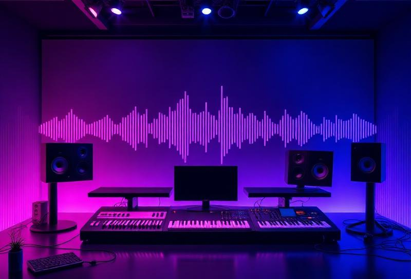
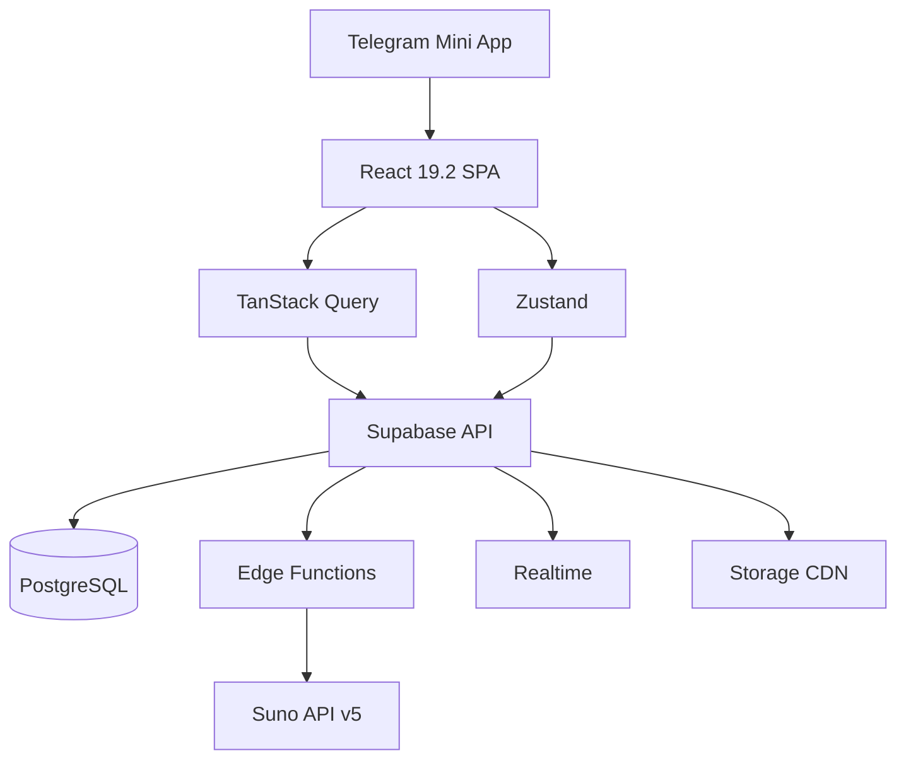

<div align="center">


**AI-powered music creation platform — прямо в Telegram**

<p>
  <a href="https://github.com/HOW2AI-AGENCY/aimusicverse/actions"></a>
  <a href="https://github.com/HOW2AI-AGENCY/aimusicverse/releases"></a>
  <a href="LICENSE"></a>
  
  <a href="https://t.me/AIMusicVerseBot"></a>
</p>

     

<p>
  <a href="#-быстрый-старт"></a>
  <a href="#-для-инвесторов"></a>
  <a href="#-скриншоты"></a>
  <a href="#-возможности"></a>
  <a href="DOCUMENTATION_INDEX.md"></a>
  <a href="CONTRIBUTING.md"></a>
  <a href="ROADMAP.md"></a>
</p>

</div>

---

## 📱 Скриншоты

<div align="center">

|                   Главная                   |                   Плеер                   |                 Студия                  |                  Библиотека                  |
| :-----------------------------------------: | :---------------------------------------: | :-------------------------------------: | :------------------------------------------: |
|  |  |  |  |

<sub>Скриншоты из Telegram Mini App. Для автоматической генерации: `npx playwright test scripts/capture-screenshots.ts`</sub>

</div>

---

## 💰 Для инвесторов

| Метрика               |                                                                                                 Значение                                                                                                  |
| --------------------- | :-------------------------------------------------------------------------------------------------------------------------------------------------------------------------------------------------------: |
| ⭐ GitHub Stars       |                                                                                                                      |
| 📦 Размер бандла      |  |
| 🧪 Покрытие кода      |                                                                                                                  |
| 🔒 Безопасность       |                                                                                                                            |
| 📊 Спринтов завершено |                                                                                                  **35**                                                                                                   |
| 🏗 Компонентов        |                                                                                                  **987**                                                                                                  |
| 🔧 Хуков              |                                                                                                  **347**                                                                                                  |
| 🚀 Стадия             |                                                                                     **Pre-Seed / Active Development**                                                                                     |

> **MusicVerse AI** демократизирует создание музыки через AI-powered инструменты прямо в Telegram. Первый продукт, который делает профессиональное музыкальное производство доступным для 900М+ пользователей Telegram.

- **Бизнес-модель**: Freemium + подписка (Stars Payment в Telegram)
- **Рынок**: MusicTech + AI + Creator Economy ($12B+ к 2027)
- **Текущий фокус**: Стабилизация продукта, ESLint enforcement, архитектурная чистка (Sprint 035, 94% overall)

---

## 📊 Прогресс проекта

```mermaid
gantt
    title Дорожная карта 2026
    dateFormat YYYY-MM-DD
    axisFormat %b %d
    section Завершено ✅
    Sprint 033: UX-аудит              :done, 033, 2026-04-01, 2026-04-30
    Sprint 034: Надёжность генерации   :done, 034, 2026-05-01, 2026-05-31
    033-mobile: Мобильные улучшения    :done, 033m, 2026-06-01, 2026-06-28
    Sprint 035: Стабилизация + Чистка   :active, 035, 2026-06-28, 2026-07-15
    section Завершено (недавно) ✅
    Sprint 036: Рефакторинг            :done, 036, 2026-05-15, 2026-06-15
    Sprint 037: Infrastructure Hardening :done, 037, 2026-06-15, 2026-06-29
    section В работе 🟡
    Архитектурная чистка (035)         :active, 035a, 2026-06-28, 2026-07-15
    section Запланировано ⚪
    Sprint 038: DX и инфраструктура    :038, 2026-07-15, 2026-09-01
```

| Спринт | Название                        | Статус | Прогресс |
| :----: | ------------------------------- | :----: | :------: |
|  033   | UX-аудит и переработка          |   ✅   |   100%   |
|  033m  | Mobile UI Improvements          |   ✅   | 114/114  |
|  034   | Надёжность генерации            |   ✅   |   100%   |
|  035   | Стабилизация + Чистка           |   🟡   | В работе |
|  036   | Рефакторинг слоёв + Type Safety |   ✅   |   100%   |
|  037   | Infrastructure Hardening        |   ✅   |   100%   |
|  038   | DX и инфраструктура             |   ⚪   |    0%    |

<sub>Подробнее: [ROADMAP.md](./ROADMAP.md) · [PROJECT_STATUS.md](./PROJECT_STATUS.md)</sub>

---

## 🚀 Быстрый старт

```bash
git clone https://github.com/HOW2AI-AGENCY/aimusicverse.git
cd aimusicverse
npm install
npm run dev        # http://localhost:5173
npm run check-all  # lint + format + typecheck + test
```

> [!TIP]
> Откройте [http://localhost:5173](http://localhost:5173) в браузере. Приложение оптимизировано под мобильные устройства (375×812).

---

## ✨ Возможности

| Категория       | Функция                                      | Статус |
| --------------- | -------------------------------------------- | :----: |
| 🎵 AI-генерация | Suno API v5 с A/B версиями                   |   ✅   |
| 🎤 Voice Clone  | Клонирование голоса                          |   ✅   |
| 📝 Lyrics AI    | AI-помощник для текстов                      |   ✅   |
| 🎸 Инструменты  | Гитара, драм-машина, микшер                  |   ✅   |
| 🏗 Студия       | Мультитрек-редактор (Studio Lite/Pro)        |   ✅   |
| 👥 Сообщество   | Лента, артисты, блог                         |   ✅   |
| 💎 Монетизация  | Stars Payment, подписки                      |   ✅   |
| 📊 Аналитика    | Dashboard, A/B тесты                         |   ✅   |
| 🔔 Уведомления  | In-app + Push (завершение генерации)         |   ✅   |
| ♿ Доступность  | WCAG AA, 14px min, клавиатурная навигация    |   ✅   |
| 📱 Telegram     | MainButton, BackButton, Haptic, CloudStorage |   ✅   |

---

## 🏛 Архитектура


```mermaid
graph TD
    A[Telegram Mini App] --> B[React 19.2 SPA]
    B --> C[TanStack Query]
    B --> D[Zustand]
    C --> E[Supabase API]
    D --> E
    E --> F[(PostgreSQL)]
    E --> G[Edge Functions]
    G --> H[Suno API v5]
    E --> I[Realtime]
    E --> J[Storage CDN]
```

<sub>Подробнее: [ARCHITECTURE_HUB.md](./ARCHITECTURE_HUB.md) · [ADR/](./ADR/)</sub>

---

## 🛠 Технический стек

| Слой       | Технология                             |
| ---------- | -------------------------------------- |
| Frontend   | React 19.2, TypeScript 5.9, Vite 5     |
| Стиль      | Tailwind CSS 3.4, shadcn/ui            |
| Состояние  | Zustand, TanStack Query                |
| Бэкенд     | Supabase (PostgreSQL + RLS + Realtime) |
| Serverless | 120+ Edge Functions (Deno/TypeScript)  |
| Тесты      | Vitest 4.x, Playwright 1.61            |
| CI/CD      | GitHub Actions (5 jobs, 3 браузера)    |
| Платформа  | Telegram Mini App (WebView)            |

---

## 📁 Структура проекта

```text
aimusicverse/
├── src/
│   ├── components/     # 987 компонентов
│   ├── hooks/          # 347 хуков
│   ├── pages/          # 57 страниц
│   ├── api/            # 20 API-файлов
│   ├── services/       # 18 сервисов
│   ├── stores/         # 17 Zustand stores
│   └── lib/            # Утилиты, дизайн-токены
├── supabase/           # 120+ Edge Functions
├── docs/               # 100+ файлов документации
├── specs/              # 14 спец-директорий
├── SPRINTS/            # 50+ спринт-файлов
└── tests/              # unit + e2e тесты
```

---

## 📞 Контакты и ссылки

| Ресурс          | Ссылка                                           |
| --------------- | ------------------------------------------------ |
| 🤖 Telegram бот | [@AIMusicVerseBot](https://t.me/AIMusicVerseBot) |
| 📧 Email        | `hello@how2ai.agency`                            |
| 🌐 Сайт         | [how2ai.agency](https://how2ai.agency)           |
| 🛡 Безопасность | `security@how2ai.agency`                         |
| 📄 Лицензия     | [MIT](LICENSE)                                   |

---

<div align="center">

### 🔗 Навигация

[📚 Документация](./DOCUMENTATION_INDEX.md) · [🗺 Roadmap](./ROADMAP.md) · [📊 Статус](./PROJECT_STATUS.md) · [📝 Changelog](./CHANGELOG.md) · [🤝 Contributing](./CONTRIBUTING.md)

<sub>Обновлено: 29.06.2026 · HOW2AI Agency © 2025-2026</sub>

</div>
