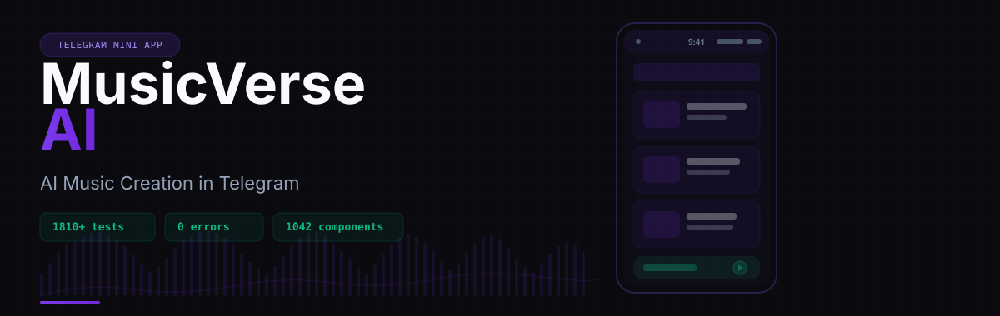
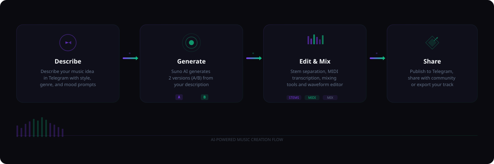
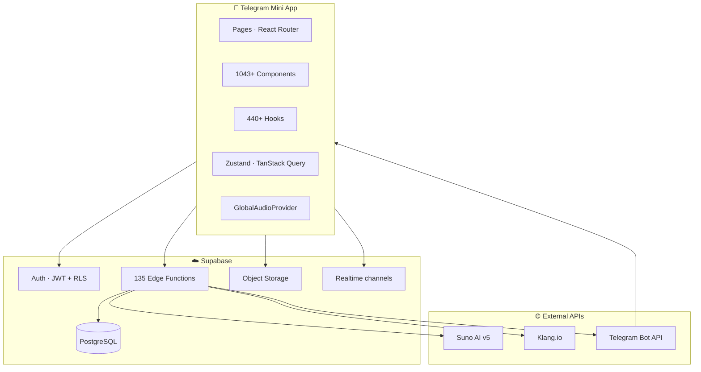
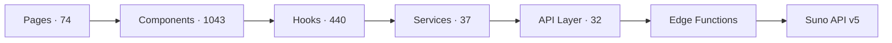
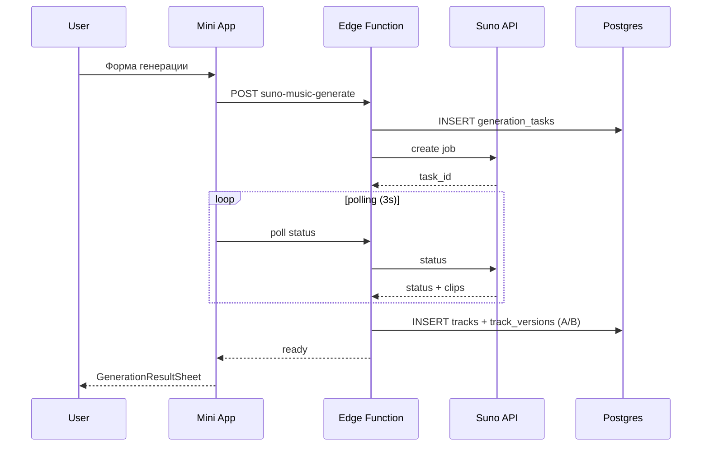
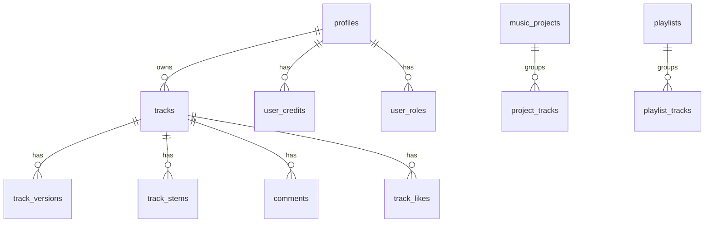

<!-- ╔══════════════════════════════════════════════════╗ -->
<!-- ║  NAVIGATION HEADER                               ║ -->
<!-- ╚══════════════════════════════════════════════════╝ -->

<div align="center">

# 🎵 MusicVerse AI — Music Creation in Telegram

   
 

**Профессиональная AI-генерация музыки прямо в Telegram Mini App. Suno AI v5, мультитрек-студия, A/B версии, MIDI, вокальный клон — без единого перехода во внешний сервис.**



<p>
  
  
  
  
  
  
  
  
  
</p>

<p>
  <a href="#🚀-быстрый-старт">🚀 Быстрый старт</a> ·
  <a href="#✨-возможности">✨ Возможности</a> ·
  <a href="#📱-скриншоты">📱 Скриншоты</a> ·
  <a href="#🏛-архитектура">🏛 Архитектура</a> ·
  <a href="#📊-прогресс-проекта">📊 Прогресс</a> ·
  <a href="#🛠-технический-стек">🛠 Стек</a> ·
  <a href="#📁-структура-проекта">📁 Структура</a> ·
  <a href="#📖-документация">📖 Документация</a>
</p>

</div>

---

<!-- ╔══════════════════════════════════════════════════╗ -->
<!-- ║  SITE NAVIGATION (next-prev between sections)    ║ -->
<!-- ╚══════════════════════════════════════════════════╝ -->

<div align="center">

| ← [DOCUMENTATION_INDEX](DOCUMENTATION_INDEX.md) | [ARCHITECTURE_HUB](ARCHITECTURE_HUB.md) → |
| :---------------------------------------------: | :---------------------------------------: |

</div>

---

> [!IMPORTANT]
> **Передаёте или принимаете проект?** Начните с [**🤝 HANDOFF.md**](HANDOFF.md) — что передаётся, какие аккаунты переоформить, как развернуть и принять проект.

---

## 📱 Скриншоты

<div align="center">

|                                                  Главная                                                   |                                                    Библиотека                                                    |                                                    Проекты                                                     |                                                   Студия                                                    |
| :--------------------------------------------------------------------------------------------------------: | :--------------------------------------------------------------------------------------------------------------: | :------------------------------------------------------------------------------------------------------------: | :---------------------------------------------------------------------------------------------------------: |
|  |  |  |  |

<sub>Реальные скриншоты приложения на мобильном viewport 390×844 (iPhone-class). Сгенерированы автоматически через Playwright из живого preview.</sub>
<p>
  
  
  
  
</p>

</div>

<sub><a href="#top">↑ К началу</a> · <a href="#✨-возможности">Далее: Возможности →</a></sub>

---

## ✨ Возможности

| Категория         | Функция                                                                                    | Статус |
| ----------------- | ------------------------------------------------------------------------------------------ | :----: |
| 🎨 AI-генерация   | 4 режима: Simple (prompt), Custom (lyrics), Cover (1 трек + style), Remix/Mashup (2 трека) |   ✅   |
| 🎤 Voice Clone    | Клонирование тембра + метка на треках                                                      |   ✅   |
| 📝 Lyrics AI      | AI-помощник для текстов                                                                    |   ✅   |
| 🤖 AI-харнесс     | 9 инструментов, контекст альбома, SSE stream                                               |   ✅   |
| 🎸 Инструменты    | Гитара, драм-машина, микшер                                                                |   ✅   |
| 🎛 MIDI            | SunoAPI (vocal/instrumental) + Klang.io (6 моделей для детальных стемов)                   |   ✅   |
| 🏗 Студия          | Мультитрек-редактор + DAW: mute/solo, EQ, compressor, reverb, waveform                     |   ✅   |
| 🔀 Стем-сепарация | Извлечение вокала/барабанов/баса (SunoAPI + Klang.io)                                      |   ✅   |
| 🎵 Кавер          | upload-cover API: 1 трек + style → новый трек                                              |   ✅   |
| 🔄 Ремикс (мэшап) | mashup API: 2 трека → сведение, выбор второго трека из проекта                             |   ✅   |
| 🔔 Уведомления    | In-app + Push, NotificationOrchestrator (приоритетная очередь, баннеры)                    |   ✅   |
| ♿ Доступность    | WCAG AA, 14px min, клавиатурная навигация                                                  |   ✅   |
| 📱 Telegram       | MainButton, BackButton, Haptic, CloudStorage                                               |   ✅   |
| 🌐 Локализация    | i18n EN/RU (react-i18next)                                                                 |   ✅   |

<div align="center">
<p>
  
  
  
  
  
  
  
  
  
  
</p>
</div>

<sub><a href="#📱-скриншоты">← Назад: Скриншоты</a> · <a href="#top">↑ К началу</a> · <a href="#🏛-архитектура">Далее: Архитектура →</a></sub>

---

## 🏛 Архитектура



### AI Lyrics Harness


**Трёхслойная архитектура AI-ассистента лирики:**

| Слой        | Компонент                        | Описание                                                                              |
| ----------- | -------------------------------- | ------------------------------------------------------------------------------------- |
| **UI**      | 9 action-пресетов                | Написать, продолжить, анализ, продюсер, Suno, рифмы, структура, стиль, перевод        |
| **Context** | Контекстный билдер               | Текст, секции, теги, заметки, жанр, настроение, позиция в альбоме, tracklist, история |
| **Backend** | Edge Function + Gemini 2.5 Flash | Промпт-реестр, SSE streaming, JSON-парсинг, Lovable AI Gateway                        |

📄 **Подробная документация:** [docs/AI_LYRICS_HARNESS.md](docs/AI_LYRICS_HARNESS.md)

### Системная архитектура


```mermaid
flowchart TB
    subgraph Client["📱 Telegram Mini App"]
        Pages[Pages · React Router]
        Comps[1043+ Components]
        Hooks[440+ Hooks]
        State[Zustand · TanStack Query]
        Audio[GlobalAudioProvider]
    end
    subgraph Backend["☁️ Supabase"]
        Auth[Auth · JWT + RLS]
        DB[(PostgreSQL)]
        Edge[135 Edge Functions]
        Storage[Object Storage]
        Realtime[Realtime channels]
    end
    subgraph External["🌐 External APIs"]
        Suno[Suno AI v5]
        Klang[Klang.io]
        Bot[Telegram Bot API]
    end
    Client --> Auth
    Client --> Edge
    Client --> Realtime
    Client --> Storage
    Edge --> DB
    Edge --> Suno
    Edge --> Klang
    Edge --> Bot
    Bot --> Client
```

Три уровня системы: **Telegram Mini App** (React-фронтенд — страницы, компоненты, хуки, состояние на Zustand и TanStack Query, единый аудио-провайдер), **бэкенд Supabase** (авторизация JWT + RLS, PostgreSQL, 135 Edge Functions, объектное хранилище и realtime-каналы) и **внешние API** (Suno AI v5, Klang.io, Telegram Bot API). Клиент работает с Supabase напрямую, а все обращения к внешним сервисам идут через Edge Functions; бот возвращает пользователя обратно в приложение.

### Слоёная архитектура (Layered)


```mermaid
flowchart LR
    P[Pages · 74] --> C[Components · 1043]
    C --> H[Hooks · 440]
    H --> Sv[Services · 37]
    Sv --> API[API Layer · 32]
    API --> Edge[Edge Functions]
    Edge --> Suno[Suno API v5]
```

Однонаправленный поток: Pages → Components → Hooks → Services → API → Edge Functions. RLS на всех таблицах с пользовательскими данными.

### Pipeline генерации


```mermaid
sequenceDiagram
    participant U as User
    participant FE as Mini App
    participant EF as Edge Function
    participant SA as Suno API
    participant DB as Postgres
    U->>FE: Форма генерации
    FE->>EF: POST suno-music-generate
    EF->>DB: INSERT generation_tasks
    EF->>SA: create job
    SA-->>EF: task_id
    loop polling (3s)
        FE->>EF: poll status
        EF->>SA: status
        SA-->>EF: status + clips
    end
    EF->>DB: INSERT tracks + track_versions (A/B)
    EF-->>FE: ready
    FE-->>U: GenerationResultSheet
```

Полный цикл генерации трека: пользователь отправляет форму → Mini App вызывает Edge Function `suno-music-generate` → создаётся запись в `generation_tasks` и запускается задание в Suno → приложение опрашивает статус каждые 3 секунды → по готовности сохраняются две версии трека (A/B) в `tracks` и `track_versions`, после чего открывается `GenerationResultSheet`.

### Схема базы данных


```mermaid
erDiagram
    profiles ||--o{ tracks : owns
    tracks ||--o{ track_versions : has
    tracks ||--o{ track_stems : has
    profiles ||--o{ user_credits : has
    profiles ||--o{ user_roles : has
    tracks ||--o{ comments : has
    tracks ||--o{ track_likes : has
    music_projects ||--o{ project_tracks : groups
    playlists ||--o{ playlist_tracks : groups
```

Ключевые сущности и связи: профиль владеет треками, каждый трек имеет версии (A/B) и стемы; к профилю привязаны кредиты и роли; треки накапливают комментарии и лайки; проекты и плейлисты объединяют треки через связующие таблицы.

<p>
  
  
  
</p>

> Подробнее: [`ARCHITECTURE_HUB.md`](ARCHITECTURE_HUB.md) · [`docs/DATABASE.md`](docs/DATABASE.md) · [`docs/SUNO_API.md`](docs/SUNO_API.md)

<sub><a href="#✨-возможности">← Назад: Возможности</a> · <a href="#top">↑ К началу</a> · <a href="#🚀-быстрый-старт">Далее: Быстрый старт →</a></sub>

---

## 🚀 Быстрый старт

```bash
git clone https://github.com/HOW2AI-AGENCY/aimusicverse.git
cd aimusicverse
npm install
npm run dev              # → http://localhost:8080
```

```bash
# Проверка качества перед коммитом
npm run check-all        # lint + format + typecheck
npm test -- --run        # 1857 unit tests
npm run build            # production build
```

> **Требования**: Node.js 22+, npm 11+. Приложение оптимизировано под мобильные устройства (375×812 Telegram WebView).

<p>
  
  
  
  
  
  
  
  
</p>

<sub><a href="#🏛-архитектура">← Назад: Архитектура</a> · <a href="#top">↑ К началу</a> · <a href="#📊-прогресс-проекта">Далее: Прогресс →</a></sub>

---

## 📊 Прогресс проекта

| Метрика                 | Значение                                                                       | Статус |
| ----------------------- | ------------------------------------------------------------------------------ | :----: |
| Unit тесты              | 1826 passing (176 test files)                                                  |   ✅   |
| Coverage                |  |   ✅   |
| TypeScript              | 0 errors (`--noEmit`)                                                          |   ✅   |
| E2E specs               | 59                                                                             |   ✅   |
| Components              | 1050+                                                                          |   ✅   |
| Hooks                   | 448+                                                                           |   ✅   |
| API files               | 35                                                                             |   ✅   |
| Services                | 38 `*.service.ts`                                                              |   ✅   |
| Stores                  | 25                                                                             |   ✅   |
| Suno edge functions     | 46 (25/44 с AbortSignal timeout)                                               |   ✅   |
| Files >800 LOC в `src/` | 0                                                                              |   ✅   |
| `any` budget            | 0/50                                                                           |   ✅   |
| ESLint warnings         | 525 (было 1744, −70%)                                                          |   ✅   |
| Bundle eager JS         | ~508 KB gzip                                                                   |   ✅   |
| Bundle total            | 2.11 MB gzip                                                                   |   🟡   |
| Branch Protection       | активна                                                                        |   ✅   |
| Спринтов завершено      | 51+                                                                            |   ✅   |

### Последние спринты

| Спринт | Фокус                                   |                                    Статус                                     |
| ------ | --------------------------------------- | :---------------------------------------------------------------------------: |
| 059    | Bundle optimization + API/Service tests |                                      ✅                                       |
| 060    | Design polish (search, search box)      |                                      ✅                                       |
| 061    | Vendor splits + barrel cleanup          |                                      ✅                                       |
| 062    | UI/UX Audit P0/P1/P2 (A+B+C)            |                                      ✅                                       |
| 063    | Homepage UX fixes + card refinement     |                                      ✅                                       |
| 064    | P2 polish: tablet cols, error, More     |                                      ✅                                       |
|        | 065                                     |                   Generate v2 + Home Redesign + Visual Regr                   | ✅  |
|        | 066                                     | Epic bugfix + stem studio + MIDI SunoAPI + Cover/Mashup split + Notifications | ✅  |

<sub><a href="#🚀-быстрый-старт">← Назад: Быстрый старт</a> · <a href="#top">↑ К началу</a> · <a href="#🛠-технический-стек">Далее: Технический стек →</a></sub>

---

### 🤖 Готовность к AI-разработке

<p>
  
  
  
  
</p>

Проект полностью готов к работе с AI-агентами. Система памяти хранит профиль пользователя (Honcho primary) и проектные решения (file-based secondary), handoff-хуки передают контекст между сессиями, а встроенный MCP-сервер позволяет AI-ассистентам управлять MusicVerse прямо из чата.

<p>
  
  
  
  
</p>

**Что сделано:**

- MCP-сервер — поиск треков, генерация Suno, управление библиотекой, OAuth 2.1
- Двухуровневая память — Honcho (cross-session) + file-based (проектные решения)
- Handoff-система — `stop-handoff.ps1` + `startup-handoff.ps1` через SessionStart/Stop хуки
- Zero tech debt — 0 any, 0 files >800 LOC, 0 tsc errors
- 1826 unit + 59 E2E тестов, активная branch protection

**Документация:**

- [docs/MCP.md](docs/MCP.md) — справочник MCP-инструментов и гайд по добавлению новых
- [ARCHITECTURE_HUB.md](ARCHITECTURE_HUB.md) — ADR, диаграммы, слои
- [DOCUMENTATION_INDEX.md](DOCUMENTATION_INDEX.md) — полный каталог

<sub><a href="#📊-прогресс-проекта">← Назад: Прогресс</a> · <a href="#top">↑ К началу</a> · <a href="#🛠-технический-стек">Далее: Технический стек →</a></sub>

---

## 🛠 Технический стек

| Слой                     | Технология                                                               |
| ------------------------ | ------------------------------------------------------------------------ |
| **Фреймворк**            | React 19.2, TypeScript 5.9, Vite 6.4.3                                   |
| **Стилизация**           | Tailwind CSS 3.4, shadcn/ui, Radix UI                                    |
| **Глобальное состояние** | Zustand 5.0 (25 stores)                                                  |
| **Серверное состояние**  | TanStack Query 5.90                                                      |
| **Бэкенд**               | Supabase (PostgreSQL + RLS + Realtime + Storage)                         |
| **Serverless**           | 120+ Edge Functions (Deno/TypeScript)                                    |
| **Аудио**                | Tone.js 14.9, Wavesurfer.js 7.8                                          |
| **MIDI**                 | SunoAPI (vocal/instrumental) + Klang.io (6 моделей для детальных стемов) |
| **Формы**                | React Hook Form + Zod                                                    |
| **Тесты unit**           | Vitest 4.x (jsdom)                                                       |
| **Тесты e2e**            | Playwright 1.61 (Chrome, Firefox, Safari, Mobile)                        |
| **Анимации**             | Framer Motion (через tree-shaking обёртку)                               |
| **CI/CD**                | GitHub Actions (5 jobs, 3 браузера)                                      |
| **Платформа**            | Telegram Mini App (@twa-dev/sdk 8.0.2)                                   |
| **Локализация**          | react-i18next, i18next-browser-languagedetector                          |

<sub><a href="#📊-прогресс-проекта">← Назад: Прогресс</a> · <a href="#top">↑ К началу</a> · <a href="#📁-структура-проекта">Далее: Структура →</a></sub>

---

## 📁 Структура проекта

```
aimusicverse/
├── src/
│   ├── api/              # 32 — Supabase запросы
│   ├── components/       # 1043 — UI + feature компоненты
│   │   ├── ui/           # shadcn/ui primitives
│   │   ├── player/       # Аудиоплеер (compact/expanded/fullscreen)
│   │   ├── generate-form/ # Форма генерации (simple/custom)
│   │   ├── studio/       # Unified Studio + микшер + стемы
│   │   ├── library/      # Библиотека треков
│   │   └── ...
│   ├── hooks/            # 440 — кастомные React хуки
│   ├── pages/            # 74 — роуты с lazy loading
│   ├── services/         # 37 — бизнес-логика
│   ├── stores/           # 25 — Zustand stores
│   ├── contexts/         # 10 — React Context (Auth, Theme, Telegram)
│   ├── lib/              # Утилиты, аудио, логгер
│   ├── i18n/             # Локализация EN/RU
│   └── App.tsx           # Root с lazy-роутами
├── supabase/
│   ├── functions/        # 120+ Edge Functions
│   └── migrations/       # PostgreSQL миграции
├── docs/                 # 100+ файлов документации
├── specs/                # 14 директорий спецификаций
├── SPRINTS/              # Планы спринтов
├── tests/
│   ├── e2e/              # Playwright: 59 specs
│   └── unit/             # Vitest: 1857 tests
└── scripts/              # Утилиты CI/CD
```

<sub><a href="#🛠-технический-стек">← Назад: Стек</a> · <a href="#top">↑ К началу</a> · <a href="#📖-документация">Далее: Документация →</a></sub>

## 📖 Документация

| Раздел                      | Адрес                                                                      | Для кого      |
| --------------------------- | -------------------------------------------------------------------------- | ------------- |
| 🤝 **Передача проекта**     | [HANDOFF.md](HANDOFF.md)                                                   | Заказчик      |
| 📚 **Documentation Index**  | [DOCUMENTATION_INDEX.md](DOCUMENTATION_INDEX.md)                           | Все роли      |
| 🏛 **Архитектура**           | [ARCHITECTURE_HUB.md](ARCHITECTURE_HUB.md)                                 | Разработчики  |
| 🗺 **Roadmap**               | [ROADMAP.md](ROADMAP.md)                                                   | PM            |
| 📊 **Статус проекта**       | [PROJECT_STATUS.md](PROJECT_STATUS.md)                                     | Все           |
| 📝 **Changelog**            | [CHANGELOG.md](CHANGELOG.md)                                               | Все           |
| 🤝 **Contributing**         | [CONTRIBUTING.md](CONTRIBUTING.md)                                         | Контрибьюторы |
| 🔒 **Security**             | [SECURITY.md](SECURITY.md)                                                 | Безопасность  |
| 🗂 **Структура репозитория** | [REPOSITORY_STRUCTURE.md](REPOSITORY_STRUCTURE.md)                         | Онбординг     |
| 🛠 **Dev гайд**              | [docs/DEVELOPER_GUIDE.md](docs/DEVELOPER_GUIDE.md)                         | Разработчики  |
| 🎨 **Design System**        | [docs/DESIGN_SYSTEM_COMPREHENSIVE.md](docs/DESIGN_SYSTEM_COMPREHENSIVE.md) | Дизайнеры     |
| 🤖 **MCP-сервер (агенты)**  | [docs/MCP.md](docs/MCP.md)                                                 | AI-интеграции |

### 🤖 MCP-сервер — управление MusicVerse из AI-ассистентов

MusicVerse AI поставляется со встроенным **Model Context Protocol** сервером —
ChatGPT, Claude, Cursor, Codex и Lovable могут искать треки в публичном
каталоге, вести библиотеку и **запускать реальные генерации Suno** прямо из чата.

- **Endpoint:** `https://<project-ref>.supabase.co/functions/v1/mcp`
- **Аутентификация:** Supabase OAuth 2.1 с dynamic client registration
  (согласие выдаётся на странице [`/.lovable/oauth/consent`](src/pages/OAuthConsent.tsx))
- **Публичные инструменты** работают без логина: `search_public_tracks`,
  `get_track`, `get_track_stems`, `list_track_versions`, `get_public_profile`,
  `list_track_comments`.
- **Инструменты с OAuth** действуют от лица авторизованного пользователя (RLS
  применяется как в UI): `list_my_tracks`, `list_my_playlists`, `get_my_profile`,
  `get_my_credits`, `like_track`, `follow_user`, `create_playlist`,
  `add_track_to_playlist`, `remove_track_from_playlist`, `switch_active_version`,
  `generate_track` (запускает Suno-генерацию, списывает кредиты),
  `get_generation_status`.

Исходники — [`src/lib/mcp/`](src/lib/mcp), генерируется единственная Supabase
Edge Function `supabase/functions/mcp/index.ts` (авто-переписывается на каждой
сборке, редактировать вручную нельзя). Полный справочник инструментов, рецепты
использования и гайд по добавлению новых — в [docs/MCP.md](docs/MCP.md).

<sub><a href="#📁-структура-проекта">← Назад: Структура</a> · <a href="#top">↑ К началу</a></sub>

---

<!-- ╔══════════════════════════════════════════════════╗ -->
<!-- ║  FOOTER — полная карта документации и ссылки      ║ -->
<!-- ╚══════════════════════════════════════════════════╝ -->

<div align="center">

### 🗺 Навигация по репозиторию

| Раздел               | Ссылка                              | Описание             |
| -------------------- | ----------------------------------- | -------------------- |
| 🏠 **Главная**       | [README](README.md)                 | Этот документ        |
| 🤝 **Передача**      | [HANDOFF](HANDOFF.md)               | Приёмка заказчиком   |
| 📚 **Документация**  | [Index](DOCUMENTATION_INDEX.md)     | Полный каталог docs/ |
| 🏛 **Архитектура**    | [Hub](ARCHITECTURE_HUB.md)          | ADR, диаграммы, слои |
| 🗺 **Дорожная карта** | [ROADMAP](ROADMAP.md)               | План Q3 2026         |
| 📊 **Статус**        | [PROJECT_STATUS](PROJECT_STATUS.md) | Метрики, спринты     |
| 📝 **Changelog**     | [CHANGELOG](CHANGELOG.md)           | Релизы               |

### 🔁 Быстрые ссылки

| Назначение           | Команда / Ссылка                                 |
| -------------------- | ------------------------------------------------ |
| Запустить dev-сервер | `npm run dev` (порт 8080)                        |
| Запустить тесты      | `npm test -- --run`                              |
| Собрать production   | `npm run build`                                  |
| Проверить бандл      | `npm run size`                                   |
| Storybook            | `npm run storybook` (порт 6006)                  |
| Telegram бот         | [@AIMusicVerseBot](https://t.me/AIMusicVerseBot) |
| Сайт                 | [how2ai.agency](https://how2ai.agency)           |

### 🧭 Потоки онбординга

```
Заказчик    → HANDOFF → DEPLOYMENT_GUIDE → MAINTENANCE
Новичок     → README → ARCHITECTURE_HUB → CONTRIBUTING
Разработчик → CLAUDE.md → REPOSITORY_STRUCTURE → ARCHITECTURE_HUB
Дизайнер    → DESIGN_SYSTEM → DESIGN_TOKENS → LAYOUT_SYSTEM
PM          → PROJECT_STATUS → ROADMAP → CHANGELOG
Контрибьютор→ CONTRIBUTING → Issues → SECURITY
```

---

<p>
  <a href="https://github.com/HOW2AI-AGENCY/aimusicverse"></a>
  <a href="https://t.me/AIMusicVerseBot"></a>
  <a href="https://how2ai.agency"></a>
  <a href="mailto:hello@how2ai.agency"></a>
</p>

**Лицензия:** MIT · **Авторские права:** HOW2AI Agency © 2025–2026 · **Безопасность:** `security@how2ai.agency`

<sub>Последнее обновление: 2026-07-26 · Sprint 066 (Epic bugfix + stem studio + MIDI SunoAPI + Cover/Mashup split + Notifications) · tsc 0 errors · react-hooks 0 warnings · 1826 unit tests · 59 E2E specs · 25/44 edge funcs with timeouts · [🤝 Передача проекта](HANDOFF.md)</sub>

</div>
