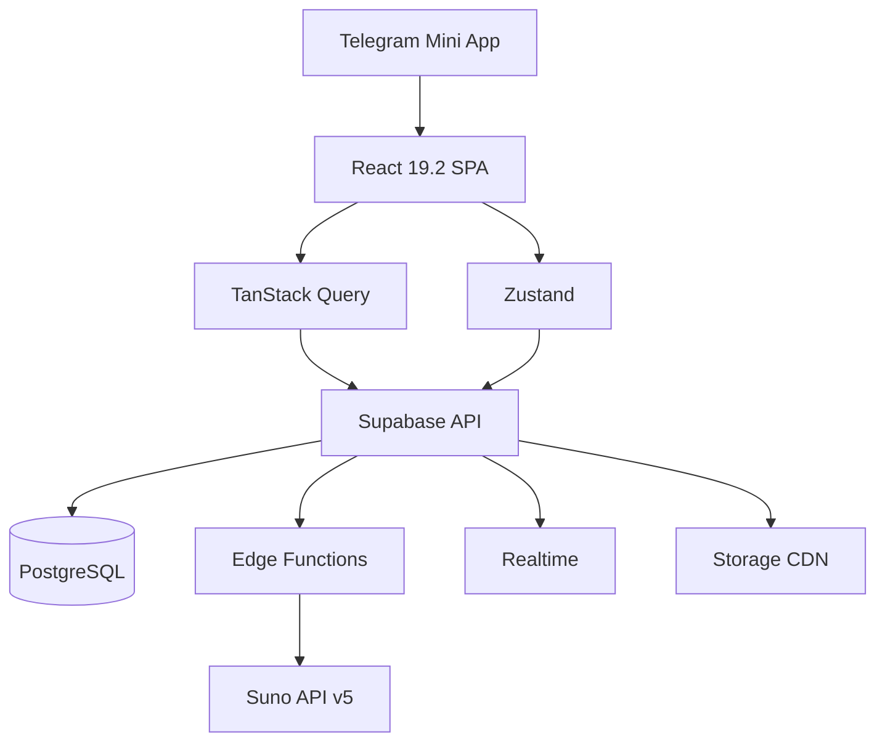

<div align="center">


**AI-powered music creation platform — прямо в Telegram**

<p>
  <a href="https://github.com/HOW2AI-AGENCY/aimusicverse/actions/workflows/quality-check.yml"></a>
  
  <a href="LICENSE"></a>
  
  <a href="https://t.me/AIMusicVerseBot"></a>
</p>

<!-- BADGES:START -->

     
<!-- BADGES:END -->

<p>
  <a href="#-быстрый-старт"></a>
  <a href="#-для-инвесторов"></a>
  <a href="#-скриншоты"></a>
  <a href="#-возможности"></a>
  <a href="DOCUMENTATION_INDEX.md"></a>
  <a href="CONTRIBUTING.md"></a>
  <a href="ROADMAP.md"></a>
</p>

</div>

---

## 📱 Скриншоты

<div align="center">

|                                                  Главная                                                   |                                                    Библиотека                                                    |                                                    Проекты                                                     |                                                   Студия                                                    |
| :--------------------------------------------------------------------------------------------------------: | :--------------------------------------------------------------------------------------------------------------: | :------------------------------------------------------------------------------------------------------------: | :---------------------------------------------------------------------------------------------------------: |
|  |  |  |  |

<sub>Реальные скриншоты приложения на мобильном viewport 390×844 (iPhone-class). Сгенерированы автоматически через Playwright из живого preview.</sub>

</div>

---

## 💰 Для инвесторов

| Метрика                        |                                                     Значение                                                     |
| ------------------------------ | :--------------------------------------------------------------------------------------------------------------: |
| ⭐ GitHub Stars                |                         |
| 📦 Eager load (холодный старт) |                |
| 📦 Всего JS (все чанки)        |  |
| 🧪 Покрытие кода               |                     |
| 🔒 Безопасность                |                                   |
| 📊 Спринтов завершено          |                                                      **42**                                                      |
| 🏗 Компонентов                  |                                           **993** (+6 project-detail)                                            |
| 🔧 Хуков                       |                                                     **347**                                                      |
| 🚀 Стадия                      |                                        **Pre-Seed / Active Development**                                         |

> **MusicVerse AI** демократизирует создание музыки через AI-powered инструменты прямо в Telegram. Первый продукт, который делает профессиональное музыкальное производство доступным для 900М+ пользователей Telegram.

- **Бизнес-модель**: Freemium + подписка (Stars Payment в Telegram)
- **Рынок**: MusicTech + AI + Creator Economy ($12B+ к 2027)
- **Текущий фокус**: Sprint 045 🟡 В РАБОТЕ (UX/UI Deep Polish). Phase A закрыта (коммит `0813d631`): emoji-as-icons заменены на Lucide (11 замен в `EnhancedVariant`, `GridVariant`, `ListVariant`, `ContextualHint`); touch-target ≥ 44px восстановлен в `CompactVariant`, `UnifiedTipCard`, `ContextualHint`; raw-color tokens (`text-white`, `from-black/70`, `bg-red-500/20`, `ring-white/10`, `shadow-black/10`) переведены на semantic (`text-foreground`, `from-foreground/70`, `bg-primary/20`, `ring-border/30`, `shadow-foreground/10`).
- **Закрыто (2026-07-03, #568/#567):** Eager JS на холодной загрузке главной сокращён с ~1.19 МБ до ~508 КБ gzip (лишние `modulePreload` тяжёлых admin/studio/charts/dnd/forms-чанков и barrel-импорт устранены — см. [docs/BUNDLE_ANALYSIS.md](./docs/BUNDLE_ANALYSIS.md)); все оставшиеся 58 `no-explicit-any` ошибок ESLint устранены (репозиторий на 0 использований `any`, было 342), попутно исправлены 2 бага, скрытые за `any`-кастами.
- **Закрыто (2026-07-03, #566/#562/#559):** Редизайн карточек треков на мобильной главной, восстановлена связность секций главной страницы (homepage reconnect), scroll-reveal и микро-взаимодействия на мобильной главной.
- **Закрыто (Sprint 049 ✅):** Mobile UX по багрепорту — залипание скролла на главной (guard `usePullToRefresh` читал `scrollTop` не с того элемента и глушил нативный скролл), исчезающие жанровые секции, переключение A/B версий теперь обновляет карточку целиком (обложка/теги/время/текст из `track_versions.metadata`), лайки переведены на per-version схему (`track_likes.track_version_id`, миграция ждёт применения на прод БД), полноэкранный плеер: починен «залипший» свайп страниц (`dragConstraints`), фрагментированные теги Suno больше не протекают в лирику, автоскролл с пилюлей «К текущей строке», теги-чипы на «О треке». См. [CHANGELOG.md](./CHANGELOG.md#unreleased) и [PROJECT_STATUS.md](./PROJECT_STATUS.md).
- **Закрыто ранее (Sprint 048 ✅):** Creation-Flow Motion Pass + Mobile Perf Fixes — анимации для создания проекта/артиста, AI-чата ассистента и создания трека в проекте, затем баг-фикс проход по итогам мобильного QA: обрезка бейджей у скруглённых углов `Button` (корневая причина — `overflow: hidden` в `.btn-enhanced`, исправлено на уровне CSS-примитива для всего приложения), лаги JS-driven анимаций на мобильных (заменены на CSS keyframes), глюки скролла (убран `smooth`-скролл в чате, JS `whileHover` заменён на CSS `:hover`). См. [CHANGELOG.md](./CHANGELOG.md#unreleased) и [PROJECT_STATUS.md](./PROJECT_STATUS.md).
- **Закрыто ранее (Sprint 044 ✅):** Type Safety Wave 2 — 7/7 задач. Итог: `any` в `src/components/**` 155 → 0; в `src/hooks/**` 164 → 6; в `src/stores/**` 12 → 0; `Result<T,E>` в `src/lib/result.ts` + 9 тестов; 16 методов 3 сервисов на `Result`; ESLint `no-explicit-any: error` + whitelist + `scripts/count-any.mjs` ≤50. +54 unit-теста за спринт (282 passing в 17 suites).
- **Далее**: Phase B-D Sprint 045 (Player/hints fixes, PageTransition `isVisible` bug, animation audit). `size-limit`'s Total Bundle порог пересчитан с 950 КБ на 2.3 МБ, чтобы CI проходил по реальной метрике (все чанки, сейчас 2.11 МБ) вместо давно устаревшего числа — это не то же самое, что вес страницы для пользователя (508 КБ eager). Дальнейшее сокращение суммы всех чанков — отдельный, не блокирующий follow-up (пересмотр границ `manualChunks`). См. [PROJECT_STATUS.md](./PROJECT_STATUS.md) и [superpowers/sdd/briefs/](./.superpowers/sdd/briefs/).

---

## 📊 Прогресс проекта

```mermaid
gantt
    title Дорожная карта 2026
    dateFormat YYYY-MM-DD
    axisFormat %b %d
    section Завершено ✅
    Sprint 033: UX-аудит              :done, 033, 2026-04-01, 2026-04-30
    Sprint 034: Надёжность генерации   :done, 034, 2026-05-01, 2026-05-31
    Sprint 035: Стабилизация           :done, 035, 2026-06-01, 2026-06-20
    Sprint 036: Рефакторинг слоёв      :done, 036, 2026-06-01, 2026-06-20
    Sprint 037: Infrastructure         :done, 037, 2026-06-21, 2026-06-29
    Sprint 038: Design System          :done, 038, 2026-06-29, 2026-06-30
    Sprint 039: Архит. рефакторинг     :done, 039, 2026-06-30, 2026-06-30
    Sprint 042: Page Decomp + Audio     :done, 042, 2026-07-01, 2026-07-02
    Sprint 043: Layer Compliance       :done, 043, 2026-07-02, 2026-07-02
    Sprint 044: Type Safety Wave 2     :done, 044, 2026-07-02, 2026-07-02
    Sprint 047: Creation-Flow Motion   :done, 047, 2026-07-03, 2026-07-03
    Sprint 049: Mobile UX fixes        :done, 049, 2026-07-03, 2026-07-03
    section Запланировано ⚪
    Sprint 040: Type Safety + God-files :040, 2026-07-01, 2026-07-12
    Sprint 040b: Тесты + Audio Export   :040b, 2026-07-15, 2026-08-01
    Sprint 041: UX features (AI/TTS)    :041, 2026-08-01, 2026-08-08
    Sprint 045: Hygiene + Docs         :045, 2026-07-27, 2026-07-31
    Sprint 046: Bundle Reduction 🔴     :046, 2026-08-01, 2026-08-10
```

| Спринт  | Название                                         | Статус | Прогресс |
| :-----: | ------------------------------------------------ | :----: | :------: |
|   033   | UX-аудит и переработка                           |   ✅   |   100%   |
|   034   | Надёжность генерации                             |   ✅   |   100%   |
|   035   | Стабилизация + Чистка                            |   ✅   |   100%   |
|   036   | Рефакторинг слоёв + Type Safety                  |   ✅   |   100%   |
|   037   | Infrastructure Hardening                         |   ✅   |   100%   |
|   038   | Design System Unification                        |   ✅   |  28/28   |
|   039   | Архитектурный рефакторинг                        |   ✅   |  14/14   |
| **042** | **Page Decomp + Audio Pooling**                  |   ✅   |  10/10   |
| **043** | **Layer Compliance (65 → 0)**                    |   ✅   |   6/6    |
| **044** | **Type Safety Wave 2**                           |   ✅   |   7/7    |
| **047** | **Creation-Flow Motion + Mobile Perf Fixes**     |   ✅   |   2/2    |
| **049** | **Mobile UX: A/B версии, лайки, плеер, главная** |   ✅   |   4/4    |
| **045** | **UX/UI Deep Polish + Hygiene**                  |   🟡   |   1/4    |
|   040   | Type Safety + God-files                          |   ⚪   |    0%    |
|  040b   | Тесты + Audio Export                             |   ⚪   |    0%    |
|   041   | UX features (AI/TTS)                             |   ⚪   |    0%    |
|   046   | 🔴 Bundle Reduction (2.21→<950KB)                |   ⚪   |    0%    |

<sub>Подробнее: [ROADMAP.md](./ROADMAP.md) · [PROJECT_STATUS.md](./PROJECT_STATUS.md) · [SPRINTS/SPRINT-042-043-PLAN.md](./SPRINTS/SPRINT-042-043-PLAN.md)</sub>

---

## 🚀 Быстрый старт

```bash
git clone https://github.com/HOW2AI-AGENCY/aimusicverse.git
cd aimusicverse
npm install
npm run dev        # http://localhost:5173
npm run check-all  # lint + format + typecheck + test
```

> [!TIP]
> Откройте [http://localhost:5173](http://localhost:5173) в браузере. Приложение оптимизировано под мобильные устройства (375×812).

---

## ✨ Возможности

| Категория       | Функция                                      | Статус |
| --------------- | -------------------------------------------- | :----: |
| 🎵 AI-генерация | Suno API v5 с A/B версиями                   |   ✅   |
| 🎤 Voice Clone  | Клонирование голоса                          |   ✅   |
| 📝 Lyrics AI    | AI-помощник для текстов                      |   ✅   |
| 🎸 Инструменты  | Гитара, драм-машина, микшер                  |   ✅   |
| 🏗 Студия        | Мультитрек-редактор (Studio Lite/Pro)        |   ✅   |
| 👥 Сообщество   | Лента, артисты, блог                         |   ✅   |
| 💎 Монетизация  | Stars Payment, подписки                      |   ✅   |
| 📊 Аналитика    | Dashboard, A/B тесты                         |   ✅   |
| 🔔 Уведомления  | In-app + Push (завершение генерации)         |   ✅   |
| ♿ Доступность  | WCAG AA, 14px min, клавиатурная навигация    |   ✅   |
| 📱 Telegram     | MainButton, BackButton, Haptic, CloudStorage |   ✅   |

---

## 🏛 Архитектура


```mermaid
graph TD
    A[Telegram Mini App] --> B[React 19.2 SPA]
    B --> C[TanStack Query]
    B --> D[Zustand]
    C --> E[Supabase API]
    D --> E
    E --> F[(PostgreSQL)]
    E --> G[Edge Functions]
    G --> H[Suno API v5]
    E --> I[Realtime]
    E --> J[Storage CDN]
```

<sub>Подробнее: [ARCHITECTURE_HUB.md](./ARCHITECTURE_HUB.md) · [ADR/](./ADR/)</sub>

---

## 🛠 Технический стек

| Слой       | Технология                             |
| ---------- | -------------------------------------- |
| Frontend   | React 19.2, TypeScript 5.9, Vite 5     |
| Стиль      | Tailwind CSS 3.4, shadcn/ui            |
| Состояние  | Zustand, TanStack Query                |
| Бэкенд     | Supabase (PostgreSQL + RLS + Realtime) |
| Serverless | 120+ Edge Functions (Deno/TypeScript)  |
| Тесты      | Vitest 4.x, Playwright 1.61            |
| CI/CD      | GitHub Actions (5 jobs, 3 браузера)    |
| Платформа  | Telegram Mini App (WebView)            |

---

## 📁 Структура проекта

```text
aimusicverse/
├── src/
│   ├── components/     # 987 компонентов
│   ├── hooks/          # 347 хуков
│   ├── pages/          # 57 страниц
│   ├── api/            # 20 API-файлов
│   ├── services/       # 18 сервисов
│   ├── stores/         # 17 Zustand stores
│   └── lib/            # Утилиты, дизайн-токены
├── supabase/           # 120+ Edge Functions
├── docs/               # 100+ файлов документации
├── specs/              # 14 спец-директорий
├── SPRINTS/            # 50+ спринт-файлов
└── tests/              # unit + e2e тесты
```

---

## 📞 Контакты и ссылки

| Ресурс          | Ссылка                                           |
| --------------- | ------------------------------------------------ |
| 🤖 Telegram бот | [@AIMusicVerseBot](https://t.me/AIMusicVerseBot) |
| 📧 Email        | `hello@how2ai.agency`                            |
| 🌐 Сайт         | [how2ai.agency](https://how2ai.agency)           |
| 🛡 Безопасность  | `security@how2ai.agency`                         |
| 📄 Лицензия     | [MIT](LICENSE)                                   |

---

<div align="center">

### 🔗 Навигация

[📚 Документация](./DOCUMENTATION_INDEX.md) · [🗺 Roadmap](./ROADMAP.md) · [📊 Статус](./PROJECT_STATUS.md) · [📝 Changelog](./CHANGELOG.md) · [🤝 Contributing](./CONTRIBUTING.md)

<sub>Обновлено: 03.07.2026 · HOW2AI Agency © 2025-2026</sub>

</div>
