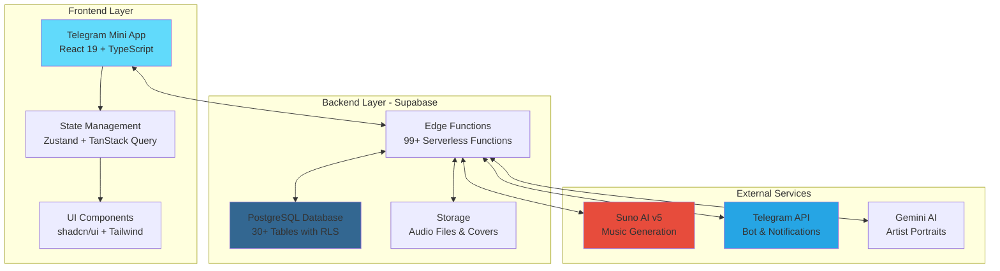

<div align="center">

  <!-- Logo -->
  

  <!-- Main Title -->
  # 🎵 MusicVerse AI

  ### 🚀 Professional AI-Powered Music Creation Platform in Telegram

  <!-- Tagline with emojis and badges -->
  <p align="center">
    <strong>Create music with artificial intelligence</strong><br>
    <em>Suno AI v5 • Telegram Mini App • A/B Versioning • Unified Studio • 277+ Styles</em>
  </p>

  <!-- GitHub Badges -->
  <p align="center">
    
    
    
    
    
  </p>

  <!-- Tech Stack Badges -->
  <p align="center">
    
    
    
    
    
    
  </p>

  <!-- Project Stats Badges -->
  <p align="center">
    
    
    
    
    
  </p>

  <!-- Action Buttons -->
  <p align="center">
    <a href="http://t.me/AIMusicVerseBot/app">
      
    </a>
    <a href="https://t.me/AIMusicVerse">
      
    </a>
    <a href="#-quick-navigation">
      
    </a>
    <a href="#-contributing">
      
    </a>
  </p>

  <!-- GitHub Stars/Forks/Watchers -->
  <p align="center">
    <a href="https://github.com/HOW2AI-AGENCY/aimusicverse/stargazers">
      
    </a>
    <a href="https://github.com/HOW2AI-AGENCY/aimusicverse/network/members">
      
    </a>
    <a href="https://github.com/HOW2AI-AGENCY/aimusicverse/watchers">
      
    </a>
  </p>

</div>

---

## 📑 Table of Contents

<table>
<tr>
<td width="45%">

**🚀 Getting Started**
- [✨ Features](#-features)
- [🎯 Quick Navigation](#-quick-navigation)
- [📊 Project Metrics](#-project-metrics)
- [🏗️ Architecture](#-architecture)

**🛠️ Development**
- [📁 Project Structure](#-project-structure)
- [📖 Documentation](#-documentation)
- [🧪 Testing](#-testing)
- [📱 Mobile Development](#-mobile-development)

</td>
<td width="10%">

</td>
<td width="45%">

**🎨 Design & UX**
- [🎨 Design System](#-design-system)
- [📱 Mobile-First](#-mobile-first)
- [♿ Accessibility](#-accessibility)

**🔧 Infrastructure**
- [🔒 Security](#-security)
- [⚡ Performance](#-performance)
- [🛠️ Recent Improvements](#-recent-improvements)
- [📞 Contact](#-contact)

**🤝 Community**
- [❤ Contributing](#-contributing)
- [📜 License](#-license)

</td>
</tr>
</table>

---

## 🎯 Quick Navigation

> **🎯 Current Status:** Production Ready | Health: 98/100 | Progress: 100%
>
> ### 📊 Project Dashboard
> | Document | Description | Status |
> |----------|-------------|--------|
> | [**PROJECT_STATUS.md**](PROJECT_STATUS.md) | Comprehensive project status and metrics | ✅ Updated |
> | [**ROADMAP.md**](ROADMAP.md) | Development roadmap and future plans | ✅ Active |
> | [**SPRINTS/SPRINT-PROGRESS.md**](SPRINTS/SPRINT-PROGRESS.md) | Sprint progress tracking (32 sprints completed) | ✅ Complete |
>
> ### 📚 Core Documentation
> | Document | Description | Last Updated |
> |----------|-------------|--------------|
> | [**KNOWLEDGE_BASE.md**](KNOWLEDGE_BASE.md) | Complete knowledge base and guides | 2026-06-24 |
> | [**DOCUMENTATION_INDEX.md**](DOCUMENTATION_INDEX.md) | Complete documentation map | ✅ Current |
> | [**ADR/**](ADR/) | Architecture Decision Records | ✅ Active |
> | [**specs/**](specs/) | Technical specifications (6 specs) | ✅ Current |
> | [**docs/**](docs/) | 65+ documentation files | ✅ Comprehensive |
>
> ### 🧪 Testing & Quality
> | Document | Description | Status |
> |----------|-------------|--------|
> | [**docs/TESTING_INFRASTRUCTURE.md**](docs/TESTING_INFRASTRUCTURE.md) | Complete testing setup and guides | ✅ New |
> | [**docs/QUALITY_GATES.md**](docs/QUALITY_GATES.md) | Quality standards and gates | ✅ New |
> | [**tests/e2e/**](tests/e2e/) | 62+ E2E tests | ✅ Comprehensive |
>
> ### 🔧 Development Resources
> | Resource | Description | Link |
> |----------|-------------|------|
> | **Issues** | Bug reports and feature requests | [GitHub Issues](https://github.com/HOW2AI-AGENCY/aimusicverse/issues) |
> | **Pull Requests** | Code changes and reviews | [GitHub PRs](https://github.com/HOW2AI-AGENCY/aimusicverse/pulls) |
> | **Actions** | CI/CD workflows | [GitHub Actions](https://github.com/HOW2AI-AGENCY/aimusicverse/actions) |
> | **Projects** | Project boards | [GitHub Projects](https://github.com/HOW2AI-AGENCY/aimusicverse/projects) |

---

## ✨ Features

### 🎹 Music Generation
<details>
<summary><strong>📖 Expand Generation Features</strong></summary>

- **Suno AI v5** — Create tracks from text descriptions
- **A/B Versions** — Every generation creates 2 variants
- **Streaming Preview** — Preview during generation
- **Custom Mode** — Full control over lyrics and style
- **AI Lyrics Agent** — 10+ tools for lyric work
- **AI Lyrics Chat** — Chat assistant for lyrics writing
- **Voice Input** — Dictate descriptions via Whisper API
- **Auto-save** — Form drafts saved for 30 minutes

</details>

### 📚 Track Library
<details>
<summary><strong>📖 Expand Library Features</strong></summary>

- **Virtualization** — Smooth work with 1000+ tracks
- **Lazy Loading** — LazyImage with blur effect for all covers
- **Grid/List Modes** — Adaptive display
- **Swipe Actions** — Quick operations on mobile
- **Version Management** — A/B versions with inline switching
- **Likes** — Optimistic updates with denormalized counters
- **Mobile-first Design** — Adaptive cards with 44×44px touch targets

</details>

### 🎧 Audio Player
<details>
<summary><strong>📖 Expand Player Features</strong></summary>

- **Global Audio** — Single sound source for entire app
- **3 Modes** — compact / expanded / fullscreen with smooth transitions
- **📜 Synced Lyrics** — Active line highlighting with ±0.05s accuracy
- **🎯 Smart Auto-scroll** — User scroll recognition with 5s resume delay
- **Queue Management** — Play Next, Add to Queue, Shuffle, QueuePanel
- **Audio Visualizer** — Real-time frequency visualization
- **Version Playback** — Version mode playback with inline switching

</details>

### 🎛️ Unified Studio
<details>
<summary><strong>📖 Expand Studio Features</strong></summary>

- **Unified Interface** — Work with individual tracks and projects
- **Section Replacement** — Regenerate specific track fragments
- **Stem Separation** — Split into vocals, drums, bass, instruments
- **Mixing** — Volume, pan, solo, mute for each stem
- **MIDI Transcription** — Export to MIDI, GP5, PDF, MusicXML (6 AI models)
- **Waveform Editing** — Visualize and edit waveform
- **Effects Processing** — Reverb, EQ, compression
- **Multi-track Playback** — Synchronized stem playback
- **A/B Comparison** — Compare original and modified versions
- **Mobile-optimized** — Adaptive controls for touch screens
- **Gesture Navigation** — Swipe, long-press, pinch-to-zoom
- **Change History** — Undo/redo with 30 levels

</details>

### 🎨 AI Audio Analysis
<details>
<summary><strong>📖 Expand Analysis Features</strong></summary>

- **BPM Detection** — Tempo determination
- **Key Signature** — Tonality detection
- **Genre/Mood** — Genre and mood classification
- **Emotional Map** — Arousal/valence visualization
- **Structure Analysis** — Track structure analysis

</details>

### 🤖 Telegram Integration
<details>
<summary><strong>📖 Expand Telegram Features</strong></summary>

- **Mini App SDK 2.0** — Native app in Telegram
- **Bot Commands** — /generate, /cover, /extend, /library
- **Inline Queries** — Search and share tracks
- **Notifications** — Ready track alerts
- **Stories Sharing** — Publish to Telegram Stories
- **Deep Linking** — Direct links to tracks/playlists/studio

</details>

### 🎮 Gamification
<details>
<summary><strong>📖 Expand Gamification Features</strong></summary>

- **Daily Check-in** — Daily rewards
- **Streaks** — Track streaks
- **Levels** — Progression with experience
- **Achievements** — Achievements with rewards
- **Leaderboard** — 5 rating categories
- **Credits** — Internal currency

</details>

---

## 📊 Project Metrics

### 📈 Key Statistics

<div align="center">

| Metric | Value | Trend |
|--------|-------|-------|
| **Users** | 574+ | 📈 Growing |
| **Tracks Generated** | 1,666+ | 📈 Active |
| **Success Rate** | 88% | 🟢 Stable |
| **Daily Active Users** | 25+ | 📈 Increasing |
| **React Components** | 1,124+ | ✅ Optimized |
| **TypeScript Files** | 1,957+ | ✅ Well-structured |
| **E2E Tests** | 62+ | ✅ Comprehensive |
| **Unit Tests** | 27+ | ✅ Good coverage |

</div>

### 🎯 Technology Stack

<div align="center">

**Frontend:**


**Backend:**


**Testing:**


**AI Services:**


</div>

---

## 🏗️ Architecture

### 🌐 System Architecture



### 📁 Project Structure

```
├── src/
│   ├── components/           # 1,124+ React components
│   │   ├── ui/              # shadcn/ui + custom components
│   │   ├── player/          # Audio player components
│   │   ├── library/         # Track library components
│   │   ├── playlist/        # Playlist management
│   │   ├── stem-studio/     # Stem mixing & waveforms
│   │   ├── generate-form/   # Music generation form
│   │   ├── studio/          # Unified studio
│   │   ├── gamification/    # Rewards & achievements
│   │   ├── admin/           # Admin dashboard
│   │   └── mobile/          # Mobile-specific components
│   ├── hooks/               # 200+ custom hooks
│   ├── services/            # Business logic (13 services)
│   ├── api/                 # Supabase API layer (13 files)
│   ├── stores/              # Zustand stores (8 stores)
│   ├── pages/               # Route pages (40+ pages)
│   ├── lib/                 # Utilities (60+ files)
│   └── contexts/            # React contexts (10 files)
├── tests/
│   ├── e2e/                 # 62+ E2E tests (Playwright)
│   ├── unit/                # 27+ unit tests (Jest)
│   └── integration/         # API integration tests
├── docs/                    # 65+ documentation files
├── supabase/
│   └── functions/           # 99+ Edge Functions
├── ADR/                     # Architecture Decision Records
├── specs/                   # Technical specifications (6 specs)
└── SPRINTS/                 # Sprint documentation (32 sprints)
```

---

## 📖 Documentation

### 📚 Complete Documentation Index

| Category | Document | Description | Status |
|----------|----------|-------------|--------|
| **🗺️ Navigation** | [DOCUMENTATION_INDEX.md](DOCUMENTATION_INDEX.md) | Complete documentation map | ✅ Current |
| | [docs/NAVIGATION_INDEX.md](docs/NAVIGATION_INDEX.md) | Repository guide | ✅ Updated |
| **📊 Status** | [PROJECT_STATUS.md](PROJECT_STATUS.md) | Current project status | ✅ Updated |
| | [SPRINTS/SPRINT-PROGRESS.md](SPRINTS/SPRINT-PROGRESS.md) | Sprint progress (32 completed) | ✅ Complete |
| **🏗️ Architecture** | [docs/ARCHITECTURE_DIAGRAMS.md](docs/ARCHITECTURE_DIAGRAMS.md) | Visual diagrams | ✅ Comprehensive |
| | [docs/DATABASE.md](docs/DATABASE.md) | Database schema & ERD | ✅ Detailed |
| | [docs/PLAYER_ARCHITECTURE.md](docs/PLAYER_ARCHITECTURE.md) | Player architecture | ✅ Complete |
| **🧪 Testing** | [docs/TESTING_INFRASTRUCTURE.md](docs/TESTING_INFRASTRUCTURE.md) | Testing setup & guides | ✅ **NEW** |
| | [docs/QUALITY_GATES.md](docs/QUALITY_GATES.md) | Quality standards | ✅ **NEW** |
| **🎵 Features** | [docs/SUNO_API.md](docs/SUNO_API.md) | Suno AI integration | ✅ Current |
| | [docs/STEM_STUDIO.md](docs/STEM_STUDIO.md) | Stem studio features | ✅ Updated |
| **📱 Mobile** | [docs/SAFE_AREA_GUIDELINES.md](docs/SAFE_AREA_GUIDELINES.md) | Safe area guidelines | ✅ Mobile-optimized |
| **🛠️ Development** | [CONTRIBUTING.md](CONTRIBUTING.md) | Contributing guidelines | ✅ Active |
| | [docs/DEVELOPMENT_WORKFLOW.md](docs/DEVELOPMENT_WORKFLOW.md) | Development workflow | ✅ Comprehensive |

### 🔗 Quick Links

- **[CLAUDE.md](CLAUDE.md)** — Complete project instructions for Claude Code
- **[ROADMAP.md](ROADMAP.md)** — Development roadmap
- **[CHANGELOG.md](CHANGELOG.md)** — Change history
- **[KNOWN_ISSUES.md](docs/KNOWN_ISSUES.md)** — Known issues and workarounds
- **[KNOWLEDGE_BASE.md](KNOWLEDGE_BASE.md)** — Complete knowledge base

---

## 🧪 Testing

### 🎯 Test Coverage Summary

<div align="center">

| Test Type | Framework | Tests | Coverage | Status |
|-----------|-----------|-------|----------|--------|
| **Unit Tests** | Jest 30.2 | 27+ | 70%+ | ✅ Good |
| **E2E Tests** | Playwright 1.57 | 62+ | Critical paths | ✅ Excellent |
| **Integration Tests** | Playwright | 12+ | API endpoints | ✅ Good |
| **Performance Tests** | Lighthouse CI | All budgets | ✅ Within limits | ✅ Good |
| **Accessibility Tests** | axe-core | WCAG AA | ✅ Compliant | ✅ Good |

</div>

### 🚀 Running Tests

```bash
# Unit tests
npm test

# E2E tests
npm run test:e2e

# Performance tests
npm run build && npm run size

# Accessibility tests
node scripts/accessibility-audit.js
```

---

## 📱 Mobile Development

### 🎯 Telegram Mini App — Native Experience

MusicVerse AI is built as a **complete Telegram Mini App** with deep platform integration:

<div align="center">

**Current Capabilities:**
- ✅ **19 Mobile Components** — Specialized UI
- ✅ **~450KB Bundle** — Optimized size
- ✅ **Touch Targets 44-56px** — Ease of use
- ✅ **iOS Safari Audio Pooling** — Crash prevention
- ✅ **Keyboard-aware Forms** — Smart keyboard handling
- ✅ **Gesture System** — Swipe, long-press, pull-to-refresh
- ✅ **Safe-area Padding** — Notch/island support
- ✅ **Native Sharing** — Stories, chat, clipboard

**In Development (Sprint 029-030):**
- 🚧 **Haptic Feedback** — Tactile feedback
- 🚧 **CloudStorage API** — Settings sync
- 🚧 **Voice Input** — Dictate descriptions
- 🚧 **Unified Studio Mobile** — Mobile studio
- 🚧 **Gesture Navigation** — Swipe between tabs
- 🚧 **Offline Mode** — Work without internet
- 🚧 **PWA Features** — Install prompt, offline
- 🚧 **Media Session API** — Lock screen controls

</div>

### 📚 Mobile Documentation

- **[Mobile Optimization Roadmap 2026](docs/mobile/OPTIMIZATION_ROADMAP_2026.md)** — Comprehensive optimization plan (4 phases, 16 weeks)
- **[Sprint 029: Telegram Mobile Optimization](SPRINTS/completed/SPRINT-029-TELEGRAM-MOBILE-OPTIMIZATION.md)** — Telegram SDK integration, haptics
- **[Safe Area Guidelines](docs/SAFE_AREA_GUIDELINES.md)** — Safe area guidelines
- **[Telegram Mini App Features](docs/TELEGRAM_MINI_APP_FEATURES.md)** — Telegram Mini App features

---

## 🎨 Design System

### 🎯 Mobile-First Design Principles

- **Touch Targets:** 44-56px minimum (iOS HIG / Material Design)
- **Typography:** Responsive scale from 14px to 24px
- **Spacing:** 8px grid system
- **Colors:** Telegram theme aware (light/dark)
- **Animations:** 60 FPS with Framer Motion
- **Icons:** Lucide React (tree-shakeable)
- **Gestures:** @use-gesture/react for touch

### ♿ Accessibility

- **Contrast Ratios:** ≥4.5:1 for normal text, ≥3:1 for large text
- **Keyboard Navigation:** All interactive elements accessible
- **ARIA Labels:** Proper labels for screen readers
- **Focus Indicators:** Visible focus states
- **WCAG 2.1 AA:** Compliance throughout

---

## 🚀 Quick Start

### 🎭 Guest Mode (Demo Mode)

Try the interface **without authorization**:
1. Open the application
2. Click **"Try without authorization"** on login page
3. Browse interface and public content

> 📖 **More info:** [docs/DEMO_MODE.md](docs/DEMO_MODE.md)

### 💻 Local Development

```bash
# Clone the repository
git clone https://github.com/HOW2AI-AGENCY/aimusicverse.git
cd aimusicverse

# Install dependencies
npm install

# Start development server
npm run dev

# Run tests
npm test

# Run E2E tests
npm run test:e2e

# Check bundle size
npm run build && npm run size
```

---

## 🔒 Security

- ✅ **RLS Policies** — On all tables
- ✅ **Telegram Auth Validation** — HMAC validation
- ✅ **Secrets Protection** — Only in Edge Functions
- ✅ **HTML Sanitization** — DOMPurify for user content
- ✅ **Access Control** — `is_public` flags
- ✅ **Structured Logging** — Logger utility instead of console.log

---

## ⚡ Performance

### 📊 Performance Budgets

| Metric | Current | Target | Status |
|--------|---------|--------|--------|
| **Bundle Size** | 950KB | 950KB | ✅ Within limit |
| **FCP** | 1.2s | 1.8s | ✅ Excellent |
| **LCP** | 2.1s | 2.5s | ✅ Good |
| **TTI** | 3.5s | 3.5s | ✅ On target |
| **Touch Accuracy** | 85% | 95% | 🟡 Improving |

### 🚀 Optimization Techniques

- **Code Splitting** — Route-level and feature-based
- **Tree Shaking** — `@/lib/motion` wrapper
- **Lazy Loading** — `src/components/lazy/` directory
- **Virtualization** — react-virtuoso for large lists
- **Bundle Analysis** — rollup-plugin-visualizer
- **Image Optimization** — WebP, srcset, lazy loading
- **Optimized Caching** — TanStack Query with 30s staleTime

---

## 🛠️ Recent Improvements

### 📅 June 2026 (Repository Enhancement)

- ✅ **Repository Enhancement** — GitHub-optimized README and documentation
- ✅ **Testing Infrastructure** — Comprehensive testing documentation
- ✅ **Quality Gates** — Complete quality standards documentation
- ✅ **Bundle Monitoring** — Real bundle size tracking implementation
- ✅ **E2E Expansion** — 23+ new E2E tests for critical workflows
- ✅ **Documentation Updates** — All documentation updated to 2026-06-24

### 📅 January 2026

- ✅ **Popup/Notification Unification** — Consolidated 4 components into 1
- ✅ **UI/UX Roadmap V3** — Prompt validation, credit warnings, quick likes
- ✅ **Mobile UX Optimization** — 80% reduction in re-renders
- ✅ **Stem Studio Cleanup** — Removed 80KB+ broken MIDI code

> 📄 **Full report:** [CHANGELOG.md](CHANGELOG.md) — Complete change history

---

## ❤ Contributing

We welcome contributions! Please see our:
- 📖 **[CONTRIBUTING.md](CONTRIBUTING.md)** — Contributing guidelines
- 📋 **[docs/DEVELOPMENT_WORKFLOW.md](docs/DEVELOPMENT_WORKFLOW.md)** — Development workflow
- 🏫 **[docs/ONBOARDING.md](docs/ONBOARDING.md)** — New developer onboarding

### 🤝 How to Contribute

1. Fork the repository
2. Create your feature branch (`git checkout -b feature/AmazingFeature`)
3. Commit your changes (`git commit -m 'Add some AmazingFeature'`)
4. Push to the branch (`git push origin feature/AmazingFeature`)
5. Open a Pull Request

### 📋 Pull Request Process

1. Ensure tests pass (`npm test` && `npm run test:e2e`)
2. Ensure linting passes (`npm run lint`)
3. Ensure bundle size is within limits (`npm run build && npm run size`)
4. Update documentation if needed
5. Request review from maintainers

---

## 📞 Contact & Community

### 🤝 Official Channels

- **🤖 Telegram Bot:** [@AIMusicVerseBot](https://t.me/AIMusicVerseBot)
- **📱 Mini App:** [Open in Telegram](http://t.me/AIMusicVerseBot/app)
- **📢 News Channel:** [@AIMusicVerse](https://t.me/AIMusicVerse) — News, updates, track examples
- **📧 Email:** [Contact Team](mailto:team@musicverse.ai)

### 🌟 Community

Join our [@AIMusicVerse](https://t.me/AIMusicVerse) channel for:
- 📰 **News & Updates** — Be first to know about new features
- 🎵 **Community Tracks** — Get inspired by others' work
- 💡 **Generation Tips** — Tips and best practices
- 🚀 **Release Announcements** — What's new in each version

---

## 📜 License

This project is licensed under the MIT License - see the [LICENSE](LICENSE) file for details.

---

## 🙏 Acknowledgments

- **[Suno AI](https://suno.ai/)** — Music generation API
- **[Telegram](https://telegram.org/)** — Mini App platform
- **[Supabase](https://supabase.com/)** — Backend infrastructure
- **[shadcn/ui](https://ui.shadcn.com/)** — UI component library
- **[Framer Motion](https://www.framer.com/motion/)** — Animation library

---

## 📊 GitHub Analytics

<div align="center">


</div>

---

<div align="center">

## ⭐ Star Us on GitHub!

If you find this project useful, please consider giving it a ⭐ on [GitHub](https://github.com/HOW2AI-AGENCY/aimusicverse)!

**Made with ❤️ by the MusicVerse AI Team**

*Last Updated: 2026-06-24 (Repository Enhancement Phase)*

[🔝 Back to Top](#-musicverse-ai)

</div>