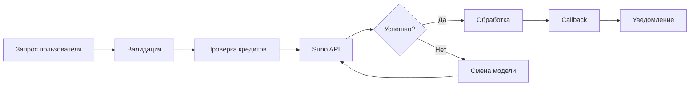

# MusicVerse AI 🎵

<div align="center">


**🚀 AI-платформа для создания музыки в Telegram Mini App**

[Возможности](#-ключевые-возможности) • [Архитектура](#-архитектура) • [Документация](#-документация) • [Быстрый старт](#-быстрый-старт) • [Разработка](#-вклад-в-разработку)

</div>

---

## 🎯 О проекте

**MusicVerse AI** — это профессиональная платформа для создания музыки с использованием искусственного интеллекта. Платформа позволяет генерировать, редактировать и делиться музыкой, используя передовые AI-модели (Suno AI v5). Реализована как Telegram Mini App для глубокой интеграции с экосистемой Telegram.

### 🎁 Ключевые возможности

<table>
<tr>
<td width="50%">

#### 🤖 AI-генерация музыки

- 🎵 Suno AI v5 с 277+ музыкальными стилями
- ✍️ Создание треков с собственными текстами
- 🎸 Инструментальные композиции
- 🔄 A/B версионирование (генерация 2 версий)
- 🎛️ Ремиксы и продолжения треков

#### 🎙️ Voice Cloning Studio ⭐ НОВАЯ ФУНКЦИЯ

- 🔊 Suno Voice API интеграция
- 🎯 6-шаговый процесс клонирования голоса
- 👤 Создание собственных AI голосов
- 📚 Библиотека кастомных голосов
- 🎤 Персонализированная генерация музыки

#### 🎛️ Профессиональная студия

- 🔀 Микшер с 16+ каналами
- 📊 Временная шкала (timeline)
- 🎼 Разделение на stems (4 stems: вокал, ударные, бас, инструменты)
- ✂️ Редактирование секций трека
- 🎹 MIDI-транскрипция (6 AI моделей)

</td>
<td width="50%">

#### 📝 AI-ассистент текстов

- ✨ 10+ инструментов для написания текстов
- 🎵 Ритм-анализ и генерация рифм
- 📐 Структурирование песен
- 🌍 Перевод текстов на разные языки
- 🎭 Генерация по жанру и настроению

#### 👥 Социальные функции

- 👤 Профили артистов с портфолио
- 💬 Комментарии и система лайков
- 🔗 Подписки и активность друзей
- 🎁 Приглашения (реферальная система)
- 🏆 Лидерборды и рейтинги

#### 🎮 Геймификация

- 📅 Ежедневные чекины (daily check-ins)
- 🔥 Стрики (серии посещений)
- ⭐ Уровни и система опыта
- 🏅 20+ достижений (achievements)
- 💰 Балльная система вознаграждений

#### 💳 Монетизация

- 💳 Tinkoff платежи (RUB)
- 🪙 Кредитная система
- 📈 Подписки PRO/PREMIUM
- 📦 Тарифные пакеты кредитов

#### 📱 Мобильная оптимизация

- 📱 Haptic feedback (вибрация)
- 👆 Swipe-жесты навигации
- 📐 Safe areas (iOS/Android адаптация)
- 🎯 Touch targets 44×44px
- 📴 Офлайн-режим поддержка

</td>
</tr>
</table>

---

## 📊 Статус проекта

| Метрика | Текущее значение | Цель | Прогресс |
|---------|------------------|------|----------|
| 👥 Пользователи | 574+ | 1,000+ | 🟡 57% |
| 🎵 Треков создано | 1,800+ | 5,000+ | 🟡 36% |
| 📈 Месячных генераций | 1,217+ | 2,000+ | 🟡 61% |
| ✅ Успешность генерации | ~88% | >92% | 🟡 Улучшается |
| 📱 DAU | ~25 | 50+ | 🟡 50% |

**Общее состояние проекта**: 🟢 **95/100** — Production Ready

**Текущий фокус**: Voice Cloning Integration + UI Improvements (Spec 001)

---

## 🏗️ Архитектура

### Технологический стек

<div align="center">

| Категория | Технологии |
|-----------|------------|
| **Frontend** | React 19.2 • TypeScript 5.9 • Vite 5.0 • Tailwind CSS 3.4 |
| **Backend** | Supabase (PostgreSQL) • Edge Functions (Deno) |
| **AI/ML** | Suno API v5 • Tone.js • Web Audio API |
| **State** | Zustand • TanStack Query v5.90 |
| **UI** | Radix UI • shadcn/ui • Framer Motion 12 |
| **Audio** | wavesurfer.js • Tone.js • lamejs • MIDI.js |
| **Testing** | Jest • Playwright • Vitest • axe-core |
| **Monitoring** | Sentry • custom logging • api_usage_logs |

</div>

### Структура проекта

```
MusicVerse AI/
├── 📁 src/                          # Исходный код приложения
│   ├── 📁 api/                      # API клиенты (21 модуль)
│   ├── 📁 components/               # 1130+ React компонентов
│   │   ├── ui/                      # Базовые UI (shadcn/ui)
│   │   ├── studio/                  # Студия: микшер, timeline, editor
│   │   │   └── voice-cloning/       # 🆕 Voice cloning studio
│   │   ├── lyrics/                  # Lyrics wizard и инструменты
│   │   ├── generate/                # Форма генерации музыки
│   │   ├── library/                 # Библиотека треков
│   │   ├── player/                  # Аудиоплеер
│   │   └── social/                  # Социальные компоненты
│   ├── 📁 services/                 # Бизнес-логика (42 файла)
│   │   ├── voice/                   # 🆕 Voice cloning сервис
│   │   ├── lyrics/                  # Lyrics сервисы
│   │   └── ...                      # Прочие сервисы
│   ├── 📁 hooks/                    # 390+ кастомных хуков
│   ├── 📁 pages/                    # 57+ страниц
│   ├── 📁 stores/                   # Zustand stores (8 штук)
│   ├── 📁 lib/                      # Утилиты (60+ файлов)
│   ├── 📁 types/                    # TypeScript типы
│   └── 📁 workers/                  # Web Workers
├── 📁 supabase/
│   ├── 📁 functions/               # 120+ Edge Functions
│   ├── 📁 migrations/               # Database migrations
│   └── ⚙️ config.toml
├── 📁 docs/                         # 305+ документов
├── 📁 tests/                        # Unit и E2E тесты
└── 📁 graphify-out/                 # Knowledge graph
```

### Ключевые особенности архитектуры

#### 🎵 Music Generation Pipeline



**Возможности**:
- 🔄 SunoAI v5 с автоматическим fallback (V5 → V4_5PLUS → V4_5 → V4 → V3_5)
- ⏱️ Exponential backoff retry (3 попытки, задержки 1с-8с)
- ⏰ 30-секундный timeout protection
- 🛡️ Автоматическое восстановление после ошибок
- 💬 Пользовательские сообщения об ошибках

#### ⚡ Performance Optimizations

| Оптимизация | Реализация | Эффект |
|-------------|------------|--------|
| **Bundle Splitting** | vendor-react, vendor-framer, vendor-tone | Быстрая загрузка |
| **Lazy Loading** | 15+ тяжелых компонентов | Меньший initial bundle |
| **React.memo** | TrackCard, MixerChannel, Waveform | -60% re-renders |
| **Waveform Cache** | IndexedDB + LRU (7 дней TTL) | Мгновенный доступ |
| **RAF Playback** | Оптимизированные time updates | 55+ FPS при скролле |

#### 🔒 Type Safety

- **Branded Types**: `TrackId`, `UserId`, `StemId`, `ProjectId`
- **Type-safe Context**: WebKit fallback для AudioContext
- **Error Typing**: `AppError`, `NetworkError`, `APIError`, `GenerationError`

---

## 🚀 Быстрый старт

### Предварительные требования

```bash
# Системные требования
- Node.js 22.15+
- npm 10.8+
- Supabase CLI (опционально для локальной разработки)
```

### Установка

```bash
# 1️⃣ Клонирование репозитория
git clone https://github.com/HOW2AI-AGENCY/aimusicverse.git
cd aimusicverse

# 2️⃣ Установка зависимостей
npm install

# 3️⃣ Настройка окружения
cp .env.example .env
# Отредактируйте .env с вашими ключами

# 4️⃣ Запуск dev-сервера
npm run dev
# → http://localhost:8080
```

### Доступные команды

#### 🛠️ Разработка

```bash
npm run dev              # Dev-сервер (порт 8080)
npm run build            # Production build
npm run preview          # Превью production сборки
```

#### 🧪 Тестирование

```bash
npm test                 # Jest unit-тесты
npm run test:coverage    # С отчётом покрытия
npm run test:e2e         # Playwright E2E (все браузеры)
npm run test:e2e:mobile  # Мобильные тесты
npm run test:e2e:ui      # С UI-интерфейсом
```

#### 🔍 Качество кода

```bash
npm run lint             # ESLint проверка
npm run format           # Prettier форматирование
npm run size             # Bundle size анализ
npm run size:why         # Подробный анализ состава
```

---

## 📚 Документация

### 📖 Основная документация

| Документ | Описание |
|----------|----------|
| [Архитектура](docs/ARCHITECTURE.md) | Системная архитектура и паттерны проектирования |
| [Производительность](docs/PERFORMANCE_OPTIMIZATION.md) | Оптимизации: memoization, caching, lazy loading |
| [Bundle оптимизация](docs/BUNDLE_OPTIMIZATION.md) | Сплиттинг, tree-shaking, оптимизация импортов |
| [Тестирование](docs/TESTING_INFRASTRUCTURE.md) | Стратегия тестирования и инфраструктура |
| [Обработка ошибок](docs/ERROR_HANDLING_INFRASTRUCTURE.md) | Type-safe error handling |
| [База данных](docs/DATABASE.md) | Схема Supabase и связи |

### 🎨 Feature-документация

| Документ | Описание |
|----------|----------|
| [AI Lyrics Assistant](docs/AI_LYRICS_ASSISTANT.md) | Инструменты для написания текстов |
| [Студия](docs/STEM_STUDIO.md) | Микшер, timeline, stem separation |
| [Telegram Bot](docs/TELEGRAM_BOT_ARCHITECTURE.md) | Архитектура бота |
| [Платежи](docs/TELEGRAM_PAYMENTS.md) | Tinkoff интеграция |
| [Mobile UI](docs/MOBILE_COMPONENTS.md) | Мобильная оптимизация |

### 🛠️ Руководства для разработчиков

| Документ | Описание |
|----------|----------|
| [Быстрый старт](docs/QUICK_START.md) | Руководство по разработке |
| [Design System](docs/DESIGN_SYSTEM_COMPREHENSIVE.md) | Дизайн-система и токены |
| [Навигация](docs/NAVIGATION_SYSTEM.md) | Система навигации |
| [Hooks Reference](docs/HOOKS_REFERENCE.md) | Референс кастомных хуков |
| [Contributing](CONTRIBUTING.md) | Гайд по контрибьюции |

### 📋 Sprint-документация

| Sprint | Статус | Документ |
|--------|--------|----------|
| **Sprints 001-032** | ✅ Завершены | [Архив](SPRINTS/completed/) |
| **Voice Cloning** | ✅ Завершён | [Документация](docs/VOICE_CLONING_INTEGRATION.md) |
| **Spec 001: UI Improvements** | 🔄 В процессе | [Спецификация](specs/001-ui-improvements/spec.md) |
| **Sprint B** | ⏳ Запланирован | Performance Scaling |
| **Sprint C** | 📋 Q3 2026 | Platform Integrations |

---

## 🎨 Дизайн-система

### Design Tokens

```css
/* 🎨 Цветовая палитра */
--bg-primary: #0a0a0f;
--bg-secondary: #12121a;
--bg-glass: rgba(255, 255, 255, 0.05);
--text-primary: #ffffff;
--text-secondary: #a0a0b0;
--accent-primary: #6366f1;
--accent-success: #10b981;
--accent-warning: #f59e0b;
--accent-error: #ef4444;

/* 📐 Размеры */
--radius-sm: 8px;
--radius-md: 12px;
--radius-lg: 16px;
--radius-full: 9999px;
```

### Компоненты

- **shadcn/ui** — базовые компоненты (Button, Dialog, Sheet, etc.)
- **Кастомные** — TrackCard, MixerChannel, Waveform, LyricsEditor
- **Анимации** — Framer Motion presets (fadeIn, slideUp, scaleIn)
- **Иконки** — lucide-react (централизованные через `@/lib/icons`)

### Принципы дизайна

- **Mobile-first** — touch targets 44x44px минимум
- **Safe Areas** — обработка iOS/Android безопасных зон
- **Glassmorphism** — glass-эффекты с backdrop-blur
- **Accessibility** — WCAG 2.1 AA compliance

---

## 🧪 Тестирование

### Покрытие тестами

<div align="center">

| Тип | Framework | Тестов | Покрытие |
|----|-----------|--------|----------|
| **Unit** | Jest + Testing Library | 27+ files | 70%+ |
| **E2E** | Playwright | 62+ tests | 7 browsers |
| **Component** | Storybook | 50+ stories | Interactions |
| **Performance** | Custom | 4 benchmarks | FPS, Memory |

</div>

### Запуск тестов

```bash
# Unit-тесты
npm test

# С покрытием
npm run test:coverage

# E2E (все браузеры)
npm run test:e2e

# Конкретный браузер
npm run test:e2e:chromium
npm run test:e2e:firefox
npm run test:e2e:webkit

# Мобильные
npm run test:e2e:mobile

# С UI
npm run test:e2e:ui

# Hints-система
npm run test:e2e:hints
```

---

## 🔧 Конфигурация

### Environment Variables

```env
# 🔑 Supabase
SUPABASE_URL=https://xxx.supabase.co
SUPABASE_ANON_KEY=eyJxxx...

# 🤖 Suno AI
SUNO_API_KEY=sk-xxx

# 📱 Telegram
TELEGRAM_BOT_TOKEN=1234567890:ABCdef...
MINI_APP_URL=https://your-app.vercel.app

# 🚨 Sentry (опционально)
SENTRY_DSN=https://xxx@sentry.io/xxx
```

### Bun vs npm

Проект поддерживает оба менеджера пакетов:

```bash
# npm
npm install
npm run dev

# bun (быстрее)
bun install
bun run dev
```

---

## 🤝 Вклад в разработку

### Workflow

1️⃣ **Создайте ветку** от `main`

```bash
git checkout -b feature/amazing-feature
```

2️⃣ **Внесите изменения** и протестируйте локально

```bash
npm run dev
npm test
```

3️⃣ **Проверьте код**

```bash
npm run lint
npm run format
```

4️⃣ **Закоммитьте** с описательным сообщением

```bash
git add .
git commit -m "feat: add amazing feature"
```

5️⃣ **Push и PR**

```bash
git push origin feature/amazing-feature
```

### Стандарты кода

- **TypeScript** — strict mode (target 100%)
- **ESLint** — все правила обязательны
- **Prettier** — автоматическое форматирование
- **Commit messages** — Conventional Commits

---

## 📈 Дорожная карта

### Q2 2026 (Апрель-Июнь) — Завершается

#### ✅ Voice Cloning Integration

- [x] Voice Cloning Studio (6-шаговый процесс)
- [x] Suno Voice API интеграция + webhook handlers
- [x] Voice Library + Voice History страницы
- [x] Database migrations для voice cloning

#### ✅ Reliability & Stability

- [x] Улучшение reliability генерации (retry + backoff + model fallback)
- [x] CI/CD pipeline обновление

#### 🔄 Spec 001: UI Improvements

- [x] Спецификация, план, задачи, контракты
- [ ] Реализация UI компонентов
- [ ] Bundle анализ и оптимизация

### Q3 2026 (Июль-Сентябрь)

#### ⏳ Performance Scaling

- [ ] Оптимизация компонентов (PlaylistTrackItem, LyricsLine)
- [ ] Database query оптимизация
- [ ] Advanced caching (Service Worker)

#### 📋 Platform Integrations

- [ ] Spotify / Apple Music / YouTube export
- [ ] OAuth 2.0 flows
- [ ] Public API development

---

## 🚨 Известные проблемы

### P1 — Критические (решённые)

- ✅ Все P1-P4 issues закрыты (28 issues resolved)
- ✅ Generation reliability improved (F1.1 complete)

### P2 — В процессе улучшения

- 🟡 Generation failure rate ~12% → target <8% (model fallback добавлен)
- 🟡 Bundle size optimisation pending
- 🟡 Spec 001: UI Improvements — в реализации

### P3 — Плановые

- 📋 Platform integrations (Spotify, Apple Music)
- 📋 Public API
- 📋 Performance Scaling (Q3 2026)

---

## 📄 Лицензия

Proprietary software. All rights reserved.

---

## 🙏 Благодарности

- [Suno AI](https://suno.com) — Music generation API
- [Supabase](https://supabase.com) — Backend infrastructure
- [Telegram](https://telegram.org) — Mini App platform
- [shadcn/ui](https://ui.shadcn.com) — Component library
- [Radix UI](https://www.radix-ui.com) — Accessible primitives

---

<div align="center">

**Сделано с ❤️ командой MusicVerse**

[Website](https://musicspace.vercel.app) • [Telegram](https://t.me/musicspaceapp) • [Twitter](https://twitter.com/musicspaceapp)

</div>

---

**📅 Последнее обновление**: 2026-06-26  
**📊 Версия**: 1.0.0  
**🏷️ Статус**: Production Ready  
**🎯 Health Score**: 95/100