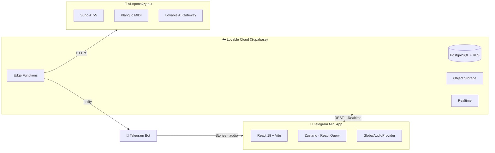

<div align="center">


# 🎵 MusicVerse AI

**Профессиональная AI-платформа для создания музыки — нативный Telegram Mini App.**

<p>
  <a href="https://github.com/HOW2AI-AGENCY/aimusicverse/actions"></a>
  <a href="https://github.com/HOW2AI-AGENCY/aimusicverse/releases"></a>
  <a href="LICENSE"></a>
  
  <a href="https://t.me/AIMusicVerseBot"></a>
</p>

<p>
  
  
  
  
  
  
</p>

<p>
  <a href="#-быстрый-старт"></a>
  <a href="#-возможности"></a>
  <a href="#-архитектура"></a>
  <a href="DOCUMENTATION_INDEX.md"></a>
  <a href="CONTRIBUTING.md"></a>
  <a href="ROADMAP.md"></a>
</p>

[🇬🇧 English](README.md) · [🌐 Preview](https://aimusicverse.lovable.app) · [💬 Telegram-бот](https://t.me/AIMusicVerseBot)

</div>

---

> [!NOTE]
> **MusicVerse AI** генерирует, редактирует, сводит и публикует музыку прямо в Telegram. Под капотом — **Suno AI v5**, мобильная DAW-студия, AI-ассистент лирики, разделение стемов, MIDI-транскрипция, геймификация и нативная Telegram-интеграция (MainButton, haptics, Stories).

---

## ✨ Возможности

| Категория | Что внутри | Статус |
| --- | --- | :---: |
| 🤖 **Генерация** | Suno v5 · 277+ стилей · собственная лирика · A/B-версии · extend/remix | ✅ |
| 🎙️ **Voice Cloning** | 6-шаговый клон голоса · персональная генерация · библиотека голосов | ✅ |
| 🎛️ **Студия** | 16-канальный микшер · timeline · перегенерация секций · A/B | ✅ |
| 🪓 **Stems** | 4 стема (vocals · drums · bass · other) + микшер | ✅ |
| 🎼 **MIDI** | 6 AI-моделей транскрипции · мульти-трек экспорт | ✅ |
| 📝 **Lyrics AI** | 10+ инструментов: ритм, рифмы, структура, перевод | ✅ |
| 👥 **Социалка** | профили · лайки · комментарии · подписки · лидерборды | ✅ |
| 🎮 **Геймификация** | чек-ины · стрики · уровни · 20+ ачивок · Stars-награды | ✅ |
| 💳 **Монетизация** | Telegram Stars · подписки · кредитные паки | ✅ |
| 📱 **Telegram-native** | MainButton · BackButton · haptics · Stories · deep-links | ✅ |
| 🧠 **Realtime-сессии** | совместное творчество · presence · live waveform | 🚧 |
| 🌍 **Marketplace** | продажа битов / лупов / голосов | 📋 |

---

## 🏛 Архитектура



Подробные диаграммы: [`ARCHITECTURE_HUB.md`](ARCHITECTURE_HUB.md) · [`docs/ARCHITECTURE_DIAGRAMS.md`](docs/ARCHITECTURE_DIAGRAMS.md).

---

## 🚀 Быстрый старт

<details open>
<summary><b>Требования</b></summary>

- Node.js **≥ 20**
- npm **≥ 10** (или pnpm/bun)
- Клиент Telegram для проверки Mini App

</details>

<details open>
<summary><b>Установка</b></summary>

```bash
git clone https://github.com/HOW2AI-AGENCY/aimusicverse.git
cd aimusicverse
npm install
npm run dev          # → http://localhost:8080
```

</details>

<details>
<summary><b>Скрипты</b></summary>

| Команда | Назначение |
| --- | --- |
| `npm run dev` | Dev-сервер Vite (порт 8080) |
| `npm run build` | Production-сборка |
| `npm test` | Unit-тесты (Vitest) |
| `npm run test:e2e` | E2E (Playwright) |
| `npm run test:e2e:mobile` | Mobile-эмуляция |
| `npm run lint` / `format` | ESLint / Prettier |
| `npm run size` | Гард бандла (≤ 950 КБ) |
| `npm run storybook` | Storybook на :6006 |

</details>

---

## 📚 Документация

| Раздел | Точка входа |
| --- | --- |
| 📖 Полный индекс | [`DOCUMENTATION_INDEX.md`](DOCUMENTATION_INDEX.md) |
| 🏛 Архитектура | [`ARCHITECTURE_HUB.md`](ARCHITECTURE_HUB.md) |
| 🧩 База знаний | [`KNOWLEDGE_BASE.md`](KNOWLEDGE_BASE.md) |
| 🗂 Структура репо | [`REPOSITORY_STRUCTURE.md`](REPOSITORY_STRUCTURE.md) |
| 🗺 Roadmap | [`ROADMAP.md`](ROADMAP.md) |
| 📊 Статус | [`PROJECT_STATUS.md`](PROJECT_STATUS.md) |
| 🪲 Известные проблемы | [`KNOWN_ISSUES_TRACKED.md`](KNOWN_ISSUES_TRACKED.md) |
| 🤝 Контрибьюторам | [`CONTRIBUTING.md`](CONTRIBUTING.md) |
| 🔒 Безопасность | [`SECURITY.md`](SECURITY.md) |
| 📝 Changelog | [`CHANGELOG.md`](CHANGELOG.md) |

> [!TIP]
> Новичкам: [`KNOWLEDGE_BASE.md`](KNOWLEDGE_BASE.md) → [`ARCHITECTURE_HUB.md`](ARCHITECTURE_HUB.md) → [`CONTRIBUTING.md`](CONTRIBUTING.md). Делаете фичу — откройте [`DOCUMENTATION_INDEX.md`](DOCUMENTATION_INDEX.md) и выберите путь по своей роли.

---

## 🤝 Вклад

PR, баг-репорты и идеи приветствуются.

1. Прочитайте [`CONTRIBUTING.md`](CONTRIBUTING.md).
2. Соблюдайте [`CODE_OF_CONDUCT.md`](CODE_OF_CONDUCT.md).
3. Откройте [issue](https://github.com/HOW2AI-AGENCY/aimusicverse/issues) или [discussion](https://github.com/HOW2AI-AGENCY/aimusicverse/discussions).

---

<div align="center">

### 🔗 Связанные документы

| 📚 Индекс | 🏛 Архитектура | 🗺 Roadmap | 🤝 Контрибьюторам | 🔒 Безопасность | 📝 Changelog |
| :---: | :---: | :---: | :---: | :---: | :---: |
| [Index](DOCUMENTATION_INDEX.md) | [Hub](ARCHITECTURE_HUB.md) | [Roadmap](ROADMAP.md) | [Contributing](CONTRIBUTING.md) | [Security](SECURITY.md) | [Changelog](CHANGELOG.md) |

**Сделано с ❤️ командой MusicVerse AI**

<sub>Обновлено: 2026-06-27 · [Сообщить о проблеме](https://github.com/HOW2AI-AGENCY/aimusicverse/issues/new) · [Обсудить](https://github.com/HOW2AI-AGENCY/aimusicverse/discussions)</sub>

</div>
