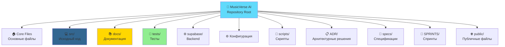

# 📁 Структура репозитория MusicVerse AI

**Последнее обновление:** 25 июня 2026  
**Версия:** 1.0.0 | **Статус:** ✅ Production Ready

---

## 🗺️ Общая схема



---

## 📂 Детальная структура

### 🏠 Корневые файлы (Root Level)

```
aimusicverse/
├── README.md                          # 🎯 Главная точка входа
├── README_EN.md                       # 🇬🇧 English версия README
├── REPOSITORY_STRUCTURE.md            # 📁 Этот файл - структура репо
├── PROJECT_STATUS.md                  # 📊 Текущий статус проекта
├── ROADMAP.md                         # 🗺️ Дорожная карта
├── CHANGELOG.md                       # 📜 История изменений
├── CONTRIBUTING.md                    # 🤝 Руководство по контрибуции
├── CODE_OF_CONDUCT.md                 # 📜 Кодекс поведения
├── SECURITY.md                        # 🔒 Политика безопасности
├── MAINTENANCE.md                     # 🔧 Руководство по поддержке
├── CLAUDE.md                          # 🤖 Инструкции для Claude Code
├── DOCUMENTATION_INDEX.md             # 📚 Индекс документации
├── KNOWLEDGE_BASE.md                  # 🧠 База знаний
├── PROJECT_STRUCTURE.md               # 🏗️ Структура проекта
│
├── package.json                       # 📦 Зависимости проекта
├── package-lock.json                  # 🔒 Locked зависимости
├── bun.lock                           # 🥟 Bun lock файл
├── tsconfig.json                      # ⚙️ TS конфигурация
├── tsconfig.app.json                  # ⚙️ TS App конфигурация
├── tsconfig.node.json                 # ⚙️ TS Node конфигурация
├── vite.config.ts                     # ⚡ Vite конфигурация
├── vitest.config.ts                   # 🧪 Vitest конфигурация
├── jest.config.js                     # 🃏 Jest конфигурация
├── playwright.config.ts               # 🎭 Playwright конфигурация
├── tailwind.config.ts                 # 🎨 Tailwind конфигурация
├── postcss.config.js                  # 🎨 PostCSS конфигурация
├── eslint.config.js                   # 🔍 ESLint конфигурация
├── prettierrc.json                    # 💅 Prettier конфигурация
├── prettierignore                     # 🙈 Prettier ignore
├── .editorconfig                      # 📝 EditorConfig
├── .gitattributes                     # 📝 Git attributes
├── .gitignore                         # 🙈 Git ignore
├── .env                               # 🔐 Переменные окружения
├── .env.example                       # 📝 Пример .env
├── components.json                    # 🧩 shadcn/ui конфигурация
├── babel.config.js                    # 🌀 Babel конфигурация
├── bunfig.toml                        # 🥟 Bun конфигурация
├── lighthouserc.json                  # 🏮 Lighthouse конфигурация
├── index.html                         # 🌐 Entry HTML
└── vitest.shims.d.ts                  # 🧪 Vitest типы
```

---

### 💻 Исходный код (`src/`)

```
src/
├── main.tsx                           # 🚀 Entry point
├── App.tsx                            # 📱 Root компонент
│
├── components/                        # 🧩 React компоненты (1,124+)
│   ├── ui/                            # 🎨 shadcn/ui компоненты
│   ├── mobile/                        # 📱 Мобильные компоненты (19)
│   ├── player/                        # 🎧 Аудиоплеер компоненты
│   ├── generate/                      # 🎹 Генерация музыки
│   ├── library/                       # 📚 Библиотека треков
│   ├── studio/                        # 🎛️ Unified Studio
│   ├── gamification/                  # 🎮 Геймификация
│   ├── auth/                          # 🔐 Аутентификация
│   ├── layout/                        # 📐 Layout компоненты
│   └── common/                        # 🔧 Общие компоненты
│
├── hooks/                             # 🪝 Кастомные хуки (200+)
│   ├── useTelegram.ts                 # 🤖 Telegram интеграция
│   ├── useAudioPlayer.ts              # 🎧 Аудиоплеер
│   ├── useGeneration.ts               # 🎹 Генерация
│   └── ...
│
├── services/                          # ⚙️ Бизнес-логика (13)
│   ├── audioService.ts                # 🎧 Аудио сервис
│   ├── generationService.ts           # 🎹 Сервис генерации
│   ├── telegramService.ts             # 🤖 Telegram сервис
│   └── ...
│
├── api/                               # 🔌 API слой
│   ├── supabase.ts                    # 🗄️ Supabase клиент
│   ├── endpoints/                     # 📡 API endpoints
│   └── types/                         # 📝 API типы
│
├── stores/                            # 🗄️ Zustand хранилища (8)
│   ├── usePlayerStore.ts              # 🎧 Плеер стейт
│   ├── useLibraryStore.ts             # 📚 Библиотека
│   └── ...
│
├── pages/                             # 📄 Страницы (40+)
│   ├── HomePage.tsx                   # 🏠 Главная
│   ├── GeneratePage.tsx               # 🎹 Генерация
│   ├── LibraryPage.tsx                # 📚 Библиотека
│   ├── StudioPage.tsx                 # 🎛️ Студия
│   └── ...
│
├── lib/                               # 📚 Утилиты (60+)
│   ├── utils.ts                       # 🔧 Общие утилиты
│   ├── constants.ts                   # 📌 Константы
│   ├── validators.ts                  # ✅ Валидаторы
│   └── ...
│
├── types/                             # 📝 TypeScript типы
│   ├── track.ts                       # 🎵 Track типы
│   ├── user.ts                        # 👤 User типы
│   └── ...
│
├── contexts/                          # 🎭 React контексты (10)
│   ├── TelegramContext.tsx            # 🤖 Telegram контекст
│   ├── AudioContext.tsx               # 🎧 Аудио контекст
│   └── ...
│
├── assets/                            # 🖼️ Статические файлы
│   ├── images/                        # 🖼️ Изображения
│   ├── icons/                         # 🎯 Иконки
│   └── fonts/                         # 🔤 Шрифты
│
└── styles/                            # 🎨 Глобальные стили
    ├── globals.css                    # 🌍 Глобальные CSS
    └── index.css                      # 🎨 Основные стили
```

---

### 📚 Документация (`docs/`)

```
docs/
├── INDEX.md                           # 📑 Индекс документации
├── NAVIGATION.md                      # 🧭 Центр навигации
├── NAVIGATION_INDEX.md                # 📋 Индекс навигации
├── NAVIGATION_SYSTEM.md               # 🗺️ Система навигации
├── PROGRESS.md                        # 📊 Трекер прогресса
│
├── 📖 Основные руководства
│   ├── QUICK_START.md                 # 🚀 Быстрый старт
│   ├── ONBOARDING.md                  # 🎓 Онбординг
│   ├── DEVELOPER_GUIDE.md             # 👨‍💻 Гайд разработчика
│   ├── DEVELOPMENT_WORKFLOW.md        # 🔄 Рабочий процесс
│   └── PROJECT_MANAGEMENT.md          # 📋 Управление проектом
│
├── 🏗️ Архитектура
│   ├── ARCHITECTURE.md                # 🏛️ Архитектура системы
│   ├── ARCHITECTURE_DIAGRAMS.md       # 📊 Диаграммы архитектуры
│   ├── COMPREHENSIVE_ARCHITECTURE.md  # 📖 Полная архитектура
│   ├── DATABASE.md                    # 🗄️ Схема БД
│   ├── PLAYER_ARCHITECTURE.md         # 🎧 Архитектура плеера
│   ├── AUDIO_ARCHITECTURE_DIAGRAM.md  # 🎵 Диаграмма аудио
│   └── TELEGRAM_BOT_ARCHITECTURE.md   # 🤖 Архитектура бота
│
├── 🎨 Дизайн и UI
│   ├── DESIGN_SYSTEM_COMPREHENSIVE.md # 🎨 Дизайн-система
│   ├── STYLES.md                      # 💅 Стили
│   ├── LAYOUT_SYSTEM.md               # 📐 Layout система
│   ├── Z_INDEX_HIERARCHY.md           # 📊 Z-index иерархия
│   ├── SAFE_AREA_GUIDELINES.md        # 📱 Safe Area (iOS)
│   ├── MOBILE_COMPONENTS.md           # 📱 Мобильные компоненты
│   └── META_TAGS.md                   # 🏷️ Meta теги
│
├── 🎵 Функции
│   ├── SUNO_API.md                    # ☀️ Suno AI интеграция
│   ├── GENERATION_SYSTEM.md           # 🎹 Система генерации
│   ├── STEM_STUDIO.md                 # 🎛️ Stem Studio
│   ├── AI_LYRICS_ASSISTANT.md         # ✍️ AI Lyrics Assistant
│   ├── CREATIVE_TOOLS.md              # 🛠️ Креативные инструменты
│   ├── CONTEXTUAL_HINTS_SYSTEM.md     # 💡 Контекстные подсказки
│   ├── AUDIO_UPLOAD_FLOW.md           # 📤 Загрузка аудио
│   └── DEMO_MODE.md                   # 🎭 Демо режим
│
├── 🤖 Telegram
│   ├── TELEGRAM_MINI_APP_FEATURES.md  # 📱 Mini App функции
│   ├── TELEGRAM_MINI_APP_ADVANCED_FEATURES.md  # ⚡ Продвинутые функции
│   ├── TELEGRAM_BOT_ARCHITECTURE.md   # 🤖 Архитектура бота
│   ├── TELEGRAM_BOT_COMMANDS_REFERENCE.md  # 📋 Команды бота
│   ├── TELEGRAM_BOT_DEVELOPER_GUIDE.md     # 👨‍💻 Гайд разработчика бота
│   ├── TELEGRAM_BOT_MONITORING.md     # 📊 Мониторинг бота
│   ├── TELEGRAM_BOT_USER_GUIDE_RU.md  # 🇷🇺 Гайд пользователя
│   ├── TELEGRAM_BOT_UTILITIES.md      # 🛠️ Утилиты бота
│   └── TELEGRAM_PAYMENTS.md           # 💰 Платежи
│
├── 🧪 Тестирование и качество
│   ├── TESTING_INFRASTRUCTURE.md      # 🧪 Инфраструктура тестов
│   ├── QUALITY_GATES.md               # ✅ Quality Gates
│   ├── PERFORMANCE_OPTIMIZATION.md    # ⚡ Оптимизация
│   ├── PERFORMANCE_OPTIMIZATION_GUIDE.md  # 📖 Гайд оптимизации
│   ├── PERFORMANCE_MONITORING_SETUP.md     # 📊 Мониторинг
│   ├── ERROR_HANDLING_INFRASTRUCTURE.md    # 🚨 Обработка ошибок
│   └── AUDIT_SYSTEM.md                # 🔍 Система аудита
│
├── 🔧 Интеграции
│   ├── API.md                         # 📡 API документация
│   ├── KLANG_IO.md                    # 🎵 Klang.io интеграция
│   ├── KLANG_IO_API_GUIDE_RU.md       # 🇷🇺 Klang.io гайд
│   └── BUNDLE_OPTIMIZATION.md         # 📦 Оптимизация bundle
│
├── 📱 Мобильная разработка
│   ├── iOS_FIXES.md                   # 🍎 iOS исправления
│   ├── LANGUAGES.md                   # 🌍 Языки
│   └── mobile/
│       └── OPTIMIZATION_ROADMAP_2026.md  # 📱 План оптимизации
│
├── 📊 Аналитика и аудит
│   ├── UX_AUDIT/                      # 🔍 UX аудит
│   └── PLAYER_TROUBLESHOOTING.md      # 🔧 Тroubleshooting плеера
│
├── 📋 Спецификации
│   ├── PROJECT_SPECIFICATION.md       # 📝 Спецификация проекта
│   ├── CRITICAL_FILES.md              # ⚠️ Критические файлы
│   └── PLAYER_README.md               # 🎧 Плеер README
│
├── 🗂️ Архив
│   ├── ARCHIVE.md                     # 📦 Архив документов
│   ├── KNOWN_ISSUES.md                # 🐛 Известные проблемы
│   ├── SECURITY_SUMMARY.md            # 🔒 Резюме безопасности
│   └── MUSICVERSE_DESCRIPTION.md      # 📝 Описание проекта
│
└── 📂 Подпапки
    ├── architecture/                  # 🏗️ Архитектурные диаграммы
    ├── archive/                       # 📦 Архив
    ├── checklists/                    # ✅ Чеклисты
    ├── features/                      # ✨ Документация функций
    ├── guides/                        # 📖 Руководства
    ├── images/                        # 🖼️ Изображения для доков
    ├── integrations/                  # 🔗 Интеграции
    ├── mobile/                        # 📱 Мобильная документация
    ├── ru/                            # 🇷🇺 Русские переводы
    ├── TELEGRAM_MINI_APP/             # 📱 Telegram Mini App
    └── templates/                     # 📄 Шаблоны
```

---

### 🧪 Тесты (`tests/`)

```
tests/
├── e2e/                              # 🎭 E2E тесты (62+)
│   ├── auth.spec.ts                  # 🔐 Тесты аутентификации
│   ├── generation.spec.ts            # 🎹 Тесты генерации
│   ├── player.spec.ts                # 🎧 Тесты плеера
│   ├── library.spec.ts               # 📚 Тесты библиотеки
│   └── ...
│
├── unit/                             # 🃏 Unit тесты (27+)
│   ├── utils.test.ts                 # 🔧 Тесты утилит
│   ├── validators.test.ts            # ✅ Тесты валидаторов
│   └── ...
│
└── integration/                      # 🔗 Integration тесты
    ├── api.test.ts                   # 📡 API тесты
    └── supabase.test.ts              # 🗄️ Supabase тесты
```

---

### ⚙️ Backend (`supabase/`)

```
supabase/
├── functions/                        # ⚡ Edge Functions (99+)
│   ├── generate/                     # 🎹 Генерация музыки
│   │   ├── index.ts                  # 🚀 Main функция
│   │   ├── suno-api.ts               # ☀️ Suno API
│   │   └── ...
│   │
│   ├── auth/                         # 🔐 Аутентификация
│   │   ├── telegram-auth.ts          # 🤖 Telegram auth
│   │   └── ...
│   │
│   ├── tracks/                       # 🎵 Управление треками
│   │   ├── get.ts                    # 📥 Получение
│   │   ├── update.ts                 # ✏️ Обновление
│   │   └── delete.ts                 # 🗑️ Удаление
│   │
│   ├── library/                      # 📚 Библиотека
│   ├── studio/                       # 🎛️ Студия
│   ├── payments/                     # 💰 Платежи
│   ├── notifications/                # 🔔 Уведомления
│   └── ...
│
├── migrations/                       # 🗄️ Миграции БД
│   ├── 20240101000000_initial.sql
│   └── ...
│
├── config.toml                       # ⚙️ Supabase конфигурация
└── seed.sql                          # 🌱 Начальные данные
```

---

### 🏃 Спринты (`SPRINTS/`)

```
SPRINTS/
├── README.md                         # 📖 Обзор системы спринтов
├── SPRINT-PROGRESS.md                # 📊 Текущий прогресс
├── BACKLOG.md                        # 📋 Продуктовый бэклог
├── FUTURE_WORK_PLAN_2026.md          # 📅 План на 2026
├── IMPROVEMENT_PLAN_2026.md          # ⚡ План улучшений
│
├── completed/                        # ✅ Архив спринтов (35+)
│   ├── SPRINT-001-*.md
│   ├── SPRINT-002-*.md
│   └── ...
│
└── active/                           # 🔄 Активные спринты
    └── SPRINT-036-*.md
```

---

### 📋 Архитектурные решения (`ADR/`)

```
ADR/
├── ADR_TEMPLATE.md                   # 📝 Шаблон ADR
├── ADR-001-TECHNOLOGY-STACK-CHOICE.md  # 🛠️ Выбор технологий
├── ADR-002-Frontend-Architecture-And-Stack.md  # ⚛️ Frontend архитектура
├── ADR-003-Performance-Optimization-Architecture.md  # ⚡ Оптимизация
├── ADR-004-Audio-Playback-Optimization.md  # 🎧 Аудио оптимизация
├── ADR-004-Error-Handling-Architecture.md  # 🚨 Обработка ошибок
├── ADR-005-State-Machine-Architecture.md  # 🔄 State Machine
├── ADR-006-Type-Safe-Audio-Context.md  # 🎵 Type-safe аудио
├── ADR-011-UNIFIED-STUDIO-ARCHITECTURE.md  # 🎛️ Unified Studio
└── ADR-012-GENERATION-FORM-COMPACT-UI.md  # 📱 Компактный UI
```

---

### 📝 Спецификации (`specs/`)

```
specs/
├── 001-mobile-ui-redesign/           # 📱 Mobile UI редизайн
│   ├── spec.md                       # 📝 Спецификация
│   ├── requirements.md               # ✅ Требования
│   └── user-stories.md               # 📖 User stories
│
├── 031-mobile-studio-v2/             # 🎛️ Mobile Studio V2
│   ├── spec.md
│   ├── requirements.md
│   └── design/
│
└── 032-professional-ui/              # 🎨 Professional UI
    ├── spec.md
    ├── requirements.md
    └── components/
```

---

### 🔧 Скрипты (`scripts/`)

```
scripts/
├── setup.sh                          # 🚀 Настройка проекта
├── deploy.sh                         # 🚢 Деплой
├── migrate.sh                        # 🗄️ Миграции БД
├── seed.ts                           # 🌱 Заполнение БД
├── generate-types.ts                 # 📝 Генерация типов
└── utils/
    ├── format-code.sh                # 💅 Форматирование кода
    └── run-tests.sh                  # 🧪 Запуск тестов
```

---

### 🌐 Публичные файлы (`public/`)

```
public/
├── favicon.ico                       # 🎯 Favicon
├── logo.png                          # 🖼️ Логотип
├── banner.png                        # 🖼️ Баннер
├── og-image.png                      # 📸 Open Graph изображение
├── robots.txt                        # 🤖 Robots
├── sitemap.xml                       # 🗺️ Sitemap
└── manifest.json                     # 📱 PWA manifest
```

---

### ⚙️ Конфигурация (Root level)

```
Конфигурационные файлы:
├── .editorconfig                     # 📝 EditorConfig
├── .env                              # 🔐 Переменные окружения
├── .env.example                      # 📝 Пример .env
├── .gitattributes                    # 📝 Git attributes
├── .gitignore                        # 🙈 Git ignore
├── .prettierrc.json                  # 💅 Prettier
├── .prettierignore                   # 🙈 Prettier ignore
├── eslint.config.js                  # 🔍 ESLint
├── tsconfig.json                     # ⚙️ TypeScript
├── vite.config.ts                    # ⚡ Vite
├── tailwind.config.ts                # 🎨 Tailwind
├── playwright.config.ts              # 🎭 Playwright
├── vitest.config.ts                  # 🧪 Vitest
├── jest.config.js                    # 🃏 Jest
├── components.json                   # 🧩 shadcn/ui
├── babel.config.js                   # 🌀 Babel
├── bunfig.toml                       # 🥟 Bun
└── lighthouserc.json                 # 🏮 Lighthouse
```

---

## 📊 Статистика репозитория

### 📈 Размеры

| Категория                | Количество | Размер  |
| ------------------------ | ---------- | ------- |
| **TypeScript/TSX файлы** | 1,957+     | ~15 MB  |
| **React компоненты**     | 1,124+     | ~8 MB   |
| **Тесты**                | 89+        | ~2 MB   |
| **Документация**         | 100+       | ~1.5 MB |
| **Edge Functions**       | 99+        | ~3 MB   |
| **Спринты**              | 35+        | ~500 KB |

### 🎯 Типы файлов

```
TypeScript/TSX:     ████████████████████ 60%
Markdown:           ████████ 20%
JSON:               ████ 8%
SQL:                ███ 5%
Config:             ██ 3%
Other:              ██ 4%
```

---

## 🔗 Навигация по репозиторию

### 🚀 Быстрый старт

1. **[README.md](README.md)** — Обзор проекта
2. **[CONTRIBUTING.md](CONTRIBUTING.md)** — Как контрибьютить
3. **[docs/QUICK_START.md](docs/QUICK_START.md)** — Быстрый старт
4. **[docs/ONBOARDING.md](docs/ONBOARDING.md)** — Онбординг

### 📚 Документация

- **[DOCUMENTATION_INDEX.md](DOCUMENTATION_INDEX.md)** — Полный индекс
- **[docs/NAVIGATION.md](docs/NAVIGATION.md)** — Навигация по документации
- **[docs/PROGRESS.md](docs/PROGRESS.md)** — Прогресс проекта

### 🏗️ Архитектура

- **[docs/ARCHITECTURE_DIAGRAMS.md](docs/ARCHITECTURE_DIAGRAMS.md)** — Диаграммы
- **[ADR/](ADR/)** — Architecture Decision Records
- **[docs/DATABASE.md](docs/DATABASE.md)** — Схема БД

### 🧪 Тестирование

- **[docs/TESTING_INFRASTRUCTURE.md](docs/TESTING_INFRASTRUCTURE.md)** — Инфраструктура
- **[docs/QUALITY_GATES.md](docs/QUALITY_GATES.md)** — Стандарты качества
- **[tests/](tests/)** — Тестовые файлы

### 📱 Мобильная разработка

- **[docs/SAFE_AREA_GUIDELINES.md](docs/SAFE_AREA_GUIDELINES.md)** — Safe Area
- **[docs/mobile/](docs/mobile/)** — Мобильная документация
- **[specs/031-mobile-studio-v2/](specs/031-mobile-studio-v2/)** — Спецификация

### 🎵 Функции

- **[docs/SUNO_API.md](docs/SUNO_API.md)** — Suno AI
- **[docs/STEM_STUDIO.md](docs/STEM_STUDIO.md)** — Stem Studio
- **[docs/GENERATION_SYSTEM.md](docs/GENERATION_SYSTEM.md)** — Генерация

---

## 🎯 Best Practices

### 📝 Организация кода

- **Компоненты** → `src/components/`
- **Хуки** → `src/hooks/`
- **Сервисы** → `src/services/`
- **Сторы** → `src/stores/`
- **Страницы** → `src/pages/`
- **Утилиты** → `src/lib/`

### 📚 Организация документации

- **Основное** → Root level (`README.md`, `CONTRIBUTING.md`)
- **Руководства** → `docs/guides/`
- **Архитектура** → `docs/architecture/`
- **Функции** → `docs/features/`
- **Интеграции** → `docs/integrations/`
- **Мобильное** → `docs/mobile/`

### 🧪 Организация тестов

- **E2E** → `tests/e2e/` (по модулям)
- **Unit** → `tests/unit/` (рядом с кодом)
- **Integration** → `tests/integration/`

---

## 🔍 Поиск файлов

### По назначению

| Что ищем?     | Где ищем?             |
| ------------- | --------------------- |
| Компонент     | `src/components/`     |
| Хук           | `src/hooks/`          |
| Сервис        | `src/services/`       |
| Страница      | `src/pages/`          |
| Утилита       | `src/lib/`            |
| Тип           | `src/types/`          |
| Тест          | `tests/`              |
| Edge Function | `supabase/functions/` |
| Документация  | `docs/`               |
| ADR           | `ADR/`                |
| Спринт        | `SPRINTS/`            |

### По технологии

| Технология | Путь                            |
| ---------- | ------------------------------- |
| React      | `src/components/`, `src/pages/` |
| TypeScript | `src/**/*.ts`, `src/**/*.tsx`   |
| Tailwind   | `*.tsx` (className)             |
| Supabase   | `supabase/`, `src/api/`         |
| Telegram   | `src/hooks/useTelegram.ts`      |
| Audio      | `src/services/audioService.ts`  |

---

## 📋 Чеклист организации

### ✅ Структура репозитория

- [x] Логичная иерархия папок
- [x] Консистентное именование
- [x] Разделение concerns
- [x] Документация для каждой папки
- [x] README в ключевых директориях

### ✅ Конфигурация

- [x] EditorConfig настроен
- [x] Prettier настроен
- [x] ESLint настроен
- [x] TypeScript строгий режим
- [x] Git ignore настроен

### ✅ Документация

- [x] Главный README обновлён
- [x] CONTRIBUTING.md полный
- [x] DOCUMENTATION_INDEX.md актуален
- [x] ADR документы структурированы
- [x] Спринты документированы

### ✅ Навигация

- [x] Навигация по документации
- [x] Быстрые ссылки
- [x] Индекс файлов
- [x] Диаграммы структур
- [x] Поисковые паттерны

---

## 🎓 Обучение по структуре

### Для новых разработчиков

1. **Начните здесь:** [README.md](README.md)
2. **Поймите структуру:** Этот файл
3. **Изучите архитектуру:** [docs/ARCHITECTURE_DIAGRAMS.md](docs/ARCHITECTURE_DIAGRAMS.md)
4. **Настройте окружение:** [CONTRIBUTING.md](CONTRIBUTING.md)
5. **Начните кодить:** [docs/ONBOARDING.md](docs/ONBOARDING.md)

### Для опытных разработчиков

1. **Быстрая навигация:** [DOCUMENTATION_INDEX.md](DOCUMENTATION_INDEX.md)
2. **Архитектурные решения:** [ADR/](ADR/)
3. **Активные задачи:** [SPRINTS/BACKLOG.md](SPRINTS/BACKLOG.md)
4. **Технические детали:** [docs/](docs/)

---

<div align="center">

**Структура поддерживается и обновляется командой MusicVerse AI**

_Последнее обновление: 25 июня 2026_

[🔝 В начало](#-структура-репозитория-musicverse-ai)

</div>
