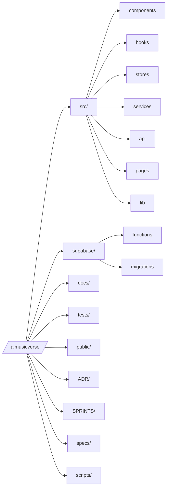

# 🗂 Repository Structure

**A visual map of the MusicVerse AI codebase — purpose, ownership, and where to look.**

  
  
  

  <a href="README.md">🏠 Home</a> ·
  <a href="DOCUMENTATION_INDEX.md">📚 Docs</a> ·
  <a href="ARCHITECTURE_HUB.md">🏛 Architecture</a>

---

## 🌳 Top-level layout

## 📁 Root directories

| Path | Purpose |
| --- | --- |
| `src/` | React app (frontend) |
| `supabase/` | Edge Functions, migrations, config |
| `docs/` | Long-form documentation |
| `tests/` | Unit (Vitest) + E2E (Playwright) |
| `public/` | Static assets |
| `ADR/` | Architecture Decision Records |
| `SPRINTS/` | Sprint planning |
| `specs/` | SDD specs |
| `scripts/` | Maintenance scripts |
| `.github/` | CI, agents, issue templates |
| `.lovable/` | Lovable platform state |

## 📦 `src/` — frontend application

<b>Top folders</b>

| Folder | Notes |
| --- | --- |
| `components/` | 935+ React components, grouped by feature (`player/`, `studio/`, `generate-form/`, `lyrics/`, `library/`, `admin/`, `telegram/`, `ui/`) |
| `hooks/` | 200+ custom hooks (`audio/`, `generation/`, `studio/`, `telegram/`) |
| `stores/` | 8 Zustand stores (player, unified studio, lyrics history, mixer history, …) |
| `services/` | Business logic & orchestration |
| `api/` | Direct, typed Supabase queries |
| `pages/` | Lazy-loaded route components |
| `lib/` | Utilities (`logger`, `motion`, `errors`, `audio*`, design tokens) |
| `contexts/` | Cross-cutting React contexts (Auth, Theme, Telegram, Notification) |
| `providers/` | Top-level provider tree (Core / Feature / UI / Analytics) |
| `integrations/supabase/` | Auto-generated client (**do not edit**) |
| `types/` | Shared types & branded IDs |
| `constants/` | Generation, lyrics, project presets, z-index |
| `styles/` | Design tokens (`colors`, `typography`, `animations`, `focus`, `accessibility`) |
| `workers/` | Web workers (waveform) |

<b>Critical files (do not break)</b>

- `src/integrations/supabase/client.ts` — auto-generated
- `src/integrations/supabase/types.ts` — auto-generated
- `src/components/GlobalAudioProvider.tsx` — single `<audio>` element
- `src/hooks/audio/usePlayerState.ts` — Zustand player store
- `src/lib/logger.ts` — logging entry
- `src/lib/motion.ts` — tree-shaken framer-motion

See [`docs/CRITICAL_FILES.md`](docs/CRITICAL_FILES.md).

## ☁️ `supabase/` — backend

<b>Edge Functions (80+)</b>

| Group | Examples |
| --- | --- |
| Generation | `suno-music-generate`, `suno-extend-audio`, `suno-remix`, `suno-replace-section` |
| Stems | `suno-separate-vocals`, `suno-add-vocals` |
| AI helpers | `ai-lyrics-assistant`, `audio-analysis`, `audio-upscale`, `audio-watermark` |
| Telegram | `telegram-bot`, `suno-send-audio`, `send-telegram-notification` |
| Payments | `stars-payment`, `verify-stars-payment` |
| Admin | `admin-*` cohort |

Detail: [`docs/API.md`](docs/API.md).

## 📚 `docs/` — documentation

100+ files; organised through [`DOCUMENTATION_INDEX.md`](DOCUMENTATION_INDEX.md). Templates in [`docs/templates/`](docs/templates/). Archive in [`docs/archive/`](docs/archive/).

## 🧪 `tests/`

| Folder | Stack |
| --- | --- |
| `tests/unit/` | Vitest + Testing Library |
| `tests/integration/` | Vitest (cross-module) |
| `tests/e2e/` | Playwright (desktop + mobile projects) |
| `tests/performance/` | Vitest perf budgets |
| `tests/__mocks__/` | Shared mocks |

## 🧭 Quick reference

| I want to… | Go to |
| --- | --- |
| Add a feature | `src/components/<feature>/` + hook in `src/hooks/<feature>/` |
| Add an API call | `src/api/*.api.ts` → `src/services/*.service.ts` → hook |
| Add an Edge Function | `supabase/functions/<name>/index.ts` (+ deploy) |
| Add a migration | `supabase/migrations/` (always include `GRANT` + RLS) |
| Add a design token | `src/lib/design-tokens.ts` + `src/styles/colors.css` |
| Add a page | `src/pages/`, register lazy in `src/App.tsx` |
| Add an ADR | `ADR/ADR-NNN-title.md` |

---

### 🔗 Related Documentation

| 📚 Index | 🏛 Architecture | 🧩 KB | 🤝 Contributing | 🪲 Issues |
| :---: | :---: | :---: | :---: | :---: |
| [Index](DOCUMENTATION_INDEX.md) | [Hub](ARCHITECTURE_HUB.md) | [Knowledge Base](KNOWLEDGE_BASE.md) | [Contributing](CONTRIBUTING.md) | [Issues](KNOWN_ISSUES_TRACKED.md) |

Last updated: 2026-06-27

