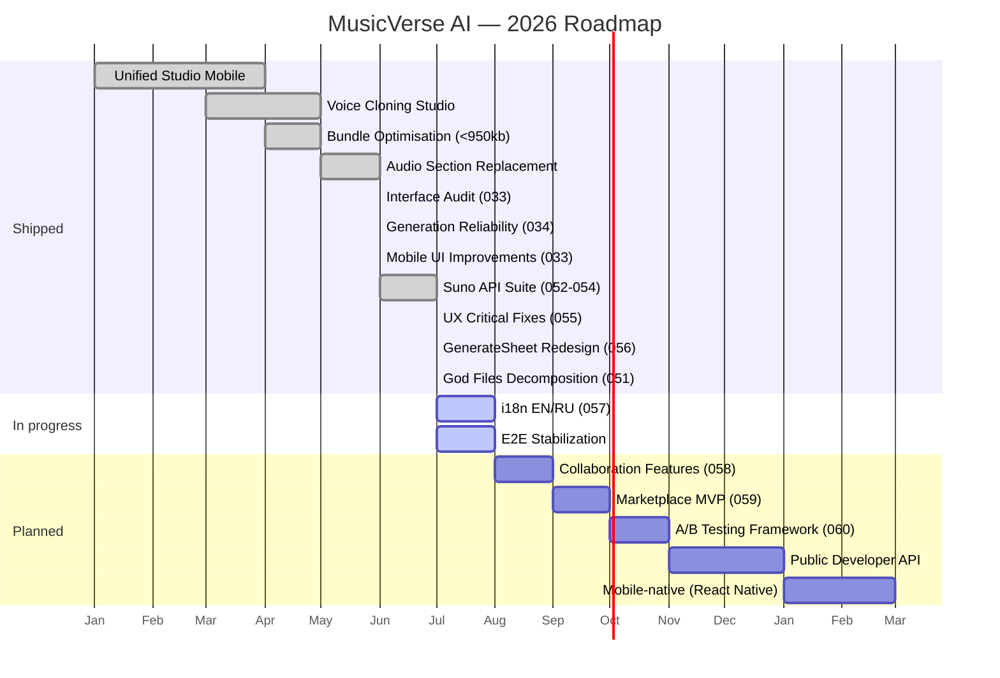

# 🗺 Roadmap

**Where MusicVerse AI is going — quarter by quarter.**

  
  
  
  

  <a href="README.md">🏠 Home</a> ·
  <a href="DOCUMENTATION_INDEX.md">📚 Docs</a> ·
  <a href="PROJECT_STATUS.md">📊 Status</a> ·
  <a href="CHANGELOG.md">📝 Changelog</a>

---

## 📅 Timeline

## 🎯 Quarterly objectives

### Q3 2026 — Collaboration

|  #  | Epic                                                 |                             Progress                              |
| :-: | ---------------------------------------------------- | :---------------------------------------------------------------: |
|  1  | Realtime sessions (presence, cursors, waveform sync) |   |
|  2  | Marketplace MVP (beats / loops / voices)             |   |
|  3  | A/B testing framework rollout                        |  |
|  4  | Lyrics co-editing                                    |   |

### Q4 2026 — Platform

|  #  | Epic                            | Status |
| :-: | ------------------------------- | :----: |
|  1  | Multi-language UI (EN/RU/ES/DE) |   📋   |
|  2  | Public Developer API            |   📋   |
|  3  | Webhooks for generations        |   📋   |
|  4  | Plugin SDK (lyrics tools)       |   📋   |

### Q1 2027 — Native expansion

|  #  | Epic                      | Status |
| :-: | ------------------------- | :----: |
|  1  | React Native iOS app      |   📋   |
|  2  | React Native Android app  |   📋   |
|  3  | Desktop (Electron) studio |   📋   |

---

## 🧱 Tech debt & infra

- [x] Split `useUnifiedStudioStore` (38 KB) into domain slices — done: 29-line facade over `src/stores/studio/{useProjectStore,useLyricsStore,useTrackStore}.ts` (verified 2026-07-04)
- [ ] Migrate remaining legacy generators to `suno-music-generate`
- [ ] Full WCAG AA pass on Library + Studio
- [ ] Lighthouse perf budget enforcement in CI

---

## 📊 Sprint history

See [`SPRINTS/`](SPRINTS/) — 34 completed sprints, archived under [`SPRINTS/completed/`](SPRINTS/completed/).

### Planned

> Приоритеты пересмотрены по итогам [аудита прогресса 2026-07-04](docs/audit/PROGRESS-AUDIT-2026-07-04.md): перед фичами — зелёный `main` и процессный фикс для прямых Lovable-коммитов.

- **Sprint 050 — Main Green + Mobile Audit F1–F12** ([детальный план](SPRINTS/SPRINT-050-PLAN.md)). ✅ **Phase A ✅ завершена (6/6).** ✅ **Phase B ✅ завершена (6/6):** B1 ✅ `useScrollLock` на 4 surfaces, B3 ✅ QueueSheet auto-close + toast, B4 ✅ cover_url normalization, B5 ✅ ErrorBoundary, B6 ✅ lazy-imports (lamejs/qrcode/canvas-confetti). GitHub Pages включён.
- **Sprint 051 — Test Debt + God Files** ✅ **T055 ✅ (395→925 tests). T056 ✅ (9/9 god files decomposed, all <740 LOC). PRs #636-#644 MERGED.**
- **Sprint 053 — Suno API: Sounds + MIDI Direct + Boost Style** ✅ **ЗАВЕРШЁН.** Все edge functions, hooks, SfxGeneratorSheet, boost-style connected.
- **Sprint 054 — Suno API: Details Suite** ✅ **ЗАВЕРШЁН.** 6 details endpoints, generic polling hook.
- **Sprint 055 — UX Critical Fixes** ✅ **Phase A+B Complete.** Все P0/P1 UX-фиксы: Save Draft, Cancel Generation, Deeplink, Welcome Bonus, Dual CTA, Footer Summary, Stepper, VoiceInput, Home CTA.
- **Bundle follow-up** (→ Sprint 052) — eager-load fix already landed 2026-07-03 (~1.19 МБ → ~508 КБ gzip, see [docs/BUNDLE_ANALYSIS.md](docs/BUNDLE_ANALYSIS.md)); remaining work is reducing the `size-limit` "Total Bundle" check (2.11 МБ across all chunks including admin/studio) via `manualChunks` boundary rework 🟡

### In Progress

- **Sprint 056 Phase C-D** — GenerateSheet docs + stories verification

### Completed (recent)

- **Sprint 050 — Main Green + Mobile Audit F1–F12** ✅ Phase A+B Complete (2026-07-06)
- **Sprint 051 Phase A-C** ✅ Decomposition complete (2026-07-06): studio.service 1137→4 modules, studio.api 953→4 modules, LyricsParser types extraction, 103 new tests
- **Sprint 051 T055** ✅ vitest config fix + API tests (2026-07-06): 395→925 passing (+530), PR #636
- **Sprint 051 T056** ✅ god file decomposition complete (2026-07-06): 9/9 files done, all <740 LOC, PRs #638-#644
- **Sprint 053** ✅ Complete: SFX/MIDI edge functions, hooks, SfxGeneratorSheet, boost-style connected
- **Sprint 054** ✅ Complete: 6 details endpoints, generic polling hook
- **Sprint 055 Phase A+B** ✅ Complete: All P0/P1 UX fixes (Save Draft, Cancel, Deeplink, Welcome Bonus, Dual CTA, Footer Summary, Stepper, VoiceInput, Home CTA)
- **Sprint 052 — Suno API: Mashup + Persona + File Upload** ([детальный план](SPRINTS/SPRINT-052-PLAN.md)). ✅ ЗАВЕРШЁН 2026-07-04 (8/10 задач). Commits `916cd72a` … `b778bf98`:
  - **Phase A (edge + DB):** 4 новых edge (`suno-mashup`, `suno-persona`, `suno-persona-callback`, `suno-file-upload`); mashup использует существующий `suno-music-callback` (signature совпадает — отдельный mashup-callback НЕ создавался); DB-миграция `track_personas` + `track_versions.persona_id` (FK) + RLS.
  - **Phase B (UI + bot):** `useSunoMashup`/`useSunoPersona`/`useSunoFileUpload` (TanStack Query mutations); `MashupDialog` с мобильным/десктоп variants; кнопка «Create Persona» в `GenerationResultSheet`; Telegram `/mashup` команда + deep-link `startapp=mashup_<id>`; рефакторинг `suno-upload-cover/extend` через общий `suno-file-uploader.ts`.
  - **E2E:** `tests/e2e/suno-mashup.spec.ts` — smoke deep-link + dialog render.
  - **Deferred (→ Sprint 052-C):** Storybook stories для MashupDialog, i18n strings (en/ru).
- **Sprint 045** — UX/UI Deep Polish + Hygiene. ✅ ЗАВЕРШЁН (4/4 фазы, 4 коммита: `0813d631` + `68cae274` + `28413a5d` + `69e652a8`):
  - **Phase A** — emoji → Lucide (11 замен), touch-target ≥ 44px (3 поверхности), raw-color → semantic.
  - **Phase B** — motion hygiene: PageTransition keyframes fix (4 варианта), BottomNavigation `isActive()` root-prefix fix, HomeHeader 5× `repeat:Infinity` через `safeTransition()` (WCAG SC 2.3.3).
  - **Phase C** — token consolidation: `typographyClass.navLabel` token, `aurora-glow` documented as composition, `vinyl-spin/-slow` motion-reduce guards.
  - **Phase D** — visual polish: `.glass-card:hover` `@media (hover: hover)` guard (WCAG SC 2.5.1), shadow `rgba()` → HSL tokens, emoji → Lucide в 3 файлах (8 замен).
  - **Phase D-4** — ErrorBoundary home button (`useNavigate`) перенесён в Sprint 050 как функциональное изменение вне design scope.

- **Sprint 046** — Desktop Layout Polish + 4K Awareness. ✅ ЗАВЕРШЁН (3 коммита: `8eb55c78` + `c0d5b942` + `6d57fa68`):
  - **Phase A** — 4K-aware tokens: `BREAKPOINTS 3xl/4xl`, расширены `GRID_COLS` (5→7 на 3xl), `MAX_WIDTHS ultrawide/fourk` (1600/1760), `LAYOUT_RATIOS` 60/40→55/45→50/50, `SIDEBAR_WIDTHS.expanded xl:72 2xl:80`, `GAPS 3xl/4xl`, новые `spacingClass.cardPadding`, `spacingClass.lyricsWord`, `containerMax`.
  - **Phase B** — Surface alignment (19 файлов): player (CompactPlayer, DesktopFullscreenPlayer, QueueSheet, LyricsPanel/Pages, CoverPage), track cards (VirtualizedTrackList, GridVariant, EnhancedVariant, TrackDetailPanel — все raw `` → `LazyImage`), Library (master-detail scale на xl/2xl, header buttons step-up, skeleton parity), filter parity (LibraryFilterChips, CompactFilterBar), lyrics+studio (LyricsAIPanel width token, LyricsStudioPage max-w wrap, StudioShell master volume, StudioShellHeader tabs parity).
  - **Phase C** — Polish (4 файла): `DesktopContentHubLayout` empty-state `2xl:hidden`, `LAYOUT_RATIOS` consumer migration, `DesktopDashboardLayout/ToolsGridLayout` → `GAPS` token, `LyricsHeader` `bg-card/50` → `bg-background/95 backdrop-blur-md` (parity с 2 другими headers).
  - 12 functional bugs флагнуты build-agent (keyboard nav, version refresh, master volume snap, notes undefined и др.) — out of design scope.

- **Sprint 047** — Mobile Audit + Z-Index/Spacing/Scroll-Lock + Player Z-Stack. ✅ ЗАВЕРШЁН (4 коммита: `5d97fa1f` + `dd8e734e` + `c22f94c3` + `3b38092e`):
  - **Phase A** — Tokens: `fontSize.overline`/`body-md` (small-text tokens), `backdrop.sheet` (70% + blur theme-aware), z-index consolidation — 3 conflicting sources (`constants/z-index.ts` + `lib/z-index.ts` + `tailwind.config.ts`) collapsed to one canonical `tailwind.config.ts` + inline `Z_INDEX` shim для inline-style consumers. Two dead TS files deleted (zero consumers verified).
  - **Phase B** — Community + track cards (6 файлов): CommunityTrending redesign (raw-white `from-white/25` → theme-aware `from-foreground/20`, `text-[Npx]` → tokens, `w-[50px] h-[50px]` → `w-12 h-12`, `mt-0.5` → `mt-1`, add `LazyImage` `coverSize="small"` + `Music2` fallback). TrackCoverImage: raw white → `primary-foreground` (×3). 4 variants (Grid/List/Compact/Enhanced): `text-[10/11/8px]` → `text-overline`/`text-caption-sm`, `max-w-[140px]` → `max-w-36`, `p-2.5 sm:p-3` → `p-3` (unify), `line-clamp-2 xs:line-clamp-1` (small phones).
  - **Phase C** — Persona/project/generator z-index (6 файлов): `z-[150]` / `z-[151]` → `z-sheet-backdrop` / `z-sheet-content` (sheet.tsx + MobileBottomSheet), loading overlay `z-50` → `z-overlay` + `backdrop.sheet`, collapsed toggle `h-10 w-10` → `h-11 w-11 min-h-touch min-w-touch`, `h-[90vh]` → `h-[90dvh]`, prompt-history nested dialog `z-10` → `z-popover`, lyrics-section dropdown `z-50` → `z-dropdown`. `isFullscreen` regex extended `h-[NNd?vh]` чтобы `ProjectSettingsSheet` получил safe-area padding.
  - **Phase D** — Player z-stack (3 файла, highest severity): DesktopFullscreenPlayer `z-50` → `z-fullscreen` (bug — было ниже compact `z-player=60`), KaraokeView `z-[100]` → `z-system` + `z-10` → `z-sticky` + `text-white` → `text-primary-foreground` (×3), MobileFullscreenPlayer drag-strip `z-20 h-10` → `z-sticky h-12 min-h-touch` (44px touch target). Safe-area: убран `tg-content-safe-area-inset-top` double-add во всех 3 player файлах, единая `+0.5rem/+1rem` формула.
  - 12 functional flags (F1–F12) задокументированы в CHANGELOG.md — НЕ правились в этом спринте, переданы build-agent (useScrollLock wiring, focus-trap, keyboard avoidance, и др.) — см. Sprint 050 (Planned) выше.
- **Sprint 049** — Mobile UX: A/B версии, per-version лайки, плеер, главная. ✅ ЗАВЕРШЁН — см. [PROJECT_STATUS.md](./PROJECT_STATUS.md) для деталей.
- **Sprint 048** — Creation-Flow Motion Pass + Mobile Perf Fixes (2/2, 100%): motion pass (создание проекта/артиста, AI-чат, создание трека) + баг-фикс проход после мобильного QA (badge clipping в `.btn-enhanced`, JS-driven анимации → CSS keyframes, scroll-конфликты).
- **Sprint 044** — Type Safety Wave 2 (7/7, 100%): `any` 155→0 в components/, 12→0 в stores/, 3 сервиса → `Result<T,E>`, ESLint `no-explicit-any: error`.
- **Sprint 043** — Layer Compliance (6/6): 65 components через service layer, ESLint guardrail, mobile Playwright smoke.
- **Sprint 042** — Page Decomposition + Audio Pooling (10/10): `usePreviewAudio` hook, 17 миграций, `LyricsStudio` 999→788 LOC, bundle audit.
- **Sprint 041, 040** — UX features + Type Safety + God-files (см. [PROJECT_STATUS.md](./PROJECT_STATUS.md))
- **Sprint 039** — Архитектурный рефакторинг + Type Safety (14/14)
- **Sprint 037-038** — Infrastructure Hardening + Design System Unification (28/28)
- **Sprint 035-036** — Стабилизация + Рефакторинг слоёв
- **Sprint 034** — Generation Reliability (auto-retry, failure tracking, A/B experiments)
- **Sprint 033** — Interface Audit & UX Overhaul (114 задач в 13 фазах)

> 📋 Детальный план спринтов 042-044: [SPRINTS/SPRINT-042-043-PLAN.md](SPRINTS/SPRINT-042-043-PLAN.md); отчёты по аудиту (архив): [UI_AUDIT_REPORT_2026-07-03.md](docs/archive/audits/UI_AUDIT_REPORT_2026-07-03.md).

---

### 🔗 Related Documentation

|            📚 Index             |       🏛 Architecture       |          📊 Status          |       📝 Changelog        |           🪲 Issues            |
| :-----------------------------: | :------------------------: | :-------------------------: | :-----------------------: | :----------------------------: |
| [Index](DOCUMENTATION_INDEX.md) | [Hub](ARCHITECTURE_HUB.md) | [Status](PROJECT_STATUS.md) | [Changelog](CHANGELOG.md) | [Issues](docs/KNOWN_ISSUES.md) |

Last updated: 2026-07-04, вечер (Sprint 050 начат — A0 P0-хотфикс влит, PR #576/#577; план закрытия спринтов — [SPRINTS/SPRINT-CLOSURE-PLAN-2026-07.md](SPRINTS/SPRINT-CLOSURE-PLAN-2026-07.md); ранее: progress audit — [report](docs/audit/PROGRESS-AUDIT-2026-07-04.md))

