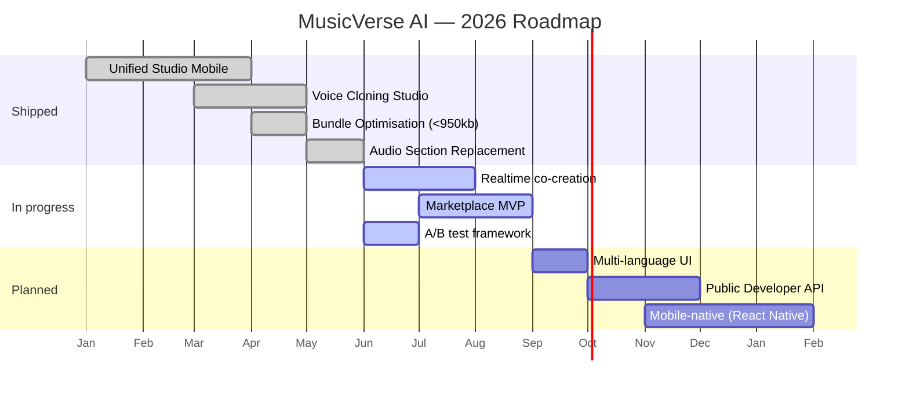

# 🗺 Roadmap

**Where MusicVerse AI is going — quarter by quarter.**

  
  
  

  <a href="README.md">🏠 Home</a> ·
  <a href="DOCUMENTATION_INDEX.md">📚 Docs</a> ·
  <a href="PROJECT_STATUS.md">📊 Status</a> ·
  <a href="CHANGELOG.md">📝 Changelog</a>

---

## 📅 Timeline

## 🎯 Quarterly objectives

### Q3 2026 — Collaboration

| # | Epic | Progress |
| :---: | --- | :---: |
| 1 | Realtime sessions (presence, cursors, waveform sync) |  |
| 2 | Marketplace MVP (beats / loops / voices) |  |
| 3 | A/B testing framework rollout |  |
| 4 | Lyrics co-editing |  |

### Q4 2026 — Platform

| # | Epic | Status |
| :---: | --- | :---: |
| 1 | Multi-language UI (EN/RU/ES/DE) | 📋 |
| 2 | Public Developer API | 📋 |
| 3 | Webhooks for generations | 📋 |
| 4 | Plugin SDK (lyrics tools) | 📋 |

### Q1 2027 — Native expansion

| # | Epic | Status |
| :---: | --- | :---: |
| 1 | React Native iOS app | 📋 |
| 2 | React Native Android app | 📋 |
| 3 | Desktop (Electron) studio | 📋 |

---

## 🧱 Tech debt & infra

- [ ] Split `useUnifiedStudioStore` (38 KB) into domain slices
- [ ] Migrate remaining legacy generators to `suno-music-generate`
- [ ] Full WCAG AA pass on Library + Studio
- [ ] Lighthouse perf budget enforcement in CI

---

## 📊 Sprint history

See [`SPRINTS/`](SPRINTS/) — 30 completed sprints, archived under [`SPRINTS/completed/`](SPRINTS/completed/).

---

### 🔗 Related Documentation

| 📚 Index | 🏛 Architecture | 📊 Status | 📝 Changelog | 🪲 Issues |
| :---: | :---: | :---: | :---: | :---: |
| [Index](DOCUMENTATION_INDEX.md) | [Hub](ARCHITECTURE_HUB.md) | [Status](PROJECT_STATUS.md) | [Changelog](CHANGELOG.md) | [Issues](KNOWN_ISSUES_TRACKED.md) |

Last updated: 2026-06-27

