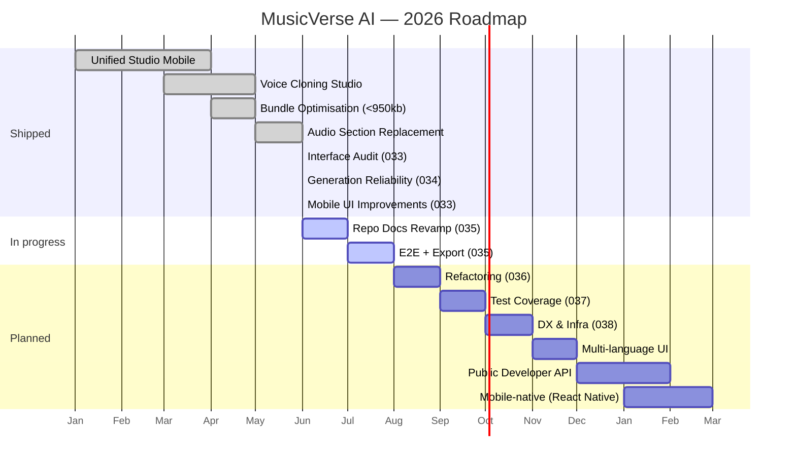

# 🗺 Roadmap

**Where MusicVerse AI is going — quarter by quarter.**

  
  
  

  <a href="README.md">🏠 Home</a> ·
  <a href="DOCUMENTATION_INDEX.md">📚 Docs</a> ·
  <a href="PROJECT_STATUS.md">📊 Status</a> ·
  <a href="CHANGELOG.md">📝 Changelog</a>

---

## 📅 Timeline

## 🎯 Quarterly objectives

### Q3 2026 — Collaboration

|  #  | Epic                                                 |                             Progress                              |
| :-: | ---------------------------------------------------- | :---------------------------------------------------------------: |
|  1  | Realtime sessions (presence, cursors, waveform sync) |   |
|  2  | Marketplace MVP (beats / loops / voices)             |   |
|  3  | A/B testing framework rollout                        |  |
|  4  | Lyrics co-editing                                    |   |

### Q4 2026 — Platform

|  #  | Epic                            | Status |
| :-: | ------------------------------- | :----: |
|  1  | Multi-language UI (EN/RU/ES/DE) |   📋   |
|  2  | Public Developer API            |   📋   |
|  3  | Webhooks for generations        |   📋   |
|  4  | Plugin SDK (lyrics tools)       |   📋   |

### Q1 2027 — Native expansion

|  #  | Epic                      | Status |
| :-: | ------------------------- | :----: |
|  1  | React Native iOS app      |   📋   |
|  2  | React Native Android app  |   📋   |
|  3  | Desktop (Electron) studio |   📋   |

---

## 🧱 Tech debt & infra

- [ ] Split `useUnifiedStudioStore` (38 KB) into domain slices
- [ ] Migrate remaining legacy generators to `suno-music-generate`
- [ ] Full WCAG AA pass on Library + Studio
- [ ] Lighthouse perf budget enforcement in CI

---

## 📊 Sprint history

See [`SPRINTS/`](SPRINTS/) — 34 completed sprints, archived under [`SPRINTS/completed/`](SPRINTS/completed/).

### Planned

- **Sprint 046** — Bundle Reduction (2.21 МБ → <950 КБ gzip, manualChunks, dead-code elimination) 🔴

### In Progress

- **Sprint 045** — UX/UI Deep Polish + Hygiene. Phase A закрыта (коммит `0813d631`): emoji-as-icons → Lucide (11 замен), touch-target ≥ 44px (3 поверхности), raw-color → semantic. Phase B-D в работе: PageTransition `isVisible` bug, animation tokens migration.

### Completed (recent)

- **Sprint 044** — Type Safety Wave 2 (7/7, 100%): `any` 155→0 в components/, 12→0 в stores/, 3 сервиса → `Result<T,E>`, ESLint `no-explicit-any: error`.
- **Sprint 043** — Layer Compliance (6/6): 65 components через service layer, ESLint guardrail, mobile Playwright smoke.
- **Sprint 042** — Page Decomposition + Audio Pooling (10/10): `usePreviewAudio` hook, 17 миграций, `LyricsStudio` 999→788 LOC, bundle audit.
- **Sprint 041, 040** — UX features + Type Safety + God-files (см. [PROJECT_STATUS.md](./PROJECT_STATUS.md))
- **Sprint 039** — Архитектурный рефакторинг + Type Safety (14/14)
- **Sprint 037-038** — Infrastructure Hardening + Design System Unification (28/28)
- **Sprint 035-036** — Стабилизация + Рефакторинг слоёв
- **Sprint 034** — Generation Reliability (auto-retry, failure tracking, A/B experiments)
- **Sprint 033** — Interface Audit & UX Overhaul (114 задач в 13 фазах)

> 📋 Детальный план спринтов 042-044: [SPRINTS/SPRINT-042-043-PLAN.md](SPRINTS/SPRINT-042-043-PLAN.md); отчёты по аудиту: [UI_AUDIT_REPORT_2026-07-03.md](UI_AUDIT_REPORT_2026-07-03.md).

---

### 🔗 Related Documentation

|            📚 Index             |       🏛 Architecture       |          📊 Status          |       📝 Changelog        |             🪲 Issues             |
| :-----------------------------: | :------------------------: | :-------------------------: | :-----------------------: | :-------------------------------: |
| [Index](DOCUMENTATION_INDEX.md) | [Hub](ARCHITECTURE_HUB.md) | [Status](PROJECT_STATUS.md) | [Changelog](CHANGELOG.md) | [Issues](KNOWN_ISSUES_TRACKED.md) |

Last updated: 2026-07-03 (Sprint 045 — UX/UI Deep Polish + Hygiene 🟡)

