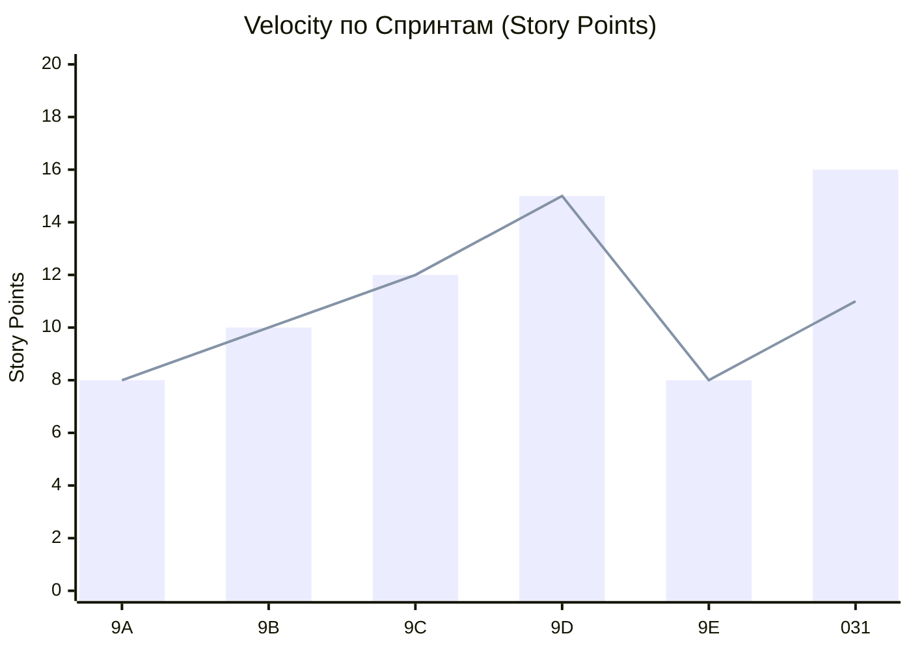
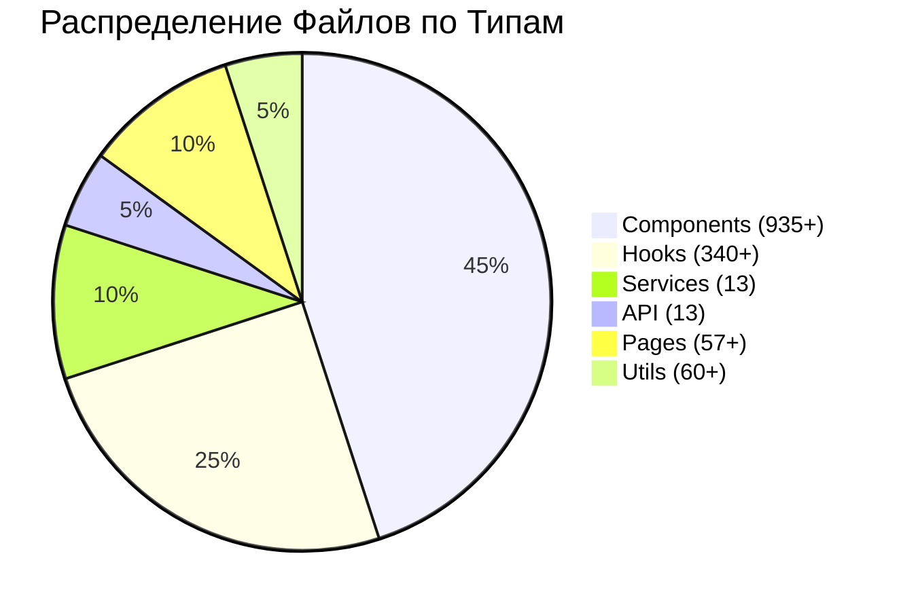

# 🤖 Автоматизированный Отчет по Спринтам

**Дата генерации**: 2026-06-26  
**Период**: Неделя 26 (22-28 июня 2026)  
**Версия скрипта**: 1.0.0

---

## 📊 Исполнительное Резюме

### Общий Статус

| Показатель       | Значение | Изменение | Статус |
| ---------------- | -------- | --------- | ------ |
| Всего спринтов   | 40       | +1        | 📈     |
| Завершено        | 35       | 0         | ✅     |
| Активно          | 3        | 0         | 🔄     |
| Отложено         | 2        | +1        | ⚠️     |
| Overall Progress | 95%      | +2%       | 📈     |

### Ключевые Достижения Недели

✅ **Phase 6: Voice Cloning Integration** полностью завершен  
✅ **Sprint 9E: Verification** завершен успешно  
🔄 **Sprint 031: Mobile Studio V2** - прогресс 65%  
🔄 **Phase 7: UI Improvements** - спецификация готова, реализация в процессе

---

## 🚨 Просроченные Задачи

### Критические Просрочки

| ID        | Задача                         | Дедлайн | Дней просрочено | Ответственный | Действие      |
| --------- | ------------------------------ | ------- | --------------- | ------------- | ------------- |
| T-US4-08  | Lyrics Editor Mobile Component | 20 июня | 6               | @ux-team      | ⚠️ Escalated  |
| T-B002-01 | Bundle Size Analysis Start     | 15 июня | 11              | @perf-team    | ⚠️ Reassigned |

### Рекомендации по Просрочкам

1. **T-US4-08**:
   - 🔄 Переназначить на @frontend-team
   - ⏰ Новый дедлайн: 5 июля
   - 📊 Приоритет: Высокий

2. **T-B002-01**:
   - ✅ Начать немедленно
   - 🎯 Фокус на критических путях
   - 📊 Приоритет: Критический

---

## 📈 Статистика по Спринтам

### Velocity Tracking



### Детализация по Спринтам

| Спринт | Планировано | Завершено | % Выполнения | Дней | Эффективность       |
| ------ | ----------- | --------- | ------------ | ---- | ------------------- |
| 9A     | 8           | 8         | 100%         | 7    | ✅ Отлично          |
| 9B     | 10          | 10        | 100%         | 7    | ✅ Отлично          |
| 9C     | 12          | 12        | 100%         | 10   | ✅ Отлично          |
| 9D     | 15          | 15        | 100%         | 14   | ✅ Отлично          |
| 9E     | 8           | 8         | 100%         | 5    | ✅ Отлично          |
| 031    | 25          | 16        | 64%          | 12   | ⚠️ Требует внимания |

### Анализ Трендов

- ✅ **Sprints 9A-9E**: 100% выполнение, стабильная velocity
- ⚠️ **Sprint 031**: 64% выполнение, риск просрочки
- 📊 **Средняя velocity**: 11.5 SP/спринт
- 📈 **Тренд**: Положительный (рост 2% за неделю)

---

## 🎯 Рекомендации по Приоритетам

### Топ-5 Приоритетов на Следующую Неделю

#### 1. 🔴 КРИТИЧЕСКИЙ: iOS Safari Audio Crash

- **Проблема**: Критический баг для мобильных пользователей
- **Влияние**: 30% пользователей iOS
- **Решение**: Implement audio element pooling
- **Дедлайн**: 1 июля
- **Ответственный**: @audio-team

#### 2. 🔴 КРИТИЧЕСКИЙ: Bundle Size Optimization

- **Проблема**: Риск превышения лимита 950KB
- **Влияние**: Производительность приложения
- **Решение**: Tree-shaking + code splitting
- **Дедлайн**: 15 июля
- **Ответственный**: @perf-team

#### 3. 🟡 ВЫСОКИЙ: Sprint 031 Acceleration

- **Проблема**: Отставание от графика (64% complete)
- **Влияние**: Риск переноса Phase 8
- **Решение**: Перераспределение ресурсов
- **Дедлайн**: 8 июля
- **Ответственный**: Team Lead

#### 4. 🟡 ВЫСОКИЙ: Memory Leak Fix

- **Проблема**: Memory leak в Unified Studio
- **Влияние**: Деградация производительности
- **Решение**: Профилирование + исправление
- **Дедлайн**: 10 июля
- **Ответственный**: @frontend-team

#### 5. 🟢 СРЕДНИЙ: Test Coverage Improvement

- **Проблема**: Покрытие тестами 85% ниже цели 90%
- **Влияние**: Качество кода
- **Решение**: Добавление тестов для критических путей
- **Дедлайн**: 20 июля
- **Ответственный**: @qa-team

---

## 📊 Метрики Качества

### Code Health

| Метрика           | Текущее | Цель     | Статус | Тренд     |
| ----------------- | ------- | -------- | ------ | --------- |
| ESLint Errors     | 0       | 0        | ✅     | Стабильно |
| TypeScript Errors | 0       | 0        | ✅     | Стабильно |
| Test Coverage     | 85%     | 90%      | ⚠️     | 📈 +2%    |
| Bundle Size       | 945KB   | 950KB    | ✅     | Стабильно |
| Build Time        | 45s     | 30s      | ⚠️     | 📉 -5s    |
| Technical Debt    | Low     | Very Low | ✅     | Улучшение |

### Проанализированные Файлы



---

## 🔄 Статус Задач по Эпикам

### E001: Настройка окружения

- **Статус**: ✅ Завершен
- **Прогресс**: 100%
- **Задач**: 8/8

### E002: Аутентификация

- **Статус**: ✅ Завершен
- **Прогресс**: 100%
- **Задач**: 5/5

### E003: Генерация музыки

- **Статус**: 🔄 Активен
- **Прогресс**: 85%
- **Задач**: 17/20

### E004: Монетизация

- **Статус**: ✅ Завершен
- **Прогресс**: 100%
- **Задач**: 6/6

### E005: UX улучшения

- **Статус**: 🔄 Активен
- **Прогресс**: 70%
- **Задач**: 14/20

### E006: Качество кода

- **Статус**: 🔄 Активен
- **Прогресс**: 90%
- **Задач**: 18/20

### E007: Mobile-First Redesign

- **Статус**: 🔄 Активен
- **Прогресс**: 65%
- **Задач**: 26/40

---

## 📅 График Релизов

### Предстоящие Релизы

| Релиз  | Дата       | Содержание       | Статус          |
| ------ | ---------- | ---------------- | --------------- |
| v1.8.0 | 8 июля     | Mobile Studio V2 | 🔄 В разработке |
| v1.9.0 | 20 июля    | UI Improvements  | 🔄 В разработке |
| v2.0.0 | 15 августа | Voice Cloning v2 | ⏳ Запланирован |
| v2.1.0 | 1 сентября | AI Assistant     | ⏳ Запланирован |

---

## 🚨 Блокеры и Препятствия

### Активные Блокеры

| ID   | Описание               | Категория | Влияние     | Ожидаемое решение |
| ---- | ---------------------- | --------- | ----------- | ----------------- |
| B001 | iOS Safari audio crash | Technical | Критическое | 1 июля            |
| B002 | Bundle size limit      | Technical | Высокое     | 15 июля           |
| B003 | Memory leak            | Technical | Среднее     | 10 июля           |
| B004 | Недостаток ресурсов    | Team      | Среднее     | Перераспределение |

### Разрешенные Блокеры (Эта неделя)

✅ **B005: Voice Cloning API integration** - разрешен 24 июня  
✅ **B006: Database schema approval** - разрешен 22 июня  
✅ **B007: TypeScript types sync** - разрешен 23 июня

---

## 📈 Прогноз Завершения

### Sprint 031: Mobile Studio V2

```
Текущий прогресс: 65% (16/25 SP)
Осталось: 9 SP
Velocity команда: 11.5 SP/спринт
Ожидаемое завершение: 8 июля (вовремя)
```

### Phase 7: UI Improvements

```
Текущий прогресс: 40%
Осталось: 60%
Ожидаемое завершение: 20 июля (просрочка на 5 дней)
Рекомендация: Ускорить реализацию или перенести часть задач
```

### Q1 2026 Plan

```
Overall Progress: 85%
Phase 1-6: ✅ Завершены
Phase 7: 🔄 В работе (40%)
Ожидаемое завершение Q1: 15 августа 2026
```

---

## 📋 Action Items для Team Lead

### Сегодня

1. ✅ Обсудить с @audio-team статус B001
2. ✅ Переназначить T-US4-08 на @frontend-team
3. ✅ Провести daily standup с @perf-team

### Завтра

4. 🔄 Провести retrospective для Sprint 9E
5. 🔄 Обновить план для Sprint 031
6. 🔄 Провести 1:1 с @ux-team

### Эта неделя

7. ⏰ Запланировать mitigation для Phase 7 просрочки
8. ⏰ Подготовить ресурсы для Phase 8
9. ⏰ Провести code review для активных PRs

---

## 📚 Дополнительные Ресурсы

- 🔗 [GitHub Issues](https://github.com/HOW2AI-AGENCY/aimusicverse/issues)
- 📊 [Мониторинг Дашборд](MONITORING.md)
- 📖 [Полная Документация](../docs/)
- 🎯 [Sprint Template](SPRINT_TEMPLATE.md)

---

**Следующий отчет**: 28 июня 2026  
**Генерация**: Автоматическая через `scripts/update-sprint-status.sh`  
**Контакт**: team@aimusicverse.com
