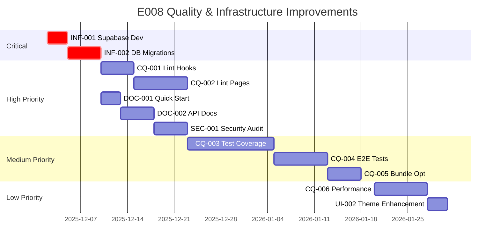

# Бэклог Продукта

Здесь хранится полный список задач, отсортированный по приоритету.

## Эпики

- **E001: Настройка окружения и CI/CD**
- **E002: Аутентификация и управление пользователями**
- **E003: Основной функционал генерации музыки**
- **E004: Интеграция и Монетизация**
- **E005: Улучшение пользовательского опыта**
- **E006: Качество кода и надежность**
- **E007: Mobile-First UI/UX Redesign** ⭐ NEW

## Статус реализации E007: Mobile-First UI/UX Redesign

### ✅ Завершено (Sprint 006)
- Детальный аудит интерфейса
- Спецификация с 6 пользовательскими сценариями
- План реализации на 5 недель (105 задач)
- Исследование mobile-first паттернов
- Модель данных для версионирования
- API контракты

### ✅ Завершено (Sprint 007)
- Исправлено 25 ESLint ошибок в компонентах
- Улучшена типизация компонентов (удалены все `any`)
- Исправлены нарушения React Hooks в компонентах
- Build и тесты стабилизированы

### 🔄 В Backlog (перенесено из Sprint 007)
- Backend фильтрация для Library

### ✅ Завершено (Sprint Infrastructure)
- Database schema готова: `track_versions.is_primary`, `track_change_log`, `audio_analysis`
- TypeScript типы синхронизированы из схемы БД (автогенерация)
- Lovable Cloud подключен и настроен
- Edge Functions настроены для деплоя

### ⏳ Запланировано (Sprint 008+)
- Library Mobile Redesign (US1)
- Player Mobile Optimization (US2)
- Track Details Panel (US3)
- Track Actions Menu (US4)
- Homepage Discovery (US5)
- AI Assistant Mode (US6)

## Задачи

| ID | Название | Приоритет | Статус | Эпик |
|---|---|---|---|---|
| T001 | Настроить ESLint, Prettier | Высокий | Done | E001 |
| T002 | Создать CI/CD pipeline | Высокий | Done | E001 |
| T003 | Реализовать Telegram OAuth | Высокий | Done | E002 |
| T004 | Улучшить обработку ошибок аутентификации | Средний | Done | E002 |
| T005 | Использовать клиентский роутер для Deep Link | Высокий | To Do | E002 |
| T006 | Автоматизировать создание Issues из TODO/FIXME | Высокий | Done | E001 |
| T007 | Оптимизировать ререндеры в ProtectedLayout | Средний | Done | E001 |
| T008 | Внедрить Infinite Query в Библиотеке | Высокий | To Do | E003 |
| T009 | Использовать React.lazy для страниц | Низкий | To Do | E001 |
| T010 | Реализовать систему связи реального времени между ботом и Mini App | Высокий | To Do | E004 |
| T011 | Интегрировать платежную систему (Stripe, Telegram Payments) | Высокий | To Do | E004 |
| T012 | Реализовать полноценную систему уведомлений для пользователя | Средний | To Do | E005 |
| T013 | Добавить функцию "лайков" для треков с сохранением в БД | Средний | To Do | E005 |
| T014 | Отображать детальную информацию о треке в боте | Низкий | To Do | E005 |
| T015 | Обновить npm-зависимости и устранить уязвимости | Средний | Done | E001 |
| T016 | Исправить все ошибки ESLint | Высокий | Done | E006 |
| T017 | Улучшить типизацию TypeScript (устранить `any`) | Высокий | Done | E006 |
| T018 | Расширить тестовое покрытие | Средний | Done | E006 |
| T019 | Улучшить навигацию в `GenerateWizard` (переход к любому пройденному шагу) | Средний | To Do | E005 |
| T020 | Рефакторинг `GenerateWizard`: использовать строгую типизацию для данных формы | Низкий | To Do | E006 |
| T021 | Улучшить UX диалогов `UploadExtendDialog` и `UploadCoverDialog` (переименовать, добавить описание) | Низкий | To Do | E005 |
| T022 | Заменить иконку и добавить текстовую метку для сортировки в Библиотеке | Низкий | To Do | E005 |
| T023 | Внедрить контекстное меню по долгому нажатию на трек в Библиотеке (long press) | Средний | To Do | E005 |
| T024 | Внедрить пакетные действия в Библиотеке (выбор нескольких треков) | Низкий | To Do | E005 |
| T025 | Провести ревизию иерархии `BottomNavigation` для оптимизации пользовательского пути | Низкий | To Do | E005 |
| T026 | Провести полный аудит доступности (a11y) и исправить основные проблемы | Средний | To Do | E005 |
| T027 | **E007: Аудит и планирование UI/UX** - Создать спецификацию, план, исследование, модель данных | Критический | ✅ Done | E007 |
| T028 | **E007: Sprint 007 Frontend Quality** - Component lint fixes, TypeScript improvements | Критический | ✅ Done | E007 |
| T036 | **Setup Lovable Cloud Environment** - Проект уже подключен к Lovable Cloud | ✅ Done | Done | E007 |
| T037 | **Database Schema Review** - Проверить схему: is_primary (не is_master), track_change_log (не track_changelog) | Критический | ✅ Done | E007 |
| T038 | **TypeScript Types Sync** - Типы автогенерируются из схемы БД (src/integrations/supabase/types.ts) | Критический | ✅ Done | E007 |
| T039 | **Core Hooks Implementation** - 6 хуков: useTrackVersions, useVersionSwitcher, useTrackChangelog, usePublicContent, usePlayerState, usePlaybackQueue | Критический | To Do | E007 |
| T040 | **Backend API для версионирования** - Version Management API, Public Content API, Backend Filtering | Критический | To Do | E007 |
| T041 | **Realtime Subscriptions** - Version updates, Stem generation subscriptions | Высокий | To Do | E007 |
| T042 | **Fix Remaining Lint Errors** - Hooks/Pages (~106 errors) | Высокий | To Do | E007 |
| T029 | **E007: US1 Library Redesign** - Mobile-first редизайн библиотеки с версионированием (10 задач) | Высокий | ⏳ Planned | E007 |
| T030 | **E007: US2 Player Optimization** - Трехрежимный плеер с очередью (12 задач) | Высокий | ⏳ Planned | E007 |
| T031 | **E007: US3 Track Details** - Панель деталей с лирикой, версиями, стемами (11 задач) | Средний | ⏳ Planned | E007 |
| T032 | **E007: US4 Track Actions** - Меню действий: персона, студия, плейлисты (8 задач) | Средний | ⏳ Planned | E007 |
| T033 | **E007: US5 Homepage Discovery** - Публичный контент как стриминг платформа (10 задач) | Средний | ⏳ Planned | E007 |
| T034 | **E007: US6 AI Assistant** - Режим AI ассистента для генерации (15 задач) | Низкий | ⏳ Planned | E007 |
| T035 | **E007: Polish & Testing** - Responsive, accessibility, performance (15 задач) | Высокий | ⏳ Planned | E007 |

---

## Детали Эпика E007: Mobile-First UI/UX Redesign

### Обзор
Комплексный редизайн интерфейса с фокусом на мобильные устройства. 105 задач, 6 пользовательских сценариев, 5 недель реализации.

### Документация
- �� **Спецификация**: `specs/copilot/audit-interface-and-optimize/spec.md`
- 📋 **План**: `specs/copilot/audit-interface-and-optimize/plan.md`
- 🔬 **Исследование**: `specs/copilot/audit-interface-and-optimize/research.md`
- 💾 **Модель данных**: `specs/copilot/audit-interface-and-optimize/data-model.md`
- ✅ **Задачи (105)**: `specs/copilot/audit-interface-and-optimize/tasks.md`
- 🚀 **Quickstart**: `specs/copilot/audit-interface-and-optimize/quickstart.md`
- 🔌 **API Контракты**: `specs/copilot/audit-interface-and-optimize/contracts/`

### Пользовательские сценарии (User Stories)

#### US1: Library Mobile Redesign & Versioning (P1 - High Priority)
**Как пользователь мобильного устройства**, я хочу видеть компактную, удобную библиотеку с поддержкой версий треков.

**Задачи**: 10 (TrackCard, TrackRow, VersionBadge, VersionSwitcher, SwipeActions)
**Критерии**:
- Touch targets ≥44×44px
- Swipe gestures с haptic feedback
- Master version система
- Performance: Lighthouse >90

#### US2: Player Mobile Optimization (P1 - High Priority)
**Как пользователь**, я хочу адаптивный плеер с тремя режимами (compact/expanded/fullscreen).

**Задачи**: 12 (CompactPlayer, ExpandedPlayer, FullscreenPlayer, QueueSheet)
**Критерии**:
- Плавные переходы между режимами
- Синхронизированная лирика
- Queue management с drag-to-reorder
- Background audio support

#### US3: Track Details Panel (P2 - Medium Priority)
**Как пользователь**, я хочу видеть полную информацию о треке с лирикой, версиями, стемами, AI анализом.

**Задачи**: 11 (TrackDetailsTab, LyricsView, VersionsTab, StemsTab, AnalysisTab)
**Критерии**:
- Normal и timestamped лирика
- Version-aware компоненты
- AI analysis с визуализацией

#### US4: Track Actions Menu (P2 - Medium Priority)
**Как пользователь**, я хочу расширенные действия с треком (персона, студия, плейлисты).

**Задачи**: 8 (CreatePersonaDialog, OpenInStudio, AddToProjectDialog, PlaylistSelector)
**Критерии**:
- Создание персон из треков
- Открытие студии для треков со стемами
- Добавление в проекты/плейлисты

#### US5: Homepage Public Content Discovery (P2 - Medium Priority)
**Как пользователь**, я хочу открывать публичный контент как на стриминговой платформе.

**Задачи**: 10 (FeaturedSection, NewReleasesSection, PopularSection, PublicTrackCard)
**Критерии**:
- Hybrid feed (featured/new/popular/personalized)
- Performance с тысячами треков
- Infinite scroll с lazy loading

#### US6: Generation Form AI Assistant Mode (P3 - Low Priority)
**Как пользователь**, я хочу AI ассистента для пошаговой генерации музыки.

**Задачи**: 15 (AssistantWizard, 7 шагов, dynamic form)
**Критерии**:
- Context-aware prompts
- Conditional fields
- Progress save/restore
- Multi-scenario support

### Timeline

**Sprint 006** (2025-12-01 - 2025-12-08): ✅ Аудит и планирование
**Sprint 007** (2025-12-08 - 2025-12-15): 🔄 Setup & Infrastructure (24 задачи)
**Sprint 008** (2025-12-15 - 2025-12-29): ⏳ Library & Player MVP (US1, US2)
**Sprint 009** (2025-12-29 - 2026-01-12): ⏳ Track Details & Actions (US3, US4)
**Sprint 010** (2026-01-12 - 2026-01-26): ⏳ Homepage & AI Assistant (US5, US6)
**Sprint 011** (2026-01-26 - 2026-02-02): ⏳ Polish & Testing

### Метрики успеха
- **Performance**: Lighthouse Mobile Score >90, FCP <2s на 3G
- **Accessibility**: WCAG 2.1 AA compliance
- **User Engagement**: +30% session duration, +50% mobile users
- **Code Quality**: 80%+ test coverage, 0 critical bugs

### Риски и митигация
- ❌ **Риск**: Миграция данных может сломать существующие треки
  - ✅ **Митигация**: Создать автоматическую версию v1.0, rollback план
- ❌ **Риск**: Performance на старых устройствах
  - ✅ **Митигация**: Progressive enhancement, feature detection
- ❌ **Риск**: Конфликты gesture/scroll
  - ✅ **Митигация**: Threshold detection, direction priority

### Следующие шаги
1. Завершить Sprint 007 (Setup & Infrastructure)
2. Начать Sprint 008 (Library & Player MVP)
3. Провести user testing после каждого User Story
4. Итерировать на основе feedback

---

## 🔍 Эпик E008: Quality & Infrastructure Improvements (NEW - 2025-12-02)

### Обзор
Комплексное улучшение качества кода, инфраструктуры, документации и безопасности на основе аудита от 2025-12-02.

### Документация
- 📊 **Аудит**: `SPRINT_AUDIT_2025-12-02.md`
- 🎯 **Приоритизация**: High -> Medium -> Low
- 📝 **Story Points**: Total ~123 SP

---

### Категория: Code Quality 📊

| ID | Название | Приоритет | Статус | Story Points | Эпик |
|---|---|---|---|---|---|
| CQ-001 | **Fix Remaining Lint Errors in Hooks** - Исправить ~50 lint ошибок в src/hooks/ | Высокий | To Do | 5 SP | E008 |
| CQ-002 | **Fix Remaining Lint Errors in Pages** - Исправить ~116 lint ошибок в src/pages/ | Высокий | To Do | 8 SP | E008 |
| CQ-003 | **Increase Test Coverage to 80%** - Unit тесты для hooks, integration для pages | Средний | To Do | 13 SP | E008 |
| CQ-004 | **Implement E2E Tests with Playwright** - Критичные user flows | Средний | To Do | 8 SP | E008 |
| CQ-005 | **Bundle Size Optimization** - Code splitting, vendor split, <800 KB | Средний | To Do | 5 SP | E008 |
| CQ-006 | **Performance Profiling & Optimization** - Lighthouse, DevTools, bottlenecks | Низкий | To Do | 8 SP | E008 |

**Итого Code Quality:** 47 SP

#### Детали задач

**CQ-001: Fix Remaining Lint Errors in Hooks**
- Remove `any` types
- Fix React Hooks dependencies
- Add proper type annotations
- Remove unused variables
- Files: `src/hooks/*.ts`

**CQ-002: Fix Remaining Lint Errors in Pages**
- Remove `any` types
- Fix React Hooks rules violations
- Add proper type annotations
- Improve error handling
- Files: `src/pages/*.tsx`

**CQ-003: Increase Test Coverage to 80%**
- Unit тесты для всех hooks
- Integration тесты для pages
- Component тесты для UI
- Достичь 80% statements coverage
- Достичь 75% branches coverage

**CQ-004: Implement E2E Tests with Playwright**
- User authentication flow
- Music generation flow
- Library management
- Player functionality
- Mobile и desktop viewports

**CQ-005: Bundle Size Optimization**
- Implement code splitting (React.lazy)
- Split vendor bundle
- Remove unused dependencies
- Enable tree-shaking
- Target: <800 KB total

**CQ-006: Performance Profiling & Optimization**
- Lighthouse audit (target: >90)
- React DevTools profiling
- Identify bottlenecks
- Optimize re-renders
- Improve initial load time

---

### Категория: Documentation 📚

| ID | Название | Приоритет | Статус | Story Points | Эпик |
|---|---|---|---|---|---|
| DOC-001 | **Create Quick Start Guide** - Пошаговый гайд для новых пользователей | Высокий | To Do | 3 SP | E008 |
| DOC-002 | **Complete API Documentation** - REST API reference с примерами | Высокий | To Do | 5 SP | E008 |
| DOC-003 | **Create Testing Documentation** - Тестовая стратегия и guidelines | Средний | To Do | 3 SP | E008 |
| DOC-004 | **Create Deployment Guide** - Environment setup, build, deploy | Средний | To Do | 3 SP | E008 |
| DOC-005 | **Create FAQ & Troubleshooting** - Часто задаваемые вопросы и решения | Средний | To Do | 2 SP | E008 |
| DOC-006 | **User Guides** - Детальные руководства пользователя (guides/ folder) | Низкий | To Do | 8 SP | E008 |

**Итого Documentation:** 24 SP

#### Детали задач

**DOC-001: Create Quick Start Guide** (`docs/QUICK_START.md`)
- Installation steps
- First track generation walkthrough
- Basic features overview
- Common workflows

**DOC-002: Complete API Documentation** (`docs/API.md`)
- REST API endpoints
- Request/Response examples
- Authentication details
- Error codes reference
- Rate limiting

**DOC-003: Create Testing Documentation** (`docs/TESTING.md`)
- Testing philosophy
- Unit test guidelines
- Integration test guidelines
- E2E test guidelines
- Running tests locally

**DOC-004: Create Deployment Guide** (`docs/DEPLOYMENT.md`)
- Environment setup
- Build process
- Deployment to production
- Rollback procedures
- Monitoring setup

**DOC-005: Create FAQ & Troubleshooting** (`docs/FAQ.md`, `docs/TROUBLESHOOTING.md`)
- Common questions
- Common errors and solutions
- Debug tips
- Performance issues

**DOC-006: User Guides** (`docs/guides/`)
- Music generation guide
- Library management guide
- Player usage guide
- Projects and albums guide
- Advanced features (stems, effects, etc.)

---

### Категория: Infrastructure 🏗️

| ID | Название | Приоритет | Статус | Story Points | Эпик |
|---|---|---|---|---|---|
| INF-001 | **Setup Supabase Development Environment** - Локальное Supabase окружение | Критический | To Do | 3 SP | E008 |
| INF-002 | **Database Migrations for Versioning** - 6 migrations для версионирования | Критический | To Do | 5 SP | E008 |
| INF-003 | **Setup Monitoring & Logging** - Error tracking, analytics, performance | Средний | To Do | 5 SP | E008 |
| INF-004 | **CI/CD Pipeline Enhancements** - Preview, E2E, budgets, security | Низкий | To Do | 3 SP | E008 |

**Итого Infrastructure:** 16 SP

#### Детали задач

**INF-001: Setup Supabase Development Environment** ⚠️ БЛОКЕР для Sprint 008
- Install Supabase CLI
- Initialize local Supabase
- Configure migrations
- Seed test data
- Documentation

**INF-002: Database Migrations for Versioning** ⚠️ ЗАВИСИТ от INF-001
- master_version column
- version_number tracking
- changelog table
- playlists support
- indexes и RLS policies

**INF-003: Setup Monitoring & Logging**
- Error tracking (Sentry)
- Analytics (GA/Plausible)
- Performance monitoring
- Log aggregation
- Alerting

**INF-004: CI/CD Pipeline Enhancements**
- Add deployment preview
- Automated E2E tests in CI
- Performance budgets
- Security scanning
- Automated releases

---

### Категория: UI/UX Improvements 🎨

| ID | Название | Приоритет | Статус | Story Points | Эпик |
|---|---|---|---|---|---|
| UI-001 | **Accessibility Audit & Fixes** - WCAG AA compliance, keyboard, screen reader | Средний | To Do | 8 SP | E008 |
| UI-002 | **Dark/Light Theme Enhancement** - Улучшение тем и кастомизация | Низкий | To Do | 3 SP | E008 |
| UI-003 | **Animation & Transition Polish** - Smooth transitions, 60fps | Низкий | To Do | 3 SP | E008 |

**Итого UI/UX:** 14 SP

#### Детали задач

**UI-001: Accessibility Audit & Fixes**
- Run WAVE/axe audit
- Fix WCAG AA violations
- Keyboard navigation
- Screen reader testing
- Color contrast improvements

**UI-002: Dark/Light Theme Enhancement**
- Improve color schemes
- Add theme customization options
- Accent colors selector
- High contrast mode

**UI-003: Animation & Transition Polish**
- Smooth page transitions
- Component animations
- Loading states polish
- Micro-interactions
- 60fps performance

---

### Категория: Security 🔐

| ID | Название | Приоритет | Статус | Story Points | Эпик |
|---|---|---|---|---|---|
| SEC-001 | **Security Audit** - Полный аудит: dependencies, XSS, CSRF, SQL, API | Высокий | To Do | 5 SP | E008 |
| SEC-002 | **Implement Rate Limiting** - User/IP limits, graceful degradation | Средний | To Do | 3 SP | E008 |
| SEC-003 | **Content Security Policy (CSP)** - Строгий CSP, monitoring | Низкий | To Do | 2 SP | E008 |

**Итого Security:** 10 SP

#### Детали задач

**SEC-001: Security Audit**
- npm audit fix
- XSS vulnerability scan
- CSRF protection review
- SQL injection prevention
- API security review

**SEC-002: Implement Rate Limiting**
- User-based limits
- IP-based limits
- Graceful degradation
- Rate limit headers
- Documentation

**SEC-003: Content Security Policy (CSP)**
- Define CSP headers
- Test in report-only mode
- Deploy to production
- Monitor violations
- Documentation

---

## 📊 Эпик E008: Статистика

### Story Points по категориям

| Категория | Story Points | Задачи | % от эпика |
|-----------|--------------|--------|------------|
| Code Quality | 47 SP | 6 | 38% |
| Documentation | 24 SP | 6 | 20% |
| Infrastructure | 16 SP | 4 | 13% |
| UI/UX | 14 SP | 3 | 11% |
| Security | 10 SP | 3 | 8% |
| **ИТОГО** | **123 SP** | **22** | **100%** |

### Приоритизация

| Приоритет | Story Points | Задачи |
|-----------|--------------|--------|
| Критический | 8 SP | 2 |
| Высокий | 26 SP | 5 |
| Средний | 50 SP | 9 |
| Низкий | 27 SP | 6 |

### Рекомендуемое распределение по спринтам

#### Sprint 008 Prerequisites (КРИТИЧНО)
- **INF-001** (3 SP) - Setup Supabase Dev Environment
- **INF-002** (5 SP) - Database Migrations
- **Итого:** 8 SP

#### Sprint 008+ Parallel Track (ВЫСОКИЙ ПРИОРИТЕТ)
- **CQ-001** (5 SP) - Fix Lint Errors in Hooks
- **CQ-002** (8 SP) - Fix Lint Errors in Pages
- **DOC-001** (3 SP) - Quick Start Guide
- **DOC-002** (5 SP) - API Documentation
- **SEC-001** (5 SP) - Security Audit
- **Итого:** 26 SP

#### Sprint 009+ (СРЕДНИЙ ПРИОРИТЕТ)
- **CQ-003** (13 SP) - Test Coverage
- **CQ-004** (8 SP) - E2E Tests
- **CQ-005** (5 SP) - Bundle Optimization
- **DOC-003** (3 SP) - Testing Docs
- **DOC-004** (3 SP) - Deployment Guide
- **DOC-005** (2 SP) - FAQ
- **INF-003** (5 SP) - Monitoring
- **UI-001** (8 SP) - Accessibility
- **SEC-002** (3 SP) - Rate Limiting
- **Итого:** 50 SP

#### Sprint 010+ (НИЗКИЙ ПРИОРИТЕТ)
- **CQ-006** (8 SP) - Performance Optimization
- **DOC-006** (8 SP) - User Guides
- **INF-004** (3 SP) - CI/CD Enhancements
- **UI-002** (3 SP) - Theme Enhancement
- **UI-003** (3 SP) - Animation Polish
- **SEC-003** (2 SP) - CSP
- **Итого:** 27 SP

---

## 📈 Метрики прогресса эпика E008

### Tracking Dashboard

| Метрика | Текущее | Цель (1 мес) | Цель (3 мес) | Статус |
|---------|---------|--------------|--------------|--------|
| Lint Errors | 166 | 50 | 0 | 🔴 |
| Test Coverage | 60% | 70% | 80% | 🟡 |
| Bundle Size | 1.01 MB | 900 KB | 800 KB | 🟡 |
| Lighthouse Score | ? | 85 | 90+ | ⚪ |
| Docs Coverage | 60% | 80% | 95% | 🟡 |
| Security Score | ? | 85% | 95% | ⚪ |

### Success Criteria

**Краткосрочные (1 месяц):**
- ✅ Sprint 008 prerequisites завершены (INF-001, INF-002)
- ✅ Lint errors < 50
- ✅ Test coverage > 70%
- ✅ Core documentation completed (DOC-001, DOC-002)
- ✅ Security audit passed (SEC-001)

**Среднесрочные (3 месяца):**
- ✅ Lint errors = 0
- ✅ Test coverage > 80%
- ✅ E2E tests implemented
- ✅ Bundle size < 800 KB
- ✅ Lighthouse score > 90
- ✅ WCAG AA compliance
- ✅ Monitoring & logging operational

---

## 🎯 Эпик E008: Roadmap Timeline

**Примечание:** Timeline является ориентировочным и может корректироваться в зависимости от приоритетов спринтов.

---

## 🔗 Связанные документы

- 📊 [Sprint Audit 2025-12-02](../SPRINT_AUDIT_2025-12-02.md) - Детальный аудит
- 📋 [Sprint Management](../SPRINT_MANAGEMENT.md) - Управление спринтами
- 📚 [Documentation Index](../docs/INDEX.md) - Навигация по документации
- 🔐 [Security Policy](../SECURITY.md) - Политика безопасности
- 🤝 [Contributing](../CONTRIBUTING.md) - Руководство по участию

---

**Последнее обновление:** 2025-12-02  
**Следующий обзор:** Sprint Planning Meeting

[⬆️ Вернуться к началу](#бэклог-продукта)

