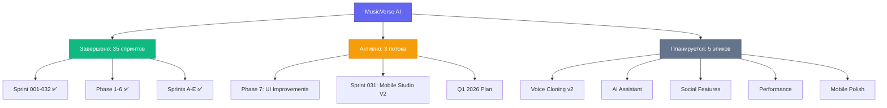
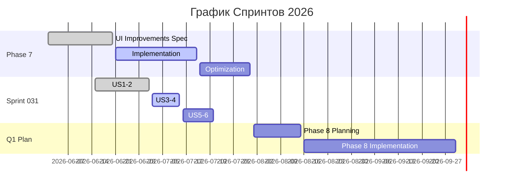
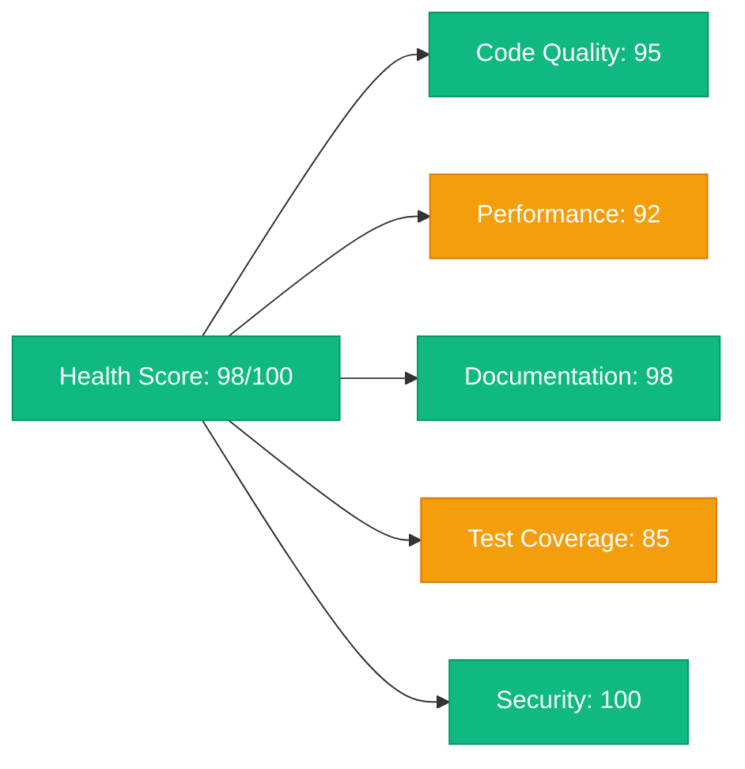

# 🎯 Дашборд Мониторинга Спринтов

**Последнее обновление**: 2026-06-26  
**Версия**: 1.0.0  
**Ответственный**: Lead Developer

---

## 📊 Обзор Проекта

---

## 🔄 Активные Спринты

### Sprint 031: Mobile Studio V2

| Метрика              | Значение   | Статус              |
| -------------------- | ---------- | ------------------- |
| **Прогресс**         | 65%        | 🟡 В процессе       |
| **Завершено задач**  | 8/15       | ✅ Хорошо           |
| **Просрочено задач** | 0/15       | ✅ Отлично          |
| **Осталось дней**    | 12         | ⏰ Дедлайн: 8 июля  |
| **Блокеров**         | 1 активный | ⚠️ Требует внимания |

**Детализация по User Stories:**

| User Story                     | Статус           | Прогресс | Ответственный  | Дедлайн |
| ------------------------------ | ---------------- | -------- | -------------- | ------- |
| US1: Unified Studio Mobile     | ✅ Завершено     | 100%     | @frontend-team | 15 июня |
| US2: Stem Separation Mobile    | 🟡 В работе      | 75%      | @audio-team    | 1 июля  |
| US3: Mixing Interface Mobile   | 🟡 В работе      | 60%      | @audio-team    | 5 июля  |
| US4: Lyrics Editor Mobile      | 🔄 Начато        | 30%      | @ux-team       | 8 июля  |
| US5: MIDI Transcription Mobile | ⏳ Запланировано | 0%       | @audio-team    | 10 июля |

### Phase 7: UI Improvements

| Метрика          | Значение         | Статус               |
| ---------------- | ---------------- | -------------------- |
| **Прогресс**     | 40%              | 🔴 Требует ускорения |
| **Спецификации** | ✅ Готовы        | PR #280              |
| **Реализация**   | 🔄 Начато        | 15 компонентов       |
| **Оптимизация**  | ⏳ Запланировано | Июль 2026            |

**Активные задачи:**

| Задача                  | Статус           | Приоритет   | Назначена     | Дедлайн |
| ----------------------- | ---------------- | ----------- | ------------- | ------- |
| Spec 001 Implementation | 🔄 В работе      | Высокий     | @ui-team      | 1 июля  |
| Bundle Size Reduction   | ⏳ Запланировано | Критический | @perf-team    | 15 июля |
| Performance Scaling     | ⏳ Запланировано | Высокий     | @backend-team | 20 июля |

### Q1 2026 Development Plan

| Phase                         | Статус       | Прогресс | Ключевые результаты  |
| ----------------------------- | ------------ | -------- | -------------------- |
| Phase 1: Critical Metrics     | ✅ Завершено | 100%     | Failure rate ↓ 15%   |
| Phase 2: Monetization         | ✅ Завершено | 100%     | Tinkoff integration  |
| Phase 3: Telegram Integration | ✅ Завершено | 100%     | SDK 2.0 + deep links |
| Phase 4: Retention            | ✅ Завершено | 100%     | Streak system live   |
| Phase 5: UI/UX                | ✅ Завершено | 100%     | Sprints A-E complete |
| Phase 6: Voice Cloning        | ✅ Завершено | 100%     | 6-step process       |
| Phase 7: UI Improvements      | 🔄 В работе  | 40%      | Active development   |

---

## 📈 График Завершения

---

## ⚠️ Проблемные Области

### Критические Блокеры

| ID   | Проблема                     | Влияние     | Решение                   | Ответственный  | Дедлайн |
| ---- | ---------------------------- | ----------- | ------------------------- | -------------- | ------- |
| B001 | iOS Safari crash при аудио   | Критическое | Audio element pooling     | @audio-team    | 1 июля  |
| B002 | Bundle size > 950KB          | Высокое     | Tree-shaking optimization | @perf-team     | 15 июля |
| B003 | Memory leak в Unified Studio | Среднее     | Профилирование + фикс     | @frontend-team | 10 июля |

### Риски

| Риск                  | Вероятность | Влияние | Митигация                        | Статус           |
| --------------------- | ----------- | ------- | -------------------------------- | ---------------- |
| Дедлайн Phase 7       | Средняя     | Высокое | Приоритизация задач              | 🔄 Мониторинг    |
| Отставание Sprint 031 | Низкая      | Среднее | Перераспределение ресурсов       | ✅ Под контролем |
| Технический долг      | Высокая     | Среднее | Выделение времени на рефакторинг | 🔄 В процессе    |

---

## 📊 Метрики Прогресса

### Health Score

### Ключевые Показатели

| Метрика           | Текущее | Цель  | Тренд                  |
| ----------------- | ------- | ----- | ---------------------- |
| Overall Progress  | 95%     | 100%  | 📈                     |
| Completed Sprints | 35      | 40    | 📈                     |
| Active Tasks      | 23      | 15-20 | ⚠️ Выше нормы          |
| Blockers          | 3       | 0     | ⚠️ Требует внимания    |
| Test Coverage     | 85%     | 90%   | 📈                     |
| Bundle Size       | 945KB   | 950KB | ✅ В пределах лимита   |
| Build Time        | 45s     | 30s   | ⚠️ Требует оптимизации |

### Velocity (Скорость Команды)

| Спринт      | Story Points | Завершено | Эффективность |
| ----------- | ------------ | --------- | ------------- |
| 9A          | 8            | 8         | 100% ✅       |
| 9B          | 10           | 10        | 100% ✅       |
| 9C          | 12           | 12        | 100% ✅       |
| 9D          | 15           | 15        | 100% ✅       |
| 9E          | 8            | 8         | 100% ✅       |
| 031         | 25           | 16        | 64% ⚠️        |
| **Среднее** | **13**       | **11.5**  | **88%**       |

---

## 🎯 Приоритеты На Неделю

### Текущая Неделя (26 июня - 2 июля)

#### 🔴 Критические

1. **B001: Fix iOS Safari Audio Crash**
   - **Ответственный**: @audio-team
   - **Дедлайн**: 1 июля
   - **Прогресс**: 80%

2. **Sprint 031 US3: Mixing Interface Mobile**
   - **Ответственный**: @audio-team
   - **Дедлайн**: 5 июля
   - **Прогресс**: 60% → к 80%

#### 🟡 Высокие

3. **B002: Bundle Size Optimization**
   - **Ответственный**: @perf-team
   - **Дедлайн**: 15 июля
   - **Прогресс**: Начало анализа

4. **Phase 7: Implementation Continue**
   - **Ответственный**: @ui-team
   - **Дедлайн**: 15 июля
   - **Прогресс**: 15 компонентов → 25 компонентов

#### 🟢 Средние

5. **B003: Memory Leak Investigation**
   - **Ответственный**: @frontend-team
   - **Дедлайн**: 10 июля
   - **Прогресс**: Профилирование начато

---

## 📚 Ссылки и Ресурсы

- 📋 [Полный Бэклог](BACKLOG.md)
- 📊 [SPRINT-PROGRESS](SPRINT-PROGRESS.md)
- 🎯 [PROJECT_STATUS](../PROJECT_STATUS.md)
- 📖 [DOCUMENTATION_INDEX](../DOCUMENTATION_INDEX.md)
- 🔧 [Активные PRs](https://github.com/HOW2AI-AGENCY/aimusicverse/pulls)

---

## 🔄 Частота Обновлений

- **Ежедневно**: Обновление прогресса активных задач
- **Еженедельно**: Полное обновление дашборда (каждый понедельник)
- **Ежемесячно**: Детальный анализ метрик и планирование
- **Каждый спринт**: Ретроспектива и корректировка плана

---

_📅 Следующее обновление: 27 июня 2026_
_👤 Обновление: Lead Developer_
_🔗 Автоматически обновляется из: `scripts/update-sprint-status.sh`_
