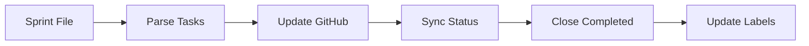
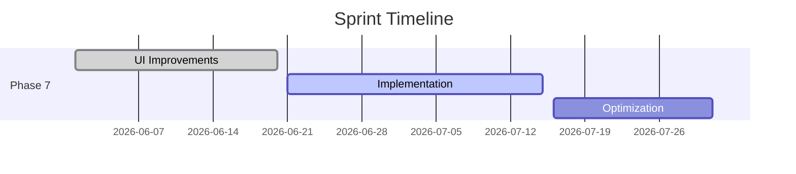

# 📊 Система Мониторинга Спринтов

**MusicVerse AI** - Комплексная система мониторинга и отслеживания прогресса спринтов.

## 🎯 Обзор

Система мониторинга спринтов предоставляет:

- **📊 Визуальный дашборд** - Реальное время статус всех спринтов
- **🤖 Автоматические отчеты** - Еженедельные отчеты о прогрессе
- **🔍 Система трекинга** - Отслеживание задач и блокеров
- **📈 Визуализация** - Mermaid diagrams и графики
- **🔄 Автоматизация** - Скрипты для обновления статусов

## 📁 Структура

```
SPRINTS/
├── MONITORING.md              # Главный дашборд мониторинга
├── AUTOMATED_REPORT.md        # Автоматические отчеты
├── TRACKING_SYSTEM.md         # Описание системы трекинга
├── VISUAL_DASHBOARD.md        # Визуальный дашборд с графиками
├── SPRINT-PROGRESS.md         # Общий прогресс проекта
├── BACKLOG.md                 # Бэклог задач
├── completed/                 # Завершенные спринты
│   ├── SPRINT-001-SETUP.md
│   ├── SPRINT-002-AUDIT-IMPROVEMENTS.md
│   └── ...
└── reports/                   # Автоматически генерируемые отчеты

scripts/
├── update-sprint-status.sh    # Главный скрипт обновления
├── generate-sprint-json.sh     # Генератор JSON-отчетов
├── Makefile.sprints           # Make targets для удобства
└── sprint-cron.conf           # Конфигурация cron
```

## 🚀 Быстрый Старт

### Установка

```bash
# 1. Установить зависимости
npm install --save-dev gh-docs json-server

# 2. Сделать скрипты исполняемыми
chmod +x scripts/*.sh

# 3. Запустить начальное обновление
make update-weekly
```

### Использование

```bash
# Ежедневное обновление
make update-daily

# Еженедельное обновление
make update-weekly

# Генерация отчетов
make report-only

# Синхронизация с GitHub
make github-sync

# Проверка здоровья проекта
make check-health

# Помощь
make help
```

## 📊 Компоненты Системы

### 1. MONITORING.md

Главный дашборд с обзором всех спринтов.

**Содержит:**

- Обзор проекта с health score
- Активные спринты с прогрессом
- График завершения (Gantt chart)
- Проблемные области и блокеры
- Метрики прогресса
- Приоритеты на неделю

**Обновление:** Ежедневно (автоматически)

### 2. AUTOMATED_REPORT.md

Детальный автоматический отчет.

**Содержит:**

- Исполнительное резюме
- Просроченные задачи
- Статистика по спринтам
- Velocity tracking
- Рекомендации по приоритетам
- Метрики качества
- Прогноз завершения

**Обновление:** Еженедильно (каждый понедельник)

### 3. TRACKING_SYSTEM.md

Документация системы трекинга.

**Содержит:**

- Принципы трекинга
- Процесс мониторинга (daily/weekly/monthly)
- Матрица ответственностей
- Частота обновлений
- Интеграция с GitHub Issues
- Эскалация проблем
- Best practices

**Обновление:** По необходимости

### 4. VISUAL_DASHBOARD.md

Визуальный дашборд с графиками.

**Содержит:**

- Health Score (pie charts)
- Timeline и графики (xychart)
- Статусы спринтов (progress bars)
- Статистические метрики
- User Stories прогресс
- Blockers и риски
- Performance metrics
- Calendar view

**Обновление:** Ежедневно (автоматически)

## 🤖 Автоматизация

### Cron Jobs

Система автоматически обновляется через cron:

```bash
# Ежедневное обновление в 11 PM
0 23 * * * cd /path/to/project && bash scripts/update-sprint-status.sh --daily

# Еженедельное обновление в понедельник 9 AM
0 9 * * 1 cd /path/to/project && bash scripts/update-sprint-status.sh --weekly

# GitHub sync каждые 6 часов
0 */6 * * * cd /path/to/project && bash scripts/update-sprint-status.sh --github-sync

# Health check ежедневно в 8 AM
0 8 * * * cd /path/to/project && bash scripts/update-sprint-status.sh --health-check
```

### Ручной Запуск

```bash
# Полное обновление
./scripts/update-sprint-status.sh --weekly

# Только отчеты
./scripts/update-sprint-status.sh --report-only

# GitHub sync
./scripts/update-sprint-status.sh --github-sync

# Verbose режим
./scripts/update-sprint-status.sh --weekly --verbose
```

## 📈 Метрики

### KPIs

| KPI             | Формула                   | Цель     |
| --------------- | ------------------------- | -------- |
| Velocity        | SP completed / sprint     | 12-15 SP |
| Completion Rate | Tasks completed / planned | >90%     |
| Health Score    | Weighted average metrics  | >95/100  |
| Test Coverage   | Lines covered / total     | >90%     |
| Bundle Size     | Total JS / CSS bundle     | <950 KB  |

### Health Score Components

- **Code Quality** (15%) - ESLint, TypeScript, технический долг
- **Performance** (15%) - Bundle size, build time, оптимизация
- **Documentation** (20%) - Покрытие документацией, актуальность
- **Test Coverage** (15%) - Unit tests, E2E tests
- **Security** (20%) - Безопасность, уязвимости
- **Team Velocity** (15%) - Скорость выполнения задач

## 🔗 Интеграция с GitHub

### Automatic Sync

Система автоматически синхронизируется с GitHub Issues:



### Label Mapping

| Sprint Status  | GitHub Status | GitHub Label   |
| -------------- | ------------- | -------------- |
| ✅ Completed   | closed        | ✅ done        |
| 🔄 In Progress | open          | 🔄 in-progress |
| ⏳ Planned     | open          | ⏳ planned     |
| ⚠️ Blocked     | open          | ⚠️ blocked     |

## 🎨 Визуализация

### Mermaid Diagrams

Все дашборды используют Mermaid для визуализации:

- **Pie charts** - Распределение ресурсов, health score
- **Gantt charts** - Timeline спринтов
- **XY charts** - Velocity, метрики
- **Flowcharts** - Процессы, workflows
- **Graphs** - Зависимости, архитектура

### Example Gantt Chart



## 🚨 Alerting

### Blocker Alerts

Система автоматически детектирует и предупреждает о:

- 🔴 **Критические блокеры** - Непосредственная угроза релизу
- 🟡 **Высокие блокеры** - Риск просрочки дедлайна
- 🟢 **Средние блокеры** - Влияют на качество

### Escalation Levels

1. **Level 1 (Developer)** - Задержка < 1 день
2. **Level 2 (Senior Dev)** - Задержка > 1 день
3. **Level 3 (Team Lead)** - Задержка > 3 дня
4. **Level 4 (Management)** - Критический > 5 дней

## 📞 Поддержка

### Команды

| Команда              | Описание                |
| -------------------- | ----------------------- |
| `make help`          | Показать все команды    |
| `make update-daily`  | Ежедневное обновление   |
| `make update-weekly` | Еженедельное обновление |
| `make report-only`   | Генерация отчетов       |
| `make github-sync`   | GitHub sync             |
| `make check-health`  | Health check            |
| `make clean`         | Очистка файлов          |
| `make install`       | Установка зависимостей  |

### Логи

Все операции логируются:

- `.sprint-update.log` - Главный лог
- `.sprint-cron.log` - Cron operations
- `.sprint-github-sync.log` - GitHub sync
- `.sprint-health.log` - Health checks

## 📚 Дополнительные Ресурсы

### Документация

- [PROJECT_STATUS.md](../PROJECT_STATUS.md) - Статус проекта
- [ROADMAP.md](../ROADMAP.md) - Дорожная карта
- [DOCUMENTATION_INDEX.md](../DOCUMENTATION_INDEX.md) - Указатель документации
- [SPRINT_TEMPLATE.md](SPRINT_TEMPLATE.md) - Шаблон спринта

### Внешние Инструменты

- **GitHub Issues** - Task tracking
- **GitHub Projects** - Sprint board
- **Discord** - Communication
- **Sentry** - Error tracking

## 🔄 Best Practices

### Для Разработчиков

1. ✅ **Обновляй статусы ежедневно** - В конце рабочего дня
2. ⚠️ **Сообщай о проблемах сразу** - Не жди до последнего
3. 📊 **Следуй Definition of Done** - Критерии завершения
4. 📝 **Поддерживай документацию** - Актуальная информация

### Для Team Lead

1. 📊 **Мониторь прогресс ежедневно** - Проверяй дашборды
2. 🚨 **Убирай блокеры** - Предотвращай просрочки
3. 📈 **Проводи ретроспективы** - Улучшай процесс
4. 🤝 **Поддерживай команду** - Распределяй нагрузку

## 🎯 Roadmap Системы

### Phase 1 (Текущая) ✅

- [x] Базовые дашборды
- [x] Автоматические отчеты
- [x] GitHub integration
- [x] Cron automation

### Phase 2 (Будущее) 🔄

- [ ] Web dashboard (React)
- [ ] Real-time updates (WebSocket)
- [ ] Mobile app (Telegram Mini App)
- [ ] AI-powered predictions
- [ ] Advanced analytics

## 📞 Контакты

| Роль      | Telegram  | Email                   |
| --------- | --------- | ----------------------- |
| Team Lead | @teamlead | team@aimusicverse.com   |
| DevOps    | @devops   | devops@aimusicverse.com |

---

**Версия**: 1.0.0  
**Последнее обновление**: 2026-06-26  
**Авторы**: Team Lead, HOW2AI  
**Лицензия**: MIT

---

_Создано с ❤️ для MusicVerse AI_
