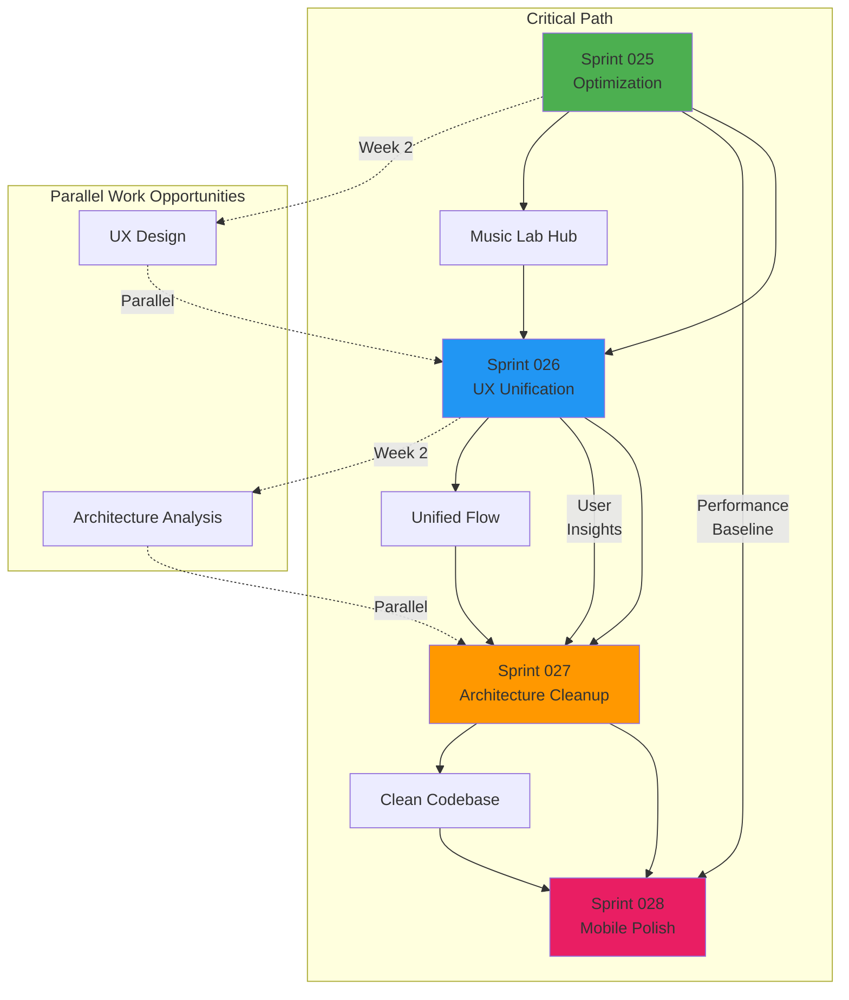

# Sprint Roadmap Q4 2025 - Q1 2026

**Период**: December 2025 - February 2026  
**Спринты**: 025-028  
**Фокус**: Optimization, UX Consolidation, Architecture Cleanup, Mobile Polish

---

## 📅 Timeline Overview

```
2025 December              2026 January              2026 February
│                          │                         │
├─ SPRINT-025 ────────────►│                         │
│  Optimization            │                         │
│  Dec 16-29               │                         │
│                          │                         │
│                          ├─ SPRINT-026 ───────────►│
│                          │  UX Unification         │
│                          │  Dec 30 - Jan 12        │
│                          │                         │
│                          │                         ├─ SPRINT-027 ─────────►
│                          │                         │  Architecture Cleanup
│                          │                         │  Jan 13-26
│                          │                         │
│                          │                         │                         ├─ SPRINT-028 ──►
│                          │                         │                         │  Mobile Polish
│                          │                         │                         │  Jan 27 - Feb 9
│                          │                         │                         │
└──────────────────────────┴─────────────────────────┴─────────────────────────┴───────────────►
```

---

## 🎯 Sprint Goals Matrix

| Sprint | Optimization | UX | Architecture | Mobile | Team |
|--------|-------------|-----|--------------|--------|------|
| **025** | 🎯🎯🎯🎯 | - | - | - | 2 devs |
| **026** | ✅ | 🎯🎯🎯🎯 | - | - | 3 people |
| **027** | ✅ | ✅ | 🎯🎯🎯🎯 | - | 2 devs |
| **028** | ✅ | ✅ | ✅ | 🎯🎯🎯🎯 | 2 devs |

🎯 = Primary Focus | ✅ = Prerequisite Complete

---

## 🔗 Dependency Graph



---

## 📊 Metrics Evolution

### Performance Metrics

| Metric | Baseline | After 025 | After 026 | After 027 | After 028 | Target |
|--------|----------|-----------|-----------|-----------|-----------|--------|
| Bundle Size | 1.16 MB | <900 KB | <850 KB | <820 KB | <800 KB | <800 KB |
| TTI (4G) | 4.5s | <3.5s | <3.3s | <3.1s | <3s | <3s |
| List FPS | 45 | >55 | - | - | >58 | 60 |
| Lighthouse | - | >85 | >87 | >88 | >90 | >90 |

### Code Quality Metrics

| Metric | Baseline | After 025 | After 026 | After 027 | After 028 | Target |
|--------|----------|-----------|-----------|-----------|-----------|--------|
| Stem Studio Files | 91 | - | - | 60 | - | 60 |
| Code Duplication | TBD | - | - | <5% | - | <5% |
| Test Coverage | 75% | 78% | 79% | >80% | >80% | >80% |

### UX Metrics

| Metric | Baseline | After 025 | After 026 | After 027 | After 028 | Target |
|--------|----------|-----------|-----------|-----------|-----------|--------|
| Creation Steps | 9 | - | 4 | - | - | 4 |
| Time to Track | 10min | - | <5min | - | - | <5min |
| Nav Depth (taps) | TBD | - | - | - | <3 | <3 |

---

## 🚀 Major Deliverables

### Sprint 025: Optimization Foundation
- ✨ Music Lab Hub (unified workspace)
- 📊 Performance monitoring infrastructure
- 📜 List virtualization (react-virtuoso)
- 📦 Bundle optimization Phase 1

### Sprint 026: UX Transformation
- 🎸 Unified creative flow (Guitar → Generate → Stems)
- ⚡ Quick Create presets (6+ one-tap options)
- 🧭 Guided workflows with progressive disclosure
- 👋 Redesigned onboarding (3-5 min)

### Sprint 027: Code Excellence
- 🗑️ Stem Studio consolidation (91 → 60 files)
- 🔄 Zero code duplication
- 🔍 Edge functions audit and optimization
- 🛡️ Code quality gates (pre-commit hooks)

### Sprint 028: Mobile Mastery
- 📱 4-tab navigation (Home, Create, Library, Profile)
- ☝️ Touch optimizations (all targets ≥44px)
- 👁️ Progressive disclosure patterns
- 🏎️ Mobile performance (<3s TTI on 4G)

---

## ⚠️ Risk Management

### Sprint 025 Risks
| Risk | Severity | Status | Mitigation |
|------|----------|--------|------------|
| Virtualization breaks existing lists | 🔴 MEDIUM | Monitoring | Comprehensive testing |
| Bundle size target not met | 🟡 LOW | Monitoring | Multiple strategies |

### Sprint 026 Risks
| Risk | Severity | Status | Mitigation |
|------|----------|--------|------------|
| UX changes confuse users | 🔴 HIGH | Monitoring | Gradual rollout, tutorials |
| User testing delays sprint | 🟡 MEDIUM | Monitoring | Parallel testing prep |

### Sprint 027 Risks
| Risk | Severity | Status | Mitigation |
|------|----------|--------|------------|
| Refactor breaks functionality | 🔴 HIGH | Monitoring | Incremental approach, tests |
| Scope creep (too many files) | 🟡 MEDIUM | Monitoring | Strict prioritization |

### Sprint 028 Risks
| Risk | Severity | Status | Mitigation |
|------|----------|--------|------------|
| Platform-specific bugs | 🟡 MEDIUM | Monitoring | Cross-device testing |
| Performance regressions | 🟡 MEDIUM | Monitoring | Continuous monitoring |

---

## 📈 Velocity Tracking

### Historical Performance (6 months)
- Completed: 7 sprints
- Planned: 24 sprints
- Velocity: 1.2 sprints/month
- Target: 2 sprints/month

### Q4 2025 - Q1 2026 Target
- Planned: 4 sprints (025-028)
- Duration: 8 weeks (2 months)
- Target Velocity: 2 sprints/month
- Confidence: HIGH (focused scope, clear goals)

### Velocity Improvement Strategies
1. **Scope Discipline**: Strict time-boxing, backlog for extras
2. **Parallel Work**: Leverage dependencies graph
3. **Clear AC**: Reduce rework and ambiguity
4. **Automation**: CI/CD, monitoring, testing
5. **Team Focus**: Dedicated team members per sprint

---

## 🎓 Team Capacity

| Sprint | Team Size | Total Hours | Available Hours* | Story Points |
|--------|-----------|-------------|------------------|--------------|
| 025 | 2 devs | 320h | 256h | 28 SP |
| 026 | 3 people | 480h | 384h | 26 SP |
| 027 | 2 devs | 320h | 256h | 26 SP |
| 028 | 2 devs | 320h | 256h | 25 SP |

*Available = Total × 80% (20% buffer for unknowns, meetings, etc.)

---

## 📚 Documentation Structure

```
SPRINTS/
├── SPRINT-025-TO-028-DETAILED-PLAN.md    # Master plan (this is the bible)
├── SPRINT-ROADMAP-Q4-2025.md             # This file (visual roadmap)
├── SPRINT-RESOURCE-ALLOCATION.md         # Team assignments (to be created)
│
├── SPRINT-025-OPTIMIZATION.md            # Sprint 025 summary
├── SPRINT-026-UX-UNIFICATION.md          # Sprint 026 summary (to be created)
├── SPRINT-027-ARCHITECTURE-CLEANUP.md    # Sprint 027 summary (to be created)
└── SPRINT-028-MOBILE-POLISH.md           # Sprint 028 summary (to be created)

specs/copilot/conduct-project-audit-and-sprint-planning/
├── plan.md           # Implementation plan
├── research.md       # Analysis and findings
├── data-model.md     # Sprint structure & metrics
└── quickstart.md     # Quick reference
```

---

## ✅ Sprint Readiness Checklist

### Sprint 025 (Starting Dec 16)
- [x] Detailed plan created
- [x] Success metrics defined
- [x] Team allocated (2 devs)
- [ ] Performance monitoring tools configured
- [ ] Kickoff meeting scheduled
- [ ] Backlog groomed

### Sprint 026 (Starting Dec 30)
- [x] Goals defined
- [ ] UX research completed
- [ ] Prototypes ready
- [ ] User testing plan
- [ ] Team allocated (3 people)

### Sprint 027 (Starting Jan 13)
- [x] Goals defined
- [ ] Stem Studio audit completed
- [ ] Consolidation strategy agreed
- [ ] Test suite reviewed
- [ ] Team allocated (2 devs)

### Sprint 028 (Starting Jan 27)
- [x] Goals defined
- [ ] Mobile design completed
- [ ] Testing devices prepared
- [ ] Performance baselines established
- [ ] Team allocated (2 devs)

---

## 🎯 Success Criteria (Overall)

### Must Have (RED if missed)
- [ ] All 4 sprints completed in 8 weeks
- [ ] Bundle size <800 KB
- [ ] Stem Studio ≤60 files
- [ ] Test coverage ≥80%
- [ ] No P0/P1 bugs

### Should Have (YELLOW if missed)
- [ ] TTI <3s on 4G
- [ ] User satisfaction >4.0/5.0
- [ ] Zero code duplication
- [ ] Lighthouse score >90

### Nice to Have (GREEN bonus)
- [ ] Onboarding completion >80%
- [ ] 100% touch target compliance
- [ ] All edge functions optimized
- [ ] Documentation 100% complete

---

## 📞 Contacts & Ownership

| Area | Owner | Backup |
|------|-------|--------|
| Overall Roadmap | Tech Lead | Product Manager |
| Sprint 025 | Frontend Performance Engineer | Full-Stack Developer |
| Sprint 026 | Frontend UX Engineer | Product Designer |
| Sprint 027 | Senior Frontend Engineer | Mid-Level Frontend |
| Sprint 028 | Mobile UX Specialist | Frontend Developer |

---

**Version**: 1.0.0  
**Created**: 2025-12-11  
**Next Review**: Sprint 025 Retrospective (2025-12-29)  
**Owner**: Tech Lead

---

## 📖 Related Documents

- [Master Plan](./SPRINT-025-TO-028-DETAILED-PLAN.md)
- [Constitution](../.specify/memory/constitution.md)
- [Project Specification](../docs/PROJECT_SPECIFICATION.md)
- [Research & Analysis](../specs/copilot/conduct-project-audit-and-sprint-planning/research.md)
