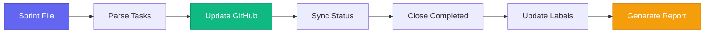
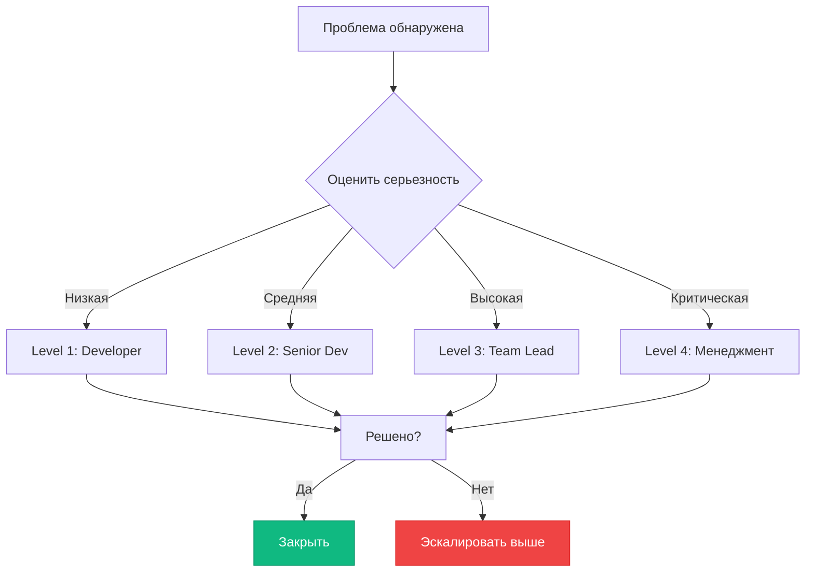
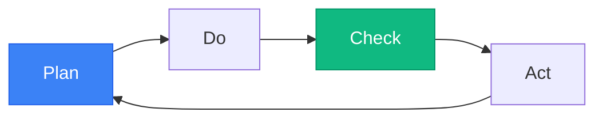

# 🔍 Система Трекинга Спринтов

**Версия**: 1.0.0  
**Последнее обновление**: 2026-06-26  
**Владелец процесса**: Team Lead

---

## 📋 Обзор Системы

### Принципы Трекинга

```mermaid
graph TB
    A[Система Трекинга] --> B[Прозрачность]
    A --> C[Актуальность]
    A --> D[Ответственность]
    A --> E[Автоматизация]
    
    B --> B1[Все задачи видны]
    B --> B2[Статусы обновлены]
    B --> B3[Прогресс отслеживается]
    
    C --> C1[Ежедневные обновления]
    C --> C2[Реальные данные]
    C --> C3[Без "фейковых" прогрессов]
    
    D --> D1[Ясные владельцы]
    D --> D2[Один ответственный]
    D --> D3[Подотчетность]
    
    E --> E1[Авто-сбор метрик]
    E --> E2[Интеграция с GitHub]
    E --> E3[Авто-отчеты]
    
    style A fill:#6366f1,stroke:#4338ca,color:#fff
    style B fill:#10b981,stroke:#059669,color:#fff
    style C fill:#3b82f6,stroke:#2563eb,color:#fff
    style D fill:#f59e0b,stroke:#d97706,color:#fff
    style E fill:#8b5cf6,stroke:#7c3aed,color:#fff
```

---

## 🔄 Процесс Мониторинга

### Ежедневный Мониторинг (Daily)

**Время**: 10:00 - 10:15 AM  
**Участники**: Все разработчики  
**Формат**: Standup (15 минут)

#### Чек-лист Standup

1. **Что完成了 вчера?**
   - ✅ Завершенные задачи
   - 🔄 Обновления прогресса
   - 📊 Метрики

2. **Что планируется сегодня?**
   - 🎯 Задачи на сегодня
   - ⚠️ Потенциальные блокеры
   - 🆕 Новые задачи

3. **Есть ли блокеры?**
   - 🚨 Активные блокеры
   - 🤝 Требуется помощь
   - 📞 Эскалация

#### Обновление Статусов

**После standup каждый разработчик обновляет:**

- ✅ Завершенные задачи → `status: "completed"`
- 🔄 Задачи в работе → обновить `progress: %`
- ⚠️ Новые блокеры → добавить в блокеры
- 📊 Прогресс → обновить в спринте

### Еженедельное Обновление (Weekly)

**День**: Понедельник  
**Время**: 9:00 AM - 10:00 AM  
**Участники**: Team Lead, Senior Devs

#### Чек-лист Weekly Review

1. **📊 Анализ Прошлой Недели**
   - Velocity команды
   - Завершенные задачи
   - Просрочки и причины
   - Блокеры и решения

2. **🎯 Планирование Текущей Недели**
   - Приоритеты
   - Распределение ресурсов
   - Дедлайны
   - Риски

3. **📈 Обновление Дашбордов**
   - MONITORING.md
   - AUTOMATED_REPORT.md
   - SPRINT-PROGRESS.md
   - PROJECT_STATUS.md

4. **🔄 Синхронизация с GitHub**
   - Закрыть completed issues
   - Обновить labels
   - Создать новые issues

#### Weekly Report Template

```markdown
# Weekly Report - Неделя N

## Исполнительное Резюме
- Завершено: X задач
- В работе: Y задач
- Просрочено: Z задач
- Velocity: N SP

## Достижения
- ✅ ...
- ✅ ...

## Проблемы
- ⚠️ ...
- ⚠️ ...

## Планы на следующую неделю
- 🎯 ...
- 🎯 ...

## Метрики
- Прогресс: X%
- Health Score: Y/100
- Bundle Size: Z KB
```

### Ежемесячный Анализ (Monthly)

**День**: Первый понедельник месяца  
**Время**: 2:00 PM - 4:00 PM  
**Участники**: Вся команда

#### Monthly Review Agenda

1. **📊 Анализ Месяца**
   - Статистика по спринтам
   - Velocity trends
   - Качество кода
   - Technical debt

2. **🎯 Ретроспектива**
   - Что пошло хорошо?
   - Что можно улучшить?
   - Action items

3. **📈 Планирование Следующего Месяца**
   - Эпики и спринты
   - Ресурсы
   - Релизы

4. **📚 Обновление Документации**
   - Все файлы спринтов
   - Дорожная карта
   - База знаний

---

## 👥 Ответственности

### Роли и Обязанности

| Роль | Ответственность | Частота Обновлений |
|------|-----------------|-------------------|
| **Team Lead** | Общее управление, приоритеты, эскалация | Ежедневно |
| **Senior Developer** | Code review, менторство, технические решения | Ежедневно |
| **Developer** | Реализация задач, обновление статусов | Ежедневно |
| **QA Engineer** | Тестирование, баг-репорты, качество | По задачам |
| **DevOps** | CI/CD, деплой, мониторинг | По необходимости |

### Матрица Ответственностей

(R) Responsible - выполняет работу  
(A) Accountable - несет ответственность  
(C) Consulted - консультируется  
(I) Informed - информируется

| Задача | Team Lead | Senior Dev | Dev | QA | DevOps |
|--------|-----------|------------|-----|----|--------|
| Создание спринта | A | C | R | I | I |
| Реализация задач | I | C | R | I | I |
| Code review | I | R | C | I | I |
| Тестирование | I | I | C | R | I |
| Деплой | A | I | I | C | R |
| Мониторинг | R | C | I | I | C |
| Документация | A | C | R | I | I |

---

## 📅 Частота Обновлений

### Стандарты Обновлений

#### Для Задач

- **В процессе**: Ежедневно (в конце рабочего дня)
- **Завершена**: Немедленно после завершения
- **Блокирована**: Немедленно при возникновении
- **Просрочена**: Обновить预估 дату завершения

#### Для Спринтов

- **Прогресс**: Ежедневно (автоматически из задач)
- **Статус**: При изменении фазы спринта
- **Метрики**: Еженедильно (понедельник)
- **Ретроспектива**: После завершения спринта

#### Для Документации

- **Дашборды**: Еженедильно (понедельник)
- **Отчеты**: Еженедильно (пятница)
- **Документация**: По необходимости (минимум раз в месяц)
- **GitHub Issues**: Ежедневно (синхронизация)

### Слан Обновлений

```mermaid
gantt
    title Цикл Обновлений
    dateFormat HH:mm
    axisFormat %H:%M
    
    section Daily
    Статусы задач        :done, d1, 09:00, 10m
    Daily standup        :active, d2, 10:00, 15m
    Обновление тасков    :d3, 10:15, 10m
    
    section Weekly
    Weekly review         :milestone, w1, 09:00, 60m
    Обновление дашбордов :w2, 10:00, 30m
    GitHub sync          :w3, 10:30, 30m
    
    section Monthly
    Monthly review        :milestone, m1, 14:00, 120m
    Ретроспектива         :m2, 16:00, 60m
    Documentation update :m3, 17:00, 60m
```



---

## 🔗 Интеграция с GitHub Issues

### Автоматическая Синхронизация

**Скрипт**: `scripts/update-sprint-status.sh`  
**Запуск**: Каждый день в 11:00 PM  
**Действия**:

1. Читает статус из спринт-файлов
2. Обновляет GitHub Issues
3. Закрывает завершенные задачи
4. Создает новые issues из backlog

### Mapping Статусов

| Sprint Status | GitHub Issue Status | GitHub Label |
|---------------|---------------------|--------------|
| ✅ Completed | closed | ✅ done |
| 🔄 In Progress | open | 🔄 in-progress |
| ⏳ Planned | open | ⏳ planned |
| ⚠️ Blocked | open | ⚠️ blocked |
| 🐞 Bug | open | 🐞 bug |
| ✨ Feature | open | ✨ feature |

### Workflow



### Создание Issues

**Из backlog автоматически создаются issues когда:**

- Задача переносится в "Planned"
- Назначен спринт
- Есть четкий дедлайн

**Template Issue:**

```yaml
---
title: "[SPRINT-XXX] Task Name"
labels: ["sprint-xxx", "feature", "priority-high"]
assignee: "@username"
milestone: "Sprint XXX"
---

## Описание
...

## Критерии приемки
- [ ] ...

## Зависимости
- ...

## Дедлайн
YYYY-MM-DD
```

---

## 📊 Метрики и KPIs

### KPIs для Трекинга

| KPI | Формула | Цель | Измерение |
|-----|---------|------|-----------|
| **Velocity** | SP completed / sprint | 12-15 SP | Еженедельно |
| **Completion Rate** | Tasks completed / planned | >90% | Каждый спринт |
| **On-Time Delivery** | On-time tasks / total | >85% | Каждый спринт |
| **Blocker Resolution** | Resolved / total | <3 days | Ежедневно |
| **Bug Fix Time** | Mean time to fix | <2 days | По багам |
| **Documentation** | Docs updated / changes | 100% | Еженедильно |

### Dashboard Metrics

**Реальное время (авто-обновление):**

- Активные задачи
- Просрочки
- Блокеры
- Прогресс спринта
- Velocity

**Исторические (ежемесячное обновление):**

- Тренды velocity
- Завершенные спринты
- Качество кода
- Technical debt

---

## 🚨 Эскалация Проблем

### Уровни Эскалации

#### Level 1: Задача (Developer)
**Когда**: Небольшая задержка (< 1 день)  
**Действие**: Обновить статус, упомянуть в standup

#### Level 2: Команда (Senior Dev)
**Когда**: Задержка > 1 день или техническая проблема  
**Действие**: Обсудить с senior, pair programming

#### Level 3: Team Lead
**Когда**: Задержка > 3 дней или блокер  
**Действие**: Эскалировать Team Lead, mitigation plan

#### Level 4: Менеджмент
**Когда**: Критический блокер > 5 дней  
**Действие**: Менеджмент-эскалация, пересмотр плана

### Process Flow



---

## 📞 Коммуникация

### Каналы Коммуникации

| Канал | Назначение | Частота | Аудитория |
|-------|-----------|---------|-----------|
| **#standup** | Daily standup | Ежедневно 10:00 | Все devs |
| **#sprint-xxx** | Обсуждение спринта | По необходимости | Команда спринта |
| **#blockers** | Блокеры и проблемы | Как возникают | Все devs |
| **#releases** | Релизы и деплой | По релизам | DevOps + Team Lead |
| **#metrics** | Метрики и отчеты | Еженедильно | Team Lead + Management |

### Стандарты Сообщений

#### Для Обновлений Статуса

```
✅ ЗАВЕРШЕНО: [Task ID] Название задачи
🔄 В РАБОТЕ: [Task ID] Название (X% complete)
⚠️ БЛОКЕР: [Task ID] Описание блокера
🆕 НОВАЯ ЗАДАЧА: [Task ID] Название + приоритет
```

#### Для Просрочек

```
⚠️ ПРОСРОЧКА: [Task ID]
Дедлайн: YYYY-MM-DD
Дней просрочено: N
Причина: ...
План действий: ...
```

#### Для Завершения Спринта

```
🎉 SPINT XXX ЗАВЕРШЕН
Завершено задач: N
Время: X дней
Velocity: Y SP
Health Score: Z/100
```

---

## 📚 Шаблоны Документов

### Sprint Planning Template

```markdown
# Sprint XXX Planning

## Цели Спринта
- ...

## User Stories
| ID | Название | Priority | Estimation | Assignee |
|----|----------|----------|------------|----------|
| US1 | ... | High | 5 SP | @user |

## Риски
- ...

## Дедлайн
YYYY-MM-DD

## Definition of Done
- [ ] Код ревью пройдено
- [ ] Тесты написаны
- [ ] Документация обновлена
- [ ] Прод тестирование пройдено
```

### Retrospective Template

```markdown
# Sprint XXX Retrospective

## Что пошло хорошо ✅
- ...

## Что можно улучшить ⚠️
- ...

## Action Items 🎯
| Item | Owner | Due Date |
|------|-------|----------|
| ... | @user | YYYY-MM-DD |

## Velocity
- Planned: X SP
- Completed: Y SP
- Efficiency: Z%

## Lessons Learned
- ...
```

---

## 🔧 Инструменты

### Основные Инструменты

| Инструмент | Назначение | Ссылка |
|------------|-----------|--------|
| **GitHub Issues** | Task tracking | github.com/HOW2AI-AGENCY/aimusicverse/issues |
| **GitHub Projects** | Sprint board | github.com/HOW2AI-AGENCY/aimusicverse/projects |
| **Discord** | Communication | discord.gg/aimusicverse |
| **Notion** | Documentation | notion.so/aimusicverse |
| **Sentry** | Error tracking | sentry.io/aimusicverse |

### Автоматизация

**Скрипты:**
- `scripts/update-sprint-status.sh` - Обновление статусов
- `scripts/generate-report.sh` - Генерация отчетов
- `scripts/sync-github.sh` - Синхронизация с GitHub

**Запуск:**
```bash
# Ежедневное обновление
./scripts/update-sprint-status.sh

# Генерация отчета
./scripts/generate-report.sh --weekly

# GitHub sync
./scripts/sync-github.sh
```

---

## 📖 Best Practices

### Для Разработчиков

1. **Обновляй статусы ежедневно**
   - В конце рабочего дня
   - Перед уходом домой
   - Реальные данные только

2. **Сообщай о проблемах сразу**
   - Не жди до последнего
   - Эскалируй по уровню
   - Предлагай решения

3. **Следуй Definition of Done**
   - Код ревью обязательно
   - Тесты обязательны
   - Документация обязательна

### Для Team Lead

1. **Мониторь прогресс ежедневно**
   - Проверяй статусы
   - Следи за блокерами
   - Предотвращай просрочки

2. **Проводи ретроспективы**
   - После каждого спринта
   - Собирай feedback
   - Внедряй улучшения

3. **Поддерживай команду**
   - Убирай блокеры
   - Распределяй нагрузку
   - Менторство

### Для Команды

1. **Участвуй в standup**
   - Будь вовремя
   - Будь кратким
   - Будь честным

2. **Помогай коллегам**
   - Pair programming
   - Code review
   - Knowledge sharing

3. **Улучшай процесс**
   - Предлагай идеи
   - Тестируй новые подходы
   - Делись опытом

---

## 🔄 Непрерывное Улучшение

### Цикл Улучшения



### Механизм Обратной Связи

**Ежемесячно:**
- Анонимный survey команде
- Обсуждение результатов
- Action items для улучшения

**Каждый спринт:**
- Ретроспектива
- Что went well
- Что можно улучшить

**Еженедильно:**
- Обзор метрик
- Обсуждение проблем
- Корректировка плана

---

## 📞 Контакты

| Роль | Имя | Email | Discord |
|------|-----|-------|---------|
| Team Lead | HOW2AI | team@aimusicverse.com | @teamlead |
| Senior Dev | - | - | @senior-dev |
| DevOps | - | - | @devops |

---

_📅 Последнее обновление: 2026-06-26  
👤 Владелец: Team Lead  
🔄 Обновление: Ежемесячно или по необходимости_
