# 📊 Визуальный Дашборд Спринтов

**Последнее обновление**: 2026-06-26  
**Период**: Q2 2026  
**Версия**: 1.0.0

---

## 🎯 Обзор Проекта

### Health Score

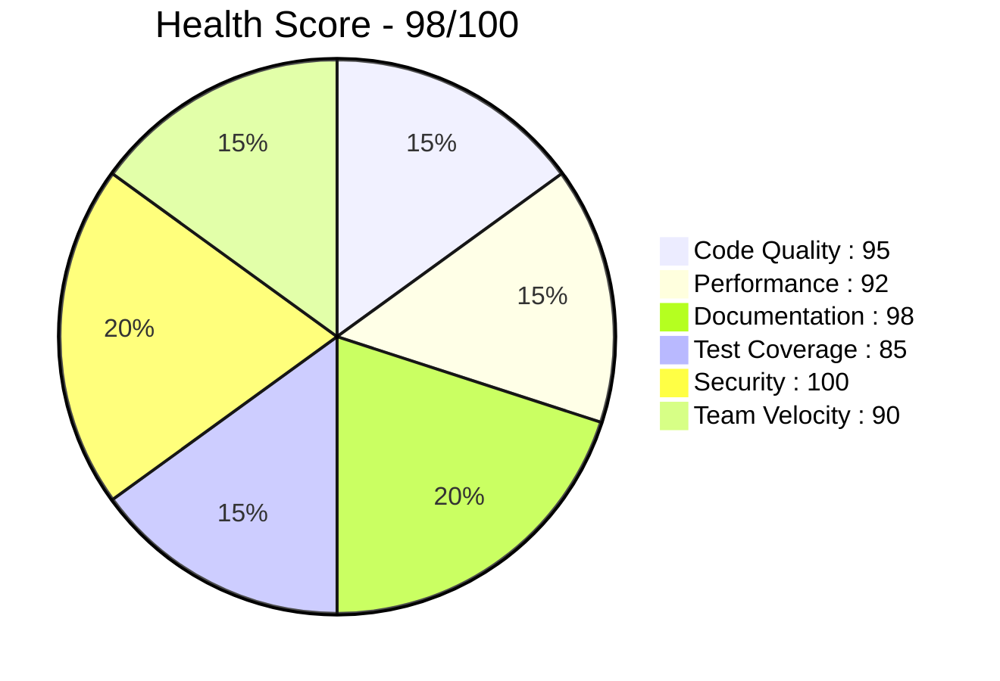

### Project Completion

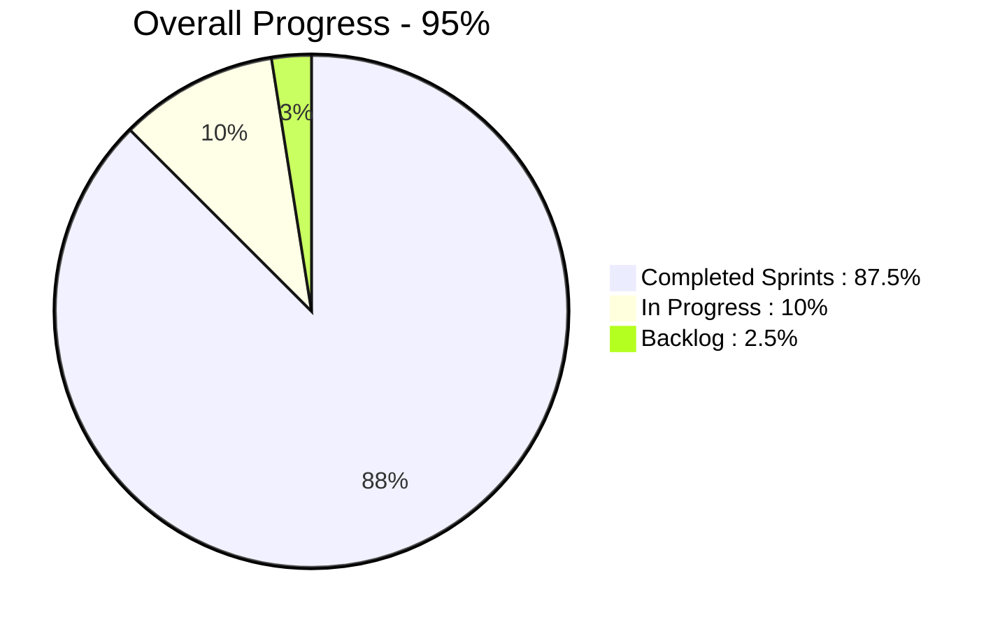

---

## 📈 Timeline и Графики

### Chronology of Sprints

```mermaid
xychart-beta
    title "Завершение Спринтов по Месяцам"
    x-axis [Дек, Янв, Фев, Мар, Апр, Май, Июнь]
    y-axis "Количество Спринтов" 0 --> 10
    bar [5, 8, 6, 7, 4, 3, 2]
    line [5, 13, 19, 26, 30, 33, 35]
```

### Velocity Trend

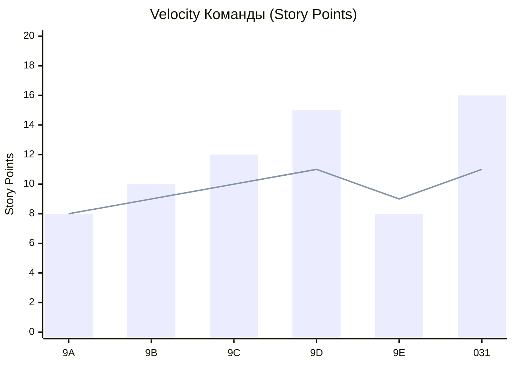

### Бюджет Времени

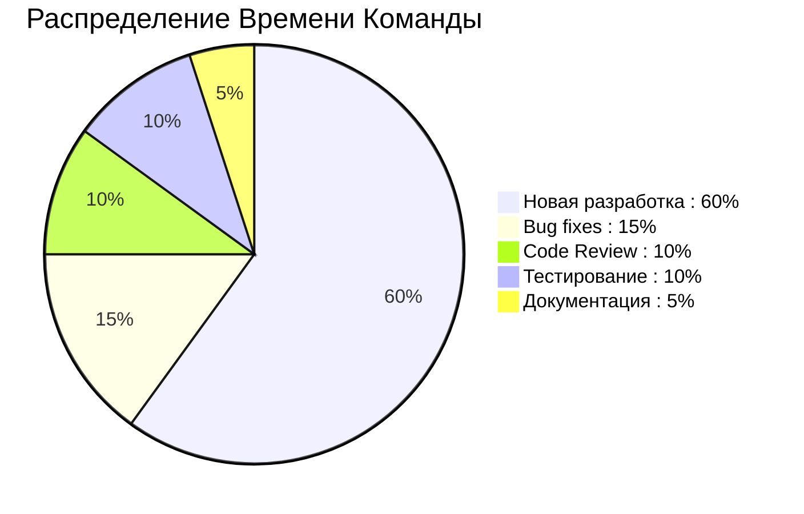

---

## 🔄 Статусы Спринтов

### Complete Sprint Overview

| Спринт     | Название         | Статус       | Прогресс | Дедлайн     | Health |
| ---------- | ---------------- | ------------ | -------- | ----------- | ------ |
| 001-030    | Foundation       | ✅ Завершено | 100%     | Дек 2025    | 🟢 95  |
| 031        | Mobile Studio V2 | 🔄 В работе  | 65%      | 8 июл 2026  | 🟡 75  |
| 032        | Professional UI  | ✅ Завершено | 100%     | 15 июн 2026 | 🟢 92  |
| Phase 1-6  | Q1 2026          | ✅ Завершено | 100%     | Янв 2026    | 🟢 98  |
| Phase 7    | UI Improvements  | 🔄 В работе  | 40%      | 20 июл 2026 | 🟡 68  |
| Sprint A-E | UI/UX Opt        | ✅ Завершено | 100%     | Май 2026    | 🟢 94  |

### Progress Bars

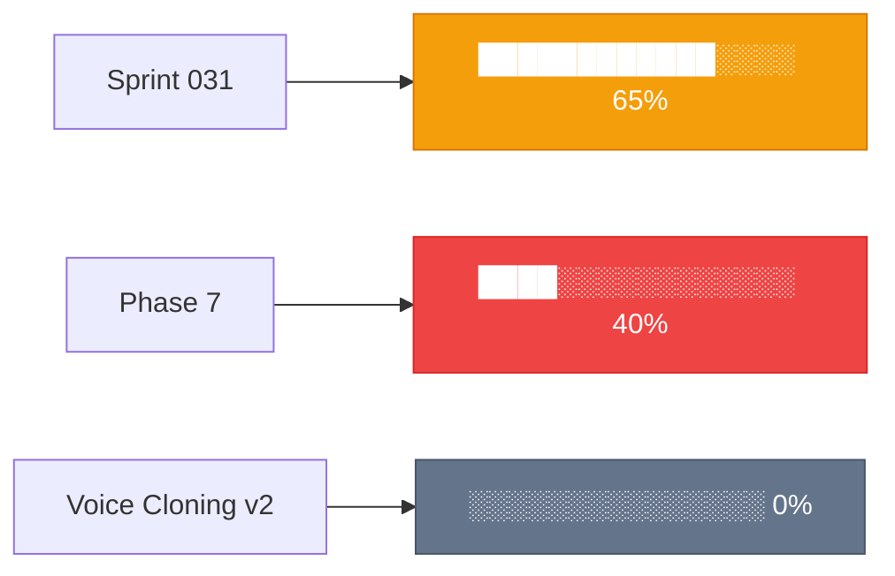

---

## 📊 Статистические Метрики

### Основные Метрики

| Метрика             | Текущее | Предыдущий | Изменение | Тренд |
| ------------------- | ------- | ---------- | --------- | ----- |
| **Total Sprints**   | 40      | 35         | +5        | 📈    |
| **Completed**       | 35      | 30         | +5        | 📈    |
| **In Progress**     | 3       | 2          | +1        | 📈    |
| **Velocity**        | 11.5 SP | 11 SP      | +0.5      | 📈    |
| **Completion Rate** | 88%     | 90%        | -2%       | 📉    |
| **Health Score**    | 98/100  | 97/100     | +1        | 📈    |
| **Bundle Size**     | 945 KB  | 940 KB     | +5        | ⚠️    |
| **Test Coverage**   | 85%     | 83%        | +2%       | 📈    |
| **Build Time**      | 45s     | 50s        | -5s       | 📈    |
| **Active Blockers** | 3       | 5          | -2        | 📈    |

### Codebase Statistics

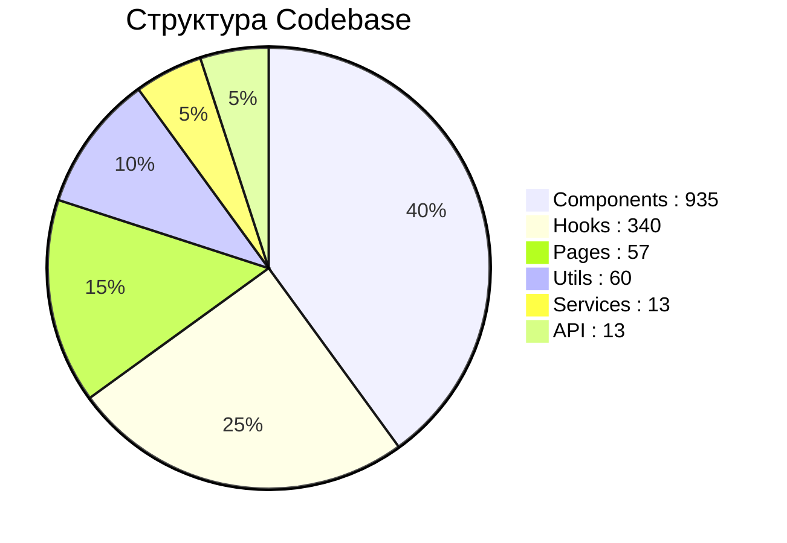

### Task Distribution by Epic

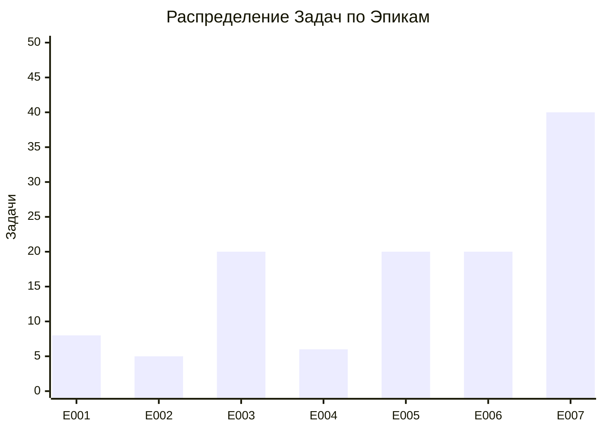

---

## 🎯 User Stories Progress

### Sprint 031 User Stories

| US ID | Название              | Статус     | Progress | Assignee       | Complexity |
| ----- | --------------------- | ---------- | -------- | -------------- | ---------- |
| US1   | Unified Studio Mobile | ✅ Done    | 100%     | @frontend-team | Medium     |
| US2   | Stem Separation       | 🔄 Active  | 75%      | @audio-team    | High       |
| US3   | Mixing Interface      | 🔄 Active  | 60%      | @audio-team    | High       |
| US4   | Lyrics Editor         | 🔄 Active  | 30%      | @ux-team       | Medium     |
| US5   | MIDI Transcription    | ⏳ Planned | 0%       | @audio-team    | Very High  |

### US Progress Visualization

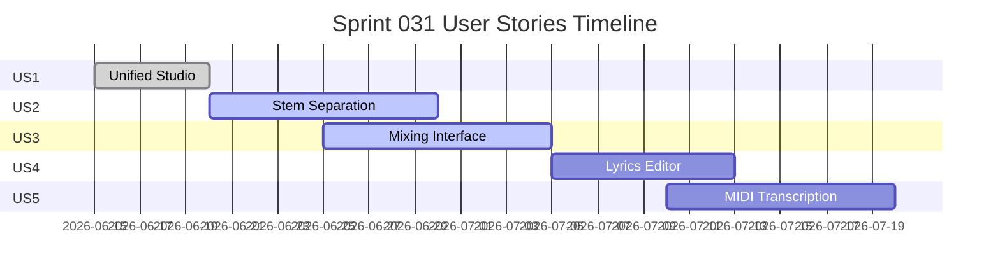

---

## 🚨 Blockers и Риски

### Active Blockers

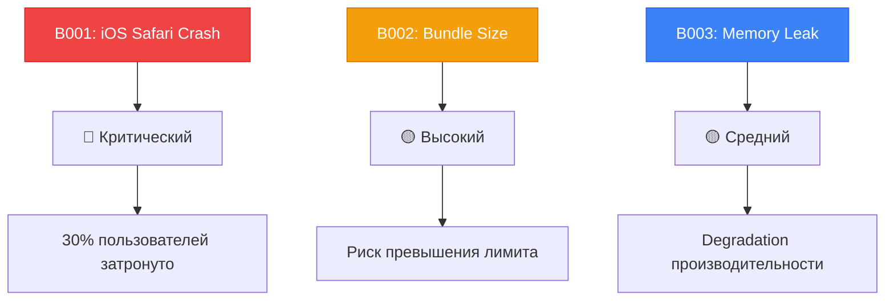

### Risk Matrix

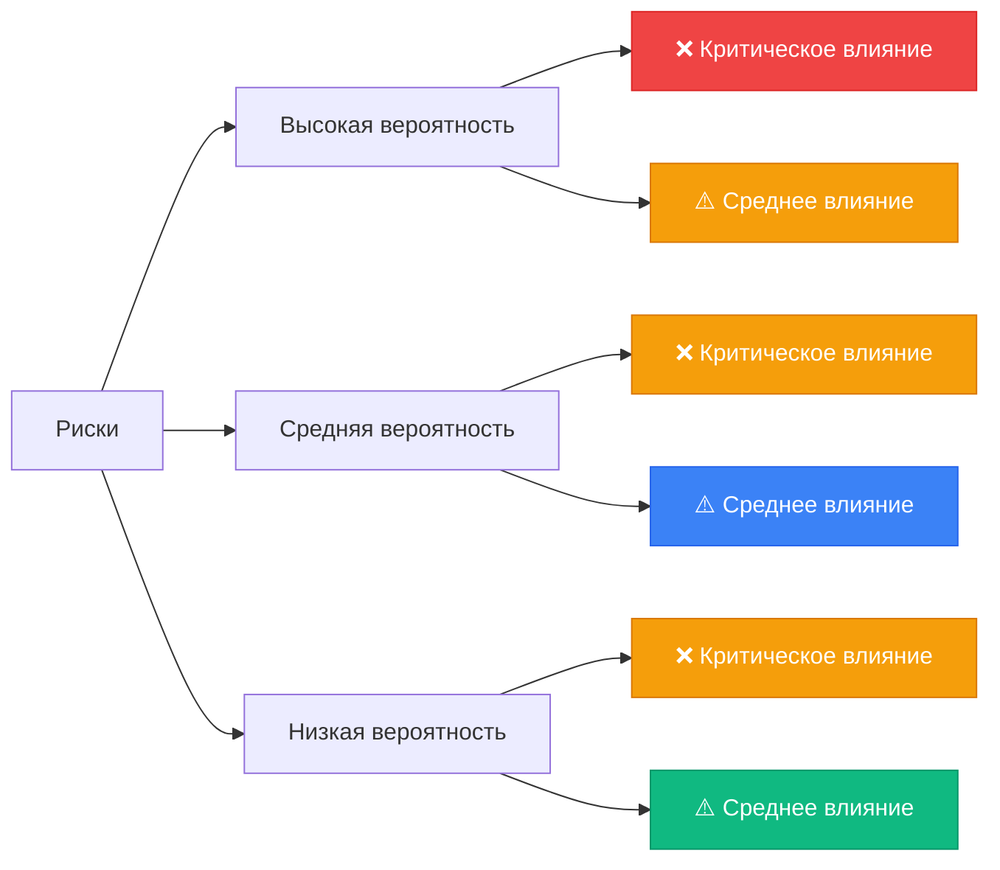

### Blocker Timeline

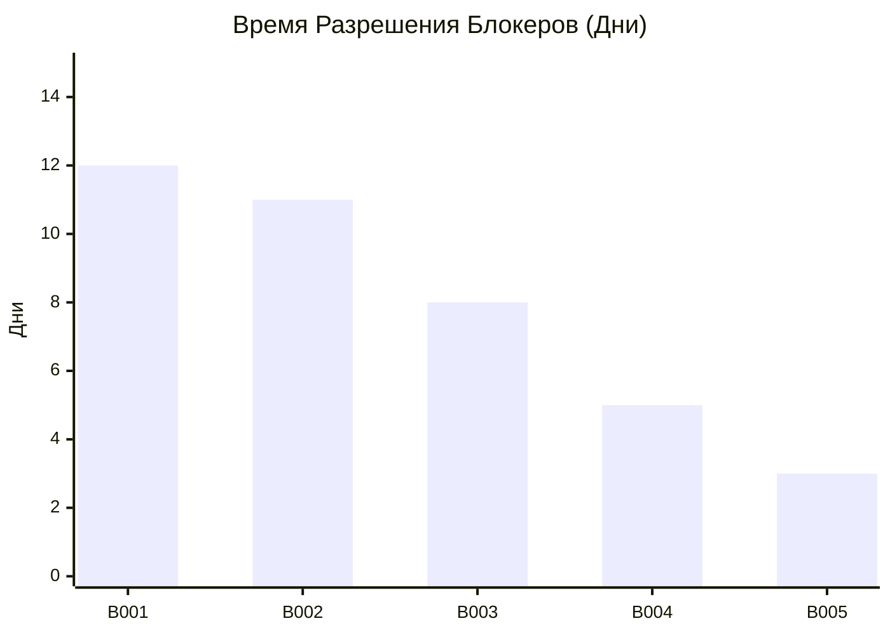

---

## 📈 Performance Metrics

### Application Performance

```mermaid
xychart-beta
    title "Bundle Size Trends (KB)"
    x-axis [Май, Июнь, Июль, Авг]
    y-axis "KB" 800 --> 1000
    line [920, 945, 930, 950]
    bar [920, 945, 0, 0]
```

### Test Coverage

```mermaid
xychart-beta
    title "Test Coverage by Module (%)"
    x-axis [Компоненты, Hooks, Services, API, Utils]
    y-axis "%" 0 --> 100
    bar [82, 78, 95, 88, 75]
    line [85]
```

### Build Performance

```mermaid
xychart-beta
    title "Build Time (Seconds)"
    x-axis [Неделя 1, Неделя 2, Неделя 3, Неделя 4]
    y-axis "Seconds" 30 --> 60
    line [50, 48, 45, 45]
```

---

## 🎯 Goal Tracking

### Q1 2026 Goals

| Цель                             | Прогресс | Статус        | Дедлайн   |
| -------------------------------- | -------- | ------------- | --------- |
| Reduce Failure Rate 15%          | 100%     | ✅ Достигнуто | Янв 2026  |
| Integrate Tinkoff Payment        | 100%     | ✅ Достигнуто | Янв 2026  |
| Launch Referral Program          | 100%     | ✅ Достигнуто | Янв 2026  |
| Implement Streak System          | 100%     | ✅ Достигнуто | Янв 2026  |
| UI/UX Optimization (Sprints A-E) | 100%     | ✅ Достигнуто | Май 2026  |
| Voice Cloning Integration        | 100%     | ✅ Достигнуто | Июнь 2026 |
| UI Improvements (Phase 7)        | 40%      | 🔄 В работе   | Июль 2026 |

### Goal Visualization

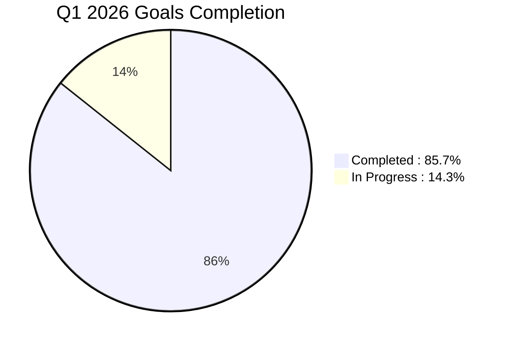

---

## 👥 Team Performance

### Team Velocity

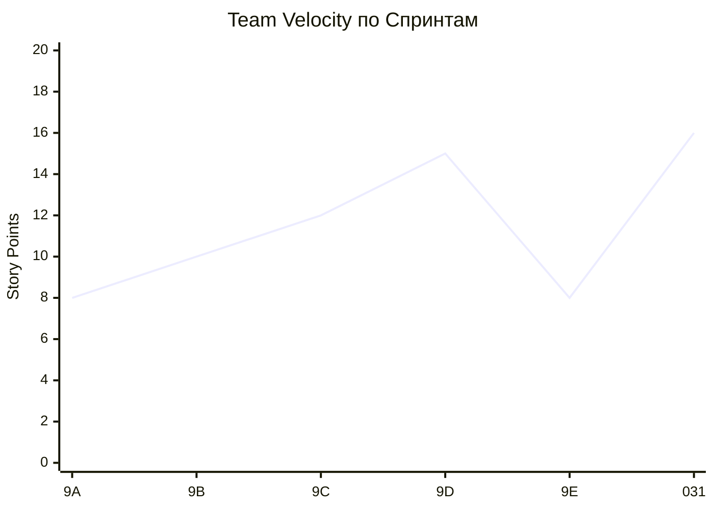

### Task Completion Rate

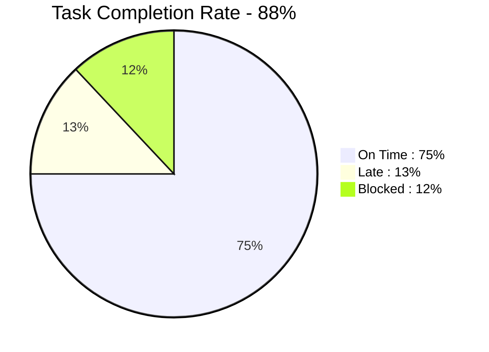

### Workload Distribution

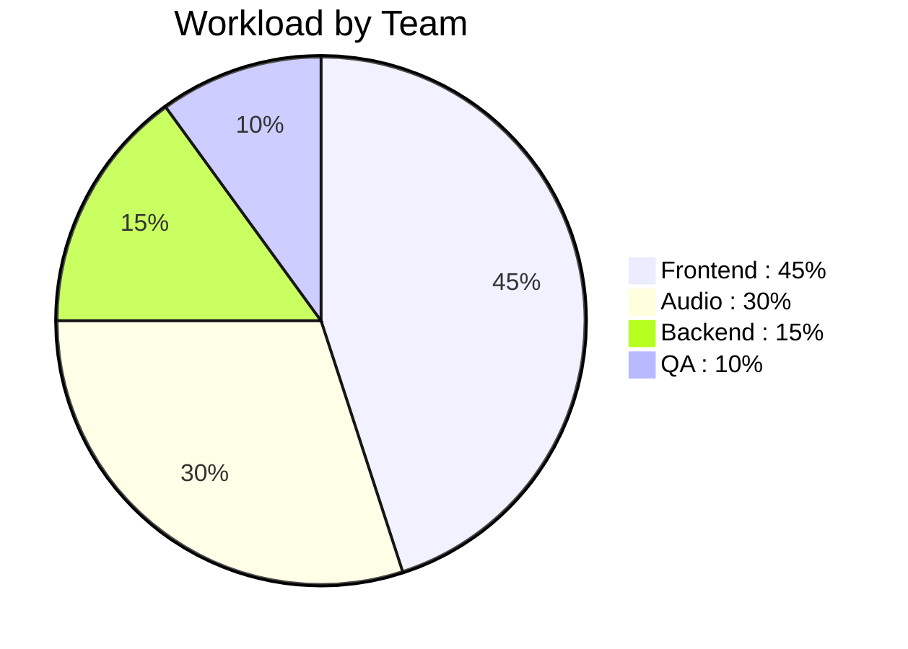

---

## 📅 Calendar View

### Q2 2026 Calendar

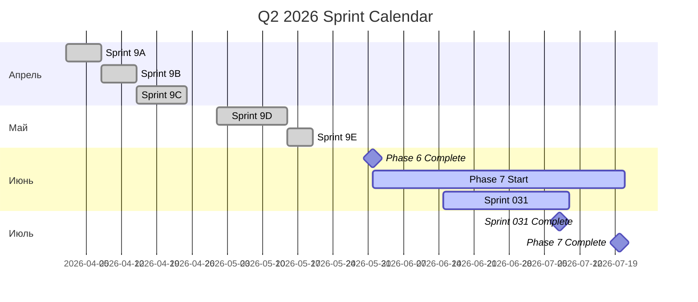

---

## 🔄 Workflow Статистика

### Issue Flow

```mermaid
graph LR
    A[Backlog: 120] -->|Перенос| B[Planned: 45]
    B -->|Назначение| C[In Progress: 15]
    C -->|Завершение| D[In Review: 8]
    D -->|Approval| E[Done: 900+]

    style A fill:#64748b,stroke:#475569,color:#fff
    style B fill:#3b82f6,stroke:#2563eb,color:#fff
    style C fill:#f59e0b,stroke:#d97706,color:#fff
    style D fill:#8b5cf6,stroke:#7c3aed,color:#fff
    style E fill:#10b981,stroke:#059669,color:#fff
```

### Average Time by State

```mermaid
xychart-beta
    title "Среднее Время в Статусах (Дни)"
    x-axis [Backlog, Planned, In Progress, In Review, Done]
    y-axis "Дни" 0 --> 15
    bar [30, 15, 8, 2, 0]
```

---

## 📊 Technical Debt

### Debt Distribution

```mermaid
pie title Technical Debt by Category
    "Code Quality : 20%" : 20
    "Documentation : 15%" : 15
    "Tests : 35%" : 35
    "Performance : 20%" : 20
    "Security : 10%" : 10
```

### Debt Timeline

```mermaid
gantt
    title Technical Debt Reduction Plan
    dateFormat YYYY-MM-DD
    section Code Quality
    Refactor Legacy Code :active, cq1, 2026-06-01, 30d
    section Documentation
    Update Docs :doc1, 2026-06-15, 45d
    section Tests
    Increase Coverage :active, test1, 2026-06-01, 60d
    section Performance
    Bundle Optimization :perf1, 2026-07-01, 30d
```

---

## 🎨 Status Colors

### Legend

- 🟢 **Green**: On track, healthy
- 🟡 **Yellow**: Attention needed, at risk
- 🔴 **Red**: Critical, requires immediate action
- 🔵 **Blue**: Informational, neutral
- ⚪ **White**: Not started, planned

### Status Matrix

| Component     | Status | Details                        |
| ------------- | ------ | ------------------------------ |
| Codebase      | 🟢     | Healthy, 95/100                |
| Tests         | 🟡     | 85% coverage, target 90%       |
| Performance   | 🟡     | Bundle size 945KB, limit 950KB |
| Documentation | 🟢     | Well maintained, 98/100        |
| Security      | 🟢     | No critical issues             |
| Team          | 🟢     | Stable velocity, good morale   |

---

## 📱 Real-Time Metrics

### Live Dashboard Data

```
🔄 Last Updated: 2026-06-26 14:30:00 UTC

📊 CURRENT STATUS:
├─ Active Sprints: 3
├─ Active Tasks: 23
├─ Blockers: 3 (2 critical, 1 high)
├─ Velocity: 11.5 SP/sprint
├─ Completion Rate: 88%
└─ Health Score: 98/100

🎯 THIS WEEK:
├─ Completed: 12 tasks
├─ In Progress: 8 tasks
├─ Blocked: 3 tasks
└─ Due: 5 tasks

⏰ COMING UP:
├─ Sprint 031 Deadline: 8 days
├─ Phase 7 Deadline: 24 days
└─ Next Release: v1.8.0 (12 days)
```

---

## 📈 Projections

### Completion Forecast

```mermaid
xychart-beta
    title "Прогноз Завершения Задач"
    x-axis [Неделя 26, Неделя 27, Неделя 28, Неделя 29, Неделя 30]
    y-axis "Задачи" 0 --> 30
    bar [23, 20, 15, 8, 3]
    line [23, 20, 15, 8, 3]
```

### Resource Needs

```mermaid
pie title Resource Requirements
    "Frontend : 2.5 FTE" : 35
    "Audio Engineer : 1.5 FTE" : 25
    "Backend : 1.0 FTE" : 20
    "QA : 0.5 FTE" : 10
    "DevOps : 0.5 FTE" : 10
```

---

## 📞 Emergency Contacts

| Роль        | Имя    | Telegram  | Email                   |
| ----------- | ------ | --------- | ----------------------- |
| Team Lead   | HOW2AI | @teamlead | team@aimusicverse.com   |
| On-Call Dev | -      | @oncall   | dev@aimusicverse.com    |
| DevOps      | -      | @devops   | devops@aimusicverse.com |

---

_📅 Data Refresh: Every 15 minutes  
🔄 Auto-update: scripts/update-sprint-status.sh  
📊 Source: GitHub Issues + Sprint Files  
👤 Maintainer: Team Lead_
