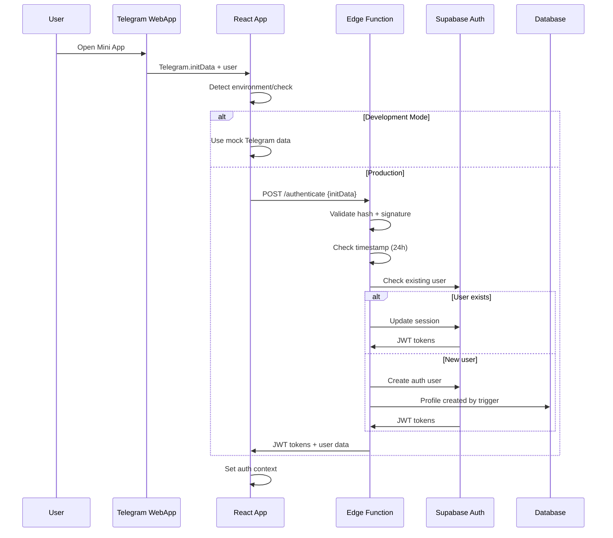

# 🤖 MusicVerse AI - Telegram Bot & Mini App Integration Analysis

## 📊 System Overview

MusicVerse AI implements a sophisticated dual-integration approach with Telegram, featuring both a **Telegram Mini App** (web application) and a **Telegram Bot** (native bot interface). This creates a seamless user experience across chat and web contexts.

## 🏗️ Architecture Components

### 1. Telegram Mini App (Web Application)
**Technology**: React 19 + TypeScript + Web App SDK
**Purpose**: Full-featured music generation studio accessible within Telegram

### 2. Telegram Bot (Native Bot)
**Technology**: GrammY framework + TypeScript + Edge Functions
**Purpose**: Chat-based music management and notifications

## 🔐 Authentication & Security

### Mini App Authentication Flow


### Security Implementation
- **Hash Validation**: HMAC-SHA256 validation of Telegram `initData`
- **Timestamp Check**: 24-hour maximum token age
- **Signature Verification**: Bot token-based signature validation
- **JWT Token Management**: Secure session management with refresh tokens
- **Orphan Profile Handling**: Automatic cleanup of orphaned profiles

## 🎮 Mini App Integration Features

### Core Integration Capabilities
```typescript
interface TelegramWebApp {
  // User & Authentication
  initData: string                    // Encoded auth data
  initDataUnsafe.user: TelegramUser   // Parsed user object
  
  // User Interface
  expand(): void                        // Full-screen mode
  setBackgroundColor(color): void      // Theme integration
  setHeaderColor(color): void         // Header theming
  
  // Haptic Feedback
  HapticFeedback: {
    impactOccurred(style): void          // Tactile feedback
    notificationOccurred(type): void     // Success/error feedback
    selectionChanged(): void            // UI interaction feedback
  }
  
  // Navigation
  MainButton: {                         // Primary action button
    setText(text): void
    show(): void
    hide(): void
    onClick(callback): void
  }
  
  BackButton: {                        // Navigation button
    show(): void
    hide(): void
    onClick(callback): void
  }
  
  // Cloud Storage
  CloudStorage: {                       // Data persistence
    setItem(key, value, callback): void
    getItem(key, callback): void
    getKeys(callback): void
  }
}
```

### Theme Integration
- **CSS Variables**: Automatic theme parameter injection
- **Safe Area**: iOS/Android safe area handling
- **Responsive Design**: Platform-specific styling

## 📱 Bot Integration Features

### Core Bot Capabilities
- **Single Message UI**: Update one message instead of spam
- **Reactive Updates**: `editMessageMedia` for dynamic content
- **Deep Linking**: `t.me/bot?start=track_123`
- **Inline Commands**: Rich command menu
- **File Handling**: Audio file delivery with metadata
- **Notification System**: Push notifications to users

### Bot Command Structure
```bash
/start      # Main menu with banner
/generate   # Start music generation
/library    # Access music library
/projects   # Project management
/status     # Generation status
/settings   # Configuration
/app        # Open Mini App
/help     # Help commands
```

### User Flow Examples

#### 🎧 Music Library Interface
```
[Album Cover]
🎧 Sunset Dreams
👤 AI Artist
🏷 #Pop #Chill
💿 Track 1 of 5
┌──────────────────────────┐
│ [⏮] [▶ PLAY] [⏭]      │
│ [❤ Like][⬇][✂️ Stems] │
│ [🔙 Назад]             │
└──────────────────────────┘
```

#### 📁 Project Management
```
[Album Cover]
📁 My Summer EP
5 tracks • 15 min
Created: 12 Dec 2024
┌──────────────────────────┐
│[⬅][Project 1/3][➡]     │
│[📂 Open in Studio]      │
│[🔙 Back]               │
└──────────────────────────┘
```

## 🔗 Deep Link & Navigation Architecture

### Deep Link Patterns
- **Track Links**: `t.me/bot?start=track_TRACKID`
- **Project Links**: `t.me/bot?start=project_PROJECTID`  
- **Generation Links**: `t.me/bot?start=generate_STYLE`
- **Mini App Links**: Direct web app access

### Navigation System
```typescript
// URL Router for Mini App
const DeepLinkHandler = () => {
  const startParam = webApp.initDataUnsafe?.start_param;
  
  switch(true) {
    case startParam.startsWith('track_'):
      navigate('/library?track=' + trackId); break;
    case startParam.startsWith('project_'):
      navigate('/projects/' + projectId); break;
    case startParam.startsWith('generate_'):
      navigate('/generate?style=' + style); break;
  }
};
```

## 📊 Notification System

### Automated Notifications
- **Generation Complete**: Track ready notification
- **Generation Failed**: Error notification with retry
- **Stems Complete**: Audio separation completion
- **Project Updates**: Project status changes
- **Analytics**: Track play notifications

### Notification Types
1. **Text Messages**: Simple status updates
2. **Audio Messages**: Direct audio file delivery
3. **Rich Messages**: Text + inline buttons
4. **Media Messages**: Audio + cover image + actions

### Example Notification Flow
```typescript
// Completion notification with audio
{
  type: 'generation_complete',
  chat_id: 123456789,
  title: "My New Song",
  audioUrl: "https://path/to/audio.mp3",
  coverUrl: "https://path/to/cover.jpg", 
  duration: 180, // seconds
  tags: "pop,electronic",
  generationMode: "upscale"
}
```

## 🛡️ Security Measures

### Authentication Security
- **Secret Key Construction**: `HMAC-SHA256("WebAppData", bot_token)`
- **Data Integrity**: Hash comparison validation
- **Expiry Protection**: Timestamp validation (24h)
- **Signature Verification**: Cryptographic validation

### Access Control
- **Row Level Security**: Database-level user isolation
- **Permission System**: Role-based access (admin/user/moderator)
- **Resource Authorization**: Track/project ownership validation
- **Rate Limiting**: API call frequency controls

### Data Protection
- **Token Management**: Secure JWT session handling
- **User Data**: Minimal data collection
- **Storage**: Cloud storage with access controls

## 🚀 Performance Optimizations

### Mini App Performance
- **Lazy Loading**: Component-based code splitting
- **Caching**: React Query with 5-minute stale time
- **Image Optimization**: Responsive cover image handling
- **Bundle Size**: Tree shaking and optimization

### Bot Performance
- **Edge Functions**: Deployed at edge for low latency
- **Asynchronous Processing**: Background task handling
- **File Caching**: Telegram file_id reuse
- **Database Indexing**: Optimized query performance

## 📁 File Structure Integration

### Mini App Files
```
src/
├── contexts/TelegramContext.tsx      # Core Telegram integration
├── services/telegram-auth.ts       # Authentication service
├── hooks/useTelegramStorage.ts       # Local storage wrapper
└── components/TelegramInfo.tsx         # Debug information
```

### Bot Files
```
supabase/functions/
├── telegram-auth/                     # Authentication endpoint
├── telegram-bot/                      # Main bot logic
├── telegram-webhook-setup/            # Webhook configuration
└── send-telegram-notification/          # Push notification service
```

### Integration Utilities
```
docs/
├── TELEGRAM_BOT_ARCHITECTURE.md      # Bot implementation docs
└── TELEGRAM_MINI_APP/               # Mini App documentation
```

## 🎯 Success Metrics & Monitoring

### Authentication Metrics
- **Validation Success Rate**: Hash verification reliability
- **User Creation Rate**: New user onboarding efficiency
- **Session Management**: JWT token refresh rates
- **Error Rates**: Authentication failure analysis

### Engagement Metrics
- **Mini App Usage**: Session duration and feature usage
- **Bot Interaction**: Command usage and user flows
- **Deep Link Adoption**: External app integration usage
- **Notification Engagement**: Push notification response rates

### Technical Performance
- **Response Times**: API endpoint performance
- **Error Handling**: Error rates and recovery capabilities
- **Resource Utilization**: Edge function execution metrics

This comprehensive integration analysis demonstrates MusicVerse AI's sophisticated approach to Telegram ecosystem integration, combining security, usability, and performance optimization to create a seamless music creation experience within the Telegram platform.
