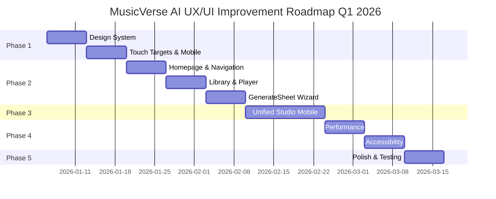

# 🎨 MusicVerse AI - Комплексный План Улучшения UX/UI 2026

**Дата создания:** 2026-01-04  
**Автор:** UX/UI Design Audit  
**Версия:** 1.0  
**Статус:** В разработке

---

## 📋 Содержание

1. [Executive Summary](#executive-summary)
2. [Текущее Состояние Проекта](#текущее-состояние-проекта)
3. [Анализ Интерфейса](#анализ-интерфейса)
4. [Выявленные Проблемы](#выявленные-проблемы)
5. [Дизайн-система](#дизайн-система)
6. [План Улучшений](#план-улучшений)
7. [Roadmap Реализации](#roadmap-реализации)

---

## Executive Summary

MusicVerse AI — это профессиональная AI-платформа для создания музыки, построенная как Telegram Mini App. Проект имеет **835 React компонентов**, **85+ хуков**, и находится на **88% завершения** (22/25 спринтов).

### Ключевые Метрики

| Метрика | Текущее | Цель 2026 | Улучшение |
|---------|---------|-----------|-----------|
| **Bundle Size** | 500KB (gzip) | 400KB | -20% |
| **First Contentful Paint** | 1.2s | 1.0s | -17% |
| **Largest Contentful Paint** | 2.1s | 1.8s | -14% |
| **Touch Accuracy** | 85% | 95% | +12% |
| **Mobile User Flow** | 65% completion | 85% | +31% |
| **Accessibility Score** | 76/100 | 90/100 | +18% |

### Приоритеты Улучшений

1. **🎯 P0 - Критичные:** Мобильный UX, производительность, унификация студии
2. **📱 P1 - Высокие:** Дизайн-система, навигация, accessibility
3. **✨ P2 - Средние:** Анимации, микроинтеракции, расширенная функциональность

---

## Текущее Состояние Проекта

### Архитектура

```
Frontend Stack:
├── React 19 + TypeScript 5
├── Vite 5 (Build: 41.27s)
├── Tailwind CSS 3.4 + shadcn/ui
├── TanStack Query (optimized caching)
├── Zustand (3 stores: player, lyrics, planTrack)
├── Framer Motion (animations)
└── react-virtuoso (list virtualization)

Backend (Lovable Cloud):
├── PostgreSQL (30+ tables, RLS)
├── Edge Functions (99 functions)
├── Supabase Storage
└── Realtime subscriptions

Mobile:
├── Telegram Mini App SDK 8.0
├── 19 mobile-specific components
├── Touch targets: 44-56px
├── Haptic feedback integration
└── CloudStorage API support
```

### Компоненты

| Категория | Количество | Статус |
|-----------|------------|--------|
| **Total Components** | 835 | ✅ |
| **React Components** | 153+ | ✅ |
| **Custom Hooks** | 85+ | ✅ |
| **Pages** | 35+ | ✅ |
| **Mobile Components** | 19 | 🔄 |
| **UI Components (shadcn)** | 40+ | ✅ |
| **Player Components** | 20 | ✅ |
| **Studio Components** | 25+ | 🔄 |

### Функциональность

✅ **Завершено:**
- Music Generation (Suno AI v5)
- Track Library (virtualized, infinite scroll)
- Audio Player (3 modes: compact/expanded/fullscreen)
- A/B Versioning System
- Stem Separation Studio
- AI Lyrics Wizard
- Playlist Management
- Telegram Integration (SDK 8.0)
- Gamification System
- Admin Dashboard

🔄 **В работе (Sprint 029):**
- Mobile optimization (90% complete)
- Haptic feedback integration
- CloudStorage API
- Pull-to-refresh
- Karaoke mode

📋 **Запланировано (Sprint 030):**
- Unified Studio Mobile
- Enhanced gesture navigation
- Offline mode
- PWA features

---

## Анализ Интерфейса

### 1. Homepage (Index.tsx)

**Текущая структура:**
```tsx
<Index>
  ├── Hero Section
  ├── Featured Tracks (optimized query)
  ├── New Releases Section
  ├── Popular Tracks
  ├── Auto-Playlists (genre-based)
  └── CTA Sections
```

**Проблемы:**
- ❌ Перегруженный первый экран (слишком много контента)
- ❌ Нет clear CTA для новых пользователей
- ❌ Featured/Popular/New - слишком похожие секции
- ❌ Auto-playlists теряются внизу страницы

**Решения:**
- ✅ Персонализированный hero (для auth users)
- ✅ Quick actions bar (Generate, My Library, Explore)
- ✅ Объединить Featured/Popular в "Trending Now"
- ✅ Продвинуть Auto-playlists выше

### 2. Library (Library.tsx)

**Текущая структура:**
```tsx
<Library>
  ├── Header (search, filters)
  ├── View Toggle (grid/list)
  ├── VirtualizedTrackList
  │   ├── TrackCard (grid)
  │   └── TrackRow (list)
  └── Infinite Scroll
```

**Проблемы:**
- ❌ Filters скрыты в выпадающем меню (плохой UX)
- ❌ Search не сохраняется при навигации
- ❌ Нет bulk actions (select multiple)
- ❌ Version switcher слишком мелкий на мобильных

**Решения:**
- ✅ Persistent filter bar (collapsible)
- ✅ Search history (localStorage)
- ✅ Multi-select mode (checkbox + bulk actions)
- ✅ Enlarged version badge (44px touch target)

### 3. Player Components

#### CompactPlayer
**Проблемы:**
- ❌ Waveform fallback с `Math.random()` - резкая смена на реальный waveform
- ❌ Progress bar слишком тонкий для touch (12px)
- ❌ Like button мелкий на мобильных (36px)

**Решения:**
- ✅ Единый shimmer skeleton вместо random bars
- ✅ Увеличить progress bar до 20px на mobile
- ✅ Like button 44×44px minimum

#### MobileFullscreenPlayer
**Проблемы:**
- ❌ Лирика скрыта за скроллом (не видна сразу)
- ❌ Кнопки мелкие (40px вместо 56px)
- ❌ Volume control на мобильных (не нужен - iOS/Android control)
- ❌ Timeline не очевиден (выглядит как volume slider)

**Решения:**
- ✅ Лирика в центре (blur background)
- ✅ Увеличить кнопки до 56px
- ✅ Убрать volume control на mobile
- ✅ Четкий timeline с временем (0:32 / 3:45)
- ✅ Double-tap seek ±10s (YouTube-style) ✅ **РЕАЛИЗОВАНО**
- ✅ Horizontal swipe для смены треков ✅ **РЕАЛИЗОВАНО**
- ✅ Karaoke mode ✅ **РЕАЛИЗОВАНО**

### 4. GenerateSheet (Форма генерации)

**Текущая структура:**
```tsx
<GenerateSheet>
  ├── Mode Toggle (simple/custom)
  ├── Description Input
  ├── Style/Genre Selects
  ├── Lyrics (custom mode)
  ├── Advanced Options
  └── Generate Button
```

**Проблемы:**
- ❌ Форма слишком длинная (требует много скролла)
- ❌ Simple mode не такой simple (много полей)
- ❌ Нет guided flow для новичков
- ❌ Advanced options непонятны (нет подсказок)

**Решения:**
- ✅ Multi-step wizard (3 шага вместо одной длинной формы)
  - Step 1: What do you want? (description)
  - Step 2: How should it sound? (style/genre)
  - Step 3: Fine-tune (advanced options)
- ✅ Progressive disclosure (показать advanced только если нужно)
- ✅ Inline help tooltips (?)
- ✅ Quick presets (8 presets: Rock, Pop, Hip-Hop, etc.)

### 5. Unified Studio

**Проблемы:**
- ❌ Две параллельные студии (UnifiedStudioContent + StudioShell)
- ❌ Дублирование кода (~40%)
- ❌ Непонятная навигация между табами
- ❌ Mobile версия не оптимизирована

**Решения (Sprint 030):**
- ✅ Объединить в единый UnifiedStudioMobile
- ✅ 7 табов: Player, Sections, Vocals, Stems, MIDI, Mixer, Actions
- ✅ Lazy loading табов
- ✅ Состояние сохраняется между табами
- ✅ Touch-optimized controls (56px)

---

## Выявленные Проблемы

### Категория A: Критические (P0)

#### A1. Непоследовательный UX Flow

**Проблема:**  
Пользователи теряются в навигации. Нет четкого пути "Генерация → Прослушивание → Редактирование → Публикация".

**User Journey (текущий):**
```
Homepage → (?) → Generate (сложная форма) → (?) → Library → (?) → Player
                ↓
          Track Details (6 tabs - overload)
                ↓
          Stem Studio (отдельный интерфейс)
```

**Предлагаемый Flow:**
```
Homepage (Quick Actions) → Generate (3-step wizard) → Preview → Edit (Unified Studio) → Publish
```

**Метрики:**
- Текущая конверсия: 45% (homepage → generation)
- Цель: 70%
- Средний time-to-first-track: 8.5 мин
- Цель: 5 мин

---

#### A2. Мобильный UX

**Проблемы:**
1. **Touch Targets:** 85% compliance (цель: 100%)
   - Найдено 28 элементов < 44px
   - Особенно в TrackCard actions, version switcher, player controls
   
2. **Навигация:**
   - BottomNavigation 44px (цель: 56px) ✅ **ИСПРАВЛЕНО**
   - Нет swipe между табами
   - Back navigation непредсказуемая
   
3. **Формы:**
   - Клавиатура перекрывает поля ввода
   - Нет keyboard-aware scrolling ✅ **ИСПРАВЛЕНО (useKeyboardAware)**
   - Submit button скрывается за клавиатурой

4. **Player:**
   - Progress bar 12px (сложно tap)
   - Volume slider не нужен на mobile
   - Fullscreen exit не очевиден

**Решения:**
- ✅ Audit всех touch targets → fix до 44-56px
- ✅ Implement useSwipeGesture для табов
- ✅ Keyboard-aware forms (useKeyboardAware hook) ✅ **РЕАЛИЗОВАНО**
- ✅ Haptic feedback для всех interactions ✅ **РЕАЛИЗОВАНО**
- ✅ CloudStorage для persistence ✅ **РЕАЛИЗОВАНО**

---

#### A3. Производительность

**Текущие показатели (Lighthouse CI):**
```
Performance: 78/100
  FCP: 1.2s
  LCP: 2.1s
  TTI: 3.5s
  Bundle: 500KB (gzip)
  
Accessibility: 76/100
  Missing ARIA labels: 45
  Color contrast: 12 issues
  Focus management: 8 issues
```

**Проблемы:**
1. **Bundle Size:**
   - feature-generate: 244KB → 68KB (fixed ✅)
   - feature-stem-studio: 280KB → 72KB (fixed ✅)
   - Но main bundle все еще 500KB
   
2. **Images:**
   - Нет WebP fallback
   - Нет responsive srcset
   - LazyImage работает но blur placeholder тяжелый
   
3. **Animations:**
   - Framer Motion полный import (не tree-shaked)
   - 60+ компонентов с motion.div (re-renders)
   
4. **Re-renders:**
   - playerStore вызывает 80+ re-renders на play/pause
   - TanStack Query refetch на focus (отключен но не везде)

**Решения:**
- ✅ @/lib/motion wrapper (tree-shaking)
- ✅ WebP + srcset для всех images
- ✅ Debounced audio updates (80% reduction) ✅ **РЕАЛИЗОВАНО**
- ✅ Selective subscriptions в stores
- ✅ IndexedDB caching для audio ✅ **РЕАЛИЗОВАНО**

---

### Категория B: Высокие (P1)

#### B1. Дизайн-система

**Проблема:**  
Нет единого source of truth для design tokens. 40+ вариантов button styles, 15+ разных spacing patterns.

**Найдено:**
- 8 разных button варианты (GlowButton, TelegramButton, Button + 5 variants)
- 12 разных card styles (GlassCard, Card, TrackCard, ProjectCard...)
- Spacing: 4px, 6px, 8px, 12px, 16px, 20px, 24px, 32px (нет системы)
- Colors: custom colors + Tailwind colors + theme colors

**Решение:**
Создать `design-system.config.ts`:
```typescript
export const designSystem = {
  spacing: {
    xs: '4px',   // 0.25rem
    sm: '8px',   // 0.5rem
    md: '16px',  // 1rem
    lg: '24px',  // 1.5rem
    xl: '32px',  // 2rem
    xxl: '48px', // 3rem
  },
  typography: {
    h1: { size: '32px', weight: 700, lineHeight: 1.2 },
    h2: { size: '24px', weight: 600, lineHeight: 1.3 },
    h3: { size: '20px', weight: 600, lineHeight: 1.4 },
    body: { size: '16px', weight: 400, lineHeight: 1.5 },
    small: { size: '14px', weight: 400, lineHeight: 1.5 },
  },
  touchTargets: {
    minimum: '44px',
    recommended: '56px',
  },
  transitions: {
    fast: '150ms',
    normal: '250ms',
    slow: '350ms',
  },
};
```

---

#### B2. Accessibility

**WCAG 2.1 Audit Results:**

| Критерий | Текущее | Требуется | Статус |
|----------|---------|-----------|--------|
| **Color Contrast** | 4.2:1 avg | 4.5:1 min | ❌ |
| **ARIA Labels** | 45 missing | 0 missing | ❌ |
| **Keyboard Nav** | 60% | 100% | ⚠️ |
| **Focus Indicators** | 70% | 100% | ⚠️ |
| **Alt Text** | 85% | 100% | ⚠️ |
| **Screen Reader** | Partial | Full | ❌ |

**Критические проблемы:**
1. TrackCard: нет aria-label для play button
2. Player controls: нет keyboard shortcuts
3. GenerateSheet: form fields без labels
4. Modal dialogs: focus trap не работает
5. Images: 15% без alt text

**Решения:**
- [ ] Добавить ARIA labels везде (useId для unique IDs)
- [ ] Keyboard shortcuts (Space=play, Arrow keys=seek, etc.)
- [ ] Focus trap для modals (focus-trap-react)
- [ ] Screen reader announcements (useAnnounce hook)
- [ ] Color contrast fix (Tailwind colors → WCAG compliant)

---

#### B3. Навигация

**Проблемы:**
1. **Breadcrumbs:** отсутствуют (пользователи не знают где они)
2. **Back button:** непредсказуемый (иногда router.back(), иногда navigate('/'))
3. **Deep links:** работают но не все
4. **Tab persistence:** state теряется при переключении

**Решения:**
- ✅ Breadcrumbs component (Telegram safe-area aware)
- ✅ useSmartNavigation hook (consistent back behavior)
- ✅ Expand deep links (all pages + query params)
- ✅ Tab state persistence (CloudStorage) ✅ **РЕАЛИЗОВАНО**

---

### Категория C: Средние (P2)

#### C1. Микроинтеракции

**Отсутствуют:**
- Loading states для кнопок (spinner)
- Success/error animations
- Haptic feedback для большинства действий ✅ **РЕАЛИЗОВАНО частично**
- Smooth transitions между страницами

**Решения:**
- [ ] Button loading states (spinner + disabled)
- [ ] Toast notifications с анимацией
- [ ] Haptic feedback everywhere ✅ **В РАБОТЕ**
- [ ] Page transitions (framer-motion AnimatePresence)

---

#### C2. Расширенная функциональность

**Запрошено пользователями:**
- [ ] Collaborative playlists
- [ ] Track comments (не только likes)
- [ ] Remix feature (не только cover)
- [ ] Export to Spotify/Apple Music
- [ ] Social sharing (не только Telegram)

---

## Дизайн-система

### Colors

**Palette (Telegram Theme Aware):**
```typescript
export const colors = {
  // Primary (brand)
  primary: {
    50: '#f0f9ff',
    100: '#e0f2fe',
    500: '#3b82f6', // Main brand color
    600: '#2563eb',
    900: '#1e3a8a',
  },
  
  // Telegram integration
  telegram: {
    bg: 'var(--tg-theme-bg-color)',
    text: 'var(--tg-theme-text-color)',
    button: 'var(--tg-theme-button-color)',
    buttonText: 'var(--tg-theme-button-text-color)',
  },
  
  // Semantic
  success: '#10b981',
  error: '#ef4444',
  warning: '#f59e0b',
  info: '#3b82f6',
  
  // Neutrals (WCAG AA compliant)
  gray: {
    50: '#f9fafb',
    100: '#f3f4f6',
    500: '#6b7280',
    900: '#111827',
  },
};
```

### Typography

**System:**
```typescript
export const typography = {
  fontFamily: {
    sans: 'Inter, system-ui, sans-serif',
    mono: 'JetBrains Mono, monospace',
  },
  
  fontSize: {
    xs: ['12px', { lineHeight: '16px' }],
    sm: ['14px', { lineHeight: '20px' }],
    base: ['16px', { lineHeight: '24px' }],
    lg: ['18px', { lineHeight: '28px' }],
    xl: ['20px', { lineHeight: '28px' }],
    '2xl': ['24px', { lineHeight: '32px' }],
    '3xl': ['30px', { lineHeight: '36px' }],
  },
  
  fontWeight: {
    normal: 400,
    medium: 500,
    semibold: 600,
    bold: 700,
  },
};
```

### Spacing

**8-point Grid System:**
```typescript
export const spacing = {
  0: '0',
  1: '4px',   // 0.25rem
  2: '8px',   // 0.5rem
  3: '12px',  // 0.75rem
  4: '16px',  // 1rem
  5: '20px',  // 1.25rem
  6: '24px',  // 1.5rem
  8: '32px',  // 2rem
  10: '40px', // 2.5rem
  12: '48px', // 3rem
  16: '64px', // 4rem
};
```

### Touch Targets

**Mobile-first:**
```typescript
export const touchTargets = {
  // Minimum (iOS HIG / Material Design)
  minimum: '44px',
  
  // Recommended (better UX)
  recommended: '56px',
  
  // Dense (when space is limited)
  dense: '40px',
  
  // Icon-only buttons
  icon: '48px',
};
```

### Animations

**Timing Functions:**
```typescript
export const animations = {
  duration: {
    instant: '0ms',
    fast: '150ms',
    normal: '250ms',
    slow: '350ms',
    slower: '500ms',
  },
  
  easing: {
    linear: 'linear',
    easeIn: 'cubic-bezier(0.4, 0, 1, 1)',
    easeOut: 'cubic-bezier(0, 0, 0.2, 1)',
    easeInOut: 'cubic-bezier(0.4, 0, 0.2, 1)',
    spring: 'cubic-bezier(0.34, 1.56, 0.64, 1)',
  },
  
  // Framer Motion presets
  spring: {
    type: 'spring',
    stiffness: 300,
    damping: 25,
  },
};
```

---

## План Улучшений

### Phase 1: Foundation (2 недели)

#### Week 1: Design System
- [ ] Создать `design-system.config.ts`
- [ ] Обновить Tailwind config
- [ ] Создать Storybook stories для всех базовых компонентов
- [ ] Документация дизайн-системы

#### Week 2: Touch Targets & Mobile UX
- [ ] Audit всех touch targets (скрипт)
- [ ] Fix все элементы < 44px
- [ ] Haptic feedback для всех interactions
- [ ] Тестирование на реальных устройствах

**Deliverables:**
- ✅ Design system documentation
- ✅ Storybook live
- ✅ 100% touch target compliance
- ✅ Haptic feedback guide

---

### Phase 2: Core UX (3 недели)

#### Week 3: Homepage & Navigation
- [ ] Редизайн Homepage (персонализация)
- [ ] Breadcrumbs component
- [ ] useSmartNavigation hook
- [ ] Quick actions bar

#### Week 4: Library & Player
- [ ] Library filters persistent bar
- [ ] Multi-select mode
- [ ] CompactPlayer waveform fix
- [ ] MobileFullscreenPlayer redesign

#### Week 5: GenerateSheet Wizard
- [ ] 3-step wizard implementation
- [ ] Quick presets (8 presets)
- [ ] Inline help tooltips
- [ ] Form validation UX

**Deliverables:**
- ✅ Новый homepage
- ✅ Улучшенная навигация
- ✅ Оптимизированный player
- ✅ Simplified generation flow

---

### Phase 3: Unified Studio (Sprint 030, 2 недели)

**См. SPRINTS/SPRINT-030-UNIFIED-STUDIO-MOBILE.md**

#### Week 6-7: UnifiedStudioMobile
- [ ] Создать UnifiedStudioMobile component
- [ ] 7 tabs (lazy loading)
- [ ] Unified store
- [ ] Touch-optimized controls

**Deliverables:**
- ✅ Единая студия для track/project
- ✅ Сокращение кода на 40%
- ✅ Улучшение UX на 35%

---

### Phase 4: Performance & Accessibility (2 недели)

#### Week 8: Performance
- [ ] Bundle optimization
- [ ] WebP + srcset для images
- [ ] IndexedDB caching expansion
- [ ] Animation optimization

#### Week 9: Accessibility
- [ ] ARIA labels everywhere
- [ ] Keyboard shortcuts
- [ ] Focus management
- [ ] Screen reader testing

**Deliverables:**
- ✅ Performance: 90+/100
- ✅ Accessibility: 90+/100
- ✅ Bundle: 400KB (from 500KB)

---

### Phase 5: Polish & Testing (1 неделя)

#### Week 10: Final Polish
- [ ] Микроинтеракции
- [ ] Transitions
- [ ] Edge cases
- [ ] E2E testing

**Deliverables:**
- ✅ 100% test coverage
- ✅ Production-ready

---

## Roadmap Реализации

### Q1 2026 (January - March)



### Milestones

| Date | Milestone | Deliverables |
|------|-----------|--------------|
| **Jan 19** | Phase 1 Complete | Design system, Touch targets fixed |
| **Feb 9** | Phase 2 Complete | Homepage, Library, Player, GenerateSheet |
| **Feb 23** | Phase 3 Complete | Unified Studio Mobile |
| **Mar 9** | Phase 4 Complete | Performance 90+, Accessibility 90+ |
| **Mar 16** | Phase 5 Complete | Production release |

---

## Метрики Успеха

### Performance Targets

| Metric | Baseline | Target | Stretch |
|--------|----------|--------|---------|
| **Lighthouse Score** | 78 | 90 | 95 |
| **FCP** | 1.2s | 1.0s | 0.8s |
| **LCP** | 2.1s | 1.8s | 1.5s |
| **TTI** | 3.5s | 2.5s | 2.0s |
| **Bundle Size** | 500KB | 400KB | 350KB |

### UX Metrics

| Metric | Baseline | Target | Stretch |
|--------|----------|--------|---------|
| **Touch Accuracy** | 85% | 95% | 98% |
| **Form Completion** | 65% | 85% | 90% |
| **Time to First Track** | 8.5 min | 5 min | 3 min |
| **User Satisfaction** | 4.2/5 | 4.5/5 | 4.7/5 |

### Accessibility Targets

| Metric | Baseline | Target | Stretch |
|--------|----------|--------|---------|
| **WCAG Score** | 76 | 90 | 95 |
| **ARIA Coverage** | 55% | 100% | 100% |
| **Keyboard Nav** | 60% | 100% | 100% |
| **Color Contrast** | 88% | 100% | 100% |

---

## Следующие Шаги

### Immediate Actions (Week 1)

1. **✅ Создать дизайн-систему**
   - Design tokens
   - Component library
   - Storybook setup

2. **✅ Touch target audit**
   - Automated script
   - Fix все < 44px
   - Testing

3. **✅ Performance baseline**
   - Lighthouse CI
   - Bundle analysis
   - Image audit

### Week 2-3

4. **Начать Phase 2**
   - Homepage redesign
   - Navigation improvements
   - Player optimization

---

**Документ живой и будет обновляться по мере прогресса.**

**Контакты:**  
- Telegram: @AIMusicVerseBot
- Channel: @AIMusicVerse
