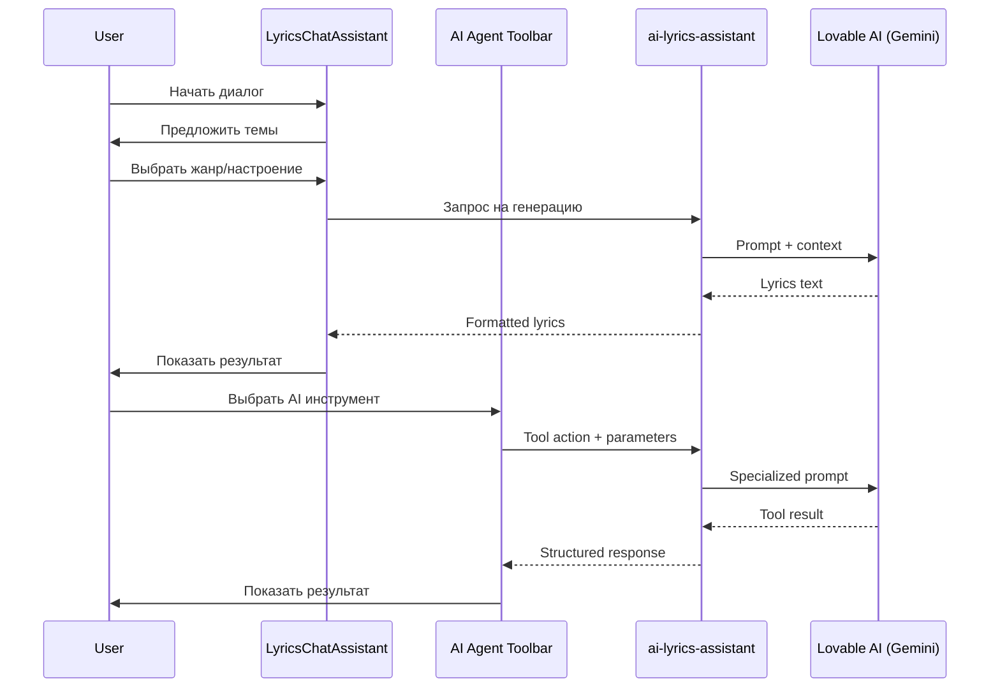

# 🎤 AI Lyrics Assistant & Agent Tools

Комплексная система для создания и редактирования текстов песен с помощью AI.

**Последнее обновление**: 2025-12-26

## Архитектура



## Компоненты

### Frontend

**`src/components/generate-form/lyrics-chat/LyricsChatAssistant.tsx`**
- Основной компонент чат-интерфейса
- Responsive: Drawer на мобильных, Dialog на десктопе
- Framer-motion анимации для сообщений

**`src/components/lyrics-workspace/ai-agent/`** (NEW)
- AI Agent Toolbar с 10+ инструментами
- Tool panels для каждого инструмента
- Result cards для отображения результатов

**`src/hooks/useLyricsChat.ts`**
- Логика чата и состояние сообщений
- Интеграция с Edge Function
- История диалога

### Backend

**`supabase/functions/ai-lyrics-assistant/index.ts`**
- Edge Function для генерации текстов
- Использует Lovable AI (Gemini 2.5 Flash)
- Поддерживает 15+ режимов работы

## Режимы работы

### Базовые режимы

| Режим | Описание |
|-------|----------|
| `generate` | Создание текста с нуля |
| `rewrite` | Полное переосмысление текста |
| `improve` | Улучшение рифм, ритма, образности |
| `translate` | Перевод с сохранением ритма |

### AI Agent Tools (NEW - Sprint 027)

| Инструмент | Действие | Описание |
|------------|----------|----------|
| `continue` | `continue_line` | Продолжить текст в стиле (natural, dramatic, contrast, climax) |
| `structure` | `fit_structure` | Перестроить по шаблону (verse-chorus, full-song, hip-hop) |
| `rhythm` | `analyze_rhythm` | Анализ слогов, ударений, ритмических паттернов |
| `style_convert` | `style_convert` | Конвертация в другой стиль/жанр/артиста |
| `paraphrase` | `paraphrase` | Перефразирование с разными тонами |
| `hook_generator` | `hook_generator` | Анализ хуков и генерация вариантов |
| `vocal_map` | `vocal_map` | Карта вокальной продакшн по секциям |
| `translate` | `translate_adapt` | Адаптивный перевод с сохранением слогов |

## Интеграция с генерацией

```typescript
// В GenerateSheet после получения lyrics
const handleApplyLyrics = (lyrics: string) => {
  form.setValue('lyrics', lyrics);
  form.setValue('mode', 'custom'); // Автоматически переключить на custom
  setIsLyricsChatOpen(false);
};
```

## Пример запроса к API

```typescript
const response = await supabase.functions.invoke('ai-lyrics-assistant', {
  body: {
    action: 'generate',
    context: {
      theme: 'любовь и расставание',
      genre: 'поп-баллада',
      mood: 'грустный, меланхоличный',
      structure: 'verse-chorus-verse-chorus-bridge-chorus',
      language: 'русский'
    }
  }
});
```

## UI/UX особенности

### Chat Interface
1. **Quick Options** - предустановленные темы для быстрого старта
2. **Genre Selector** - dropdown с популярными жанрами
3. **Mood Multi-select** - выбор нескольких настроений
4. **Structure Cards** - визуальный выбор структуры
5. **Copy/Regenerate/Apply** - действия с результатом
6. **Auto-scroll** - прокрутка к новым сообщениям

### AI Agent Toolbar (NEW)
1. **Tool Grid** - сетка инструментов с иконками и цветами
2. **Tool Panels** - специализированные панели для каждого инструмента
3. **Result Cards** - структурированное отображение результатов
4. **Auto-context** - автоматическое использование текущего текста
5. **One-click Apply** - применение результата одним кликом

## Структура файлов AI Agent

```
src/components/lyrics-workspace/ai-agent/
├── AIToolbar.tsx              # Основной тулбар
├── constants.ts               # Конфигурация инструментов
├── types.ts                   # TypeScript типы
├── hooks/
│   └── useAITools.ts          # Логика работы с инструментами
├── tools/
│   ├── index.ts               # Экспорт панелей
│   ├── ContinueToolPanel.tsx  # Продолжение текста
│   ├── StructureToolPanel.tsx # Перестроение структуры
│   ├── RhythmToolPanel.tsx    # Анализ ритма
│   ├── StyleConvertToolPanel.tsx
│   ├── ParaphraseToolPanel.tsx
│   ├── HookGeneratorToolPanel.tsx
│   ├── VocalMapToolPanel.tsx
│   └── TranslateToolPanel.tsx
└── results/
    ├── index.ts               # Экспорт результатов
    ├── HookResultCard.tsx     # Результат хуков
    ├── VocalMapResultCard.tsx # Карта вокала
    ├── ParaphraseResultCard.tsx
    └── TranslateResultCard.tsx
```

## Best Practices

1. Всегда указывать язык текста
2. Использовать конкретные эмоции вместо общих
3. Для лучших рифм - указывать целевой язык в prompt
4. Структура помогает AI понять ожидаемый формат
5. Используйте `rhythm` анализ перед `translate_adapt` для точного сохранения ритма
6. `hook_generator` работает лучше с завершёнными секциями
