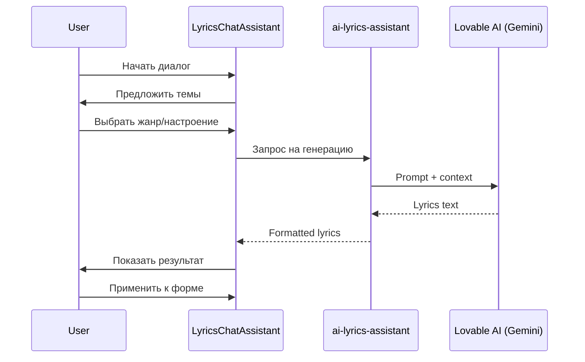

# 🎤 AI Lyrics Chat Assistant

Чат-интерфейс для создания текстов песен с помощью AI.

## Архитектура



## Компоненты

### Frontend

**`src/components/generate-form/lyrics-chat/LyricsChatAssistant.tsx`**
- Основной компонент чат-интерфейса
- Responsive: Drawer на мобильных, Dialog на десктопе
- Framer-motion анимации для сообщений

**`src/hooks/useLyricsChat.ts`**
- Логика чата и состояние сообщений
- Интеграция с Edge Function
- История диалога

### Backend

**`supabase/functions/ai-lyrics-assistant/index.ts`**
- Edge Function для генерации текстов
- Использует Lovable AI (Gemini 2.5 Flash)
- Поддерживает режимы: generate, rewrite, improve, translate

## Режимы работы

### 1. Generate (Генерация)
Создание текста с нуля на основе:
- Темы/концепции
- Жанра музыки
- Настроения
- Структуры (verse, chorus, bridge)

### 2. Rewrite (Переписать)
Полное переосмысление существующего текста с сохранением смысла.

### 3. Improve (Улучшить)
Улучшение качества текста:
- Рифмы
- Ритм
- Образность

### 4. Translate (Перевести)
Перевод с сохранением:
- Ритма и размера
- Рифмовки где возможно
- Эмоционального окраса

## Интеграция с генерацией

```typescript
// В GenerateSheet после получения lyrics
const handleApplyLyrics = (lyrics: string) => {
  form.setValue('lyrics', lyrics);
  form.setValue('mode', 'custom'); // Автоматически переключить на custom
  setIsLyricsChatOpen(false);
};
```

## Пример запроса к API

```typescript
const response = await supabase.functions.invoke('ai-lyrics-assistant', {
  body: {
    action: 'generate',
    context: {
      theme: 'любовь и расставание',
      genre: 'поп-баллада',
      mood: 'грустный, меланхоличный',
      structure: 'verse-chorus-verse-chorus-bridge-chorus',
      language: 'русский'
    }
  }
});
```

## UI/UX особенности

1. **Quick Options** - предустановленные темы для быстрого старта
2. **Genre Selector** - dropdown с популярными жанрами
3. **Mood Multi-select** - выбор нескольких настроений
4. **Structure Cards** - визуальный выбор структуры
5. **Copy/Regenerate/Apply** - действия с результатом
6. **Auto-scroll** - прокрутка к новым сообщениям

## Best Practices

1. Всегда указывать язык текста
2. Использовать конкретные эмоции вместо общих
3. Для лучших рифм - указывать целевой язык в prompt
4. Структура помогает AI понять ожидаемый формат
