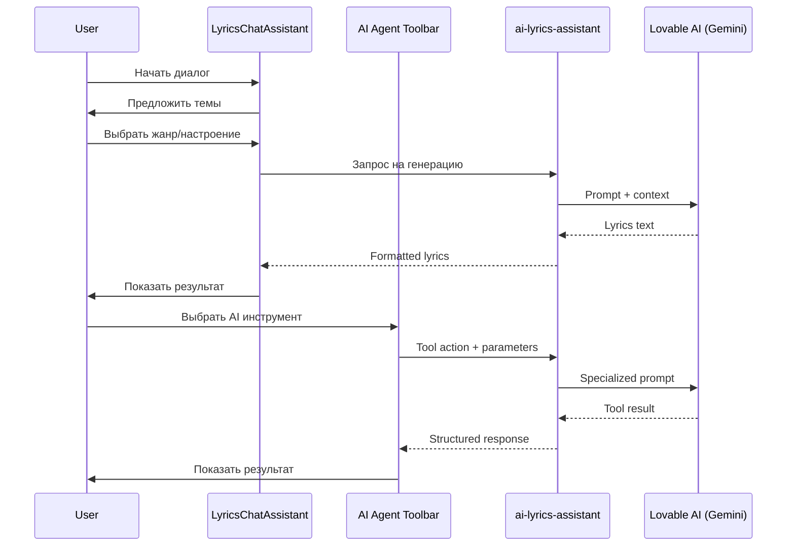

# 🎤 AI Lyrics Assistant

> ⚠️ **Этот документ устарел (2025-12-26).**
> Актуальная архитектура описана в **[AI_LYRICS_HARNESS.md](./AI_LYRICS_HARNESS.md)**.

## Краткое резюме (актуально на 2026-07-26)

Система AI-лирики состоит из двух поверхностей:

1. **Generate Sheet Wizard** — направляемый flow (жанр → настроение → структура → стриминг-генерация → применение).
2. **Lyrics Studio Agent** — 9 инструментов (написать, продолжить, анализ, продюсер, Suno, рифмы, структура, стиль, перевод).

Backend — одна Edge Function `ai-lyrics-assistant` с реестром промптов, модель `google/gemini-2.5-flash` через Lovable AI Gateway.

Полная техническая документация: **[AI_LYRICS_HARNESS.md](./AI_LYRICS_HARNESS.md)**

---

## Историческая справка (до рефакторинга)

Комплексная система для создания и редактирования текстов песен с помощью AI.

```mermaid
sequenceDiagram
    participant User
    participant Chat as LyricsChatAssistant
    participant Agent as AI Agent Toolbar
    participant Edge as ai-lyrics-assistant
    participant AI as Lovable AI (Gemini)

    User->>Chat: Начать диалог
    Chat->>User: Предложить темы
    User->>Chat: Выбрать жанр/настроение
    Chat->>Edge: Запрос на генерацию
    Edge->>AI: Prompt + context
    AI-->>Edge: Lyrics text
    Edge-->>Chat: Formatted lyrics
    Chat->>User: Показать результат
    User->>Agent: Выбрать AI инструмент
    Agent->>Edge: Tool action + parameters
    Edge->>AI: Specialized prompt
    AI-->>Edge: Tool result
    Edge-->>Agent: Structured response
    Agent->>User: Показать результат
```
