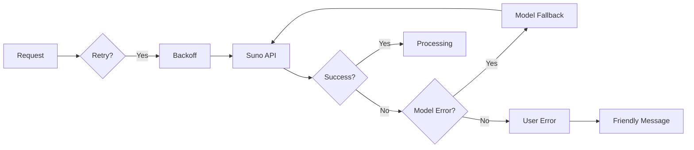
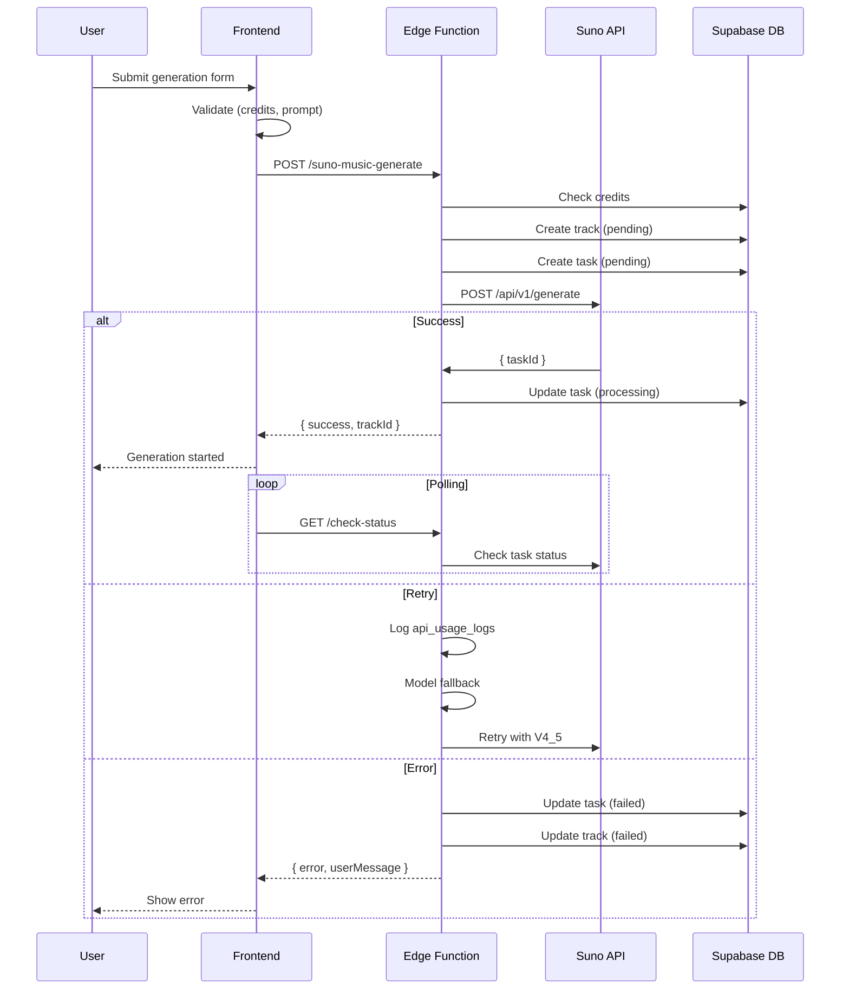
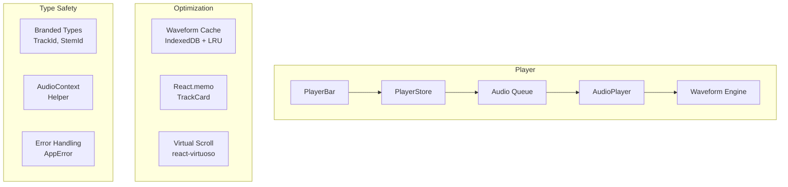

# 🏗️ Архитектурный анализ MusicVerse AI

<div align="center">

**Версия**: 1.0  
**Дата**: 2026-06-25  
**Статус**: 🟢 Актуально

</div>

---

## 📋 Executive Summary

MusicVerse AI — SPA (Single Page Application) с бэкендом на Supabase. Приложение построено на принципах модульности, типобезопасности и производительности.

---

## 🎯 Принципы проектирования

### 1. Modular Architecture (Модульность)

```
┌────────────────────────────────────────────────┐
│                    src/                         │
├──────────┬──────────┬──────────┬───────────────┤
│components│  hooks   │ services │    stores     │
│  (UI)    │ (logic)  │ (biz op) │   (state)     │
├──────────┴──────────┴──────────┴───────────────┤
│                    lib/                         │
│          (utilities, optimizations)             │
├────────────────────────────────────────────────┤
│                    types/                       │
│          (TypeScript definitions)              │
└────────────────────────────────────────────────┘
```

**Принцип**: Каждый слой отвечает только за свою зону ответственности:

- `components/` — только рендеринг, без логики
- `hooks/` — логика, доступ к стору, API
- `services/` — бизнес-операции (аудио, генерация)
- `stores/` — глобальное состояние (Zustand)
- `types/` — разделяемые типы

### 2. Type Safety (Типобезопасность)

```typescript
// Branded types — защита от передачи неверного ID
type TrackId = string & { readonly __brand: "TrackId" };
type UserId = string & { readonly __brand: "UserId" };

// Type-safe error handling
const result = await tryCatch(() => fetchData());
if (result.success) {
  const data: Track = result.data; // TypeScript знает тип
} else {
  showError(result.error.toUserMessage()); // Гарантированный метод
}

// Type-Safe Audio Context
const ctx = ensureAudioContext(); // Никаких `as any`
```

**Реализация**:

- Branded types в `src/types/branded.ts`
- Error hierarchy: `AppError` ← `NetworkError`, `APIError`, `GenerationError`
- Result type: `tryCatch<T>()` возвращает `Result<T, AppError>`
- Type-safe audio: `audioContextHelper.ts`

### 3. Performance First (Производительность)

```
┌─────────────────────────────────────────────┐
│              Performance Layer               │
├─────────────────┬───────────────────────────┤
│  Build-time     │      Runtime              │
├─────────────────┼───────────────────────────┤
│ Bundle splitting│  React.memo               │
│ Tree-shaking    │  Lazy loading              │
│ Code splitting  │  Waveform caching (IDB)   │
│ Vendor chunks   │  RAF-based playback       │
│ Terser minify   │  Virtual scrolling        │
│ Gzip/Brotli     │  Debounce/Throttle        │
└─────────────────┴───────────────────────────┘
```

**Показатели**:

- 15+ компонентов с динамическим импортом
- React.memo на 4+ ключевых компонентах
- Waveform cache: IndexedDB + LRU (20 entries, 7-day TTL)
- RAF-based time updates (50ms interval)

### 4. Error Resilience (Устойчивость к ошибкам)



- Exponential backoff retry (3 attempts, 1s-8s)
- Model fallback chain (V5 → V4_5PLUS → V4_5 → V4 → V3_5)
- 30-second timeout protection
- Transient error detection (5xx, 429, network)

---

## 🏗️ Структура приложения

### Слой Components (`src/components/`)

```
components/
├── ui/                 # shadcn/ui + кастомные (50+)
│   ├── button.tsx
│   ├── dialog.tsx
│   ├── skeleton/
│   └── touch-friendly.tsx
├── mobile/             # Мобильные компоненты (19)
│   ├── MobileLayout.tsx
│   ├── TouchTarget.tsx
│   └── SafeAreaWrapper.tsx
├── player/             # Аудиоплеер
│   ├── PlayerBar.tsx
│   ├── FullscreenPlayer.tsx
│   ├── QueuePanel.tsx
│   └── useAudioPlayer.ts (hook)
├── generate/           # Генерация музыки
│   ├── GenerateForm.tsx
│   ├── StyleSelector.tsx
│   ├── LyricsEditor.tsx
│   └── GenerationProgress.tsx
├── library/            # Библиотека треков
│   ├── TrackCard.tsx
│   ├── TrackList.tsx
│   └── PlaylistItem.tsx
├── studio/             # Unified Studio
│   ├── mixer/
│   │   ├── MixerChannel.tsx
│   │   ├── VolumeSlider.tsx
│   │   └── PanControl.tsx
│   ├── timeline/
│   │   ├── Timeline.tsx
│   │   └── Waveform.tsx
│   ├── editor/
│   │   └── SectionEditor.tsx
│   └── StudioLayout.tsx
├── social/             # Социальные
│   ├── Comments.tsx
│   ├── Likes.tsx
│   └── ActivityFeed.tsx
├── gamification/       # Геймификация
│   ├── StreakBadge.tsx
│   ├── LevelProgress.tsx
│   ├── Achievements.tsx
│   └── Leaderboard.tsx
└── lazy/               # Динамический импорт
    ├── index.ts
    ├── LazyGenerateSheet.tsx
    ├── LazyAudioVisualizer.tsx
    └── LazyFullscreenPlayer.tsx
```

**Ключевые паттерны**:

- `React.memo` с custom comparison для списков
- `Suspense` + `lazy()` для тяжелых компонентов
- `forwardRef` для доступности
- `Slot` pattern из Radix UI

### Слой Hooks (`src/hooks/`)

```
hooks/
├── useTelegram.ts          # Telegram Mini App SDK
├── useAudioPlayer.ts       # Глобальный плеер
├── useGeneration.ts        # Генерация музыки
├── useTracks.ts           # CRUD треков
├── studio/
│   ├── useStudioState.ts  # Студия (централизованное состояние)
│   ├── useWaveformCache.ts # Кэш waveform (IndexedDB)
│   ├── useOptimizedPlayback.ts # RAF-based плеер
│   └── useStemEngine.ts   # Stem processing
├── useComments.ts         # Комментарии
├── useLikes.ts            # Лайки
├── useStreak.ts           # Streak-система
└── useLevel.ts            # Уровни и опыт
```

### Слой Store (`src/stores/`)

```
stores/
├── usePlayerStore.ts      # Плеер: текущий трек, очередь, режим
├── useLibraryStore.ts     # Библиотека: треки, фильтры, поиск
├── useGenerationStore.ts  # Генерация: форма, прогресс, история
├── useStudioStore.ts      # Студия: stems, микс, эффекты
├── useUserStore.ts        # Пользователь: профиль, настройки
├── useSocialStore.ts      # Социальные: лента, уведомления
└── useGamificationStore.ts # Геймификация: стрики, уровни, ачивки
```

**Паттерн**: Zustand с селекторами для минимизации ре-рендеров

### API Слой (`src/api/`)

```
api/
├── supabase.ts            # Supabase клиент (синглтон)
├── tracks.ts              # CRUD треков
├── users.ts               # Пользователи
├── generation.ts          # Генерация + опрос статуса
├── payments.ts            # Платежи (Tinkoff)
└── telegram.ts            # Telegram Bot API
```

### Backend (`supabase/`)

```
supabase/
├── functions/             # 99+ Edge Functions (Deno)
│   ├── suno-music-generate/   # ✅ Генерация (улучшена F1.1)
│   ├── suno-music-callback/   # Callback от SunoAPI
│   ├── suno-extend-audio/     # Продолжение трека
│   ├── suno-remix/           # Ремикс
│   ├── klangio-analyze/      # Анализ аудио (Klangio)
│   ├── tinkoff-create-payment/ # Tinkoff платежи
│   ├── tinkoff-webhook/      # Callback от Tinkoff
│   ├── telegram-bot/         # Telegram Bot
│   ├── moderate-content/     # Модерация контента
│   └── ... (90+ functions)
├── migrations/            # Схема БД
│   ├── 001_users.sql
│   ├── 002_tracks.sql
│   ├── 003_generation_tasks.sql
│   └── ...
└── config.toml            # Конфигурация Supabase
```

---

## 📊 Data Flow

### Generation Flow



### Audio Playback Flow



---

## 🛠️ Ключевые технологические решения

### Почему Zustand, а не Redux?

| Критерий    | Zustand  | Redux                    |
| ----------- | -------- | ------------------------ |
| Размер      | ~2KB     | ~12KB                    |
| Boilerplate | Минимум  | Actions, Reducers, Types |
| Простота    | 0 config | Store setup              |
| TypeScript  | Нативный | Доп. типизация           |

### Почему React Query, а не RTK Query?

- Меньше бандла (~5KB vs ~15KB)
- Уже был в проекте, когда перешли с RTK
- Лучшая поддержка optimistic updates
- Нативная работа с Supabase

### Почему shadcn/ui + Radix?

- Accessibility из коробки (WCAG 2.1 AA)
- Tree-shaking (импортируем только нужное)
- Кастомизация через Tailwind
- Минимум зависимостей (только @radix-ui/\*)

---

## 📈 Ключевые метрики архитектуры

| Категория       | Метрика             | Значение |
| --------------- | ------------------- | -------- |
| **Codebase**    | Компонентов         | 1,124+   |
| **Codebase**    | Хуков               | 200+     |
| **Codebase**    | Pages               | 40+      |
| **Codebase**    | Edge Functions      | 99+      |
| **Codebase**    | Stores              | 8        |
| **Performance** | Bundle (gzip)       | ~950KB   |
| **Performance** | Lazy components     | 15+      |
| **Performance** | Memoized components | 4+       |
| **Testing**     | Unit tests          | 27+      |
| **Testing**     | E2E tests           | 62+      |

---

## 🎯 Рекомендации по улучшению

### 1. Архитектурные улучшения

| Что                              | Почему                                  | Приоритет |
| -------------------------------- | --------------------------------------- | --------- |
| **Feature-Sliced Design**        | Текущая структура смешивает UI и логику | P3        |
| **Event-Driven для уведомлений** | Telegram + WebSocket + Email            | P2        |
| **Service Worker**               | Offline-first experience                | P2        |
| **Monorepo (Turborepo)**         | Если разделим frontend/backend          | P3        |

### 2. Технический долг

| Проблема                  | Решение            | Приоритет |
| ------------------------- | ------------------ | --------- |
| `as any` в edge functions | Strict mode audit  | P1        |
| npm bug на Windows        | WSL / Codespaces   | P1        |
| Устаревшие зависимости    | `npm audit` review | P2        |

### 3. Масштабирование

| Что               | Текущее | Цель                |
| ----------------- | ------- | ------------------- |
| Bundle size       | 950KB   | <800KB              |
| TypeScript strict | 85%     | 100%                |
| Test coverage     | 70%     | >80%                |
| Edge functions    | 99      | <50 (merge similar) |

---

## 📚 Связанные документы

- [Оптимизация](../OPTIMIZATION_PLAN.md) — План дальнейших работ
- [Архитектура](ARCHITECTURE.md) — Детальное описание модулей
- [Структура репозитория](../REPOSITORY_STRUCTURE.md) — Файловая структура
- [ADR](../ADR/) — Архитектурные решения

---

<div align="center">

**Последнее обновление**: 2026-06-25

</div>
